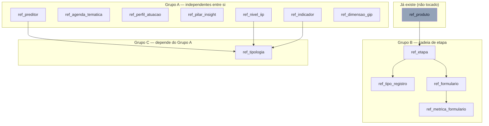

# Catálogos de Referência (Trilha C) Design

**Spec**: `.specs/features/catalogos-referencia/spec.md`
**Context**: `.specs/features/catalogos-referencia/context.md`
**Status**: Draft — teto desta sessão é Design; Tasks/Execute e qualquer migração real ficam para uma sessão futura.

---

## Architecture Overview

Não há componente de aplicação novo — é puro DDL + GRANT + seed no banco, seguindo exatamente o padrão dos 4 catálogos já provisionados (`ref_produto`, `ref_projeto`, `ref_cargo`, `ref_partido`, migrations `0007`/`0020`/`0021`/`0024`). A única complexidade real é de **ordem de dependência interna** entre as 12 tabelas novas — todas dependem só de dentro do próprio bloco "Catálogos" ou de `ref_produto` (já existente), nunca de Fundação/Operação/Planejamento acima.



**Ordem de criação dentro da migração:** Grupo A (qualquer ordem interna) → Grupo C (`ref_tipologia`, depois do A) → Grupo B (cadeia de etapa, independente de A/C, só precisa de `ref_produto` que já existe). RLS-disable + GRANT roda depois de todas as 12 `CREATE TABLE`. Seed roda por último, na mesma ordem de dependência (A antes de B, já que `ref_tipo_registro`/`ref_formulario` semeiam por `JOIN` contra `ref_etapa`).

**Por que uma migração só, não várias:** o precedente (`0007_catalogos_fundacao.sql`) já bundlou 4 tabelas + seed + re-GRANT num único arquivo. Doze tabelas com essa mesma disciplina de ordem interna cabem no mesmo padrão — divide-se em vários arquivos só se a fase Tasks (fora desta sessão) decidir que o diff fica difícil de revisar de uma vez. Ver `Tech Decisions`.

---

## Code Reuse Analysis

### Existing Components to Leverage

| Component | Location | How to Use |
| --------- | -------- | ---------- |
| Padrão de migração DDL+seed+re-GRANT num arquivo só | `supabase/migrations/0007_catalogos_fundacao.sql` | Modelo direto para o arquivo desta feature — mesma estrutura: `CREATE TABLE` das novas, `GRANT ... ON ALL TABLES IN SCHEMA public` (obrigatório por AD-025, já documentado ali como ritual a repetir), `INSERT ... ON CONFLICT DO NOTHING` |
| Padrão de seed real via migração separada, nunca `seed_test.sql` | `supabase/migrations/0020_seed_ref_partido.sql`, `0021_seed_ref_projeto.sql` | Reusa a mesma justificativa de proveniência do dado (aprovado no schema vs. levantamento pendente) exigida por `AD-005`/`AD-004` — todo `INSERT` cita a linha exata de `docs/schema_sistema.sql` de onde veio |
| Padrão de RLS desabilitada + GRANT explícito para catálogo | `supabase/migrations/0024_ref_tables_rls_fix.sql` | Mesmo mecanismo (`ALTER TABLE ... DISABLE ROW LEVEL SECURITY` + `GRANT SELECT ON ...`), escopo de papéis ampliado (ver `context.md`) |
| Papéis Postgres e semântica de cada um | `supabase/migrations/0004_plataforma_roles_grants.sql` | Nenhuma role nova — as 5 `legisla_*` já existem; esta feature só GRANTa nas 12 tabelas novas |
| Padrão de teste de estrutura/constraint contra catálogo | `supabase/tests/fundacao/catalogos.integration.test.ts` | Modelo direto para as constraints das 12 tabelas novas (`expectSqlError` + `runSql`) |
| Padrão de teste de GRANT por papel sem precisar logar como usuário real | `supabase/tests/plataforma/roles-grants.integration.test.ts` (`has_table_privilege(role, tabela, privilegio)`) | É o mecanismo certo para CAT-18 — testar GRANT direto via `pg_catalog`, sem precisar de sessão JWT por papel (esta feature não usa RLS, então o padrão de `fundacao-rls.integration.test.ts`, que loga como usuário real, não se aplica aqui) |
| Geração de tipos TypeScript | `npm run db:types` (`src/backend/supabase/database.types.ts`) | Nenhum tipo é escrito à mão — o comando já documentado em `CLAUDE.md` regenera o arquivo a partir do projeto linkado depois que a migração real rodar (fase Tasks/Execute futura) |

### Integration Points

| System | Integration Method |
| ------ | ------------------- |
| PostgREST (Supabase) | As 12 tabelas passam a ser alcançáveis via `supabase.from('ref_etapa')` etc. tão logo o GRANT exista — nenhuma rota de servidor nova, consistente com AD-011 (frontend fala direto com o Supabase) |
| `docs/schema_sistema.sql` (fonte aprovada, AD-008) | Toda `CREATE TABLE`/`INSERT` desta feature é extraída verbatim das linhas citadas — nenhuma coluna, `CHECK` ou valor de seed é inventado |
| Features futuras (roadmap §5/§6: régua de etapas, Kanban, Planejamento, Incidência, Formulários) | Consomem estas 12 tabelas por FK — esta feature não as cria, só torna a FK possível |

---

## Components

Não há componente de aplicação (frontend/backend) nesta feature — os "componentes" são artefatos de banco e de teste.

### Migração — DDL das 12 tabelas

- **Purpose**: Criar as 12 tabelas com colunas/constraints idênticas ao schema aprovado, na ordem de dependência do diagrama acima.
- **Location**: `supabase/migrations/<timestamp>_catalogos_planejamento_operacao.sql` (nome exato e criação do arquivo ficam para a fase Tasks — fora desta sessão; usar `supabase migration new <nome>` para o prefixo de timestamp, nunca o padrão manual `00NN_` já aposentado).
- **Interfaces**: nenhuma — é DDL puro.
- **Dependencies**: `ref_produto` (já existe, migração `0007`).
- **Reuses**: estrutura de `0007_catalogos_fundacao.sql`.

### Migração — RLS-disable + GRANT

- **Purpose**: Aplicar o mesmo padrão de acesso das 4 tabelas antigas (`0024`) às 12 novas, com o escopo de papéis decidido em `context.md` (leitura para as 5 roles `legisla_*`, escrita para app/admin/gestora, `anon` excluído).
- **Location**: mesmo arquivo de migração, bloco depois de todos os `CREATE TABLE`.
- **Interfaces**: nenhuma — é GRANT puro.
- **Dependencies**: as 5 roles `legisla_*` (já existem, `0004`).
- **Reuses**: `0024_ref_tables_rls_fix.sql`, com escopo de papéis mais completo (ver `context.md` para a justificativa da divergência).

### Migração — Seed das 9 tabelas com conteúdo aprovado

- **Purpose**: Popular `ref_nivel_iip`, `ref_preditor`, `ref_perfil_atuacao`, `ref_pilar_insight`, `ref_dimensao_gip`, `ref_etapa` (Estratégia+PLL), `ref_tipo_registro`, `ref_formulario`, `ref_metrica_formulario` com o conteúdo verbatim de `docs/schema_sistema.sql:2172-2317`.
- **Location**: mesmo arquivo de migração, bloco final, na ordem de dependência (Grupo A → Grupo B, já que `ref_tipo_registro`/`ref_formulario` semeiam via `JOIN` contra `ref_etapa`).
- **Interfaces**: nenhuma — é `INSERT ... ON CONFLICT DO NOTHING` puro.
- **Dependencies**: as tabelas do bloco DDL acima, na mesma migração.
- **Reuses**: os próprios `INSERT`s do schema aprovado, citando a linha de origem em comentário (mesmo padrão de proveniência de `0020`/`0021`).

### Teste — estrutura e constraints das 12 tabelas

- **Purpose**: Confirmar que cada `CHECK`/`UNIQUE`/`FK` das 12 tabelas rejeita o caso inválido correspondente (CAT-01 a CAT-13 do `spec.md`).
- **Location**: `supabase/tests/catalogos/catalogos-referencia.integration.test.ts` (pasta nova — `supabase/tests/fundacao/` é da feature de Fundação; manter a convenção de uma pasta por feature/camada já usada em `plataforma/` e `fundacao/`).
- **Interfaces**: `describe`/`it` (Vitest), reaproveita `runSql`/`expectSqlError` de `supabase/tests/helpers/sql.ts`.
- **Dependencies**: migração desta feature já aplicada no ambiente de teste (dev, via `SUPABASE_TEST_TARGET`).
- **Reuses**: `supabase/tests/fundacao/catalogos.integration.test.ts` como modelo estrutural direto.

### Teste — GRANT por papel (smoke test, CAT-18)

- **Purpose**: Confirmar `has_table_privilege(role, tabela, 'SELECT')` verdadeiro para as 5 roles `legisla_*` e falso para `anon`, e `has_table_privilege(role, tabela, 'INSERT')` falso para mentor/assessor, nas 12 tabelas novas.
- **Location**: mesmo arquivo de teste acima, ou um arquivo irmão `supabase/tests/catalogos/catalogos-grants.integration.test.ts` — decisão de organização de arquivo, sem impacto de cobertura (fica com a fase Tasks).
- **Interfaces**: idem.
- **Dependencies**: idem.
- **Reuses**: `supabase/tests/plataforma/roles-grants.integration.test.ts` como modelo direto — é exatamente o mecanismo de `has_table_privilege()` sem precisar de sessão JWT por papel, porque o controle aqui é GRANT, não RLS.

---

## Data Models

As 12 tabelas, extraídas verbatim de `docs/schema_sistema.sql:170-301`. Nenhum tipo TypeScript é escrito à mão — `npm run db:types` gera `src/backend/supabase/database.types.ts` no formato `Row`/`Insert`/`Update` já usado por `ref_produto`/`ref_projeto` (visto em `src/backend/supabase/database.types.ts:1215-1273`) tão logo a migração real rode. As interfaces abaixo documentam a forma esperada, para leitura, não para colar em código.

### ref_etapa

```typescript
interface RefEtapa {
  id_etapa: number
  id_produto: number             // FK ref_produto
  codigo: string
  nome: string
  ordem: number
  duracao_prevista_dias: number | null   // CHECK > 0 quando não NULL
  gera_registro: boolean         // default true
}
```
**Relationships**: `id_produto → ref_produto.id_produto`. `UNIQUE (id_produto, codigo)`, `UNIQUE (id_produto, ordem)`.

### ref_tipo_registro

```typescript
interface RefTipoRegistro {
  id_tipo_registro: number
  id_etapa: number                // FK ref_etapa
  codigo: string
  nome: string
  permite_multiplos: boolean      // default false
  qtd_prevista: number | null     // CHECK só quando permite_multiplos
  schema_campos: Record<string, unknown>   // JSONB, default {}
  ativo: boolean                  // default true
}
```
**Relationships**: `id_etapa → ref_etapa.id_etapa`. `UNIQUE (id_etapa, codigo)`.

### ref_formulario

```typescript
interface RefFormulario {
  id_formulario: number
  id_etapa: number                // FK ref_etapa
  codigo: string                  // UNIQUE
  nome: string
  respondente: "assessor" | "cargo_cg_parlamentar" | "gestora" | "mentor" | "mentorado" | "mandato" | null
  exige_anexo: boolean            // default false
  permite_edicao_aberta: boolean  // default true
  versao: number                  // default 1 (D13: versionado na própria linha)
  schema_campos: Record<string, unknown>   // JSONB, default {}
  ativo: boolean                  // default true
}
```
**Relationships**: `id_etapa → ref_etapa.id_etapa`.

### ref_metrica_formulario

```typescript
interface RefMetricaFormulario {
  id_metrica: number
  id_formulario: number           // FK ref_formulario ON DELETE CASCADE
  codigo_campo: string
  rotulo: string
  tipo: "escala_0_10" | "escala_1_5" | "booleano" | "numero"
  eh_nps: boolean                 // default false; só 1 true por formulário (índice único parcial)
  agrupador: string | null
  ativo: boolean                  // default true
}
```
**Relationships**: `id_formulario → ref_formulario.id_formulario` (`ON DELETE CASCADE`). `UNIQUE (id_formulario, codigo_campo)`.

### ref_preditor / ref_agenda_tematica / ref_perfil_atuacao

```typescript
interface RefCatalogoSimples {   // forma comum das 3 — mesma estrutura, tabelas distintas
  id: number                      // id_preditor | id_agenda | id_perfil
  nome: string                    // UNIQUE
  ordem: number | null
  ativo: boolean                  // default true
}
```
**Relationships**: nenhuma FK — catálogo folha, referenciado por Planejamento (fora de escopo).

### ref_pilar_insight

```typescript
interface RefPilarInsight {
  id_pilar: number
  codigo: string     // UNIQUE
  nome: string        // UNIQUE
  ordem: number | null
  ativo: boolean       // default true
}
```

### ref_indicador

```typescript
interface RefIndicador {
  id_indicador: number
  nome: string          // UNIQUE
  peso_iip: number      // NUMERIC(5,2), CHECK >= 0
  ativo: boolean         // default true
}
```

### ref_nivel_iip

```typescript
interface RefNivelIip {
  codigo: string    // PRIMARY KEY -- chave natural, não BIGSERIAL (único catálogo das 12 assim)
  rotulo: string
  valor: number      // NUMERIC(5,2), CHECK >= 0
  ordem: number
}
```
**Nota**: sem coluna `ativo` — domínio fixo de 3 valores (baixo/médio/alto), diferente das demais.

### ref_tipologia

```typescript
interface RefTipologia {
  id_tipologia: number
  grupo: string
  tipologia: string
  estado: string
  id_preditor_1: number | null      // FK ref_preditor
  id_preditor_2: number | null      // FK ref_preditor, CHECK distinto de id_preditor_1 quando ambos presentes
  nivel_d1_padrao: string | null    // FK ref_nivel_iip(codigo)
  nivel_d2_padrao: string | null    // FK ref_nivel_iip(codigo)
  nivel_d3_padrao: string | null    // FK ref_nivel_iip(codigo)
  id_indicador: number | null       // FK ref_indicador
  observacao: string | null
  ativo: boolean                     // default true
}
```
**Relationships**: `UNIQUE (grupo, tipologia, estado)`. É a tabela mais dependente das 12 — só pode ser criada depois de `ref_preditor`, `ref_nivel_iip` e `ref_indicador`.

### ref_dimensao_gip

```typescript
interface RefDimensaoGip {
  id_dimensao: number
  codigo: string      // UNIQUE
  nome: string
  valor_min: number   // SMALLINT, default 1
  valor_max: number   // SMALLINT, default 4, CHECK > valor_min
  ordem: number
  ativo: boolean       // default true
}
```

**Relationships (todas as 12):** nenhuma delas carrega `id_contrato` — é por isso que ficam fora da asserção de deploy de RLS do schema aprovado (§15) e do escopo de AD-001 lido à luz do precedente (ver `Risks & Concerns`).

---

## Error Handling Strategy

| Error Scenario | Handling | User Impact |
| --------------- | -------- | ------------ |
| `INSERT`/`UPDATE` viola `CHECK` (ex.: `ck_tipologia_preditores`, `ck_dimensao_faixa`, `ck_etapa_duracao`) | Postgres rejeita com SQLSTATE `23514`, transação não commita | Nenhum dado inválido entra; caller (futura tela de Planejamento/Incidência) recebe erro do PostgREST a tratar |
| `INSERT` viola `UNIQUE` (ex.: segunda métrica NPS no mesmo formulário, etapa duplicada no mesmo produto) | SQLSTATE `23505` | Idem — nenhuma duplicata silenciosa |
| `INSERT`/`UPDATE` referencia FK inexistente (ex.: `id_etapa` que não existe em `ref_etapa`) | SQLSTATE `23503` | Idem |
| Leitura sem GRANT (papel sem `SELECT`, incluindo `anon`) | PostgREST devolve `42501 permission denied for table` | Nenhuma linha vaza para quem não tem GRANT — comportamento idêntico ao dos 4 catálogos antigos |
| Escrita por `legisla_mentor`/`legisla_assessor` nas 12 tabelas novas | `42501 permission denied for table` | Consistente com "leitura para todos, escrita só para papéis operacionais" (§14 do schema aprovado, com o ajuste de escopo registrado em `context.md`) |
| Migração reaplicada por engano | `CREATE TABLE IF NOT EXISTS` e `INSERT ... ON CONFLICT DO NOTHING` tornam a reaplicação um no-op, sem erro | Nenhum impacto — mesma garantia de idempotência de `0007`/`0026` |
| Seed de `ref_tipologia`/`ref_indicador`/`ref_agenda_tematica` ainda não chegou | Tabela existe, vazia — consulta retorna 0 linhas, nunca erro | Qualquer feature futura que já dependa dessas 3 tabelas trata "vazio" como estado válido (AD-005), não como falha |

---

## Risks & Concerns

| Concern | Location (file:line) | Impact | Mitigation |
| ------- | --------------------- | ------ | ---------- |
| **AD-001 lido ao pé da letra ("nenhuma tabela sem RLS") entra em tensão com o precedente real de catálogo** (RLS desabilitada + GRANT) | `.specs/STATE.md` AD-001; `supabase/migrations/0024_ref_tables_rls_fix.sql`; `docs/schema_sistema.sql:1560-1657` (RLS nunca cobre `ref_*`) e `:2114-2126` (asserção de deploy filtra por `id_contrato`, isentando catálogo) | Próxima feature pode reabrir esse debate do zero, ou pior, aplicar RLS "porque AD-001 manda" e quebrar o padrão de leitura ampla que catálogo precisa | Esta feature **conforma** ao precedente + à intenção documentada do schema aprovado (AD-008), em vez de inventar RLS nova para 12 tabelas que o próprio autor do schema isentou. Recomendado (não feito aqui, `STATE.md` é read-only nesta sessão): emenda curta a AD-001 explicitando a exceção de catálogo — relatado a Pedro |
| **`GRANT SELECT ... TO anon` no precedente de `0024` contradiz o texto ativo de AD-002** ("nenhum acesso é anônimo") | `supabase/migrations/0024_ref_tables_rls_fix.sql:8` | Os 4 catálogos antigos hoje são legíveis por qualquer requisição não autenticada — gap de segurança real, mesmo que de baixo dano (dado de catálogo, não pessoal) | As 12 tabelas novas **não** repetem esse grant a `anon` (ver `context.md`). O gap nos 4 catálogos antigos fica fora de escopo desta feature — registrado como candidato a item avulso de Trilha E, relatado a Pedro |
| **§14 do schema aprovado diz "escrita só para admin" em catálogo, mas o `GRANT ... ON ALL TABLES IN SCHEMA public` (`0004`/`0007`/`0009`) já dá escrita a `legisla_gestora` também**, nos 4 catálogos antigos | `docs/schema_sistema.sql:2101`; `supabase/migrations/0004_plataforma_roles_grants.sql:55` | Mesma tensão de "comentário aprovado vs. comportamento real" — replicado nas 12 novas por consistência, não corrigido | Documentado como tensão aceita nesta feature (`context.md`); não é regressão nova, é o padrão já em produção. Corrigir os 4 antigos exigiria migração fora de escopo |
| **`dim_coalizao.agenda_tematica TEXT[]`** (migração `0023`) é campo de texto livre, adicionado *fora* do schema aprovado (que não tem essa coluna em `dim_coalizao` — `docs/schema_sistema.sql:446-451`), e não referencia `ref_agenda_tematica` | `supabase/migrations/0023_coalizao_classificacao_agenda.sql:5` | Quando `ref_agenda_tematica` ganhar conteúdo real (CAT-16) e Planejamento (`fat_meta.id_agenda`) passar a usá-la como FK, vai existir **duas fontes de "agenda temática"** no sistema: texto livre na Coalizão, catálogo estruturado na Meta — risco de divergência de nomenclatura entre as duas | Fora do escopo desta feature corrigir uma coluna já em produção fora de uma tabela que não é destas 12; flagged para quem desenhar Planejamento (roadmap §6.1) decidir se migra `dim_coalizao.agenda_tematica` para referenciar o catálogo ou mantém as duas coisas deliberadamente separadas |
| **`ref_tipologia` é a tabela mais frágil de ordenar** — depende de 3 das outras 11 tabelas novas (`ref_preditor`, `ref_nivel_iip`, `ref_indicador`), nenhuma delas semeada nesta feature (conteúdo pendente, CAT-16) | `docs/schema_sistema.sql:273-290` | Se a fase Tasks futura criar `ref_tipologia` antes das 3 dependências, a migração falha por FK inexistente | Diagrama de dependência acima já fixa a ordem; a tabela nasce vazia (sem seed) nesta feature de qualquer forma, então o risco é só de ordem de `CREATE TABLE`, não de dado |
| ~~D9 sem decisão bloqueia especificamente a Coalizão~~ **RESOLVIDA** — Pedro confirmou clonagem da Estratégia em 2026-08-10 | `docs/schema_sistema.sql:35-36`, `:2251-2262` | Nenhum — CAT-17 segue como seed migration normal, sem bloqueio | N/A |

> Nenhum risco de performance ou de cobertura de teste identificado além dos listados — são 12 tabelas de catálogo, sem volume alto de linha e sem caminho de acesso ainda construído acima delas.

---

## Tech Decisions (only non-obvious ones)

| Decision | Choice | Rationale |
| -------- | ------ | --------- |
| Uma migração vs. várias | Uma só, DDL+GRANT+seed no mesmo arquivo | Replica `0007` (4 tabelas no mesmo arquivo); 12 tabelas de catálogo sem lógica de aplicação não justificam múltiplos arquivos — revisão de diff continua tratável. Fase Tasks pode dividir se achar o diff grande demais |
| Nome do arquivo de migração | Gerado por `supabase migration new <nome>` (prefixo timestamp), nunca `00NN_` manual | Convenção já registrada em `CLAUDE.md` — o padrão manual foi aposentado depois de produzir dois `0023` |
| Pasta de teste | `supabase/tests/catalogos/` (nova) | Seguir a convenção de uma pasta por feature/camada já usada em `plataforma/`/`fundacao/`, em vez de acrescentar arquivos dentro de `fundacao/` (que já fechou sua própria feature e tem `validation.md` publicado) |
| Mecanismo de smoke test por papel | `has_table_privilege(role, tabela, privilegio)` via SQL direto, não login real por papel | Esta feature usa GRANT, não RLS — o padrão de login real (`fundacao-rls.integration.test.ts`) existe para testar *policy*, que não existe aqui. `has_table_privilege()` é o mesmo mecanismo já usado em `roles-grants.integration.test.ts` para validar GRANT sem sessão JWT |
| Regeneração de `database.types.ts` | Não faz parte desta feature | Só roda depois que a migração real existir no projeto linkado (fase Tasks/Execute futura); `npm run db:types` já documentado em `CLAUDE.md` |
| Tratamento de CAT-16/CAT-17 no design | Documentado como bloco de rastreamento, sem "componente" técnico a desenhar | São dependências de decisão humana (Monitoramento / Pedro), não de arquitetura — desenhar um componente para "esperar uma resposta" seria cerimônia sem função |

> **Nenhuma decisão desta tabela cria convenção nova de projeto que mereça um `AD-NNN`** — todas conformam a precedente já ativo (`0007`/`0020`/`0021`/`0024`, `CLAUDE.md`). As duas tensões que *poderiam* justificar um `AD-NNN` (exceção de RLS para catálogo; `anon` fora do GRANT) ficam registradas em `Risks & Concerns` e relatadas a Pedro — não decretadas por este agente, porque `STATE.md` é read-only nesta sessão.
