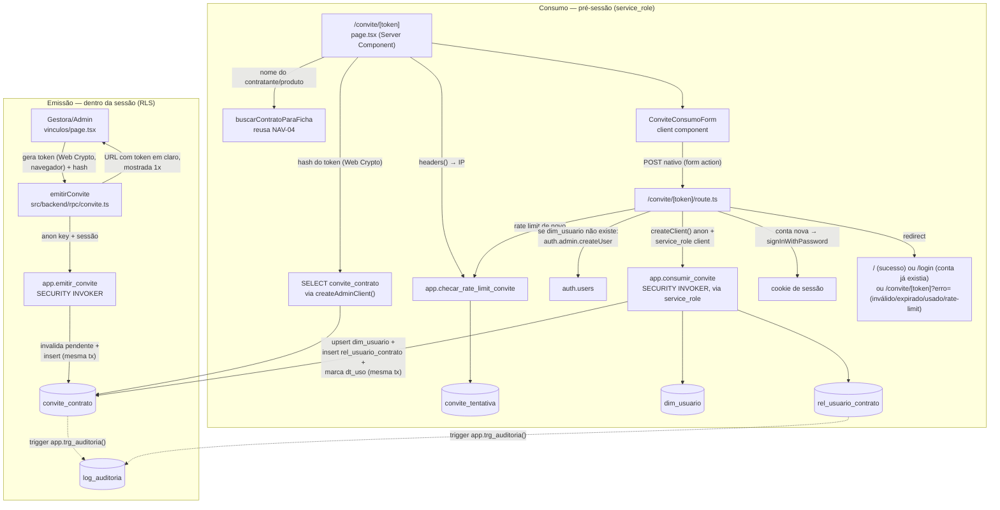

# Convite por Contrato Design

**Spec**: `.specs/features/convite-contrato/spec.md`
**Context**: `.specs/features/convite-contrato/context.md`
**Status**: Approved (decisões assumidas por Pedro em 2026-08-11 — recomendação adotada, sem
rodada síncrona de aprovação de arquitetura; ver Tech Decisions pra cada escolha não-óbvia)

---

## Approach Exploration (Complex feature — 2 abordagens consideradas)

### Abordagem A — Edge Function separada (Supabase Functions)

Uma Supabase Edge Function (`supabase functions deploy consumir-convite`) receberia o POST,
chamaria `service_role` internamente e devolveria JSON.

**Rejeitada.** O projeto não usa Edge Functions em nenhuma outra feature (AD-021 fecha a stack em
Next.js + Supabase; Edge Function apareceria como uma segunda superfície de deploy, com seu próprio
ciclo de CI/CD, só pra esta feature). O padrão já estabelecido pra "servidor faz algo que o
navegador não pode" é o Route Handler do Next.js (`app/auth/confirm/route.ts`,
`app/admin/acesso/entrar/route.ts`) — os dois já usam exatamente a combinação
`createAdminClient()` (`service_role`) + `createClient()` (anon, cookie-aware) que este fluxo
precisa.

### Abordagem B — Route Handler do Next.js reusando `createAdminClient()`/`createClient()` (recomendada, adotada)

`/convite/[token]` como página pré-sessão (Server Component, fora de `(app)/` — AD-027) +
`/convite/[token]/route.ts` (POST) fazendo o trabalho privilegiado. Reusa 100% da infraestrutura
já paga por `admin.ts`/`server.ts` e o padrão de redirect-com-query-param de erro já usado nos dois
Route Handlers pré-sessão existentes. Zero infraestrutura nova.

**Por isso foi a escolhida** — mesmo raciocínio do Code Reuse Analysis abaixo.

---

## Architecture Overview

Dois fluxos, emissão (dentro da sessão, Gestora/Admin) e consumo (fora da sessão, convidado), que
se encontram só na tabela `convite_contrato`.



---

## Code Reuse Analysis

### Existing Components to Leverage

| Component | Location | How to Use |
| --- | --- | --- |
| `createAdminClient()` | `src/backend/supabase/admin.ts` | Cliente `service_role` do consumo — mesma função já usada por `admin/acesso/entrar/route.ts`. Primeiro uso **fora** de rota dev-only; o comentário do arquivo (linha 6-8) fica desatualizado — ver Risks & Concerns |
| `createClient()` (server) | `src/backend/supabase/server.ts` | Auto-login pós-criação de conta via `signInWithPassword`, exatamente como `admin/acesso/entrar/route.ts` já faz com `verifyOtp` — mesmo padrão de cookie bridge |
| Padrão de Route Handler pré-sessão + redirect com `?error=` | `app/auth/confirm/route.ts`, `app/admin/acesso/entrar/route.ts` | Copiado literalmente pra `/convite/[token]/route.ts` (nunca `fetch`/JSON — form POST nativo, redirect real) |
| `app.papel_atual()` / `app.contratos_do_usuario()` / política `p_por_contrato` | `docs/schema_sistema.sql:1568-1582` | RLS de `convite_contrato` na emissão reusa **literalmente** o mesmo predicado já aplicado a toda tabela com `id_contrato` — nenhuma política nova a inventar |
| `app.trg_auditoria()` (trigger genérico) | `docs/schema_sistema.sql:1674-1710` | Anexado a `convite_contrato` com PK `id_convite` — cobre CVT-11 (emissão=insert, consumo=update) sem nenhum código de auditoria novo |
| `buscarContratoParaFicha` | `src/backend/queries/contrato.ts` | Reusada tal qual (aceita qualquer `SupabaseClient<Database>`, incluindo o admin) pra mostrar nome do contratante + produto na página `/convite/[token]` |
| `mapeiaErroRpc` + `MENSAGENS_CHECK`/`MENSAGENS_UNICA` | `src/backend/rpc/errors.ts` | Estendido com 3 entradas novas (`ck_convite_papel`, `ck_convite_cargo`, `ck_convite_email`) — mesma tabela, sem novo mecanismo |
| Padrão de form inline (não-modal) em `vinculos/page.tsx` | `src/frontend/components/fundacao/vinculo-form.tsx` | "Convidar por e-mail" é um segundo botão ao lado de "Adicionar vínculo", abrindo painel inline no mesmo lugar — mesmo componente de estado (`modoAtivo`), sem alterar a estrutura da página |
| RHF + Zod + shadcn `Form`/`Select`/`Input` | `vinculo-form.tsx`, `usuario.ts` | Mesmo stack pros dois formulários novos (`ConviteForm`, `ConviteConsumoForm`) |
| Domínio `texto_limpo` | `docs/schema_sistema.sql` (domain) | Reusado em `convite_contrato.grau_responsabilidade`, igual a `rel_usuario_contrato` |

### Integration Points

| System | Integration Method |
| --- | --- |
| Supabase Auth Admin API | `auth.admin.createUser({ email, password, email_confirm: true, user_metadata: { nome } })` — só quando `dim_usuario` não existe ainda pro e-mail (ver Error Handling Strategy) |
| Postgres (`app.emitir_convite`, `app.consumir_convite`, `app.checar_rate_limit_convite`) | 3 funções `SECURITY INVOKER` novas (AD-024), nenhuma `SECURITY DEFINER` |
| `fat_contrato` | FK de `convite_contrato.id_contrato`; leitura via `buscarContratoParaFicha` já existente |

---

## Components

### `convite_contrato` (tabela nova)

- **Purpose**: registra cada convite emitido — token (só hash), destino (contrato/e-mail/papel),
  janela de validade, estado de consumo.
- **Location**: `supabase/migrations/<timestamp>_convite_contrato.sql`
- **Reuses**: domínio `texto_limpo`, trigger `app.trg_auditoria()`, política `p_por_contrato`.

### `convite_tentativa` (tabela nova, suporte a rate limit)

- **Purpose**: uma linha por tentativa de acesso a `/convite/<token>`, só `ip` + `ocorrido_em`.
  Sem RLS permissiva (só `service_role`, que ignora RLS, precisa tocar essa tabela).
- **Location**: mesma migration de `convite_contrato`.

### `app.emitir_convite` (RPC, `SECURITY INVOKER`)

- **Purpose**: invalida qualquer convite pendente pro mesmo e-mail+contrato+papel (`UPDATE
  dt_expiracao = now()`) e insere o novo — 2 operações na mesma tabela, mesma transação (por isso
  RPC, não insert direto — AD-024).
- **Interfaces**: `app.emitir_convite(p_id_contrato bigint, p_email text, p_papel text, p_cargo
  text, p_grau_responsabilidade text, p_areas text[], p_token_hash text) RETURNS bigint` — devolve
  `id_convite`. `dt_expiracao` é sempre `now() + interval '7 days'`, fixo dentro da função, nunca
  parâmetro do cliente (impede burlar a decisão de expiração por chamada direta).
- **Dependencies**: RLS de `convite_contrato` (mesmo predicado `p_por_contrato`).
- **Reuses**: nenhuma lógica nova de invalidação — é um `UPDATE ... WHERE dt_uso IS NULL AND
  dt_expiracao > now()` antes do `INSERT`.

### `app.consumir_convite` (RPC, `SECURITY INVOKER`)

- **Purpose**: valida o convite (hash bate, não usado, não expirado, papel dentro da guarda),
  garante `dim_usuario` (cria se não existir, reusa se existir), insere `rel_usuario_contrato`
  (idempotente via `ON CONFLICT`) e marca `dt_uso`. Tudo numa transação, com `SELECT ... FOR
  UPDATE` na linha do convite pra serializar tentativas concorrentes do mesmo token.
- **Interfaces**: `app.consumir_convite(p_token_hash text, p_nome text) RETURNS jsonb` — devolve
  `{ id_usuario, conta_nova: boolean }`. `conta_nova=true` significa "este `dim_usuario` acabou de
  ser criado por esta chamada" — é o sinal que o Route Handler usa pra decidir se tenta
  `signInWithPassword` depois.
- **Dependencies**: só chamada pelo cliente `service_role` (nunca `anon`/`authenticated` — sem
  GRANT nenhum concedido a essas roles nesta função).
- **Reuses**: `uq_vinculo` (constraint já existente em `rel_usuario_contrato`) faz o `ON CONFLICT
  DO NOTHING` funcionar sem lógica extra.

### `app.checar_rate_limit_convite` (RPC, `SECURITY INVOKER`)

- **Purpose**: registra uma tentativa e devolve se o IP está dentro do limite.
- **Interfaces**: `app.checar_rate_limit_convite(p_ip inet) RETURNS boolean` — `true` = permitido.
  Limite: 20 tentativas / 15 minutos por IP (constante na função — ver Tech Decisions).
- **Dependencies**: nenhuma — só `convite_tentativa`.

### `src/backend/lib/convite-token.ts` (novo)

- **Purpose**: gera o token (32 bytes de entropia) e calcula o hash SHA-256, usando **Web Crypto
  API** (`crypto.getRandomValues`/`crypto.subtle.digest`) — disponível tanto no navegador
  (emissão) quanto no runtime Node do Route Handler (consumo), sem dependência nova.
- **Interfaces**: `gerarToken(): string` (hex, 64 chars); `hashToken(token: string): Promise<string>`
  (SHA-256 hex, 64 chars).
- **Reuses**: nada — não havia utilitário de token no projeto (`gerar-link-acesso.ts` usa o link do
  Supabase, não gera token próprio).

### `src/backend/rpc/convite.ts` (novo)

- **Purpose**: wrapper de `emitirConvite` (gera token+hash no navegador, chama
  `app.emitir_convite`, devolve a URL completa) — mesmo papel de `vinculo.ts`/`mandato.ts` pros
  outros RPCs.
- **Interfaces**: `emitirConvite(client, input: EmitirConviteInput): Promise<{ url: string }>`.
- **Reuses**: `mapeiaErroRpc`.

### `src/backend/queries/convite.ts` (novo)

- **Purpose**: leitura do estado do convite pro Server Component da página `/convite/[token]`
  (inválido/expirado/usado/válido) — single-table read, sem RPC (AD-024 é só pra escrita).
- **Interfaces**: `validarConvite(adminClient, tokenHash): Promise<EstadoConvite>` onde
  `EstadoConvite` é uma union `{ estado: 'valido', idContrato, papel, cargo } | { estado:
  'invalido' | 'expirado' | 'usado' }`.
- **Reuses**: nenhuma query anterior — é a primeira leitura de uma tabela nova.

### `ConviteForm` (client component, emissão)

- **Purpose**: formulário e-mail + papel (`mentor`/`assessor`) + cargo + grau + áreas; ao
  submeter com sucesso, substitui o formulário por um painel mostrando a URL (com botão copiar) —
  nunca mais reexibida depois de fechar.
- **Location**: `src/frontend/components/fundacao/convite-form.tsx`
- **Reuses**: layout/campos idênticos ao `VinculoForm` modo "adicionar" (mesmos 4 campos, exceto
  "Pessoa" que aqui é "E-mail").

### `/contratos/[id]/vinculos/page.tsx` (modificado)

- **Purpose**: segundo botão "Convidar por e-mail" ao lado de "Adicionar vínculo", abrindo
  `ConviteForm` no mesmo painel inline que já existe (`modoAtivo`).
- **Reuses**: 100% da estrutura existente — só adiciona um `modoAtivo` novo (`{ tipo: "convidar" }`).

### `/convite/[token]/page.tsx` (novo, Server Component, fora de `(app)/`)

- **Purpose**: pré-sessão. Lê IP (`headers()`), checa rate limit, valida o token (hash + estado),
  busca dados do contrato, renderiza mensagem de erro específica OU o formulário de consumo.
- **Location**: `src/frontend/app/convite/[token]/page.tsx`
- **Reuses**: `buscarContratoParaFicha`, `createAdminClient`.

### `/convite/[token]/route.ts` (novo, POST)

- **Purpose**: orquestra o consumo — rate limit, `createUser` condicional, `app.consumir_convite`,
  auto-login condicional, redirect.
- **Location**: `src/frontend/app/convite/[token]/route.ts`
- **Reuses**: exatamente o padrão de `admin/acesso/entrar/route.ts` (criar/gerar → `verifyOtp`/
  `signInWithPassword` → redirect).

### `ConviteConsumoForm` (client component)

- **Purpose**: campos nome + senha + confirmar senha, validação client-side de "senhas batem"
  antes de permitir o submit nativo (progressive enhancement — sem `fetch`/JSON).
- **Location**: `src/frontend/components/convite-consumo-form.tsx`
- **Reuses**: campos de senha do `login-form.tsx` (mesmo `<Input type="password">`).

---

## Data Models

```sql
CREATE TABLE convite_contrato (
  id_convite              BIGSERIAL PRIMARY KEY,
  id_contrato             BIGINT NOT NULL REFERENCES fat_contrato(id_contrato),
  email                   TEXT NOT NULL,
  papel_no_contrato       TEXT NOT NULL,
  cargo                   TEXT,
  grau_responsabilidade   texto_limpo,
  areas                   TEXT[],
  token_hash              TEXT NOT NULL UNIQUE,
  id_usuario_convidou     BIGINT NOT NULL REFERENCES dim_usuario(id_usuario),
  dt_expiracao            TIMESTAMPTZ NOT NULL,
  dt_uso                  TIMESTAMPTZ,
  criado_em               TIMESTAMPTZ NOT NULL DEFAULT now(),
  -- guarda em camada 1 (defesa em profundidade — a camada 2 é o RPC de consumo):
  CONSTRAINT ck_convite_papel  CHECK (papel_no_contrato IN ('mentor','assessor')),
  CONSTRAINT ck_convite_cargo  CHECK (cargo IS NULL OR cargo IN
    ('parlamentar','chefe_gabinete','assessor','secretaria_executiva','nao_se_aplica')),
  CONSTRAINT ck_convite_email  CHECK (email = lower(btrim(email)) AND email LIKE '%@%.%')
);

CREATE INDEX ix_convite_contrato  ON convite_contrato (id_contrato);
CREATE INDEX ix_convite_pendente  ON convite_contrato (id_contrato, email, papel_no_contrato)
  WHERE dt_uso IS NULL;

CREATE TABLE convite_tentativa (
  id_tentativa  BIGSERIAL PRIMARY KEY,
  ip            INET NOT NULL,
  ocorrido_em   TIMESTAMPTZ NOT NULL DEFAULT now()
);

CREATE INDEX ix_convite_tentativa_ip ON convite_tentativa (ip, ocorrido_em DESC);
```

**Relationships**: `convite_contrato.id_contrato` → `fat_contrato` (RLS herdada via
`p_por_contrato`); `id_usuario_convidou` → `dim_usuario` (quem emitiu, resolvido por
`app.id_usuario()` dentro do RPC — nunca parâmetro do cliente). `convite_tentativa` não referencia
nada — é telemetria pura, sem relação com o domínio.

**Por que não existe `dt_invalidado`**: convite duplicado invalida o anterior via
`UPDATE dt_expiracao = now()`, reusando o mesmo predicado que já cobre "expirado" — o usuário final
vê a mesma mensagem ("convite expirado, peça um novo") pros dois casos, que é o comportamento que
o `spec.md` pede; uma coluna nova só pra distinguir os dois internamente não tem consumidor.

---

## Error Handling Strategy

| Error Scenario | Handling | User Impact |
| --- | --- | --- |
| Token não corresponde a nenhum hash | `validarConvite` devolve `estado: 'invalido'` | "Convite inválido." — nunca detalha se "quase" bateu |
| `dt_expiracao < now()` (natural ou por duplicação) | `estado: 'expirado'` | "Convite expirado. Peça um novo à Gestora." |
| `dt_uso IS NOT NULL` | `estado: 'usado'` | "Convite já utilizado." |
| Rate limit excedido (IP) | `app.checar_rate_limit_convite` devolve `false`, checado **antes** do `SELECT` em `convite_contrato` | "Muitas tentativas. Tente novamente em alguns minutos." — mesma mensagem genérica tanto na página (GET) quanto no submit (POST) |
| `app.consumir_convite` recusa papel fora de `('mentor','assessor')` (nunca deveria acontecer — `ck_convite_papel` já impede o dado de existir assim) | `RAISE EXCEPTION` com `ERRCODE` próprio, capturado no Route Handler | Erro genérico 500 — este caminho é defesa em profundidade, não um estado de usuário esperado |
| **`dim_usuario` já existe pro e-mail do convite** (edge case do spec.md — conta pré-existente, com ou sem vínculo em outro contrato) | Route Handler **pula `auth.admin.createUser` inteiramente** — nunca chama a Admin API pra esse e-mail | `app.consumir_convite` ainda garante `rel_usuario_contrato` pro novo contrato e marca `dt_uso`; resposta redireciona pra `/login?msg=conta_existente` — nunca tenta logar automaticamente com a senha submetida |
| **Falha parcial** — `auth.admin.createUser` já rodou numa tentativa anterior (mesmo e-mail), mas a chamada RPC falhou antes de criar `dim_usuario` | Retry cai no branch "`dim_usuario` não existe" de novo → chama `createUser` de novo → API devolve "already registered" → **erro ignorado deliberadamente**, segue pro RPC (que cria `dim_usuario`+`rel_usuario_contrato` do zero, sem precisar do UUID do Auth — `dim_usuario` não guarda esse UUID, a ligação é só por e-mail via `app.pre_request`) | Depois do RPC confirmar `conta_nova=true`, tenta `signInWithPassword` com a senha que a pessoa **acabou de digitar agora**: se bater (mesma senha da 1ª tentativa) → login automático, `/`; se não bater → `dim_usuario`/vínculo já estão corretos mesmo assim, redireciona pra `/login` sem inventar mensagem sobre qual senha usar |
| `app.emitir_convite` — `ck_convite_papel`/`ck_convite_cargo`/`ck_convite_email` (23514) | `mapeiaErroRpc` (mensagens novas em `MENSAGENS_CHECK`) | Mensagem de campo específica no `ConviteForm` |
| `app.emitir_convite` — RLS nega (42501, contrato fora da carteira) | `mapeiaErroRpc` → `PermissaoNegadaError` | "Você não tem permissão para realizar esta operação." |

**Por que a checagem de idempotência é por `dim_usuario`, não por `auth.users`**: o SDK Admin
(`@supabase/auth-js`, verificado em `node_modules/@supabase/auth-js/dist/main/GoTrueAdminApi.d.ts`)
não tem `getUserByEmail` — só `getUserById`/`listUsers` (paginado, sem filtro por e-mail) e
`createUser`/`updateUserById` (que exigem o UUID). Tentar contornar isso paginando `listUsers` pra
achar o e-mail seria frágil e caro. Como `dim_usuario` não guarda o UUID do Auth (a ligação com
`auth.users` é só por e-mail, via `app.pre_request()`), checar `dim_usuario` é **suficiente e
correto** pra decidir se `createUser` deve ser chamado — e evita precisar de `updateUserById` (que
exigiria o UUID) em qualquer caminho.

**Por que nunca sobrescrever senha de conta pré-existente**: se um e-mail que já completou um
convite anterior (conta ativa, com senha própria) for convidado de novo pra outro contrato, o
formulário de consumo ainda pede "nome e senha" (mesmo formulário, sem ramificação visível pro
convidado) — mas o Route Handler, ao ver `dim_usuario` já existente, nunca chama `createUser` nem
`updateUserById` com a senha submetida. Sem essa guarda, qualquer pessoa com um link de convite
válido (emitido por engano pra um e-mail que já tem conta, ou reusado no futuro pareamento do PLL)
poderia resetar a senha de uma conta que não é sua — é o mesmo raciocínio de "guarda explícita,
nunca confiar que a origem da chamada é benigna" que já rege CVT-07.

---

## Risks & Concerns

| Concern | Location (file:line) | Impact | Mitigation |
| --- | --- | --- | --- |
| Comentário de `createAdminClient()` diz "só a partir de código já bloqueado a `next dev` local" | `src/backend/supabase/admin.ts:6-8` | Esta feature é o **primeiro uso de produção** do cliente `service_role` fora de uma rota dev-only (`admin/acesso/entrar`) — o comentário desatualizado pode enganar quem ler o arquivo depois e assumir que todo uso de `createAdminClient()` é dev-only | Task dedicada atualiza o comentário pra descrever as duas categorias de uso (dev-only vs. AD-010, com a lista das 5 exceções agora) |
| `enable_signup = true` nos dois ambientes (achado documentado em `docs/ambientes.md`) | config do projeto Supabase | Alguém pode se auto-cadastrar via `/auth` (se existir superfície pra isso) com o mesmo e-mail de um convite pendente, criando `auth.users` sem nunca passar por este fluxo — nesse caso `createUser` falharia com "already registered" mesmo sem nenhuma tentativa de consumo de convite anterior, e cairia no mesmo branch de "conta já existe" (comportamento seguro, mas não é o cenário que o design antecipava ao escrever esse branch) | Nenhuma ação nova nesta feature — o comportamento já é seguro (nunca sobrescreve senha, sempre garante o vínculo). Registrado aqui só pra não surpreender quem depurar esse caso depois |
| `authenticated` precisa de GRANT direto (`INSERT`/`UPDATE`) em `convite_contrato` pra `app.emitir_convite` (`SECURITY INVOKER`) funcionar — um cliente poderia, em teoria, inserir direto via PostgREST sem passar pela função, pulando a invalidação do convite anterior | RLS/GRANT de `convite_contrato` | Um bug ou uso malicioso do lado do cliente poderia criar 2 convites pendentes simultâneos pro mesmo e-mail+contrato (falha de integridade de dado, não de segurança — RLS ainda restringe a linha ao próprio contrato) | Aceito — é exatamente a mesma propriedade que já existe em `app.criar_mandato`/`app.substituir_vinculo` hoje (AD-024 é sobre atomicidade, não sobre blindar contra bypass de RPC por um cliente autenticado já autorizado na linha). Não é uma regressão introduzida por esta feature |
| `dim_usuario` não tem trigger de auditoria (`app.trg_auditoria()` não está na lista de tabelas auditadas) | `docs/schema_sistema.sql:1712-1730` | A criação/reaproveitamento de `dim_usuario` durante o consumo do convite não gera linha em `log_auditoria` — só a linha de `rel_usuario_contrato` gera (essa tabela já está na lista) | Aceito — débito pré-existente do projeto (nenhum outro caminho de criação de `dim_usuario` audita hoje, incluindo `UsuarioForm.onCriar`). Fora do escopo desta feature corrigir; CVT-11 já é satisfeito pelas linhas de `convite_contrato` (insert/update) e `rel_usuario_contrato` (insert) |
| `convite_tentativa` cresce sem limpeza automática | design desta feature | Tabela de baixo volume esperado (rota pouco acessada), mas sem job de limpeza cresce indefinidamente | `app.checar_rate_limit_convite` faz uma limpeza leve (`DELETE` de linhas fora da janela + 1h de margem) a cada chamada — suficiente pro volume esperado; se crescer, entra como item de Trilha E depois |

> Nenhum outro risco novo encontrado além dos listados.

---

## Tech Decisions (only non-obvious ones)

| Decision | Choice | Rationale |
| --- | --- | --- |
| RLS de emissão de `convite_contrato` | Reusa literalmente o predicado `p_por_contrato` (`papel_atual() IN ('admin','gestora') OR id_contrato = ANY(contratos_do_usuario())`), não uma checagem de vínculo específica da Gestora | `spec.md`/`roadmap.md` descreviam "restrito ao contrato onde a Gestora tem vínculo ativo", mas essa não é a regra que o schema aprovado aplica a nenhuma outra tabela com `id_contrato` — papel_global `gestora` já é tratado como acesso interno de portfólio (Constituição §3, AD-018) em toda tabela existente. Desviar só aqui criaria uma segunda regra de acesso pra Gestora, inconsistente com o resto do sistema, sem que o `spec.md` tenha pedido isso conscientemente (é phrasing herdada do `roadmap.md`, nunca verificada contra o predicado real) |
| Onde gerar/hashear o token | Navegador, via Web Crypto API (`crypto.subtle.digest`), não no Postgres (`pgcrypto`) nem no servidor | Evita depender de uma extensão Postgres não confirmada como habilitada neste projeto; o token em claro nunca precisa sair do navegador da Gestora até aparecer na URL — ainda mais estrito que "hash gravado, claro só na URL", já que o claro nem trafega pro backend TypeScript |
| `app.consumir_convite` é `SECURITY INVOKER`, não `SECURITY DEFINER` | Chamada exclusivamente pelo Route Handler via `createAdminClient()` (`service_role`, que já ignora RLS/GRANT por conta própria) | AD-024 proíbe `SECURITY DEFINER` nessas funções sem exceção — não havia necessidade de violar isso, porque o "privilégio elevado" desta feature já é o `service_role` da AD-010 (nova AD-033), não a função em si |
| Idempotência por `dim_usuario`, não por `auth.users` | Ver Error Handling Strategy | SDK Admin não expõe `getUserByEmail` — checar por `dim_usuario` é suficiente e evita precisar do UUID do Auth em qualquer branch |
| Nunca chamar `updateUserById` pra resetar senha de conta pré-existente | Ver Error Handling Strategy | Evita vetor de account-takeover via link de convite reusado/mal-emitido |
| Auto-login pós-consumo | `signInWithPassword` (server client, anon key) só quando `conta_nova=true`; nunca quando a conta já existia | Mesma guarda acima — só tenta autenticar com a senha submetida quando temos certeza de que foi essa chamada que definiu essa senha |
| Auditoria de `convite_contrato` | Reusa `app.trg_auditoria()` genérico (mesma lista de tabelas de `docs/schema_sistema.sql:1712-1730`, PK `id_convite`) | Zero código novo pra CVT-11 — insert (emissão) e update de `dt_uso` (consumo) já viram linha em `log_auditoria` automaticamente; ator do consumo resolve pra `app.id_usuario_sistema()` (sem `app.id_usuario()` setado, chamada é `service_role` sem JWT com e-mail) — atribuição correta: é uma ação de sistema, não de uma pessoa logada |
| Rate limit — mecanismo | Tabela Postgres (`convite_tentativa`) + RPC, não in-memory nem serviço externo | Serverless multi-instância (Vercel) invalida qualquer contador em memória; não há Upstash/Redis no projeto (`grep` confirmou); Postgres já é a única infraestrutura de estado do projeto |
| Rate limit — limiar | 20 tentativas / 15 minutos por IP, constante dentro da função (não em `ref_*`) | AD-004 (limiar em tabela de referência) tem escopo explícito de Planejamento/Incidência/Operação/Saída — não Plataforma/segurança; um limiar de rate limit de segurança não é "regra de negócio configurável", é parâmetro de proteção técnica. Ajustável por migração se necessário |
| Emissão fica em `vinculos/page.tsx` (2º botão), não uma tela nova | design desta feature | Reusa o painel inline (`modoAtivo`) já existente; convite não aparece na tabela de vínculos porque não é um vínculo ainda — consistente com "sem tela de listagem/revogação" (Out of Scope) |

> **AD-033** já foi registrada em `.specs/STATE.md` (5ª exceção da AD-010) — ver seção acima.

---

## Tips

(seção de referência do skill, não apaga — mantida vazia de conteúdo específico desta feature)
