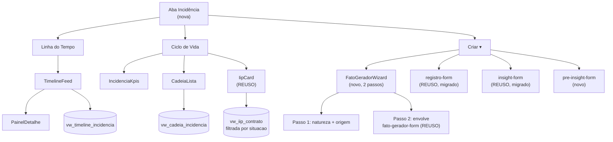

# Fatos Geradores — Linha do Tempo e Ciclo de Vida Design

**Spec**: `.specs/features/fatos-geradores-ciclo-vida/spec.md`
**Context**: `.specs/features/fatos-geradores-ciclo-vida/context.md`
**Status**: Draft

---

## Architecture Overview

A aba de Incidência do contrato ganha duas visões e vira a **casa única de
escrita** das quatro entidades (AD-057). O achado que organiza o esforço: a
parte mais difícil do wizard **já existe** — `fato-gerador-form.tsx` já
implementa a cascata Grupo › Tipologia › Estado com níveis e preditores
derivados em somente-leitura. O trabalho é envolvê-la, não reescrevê-la.



---

## Code Reuse Analysis

### O que já existe e será reaproveitado

| Componente / função | Local | Como usar |
| --- | --- | --- |
| **`fato-gerador-form.tsx`** | `components/incidencia/` | **O achado principal.** Já faz a cascata Grupo→Tipologia→Estado (`:89-134`) e já deriva nível/preditor como leitura — a correção que a skill registra como "erro já cometido e corrigido". Vira o passo 2 do wizard; ganha Título, situação e a origem vinda do passo 1 |
| `registro-form.tsx` | `components/incidencia/` | Migra para a aba (FGC-17). Precisa passar a receber a **etapa por prop** em vez de pela rota |
| `insight-form.tsx` | `components/incidencia/` | Migra para a aba (FGC-18), sem mudança de campo |
| `iip-card.tsx` | `components/incidencia/` | Cartão de IIP do Ciclo de Vida, já rotulando provisório |
| `buscarTipologiasCompletas` | `queries/incidencia.ts:75` | Alimenta a cascata; `TipologiaCompleta` já traz `nivelD1Padrao`, preditores etc. |
| `buscarPilaresInsight`, `buscarNiveisIip`, `buscarTiposRegistroDaEtapa` | `queries/incidencia.ts` | Catálogos dos formulários |
| `buscarRegistrosDaEtapa`, `buscarInsightsDoContrato`, `buscarFatosGeradoresDoContrato` | `queries/incidencia.ts` | Base para a timeline (mas ver decisão sobre view abaixo) |
| `criarFatoGerador`, `criarInsight` | `rpc/` | Escrita já existente; o fato ganha os campos novos |
| Schemas `fato-gerador.ts`, `insight.ts`, `registro.ts` | `backend/schemas/` | Estendidos, não recriados |
| `EstadoVazio`, `ErroInline`, `CarregandoSkeleton` | `components/ui/` | Estados padrão (AD-029) |

### O que muda de casa

| Hoje | Depois |
| --- | --- |
| `RegistroForm` em `/contratos/[id]/etapas/[codigo]/page.tsx:157` | Sai dali; a etapa vira prop |
| `InsightForm` e `FatoGeradorForm` em `ficha-contrato-chrome.tsx:131,152` | Saem dali |
| Listagem de Registros em `/produtos/[slug]/agenda` | **Fica** — calendário é outro propósito |

---

## Components

### `FatoGeradorWizard` (novo)
- **Purpose**: dois passos — natureza + origem, depois dados.
- **Location**: `components/incidencia/fato-gerador-wizard.tsx`
- **Interfaces**: `{ idContrato: number; onConcluido(): void }`
- **Reuses**: `fato-gerador-form.tsx` como corpo do passo 2
- **Estado**: passo 1 guarda `{ situacao, origem }` e passa ao passo 2. Voltar
  preserva o preenchido (Edge Case da spec).

### `SeletorOrigem` (novo)
- **Purpose**: 4 abas de origem com busca; inclui "fato sem origem".
- **Location**: `components/incidencia/seletor-origem.tsx`
- **Regra**: "sem origem" é **caminho de primeira classe**, nunca erro (FGC-01 AC3).

### `TimelineFeed` + `PainelDetalhe` (novos)
- **Location**: `components/incidencia/timeline-feed.tsx`, `painel-detalhe.tsx`
- **Regra**: data de ocorrência **sem hora**; hora só em metadado de auditoria.

### `CadeiaLista` + `IncidenciaKpis` (novos)
- **Location**: `components/incidencia/cadeia-lista.tsx`, `incidencia-kpis.tsx`
- **Regra**: rótulo "Cadeia A/B/C" é **posicional**, gerado no render a partir do
  índice — nunca lido do banco (AD-053).

### Módulos puros novos

| Módulo | Responsabilidade |
| --- | --- |
| `incidencia-timeline.ts` | `agrupaPorMes(itens)` — ordenação decrescente + cabeçalho de mês |
| `incidencia-cadeia.ts` | `rotulaCadeias(cadeias)` — índice → "Cadeia A", "B", … e separa as projetadas |

---

## Data Models

### Migrations

| # | Sufixo | Conteúdo | AD |
| --- | --- | --- | --- |
| 1 | `incidencia_v2_pre_insight` | `fat_pre_insight` + **RLS no mesmo DDL** + GRANTs | AD-001, AD-006, AD-055 |
| 2 | `incidencia_v2_fato_titulo_situacao` | `titulo TEXT`, `situacao TEXT NOT NULL DEFAULT 'realizado'`, `dt_prevista DATE`; troca `dt_ocorrencia NOT NULL` pela constraint condicional | AD-054 |
| 3 | `incidencia_v2_origem_quatro` | `rel_fato_origem` + `id_pre_insight`, `id_registro`; `ck_fato_origem` afrouxada para "ao menos uma das quatro" | — |
| 4 | `incidencia_v2_iip_so_realizados` | `mv_iip_contrato` passa a filtrar `situacao = 'realizado'` | AD-054, AD-014 |
| 5 | `incidencia_v2_views_timeline_cadeia` | `vw_timeline_incidencia`, `vw_cadeia_incidencia` | AD-003, AD-053 |

**`fat_pre_insight` — RLS é obrigatória no mesmo DDL (AD-001).** É a única
tabela nova das duas features; não pode nascer sem política, e a política
espelha a de `fat_insight` (escopo por contrato via carteira do usuário).

### A constraint mais delicada (migration 2)

`dt_ocorrencia` é hoje `NOT NULL`. Um fato projetado não tem data de
ocorrência. Forward-only, a sequência é:

```sql
ALTER TABLE fat_fato_gerador ALTER COLUMN dt_ocorrencia DROP NOT NULL;
ALTER TABLE fat_fato_gerador ADD CONSTRAINT ck_fato_situacao_data CHECK (
  (situacao = 'realizado'  AND dt_ocorrencia IS NOT NULL) OR
  (situacao = 'projetado'  AND dt_prevista   IS NOT NULL));
```

Os fatos já gravados são todos `realizado` com `dt_ocorrencia` preenchida, então
a constraint valida sem `NOT VALID`. **Testar isso** — se algum fato existente
violar, a migration falha no push e o drift-check acusa.

### `vw_cadeia_incidencia` — cadeia derivada (AD-053)

Agrupa por origem comum a partir de `rel_fato_origem`. Precisa acomodar:
cadeia de um fato, cadeia de vários fatos com origem comum, e cadeia que começa
direto no fato (sem linha em `rel_fato_origem`). **Não** existe coluna de nome
nem de letra — a letra é do render.

---

## Error Handling Strategy

| Cenário | Tratamento | Usuário vê |
| --- | --- | --- |
| RLS nega escrita | `mapeiaErroRpc` → `ErroInline` | Erro no formulário (L-008) |
| Fato projetado sem `dt_prevista` | Zod + constraint | Campo obrigatório marcado |
| Origem de outro contrato | Query já escopada + validação | Não aparece na lista |
| `mv_iip_contrato` desatualizada | Exibe valor conhecido, marcado | "(provisório)", sem recálculo na leitura |
| Timeline vazia no período | `EstadoVazio` | Mensagem explícita, não lista vazia |

---

## Risks & Concerns

| Concern | Local | Impacto | Mitigação |
| --- | --- | --- | --- |
| **Migrar `RegistroForm` perde o vínculo de etapa** | `etapas/[codigo]/page.tsx:157` | Hoje a etapa vem da rota. Fora dali, registros podem nascer órfãos da régua — e G1/G2 dependem desse vínculo | FGC-17 tem AC própria: a aba **exige** a etapa explicitamente. Teste de componente cobrindo o caso sem etapa |
| Aposentar 2 telas em produção | `ficha-contrato-chrome.tsx`, tela de etapa | Ponto de entrada órfão: usuário clica e nada acontece | Tarefa de remoção é a **última** da fase, depois da aba funcionando, e tem AC de "nenhum formulário órfão" |
| `mv_iip_contrato` é **materialized view** | migration 4 | Mudar o filtro exige `REFRESH`; sem refresh o número fica velho | A migration faz o refresh; o teste de integração confirma que fato projetado não move o IIP |
| Tabela nova sem RLS | `fat_pre_insight` | Tabela pública se a política ficar para depois (AD-001) | Política **no mesmo arquivo** do `CREATE TABLE`, com teste de integração negando acesso fora da carteira |
| Timeline une 4 entidades | `vw_timeline_incidencia` | União mal indexada fica lenta conforme o contrato cresce | Escopar por `id_contrato` e período dentro da view, não no cliente |
| Pré-Insight ↔ Insight sem relação definida | — | A spec deixou aberto se promover cria vínculo | **Decisão pendente de Design**: por ora coexistem sem FK entre eles. Registrar como assumption se seguir assim |

---

## Tech Decisions

| Decisão | Escolha | Racional |
| --- | --- | --- |
| Passo 2 do wizard | Envolver `fato-gerador-form` existente | A cascata e a derivação de níveis já estão certas e testadas; reescrever reintroduziria o erro que a skill catalogou |
| Letra da cadeia | Gerada no render | AD-053 — cadeia é derivada; letra persistida viraria identidade falsa |
| Timeline | View única em vez de 4 queries no cliente | AD-003 e ordenação/paginação corretas; 4 listas unidas no cliente não paginam |
| `titulo` nullable | Sim, com obrigatoriedade no formulário | `NOT NULL` quebraria fatos já gravados |

> Nenhuma decisão project-level nova — AD-053 a AD-057 já cobrem.

---

## Nota de teste (AD-042 / AD-044)

Profundidade **integral**: os dois lados de cada condicional, estado vazio e
estado de erro. A aba é superfície de escrita das quatro entidades (AD-057),
que é onde AD-046 manteve a profundidade mesmo durante o corte de ritmo — e o
corte de AD-046 não alcança esta feature de qualquer forma.

Alvos onde um erro passa despercebido (todos já cometidos em mockup):
régua com **4** posições e nunca 5; dimensão **sem** legenda descritiva; níveis
batendo com o seed da tripla escolhida; data sem hora; fato sem origem
renderizado **sem** marca de falha.
