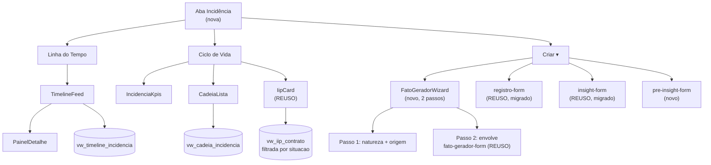

# Fatos Geradores — Linha do Tempo e Ciclo de Vida Design

**Spec**: `.specs/features/fatos-geradores-ciclo-vida/spec.md`
**Context**: `.specs/features/fatos-geradores-ciclo-vida/context.md`
**Status**: Approved (2026-09-16)

---

## Architecture Overview

A aba de Incidência do contrato ganha duas visões e vira a **casa única de
escrita** das quatro entidades (AD-057). O achado que organiza o esforço: a
parte mais difícil do wizard **já existe** — `fato-gerador-form.tsx` já
implementa a cascata Grupo › Tipologia › Estado com níveis e preditores
derivados em somente-leitura. O trabalho é envolvê-la, não reescrevê-la.



---

## Code Reuse Analysis

### O que já existe e será reaproveitado

| Componente / função | Local | Como usar |
| --- | --- | --- |
| **`fato-gerador-form.tsx`** | `components/incidencia/` | **O achado principal.** Já faz a cascata Grupo→Tipologia→Estado (`:89-134`) e já deriva nível/preditor como leitura — a correção que a skill registra como "erro já cometido e corrigido". Vira o passo 2 do wizard; ganha Título, situação e a origem vinda do passo 1 |
| `registro-form.tsx` | `components/incidencia/` | Migra para a aba (FGC-17). Precisa passar a receber a **etapa por prop** em vez de pela rota |
| `insight-form.tsx` | `components/incidencia/` | Migra para a aba (FGC-18), sem mudança de campo |
| `iip-card.tsx` | `components/incidencia/` | Cartão de IIP do Ciclo de Vida, já rotulando provisório |
| `buscarTipologiasCompletas` | `queries/incidencia.ts:75` | Alimenta a cascata; `TipologiaCompleta` já traz `nivelD1Padrao`, preditores etc. |
| `buscarPilaresInsight`, `buscarNiveisIip`, `buscarTiposRegistroDaEtapa` | `queries/incidencia.ts` | Catálogos dos formulários |
| `buscarRegistrosDaEtapa`, `buscarInsightsDoContrato`, `buscarFatosGeradoresDoContrato` | `queries/incidencia.ts` | Base para a timeline (mas ver decisão sobre view abaixo) |
| `buscarReguaDoContrato` | `queries/etapa-contrato.ts:26` | Achado de Tasks — alimenta o Select de etapa que `RegistroForm` passa a precisar fora da tela de etapa (já traz `idEtapa` por linha, nenhuma query nova) |
| `criarFatoGerador`, `criarInsight` | `rpc/` | Escrita já existente; o fato ganha os campos novos |
| Schemas `fato-gerador.ts`, `insight.ts`, `registro.ts` | `backend/schemas/` | Estendidos, não recriados |
| `EstadoVazio`, `ErroInline`, `CarregandoSkeleton` | `components/ui/` | Estados padrão (AD-029) |
| **`PlanejamentoAbas` (padrão, não o componente)** | `components/planejamento/planejamento-abas.tsx` | **Achado de Tasks (2026-09-16).** Linha do Tempo/Ciclo de Vida é exatamente a mesma forma que Diagnóstico/Estrutura do Planejamento: duas visões na **mesma rota**, alternadas por querystring (`?visao=`) via `router.replace` (sem entrada no histórico), não pelo `RouteTabs` do app-shell (que troca de rota de verdade). Mesmo motivo: trocar de visão não pode remontar o estado já carregado (fixtures da timeline, cadeias). Copiar a forma como `AbaIncidencia` novo, não importar o componente do Planejamento |

### O que muda de casa

| Hoje | Depois |
| --- | --- |
| `RegistroForm` em `/contratos/[id]/etapas/[codigo]/page.tsx:157` | Sai dali; a etapa vira prop |
| `InsightForm` e `FatoGeradorForm` em `ficha-contrato-chrome.tsx:131,152` | Saem dali |
| Listagem de Registros em `/produtos/[slug]/agenda` | **Fica** — calendário é outro propósito |

---

## Components

### `AbaIncidencia` (novo)
- **Purpose**: casca da rota `/contratos/[id]/fatos-registros` — alterna Linha
  do Tempo / Ciclo de Vida por querystring (`?visao=`), mesmo padrão de
  `PlanejamentoAbas` (ver Code Reuse Analysis), e hospeda o menu "Criar ▾".
- **Location**: `components/incidencia/aba-incidencia.tsx`
- **Interfaces**: `{ linhaDoTempo: ReactNode; cicloDeVida: ReactNode }`
- **Reuses**: forma de `planejamento-abas.tsx` (`router.replace`, sem
  histórico); não importa o componente, que é specific de Planejamento

### `FatoGeradorWizard` (novo)
- **Purpose**: dois passos — natureza + origem, depois dados.
- **Location**: `components/incidencia/fato-gerador-wizard.tsx`
- **Interfaces**: `{ idContrato: number; onConcluido(): void }`
- **Reuses**: `fato-gerador-form.tsx` como corpo do passo 2
- **Estado**: passo 1 guarda `{ situacao, origem }` e passa ao passo 2. Voltar
  preserva o preenchido (Edge Case da spec).

### `SeletorOrigem` (novo)
- **Purpose**: 4 abas de origem com busca; inclui "fato sem origem".
- **Location**: `components/incidencia/seletor-origem.tsx`
- **Regra**: "sem origem" é **caminho de primeira classe**, nunca erro (FGC-01 AC3).

### `TimelineFeed` + `PainelDetalhe` (novos)
- **Location**: `components/incidencia/timeline-feed.tsx`, `painel-detalhe.tsx`
- **Regra**: data de ocorrência **sem hora**; hora só em metadado de auditoria.

### `CadeiaLista` + `IncidenciaKpis` (novos)
- **Location**: `components/incidencia/cadeia-lista.tsx`, `incidencia-kpis.tsx`
- **Regra**: rótulo "Cadeia A/B/C" é **posicional**, gerado no render a partir do
  índice — nunca lido do banco (AD-053).

### Módulos puros novos

| Módulo | Responsabilidade |
| --- | --- |
| `incidencia-timeline.ts` | `agrupaPorMes(itens)` — ordenação decrescente + cabeçalho de mês |
| `incidencia-cadeia.ts` | `rotulaCadeias(cadeias)` — índice → "Cadeia A", "B", … e separa as projetadas |

---

## Data Models

### Migrations

| # | Sufixo | Conteúdo | AD |
| --- | --- | --- | --- |
| 1 | `incidencia_v2_pre_insight` | `fat_pre_insight` + **RLS no mesmo DDL** + GRANTs | AD-001, AD-006, AD-055 |
| 2 | `incidencia_v2_fato_titulo_situacao` | `titulo TEXT`, `situacao TEXT NOT NULL DEFAULT 'realizado'`, `dt_prevista DATE`; troca `dt_ocorrencia NOT NULL` pela constraint condicional | AD-054 |
| 3 | `incidencia_v2_origem_quatro` | `rel_fato_origem` + `id_pre_insight`, `id_registro`; `ck_fato_origem` afrouxada para "ao menos uma das quatro" | — |
| 4 | `incidencia_v2_iip_so_realizados` | `mv_iip_contrato` passa a filtrar `situacao = 'realizado'` | AD-054, AD-014 |
| 5 | `incidencia_v2_views_timeline_cadeia` | `vw_timeline_incidencia`, `vw_cadeia_incidencia` | AD-003, AD-053 |
| 6 | `incidencia_v2_fn_criar_fato_gerador` | `CREATE OR REPLACE FUNCTION app.criar_fato_gerador(...)` com os parâmetros novos | AD-024, AD-054 |

**Gap encontrado em Tasks (2026-09-16), não previsto nas 5 migrations acima:**
`app.criar_fato_gerador()` (`20260813193050_incidencia_encontros_fn_criar_fato_gerador.sql`)
é a única porta de escrita de Fato Gerador (SECURITY INVOKER, AD-024) e sua
assinatura **não tem** `p_titulo`, `p_situacao`, `p_dt_prevista`,
`p_id_pre_insight_origem` nem `p_id_registro_origem`. Sem migration 6, o
wrapper TS (`rpc/fato-gerador.ts`) poderia até compilar com os campos novos,
mas o Postgres os descartaria silenciosamente — nenhum deles chegaria ao
banco. A migration 6 precisa: (a) adicionar os 5 parâmetros; (b) tornar
`p_dt_ocorrencia` condicional em vez de `DEFAULT CURRENT_DATE` (hoje ele
sempre grava uma data, mesmo para o que seria um projetado); (c) validar
Pré-Insight/Registro de origem do mesmo contrato, mesmo padrão das duas
checagens já existentes para Meta/Insight; (d) estender o `INSERT INTO
rel_fato_origem` para as 4 colunas.

**`fat_pre_insight` — RLS é obrigatória no mesmo DDL (AD-001).** É a única
tabela nova das duas features; não pode nascer sem política, e a política
espelha a de `fat_insight` (escopo por contrato via carteira do usuário).

### A constraint mais delicada (migration 2)

`dt_ocorrencia` é hoje `NOT NULL`. Um fato projetado não tem data de
ocorrência. Forward-only, a sequência é:

```sql
ALTER TABLE fat_fato_gerador ALTER COLUMN dt_ocorrencia DROP NOT NULL;
ALTER TABLE fat_fato_gerador ADD CONSTRAINT ck_fato_situacao_data CHECK (
  (situacao = 'realizado'  AND dt_ocorrencia IS NOT NULL) OR
  (situacao = 'projetado'  AND dt_prevista   IS NOT NULL));
```

**Não é risco empírico, é estrutural.** `dt_ocorrencia` está `NOT NULL` hoje —
antes desta migration, o Postgres nunca aceitou uma linha com essa coluna
vazia, em nenhum ambiente. `situacao` nasce com `DEFAULT 'realizado' NOT NULL`,
então toda linha pré-existente cai automaticamente no primeiro ramo do CHECK
(`situacao = 'realizado' AND dt_ocorrencia IS NOT NULL`), que já era garantido
pela constraint de coluna que só é solta *depois*, na mesma migration. Não há
sequência de eventos em que uma linha gravada antes desta migration possa
violar o CHECK novo — vale para dev e para produção igualmente, com qualquer
volume de linhas. Confirmado também por leitura direta (dev, 2026-09-16):
`fat_fato_gerador` está com 0 linhas agora, então nem o caso hipotético existe
por ora. A migration valida sem `NOT VALID`.

### `vw_cadeia_incidencia` — cadeia derivada (AD-053)

Agrupa por origem comum a partir de `rel_fato_origem`. Precisa acomodar:
cadeia de um fato, cadeia de vários fatos com origem comum, e cadeia que começa
direto no fato (sem linha em `rel_fato_origem`). **Não** existe coluna de nome
nem de letra — a letra é do render.

---

## Error Handling Strategy

| Cenário | Tratamento | Usuário vê |
| --- | --- | --- |
| RLS nega escrita | `mapeiaErroRpc` → `ErroInline` | Erro no formulário (L-008) |
| Fato projetado sem `dt_prevista` | Zod + constraint | Campo obrigatório marcado |
| Origem de outro contrato | Query já escopada + validação | Não aparece na lista |
| `mv_iip_contrato` desatualizada | Exibe valor conhecido, marcado | "(provisório)", sem recálculo na leitura |
| Timeline vazia no período | `EstadoVazio` | Mensagem explícita, não lista vazia |

---

## Risks & Concerns

| Concern | Local | Impacto | Mitigação |
| --- | --- | --- | --- |
| **`RegistroForm` fora da tela de etapa perde a origem de `idEtapa`** | `registro-form.tsx:33` (prop já `idEtapa: number`, obrigatória) e `etapas/[codigo]/page.tsx:86-91` (hoje resolvido do `codigo` da rota) | **Corrigido em Tasks (2026-09-16)**: o form já exige `idEtapa` por prop, isso não muda. O que falta é *de onde* a aba nova tira esse valor — não há `codigo` de rota em `/fatos-registros`. Sem um seletor, a criação de Registro fica impossível fora da tela de etapa | Task nova: Select de etapa dentro do fluxo de criação da aba, populado por `buscarReguaDoContrato` (já existe, `queries/etapa-contrato.ts:26` — reuso direto, nenhuma query nova). Teste de componente cobrindo o caso sem etapa selecionada |
| Aposentar 2 telas em produção | `ficha-contrato-chrome.tsx`, tela de etapa | Ponto de entrada órfão: usuário clica e nada acontece | Tarefa de remoção é a **última** da fase, depois da aba funcionando, e tem AC de "nenhum formulário órfão" |
| `mv_iip_contrato` é **materialized view** | migration 4 | Mudar o filtro exige `REFRESH`; sem refresh o número fica velho | A migration faz o refresh; o teste de integração confirma que fato projetado não move o IIP |
| Tabela nova sem RLS | `fat_pre_insight` | Tabela pública se a política ficar para depois (AD-001) | Política **no mesmo arquivo** do `CREATE TABLE`, com teste de integração negando acesso fora da carteira |
| Timeline une 4 entidades | `vw_timeline_incidencia` | União mal indexada fica lenta conforme o contrato cresce | Escopar por `id_contrato` e período dentro da view, não no cliente |
| Pré-Insight ↔ Insight sem relação definida | — | Sem query para reconstruir "de qual Pré-Insight este Insight veio" | **Resolvido (AD-058, 2026-09-16)**: decisão de Pedro — coexistem sem FK entre eles, de propósito. Rastreabilidade fica para decisão futura se a operação pedir |

---

## Tech Decisions

| Decisão | Escolha | Racional |
| --- | --- | --- |
| Passo 2 do wizard | Envolver `fato-gerador-form` existente | A cascata e a derivação de níveis já estão certas e testadas; reescrever reintroduziria o erro que a skill catalogou |
| Letra da cadeia | Gerada no render | AD-053 — cadeia é derivada; letra persistida viraria identidade falsa |
| Timeline | View única em vez de 4 queries no cliente | AD-003 e ordenação/paginação corretas; 4 listas unidas no cliente não paginam |
| `titulo` nullable | Sim, com obrigatoriedade no formulário | `NOT NULL` quebraria fatos já gravados — confirmado por Pedro na revisão de design (2026-09-16) |
| Pré-Insight ↔ Insight | Sem vínculo (FK) entre os dois | Fecha o ponto aberto pela AD-055; ver AD-058 |

> Uma decisão project-level nova nesta revisão: **AD-058** (Pré-Insight/Insight
> sem vínculo), que fecha o ponto que a AD-055 tinha deixado aberto. As demais
> — AD-053 a AD-057 — já cobrem o resto.

---

## Nota de teste (AD-042 / AD-044)

Profundidade **integral**: os dois lados de cada condicional, estado vazio e
estado de erro. A aba é superfície de escrita das quatro entidades (AD-057),
que é onde AD-046 manteve a profundidade mesmo durante o corte de ritmo — e o
corte de AD-046 não alcança esta feature de qualquer forma.

Alvos onde um erro passa despercebido (todos já cometidos em mockup):
régua com **4** posições e nunca 5; dimensão **sem** legenda descritiva; níveis
batendo com o seed da tripla escolhida; data sem hora; fato sem origem
renderizado **sem** marca de falha.
