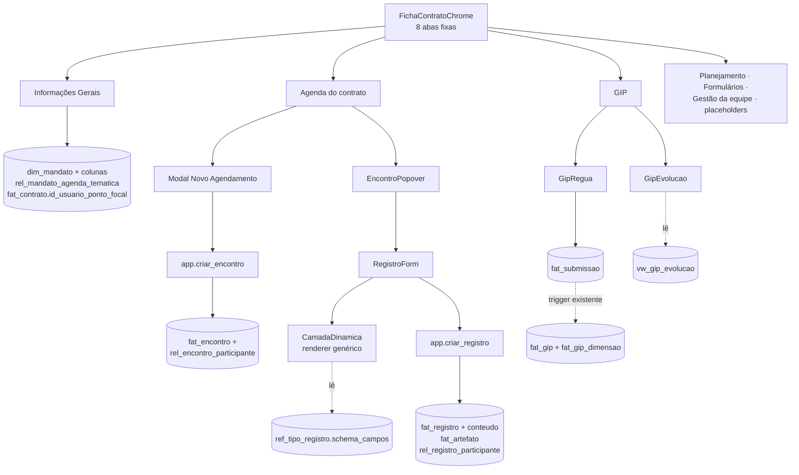

# Ficha do Mandato/Contrato — Design

**Spec**: `.specs/features/ficha-mandato-contrato/spec.md`
**Status**: Draft
**Abordagem escolhida**: (A) `ref_tipo_registro.schema_campos` + renderer genérico — confirmada por
Pedro em 2026-09-15.

---

## Architecture Overview

Três frentes independentes que só se encontram na barra de abas:



A escrita do GIP **não ganha caminho novo**: continua entrando por `fat_submissao` e sendo derivada
por `app.trg_deriva_gip`. A aba é superfície, não mecanismo (FMC-26).

---

## Code Reuse Analysis

### Componentes existentes a aproveitar

| Componente | Local | Como usar |
| :-- | :-- | :-- |
| `FichaContratoChrome` | [ficha-contrato-chrome.tsx](src/frontend/components/produtos/ficha-contrato-chrome.tsx) | **Modificar**: troca `abasEtapas` por lista fixa de 8; mantém header, IipCard e diálogos |
| `RouteTabs` | `components/app-shell/route-tabs.tsx` | Inalterado — só recebe outra lista |
| `AgendaMes` · `EncontroPopover` | [components/estrategia/](src/frontend/components/estrategia/) | **Reuso direto**, com filtro por contrato em vez de produto |
| `buscarEncontrosDoMes` · `buscarRegistrosDaAgenda` | `backend/queries/agenda.ts`, `registros-agenda.ts` | `FiltroAgenda` já aceita `idContrato` — só passar |
| `marcarPresenca` | `backend/rpc/encontro.ts` | Inalterado (presença do encontro, A-21) |
| `formulario-gip-form.tsx` | [components/produtos/](src/frontend/components/produtos/formulario-gip-form.tsx) | **Extrair** a lógica de submissão; a aba GIP reusa o caminho, com outra apresentação |
| `vinculo-table.tsx` / rota `/vinculos` | `components/fundacao/` | Reuso literal sob o rótulo "Gestão da equipe" |
| `informacoes-tse-mandato.tsx` | `components/fundacao/` | **Convive**: o TSE desce para uma seção da aba, os cards novos entram acima |
| `<ErroInline>` · `<EstadoVazio>` · `<CarregandoSkeleton>` · `<EmDesenvolvimento>` | `components/ui/` | Estados padrão (AD-029) |
| `registro-form.tsx` · `encontro-form.tsx` | `components/incidencia/` | **Reescrever** — hoje não têm camada dinâmica nem presentes |

### Padrões a replicar verbatim

| Padrão | Referência |
| :-- | :-- |
| RLS `p_por_contrato` com `USING` + `WITH CHECK` explícitos | [incidencia_encontros_rls.sql:26-40](supabase/migrations/20260813192341_incidencia_encontros_rls.sql#L26-L40) |
| RLS `p_heranca` (EXISTS contra a tabela-pai) para filha sem `id_contrato` | mesma migration, bloco final |
| Re-GRANT em bloco após criar tabela (AD-025) | [incidencia_encontros_grants.sql](supabase/migrations/20260813192816_incidencia_encontros_grants.sql) |
| RPC `SECURITY INVOKER` validando pertencimento ao contrato antes de inserir | [fn_criar_insight.sql](supabase/migrations/20260813193529_incidencia_encontros_fn_criar_insight.sql) |
| `app.id_usuario()` resolve o autor — **nunca** parâmetro do chamador (AD-006) | idem |

---

## Data Models

### `fat_artefato` — verbatim de `docs/schema_sistema.sql:931-948`

Nenhuma coluna redesenhada (AD-008). Provisionada pela primeira vez.

```sql
CREATE TABLE fat_artefato (
  id_artefato BIGSERIAL PRIMARY KEY,
  id_contrato BIGINT NOT NULL REFERENCES fat_contrato(id_contrato) ON DELETE RESTRICT,
  escopo TEXT NOT NULL, id_referencia BIGINT, tipo TEXT NOT NULL,
  url TEXT NOT NULL, descricao texto_limpo,
  id_usuario_anexou BIGINT REFERENCES dim_usuario(id_usuario),
  criado_em TIMESTAMPTZ NOT NULL DEFAULT now(),
  CONSTRAINT ck_artefato_escopo CHECK (escopo IN ('contrato','registro','submissao','encontro','etapa')),
  CONSTRAINT ck_artefato_referencia CHECK ((escopo = 'contrato') = (id_referencia IS NULL)),
  CONSTRAINT ck_artefato_tipo CHECK (tipo IN (...12 valores...)),
  CONSTRAINT ck_artefato_url CHECK (url ~* '^https?://')
);
CREATE INDEX ix_artefato_referencia ON fat_artefato (escopo, id_referencia);
```

`id_referencia` é polimórfico e **não tem FK** — o schema aprovado manda validar por trigger de
aplicação. Entra `app.trg_valida_artefato_referencia()`: quando `escopo = 'registro'`, exige
`fat_registro` existente **no mesmo `id_contrato`**.

### `rel_registro_participante` — tabela nova (B-01, fecha TIP-07)

Espelha `rel_encontro_participante` de propósito: mesma forma, outro dono.

```sql
CREATE TABLE rel_registro_participante (
  id_participacao BIGSERIAL PRIMARY KEY,
  id_registro BIGINT NOT NULL REFERENCES fat_registro(id_registro) ON DELETE CASCADE,
  id_usuario BIGINT REFERENCES dim_usuario(id_usuario),
  nome_livre texto_limpo,
  origem TEXT NOT NULL,
  CONSTRAINT ck_reg_part_origem CHECK (origem IN ('legisla','mandato','externo')),
  CONSTRAINT ck_reg_part_identificacao CHECK ((id_usuario IS NULL) <> (nome_livre IS NULL))
);
CREATE UNIQUE INDEX uq_reg_part_usuario ON rel_registro_participante (id_registro, id_usuario) WHERE id_usuario IS NOT NULL;
```

**Sem coluna `presente`.** Diferença deliberada em relação a `rel_encontro_participante`: lá a linha
existe para todo convidado e `presente` diz se compareceu; aqui a linha **é** o fato de ter estado.
Desmarcar alguém apaga a linha. Isso evita o terceiro estado ("linha com `presente = false` num
registro") que não significaria nada.

### `ref_nivel_dimensao_gip` — catálogo novo (A-11)

```sql
CREATE TABLE ref_nivel_dimensao_gip (
  id_dimensao BIGINT NOT NULL REFERENCES ref_dimensao_gip(id_dimensao) ON DELETE CASCADE,
  valor SMALLINT NOT NULL,
  descricao TEXT NOT NULL,
  CONSTRAINT pk_nivel_dimensao_gip PRIMARY KEY (id_dimensao, valor)
);
```

14 linhas (Anexo A da spec). `ref_*` é GRANT-only, sem RLS (AD-030).

### `rel_mandato_agenda_tematica` — vínculo novo

```sql
CREATE TABLE rel_mandato_agenda_tematica (
  id_mandato BIGINT NOT NULL REFERENCES dim_mandato(id_mandato) ON DELETE CASCADE,
  id_agenda BIGINT NOT NULL REFERENCES ref_agenda_tematica(id_agenda),
  CONSTRAINT pk_mandato_agenda PRIMARY KEY (id_mandato, id_agenda)
);
```

PK composta resolve FMC-07 AC5 (segunda gravação rejeitada pelo banco, não pelo cliente).

### Colunas novas

| Tabela | Coluna | Tipo | Requisito |
| :-- | :-- | :-- | :-- |
| `dim_mandato` | `minibiografia` | `texto_limpo` | FMC-05 |
| `dim_mandato` | `principais_pautas` | `TEXT[]` | FMC-06 (A-03) |
| `fat_contrato` | `id_usuario_ponto_focal` | `BIGINT REFERENCES dim_usuario` | FMC-11 (A-05) |
| `ref_tipo_registro` | — | `qtd_prevista = 4` em `sprint` | FMC-34 |

### Contrato de `ref_tipo_registro.schema_campos`

O coração da abordagem (A). Versionado desde a primeira linha para não repetir o erro de JSONB sem
versão que `formularios-produto` já pagou.

```json
{
  "versao": 1,
  "campos": [
    { "chave": "adequacoes", "rotulo": "Adequações a serem realizadas",
      "tipo": "texto_longo", "obrigatorio": false },
    { "chave": "organograma", "rotulo": "Organograma",
      "tipo": "link", "artefato_tipo": "organograma" },
    { "chave": "local", "rotulo": "Local",
      "tipo": "leitura_encontro", "origem": "local" },
    { "chave": "fotos", "rotulo": "Fotos",
      "tipo": "arquivo", "artefato_tipo": "foto", "estado": "em_desenvolvimento" }
  ]
}
```

| `tipo` | Onde grava | Observação |
| :-- | :-- | :-- |
| `texto_curto` · `texto_longo` | `fat_registro.conteudo[chave]` | |
| `link` | `fat_artefato` (`escopo='registro'`, `tipo = artefato_tipo`) | `descricao` opcional |
| `leitura_encontro` | **não grava** | Lê `fat_encontro[origem]`; some se o registro não tem encontro |
| `arquivo` | **não grava nesta feature** | Renderiza bloco "em desenvolvimento" (FMC-22) |

Campo de `tipo` desconhecido é **ignorado com aviso**, nunca quebra o formulário (edge case da spec).

---

## Components

### `CamadaDinamica`

- **Purpose**: renderizar os campos declarados por um tipo de registro e devolver os valores prontos para o RPC.
- **Location**: `src/frontend/components/incidencia/camada-dinamica.tsx`
- **Interfaces**:
  - `<CamadaDinamica campos={CampoDinamico[]} encontro={EncontroResumo | null} control={Control} />`
- **Dependencies**: `react-hook-form`, primitivos de `components/ui/`
- **Reuses**: `Input`, `Textarea`, `InputGroup`, `<EmDesenvolvimento>`

### `parseSchemaCampos` (função pura — estratégia AD-042)

- **Purpose**: validar e tipar o JSONB do catálogo, descartando campo desconhecido.
- **Location**: `src/frontend/lib/camada-dinamica.ts`
- **Interfaces**: `parseSchemaCampos(json: unknown): { campos: CampoDinamico[]; ignorados: string[] }`
- **Por que pura**: concentra a regra do renderer num teste `.test.ts` barato, em vez de exercitá-la só via render.

### Demais funções puras

| Função | Local | Requisito |
| :-- | :-- | :-- |
| `rotuloEvolucaoGip(gap: number \| null): string` | `lib/gip.ts` | FMC-28 AC9 |
| `resumoEvolucaoGip(linhas): { evoluiram, mantiveram, regrediram }` | `lib/gip.ts` | FMC-28 AC11 |
| `rotuloStatusContrato(status): string` | `lib/contrato.ts` | FMC-12 |
| `rotuloSequencia(nr, qtdPrevista): string \| null` | `lib/registro.ts` | FMC-15 AC2 |

### `InformacoesGeraisMandato`

- **Purpose**: os quatro cards da aba (Sobre o Mandato, Ponto Focal e Gestoras, Histórico de Contratos, Projetos e Coalizões).
- **Location**: `src/frontend/components/fundacao/informacoes-gerais-mandato.tsx`
- **Dependencies**: `useQuery`, `dim_mandato`, `rel_usuario_contrato`, `fat_contrato`, `rel_coalizao_membro`
- **Reuses**: `informacoes-tse-mandato.tsx` desce para seção dentro da mesma aba

### `GipRegua` e `GipEvolucao`

- **Location**: `src/frontend/components/produtos/gip-regua.tsx`, `gip-evolucao.tsx`
- **Interfaces**: `<GipRegua idContrato momento="inicio"|"fim" />`, `<GipEvolucao idContrato />`
- **Reuses**: o caminho de submissão de `formulario-gip-form.tsx`, extraído para `backend/rpc/gip.ts`

### `RegistroEncontroForm` (era `RegistroForm` na spec original — renomeado)

> **Colisão resolvida em 2026-09-16 (Pedro):** `src/frontend/components/incidencia/registro-form.tsx`
> foi reescrito pela feature concorrente `fatos-geradores-ciclo-vida` (commit `bdbc931`) para um uso
> genérico e incompatível com este — lá, Etapa/Tipo são **selecionáveis** pelo usuário (sem encontro
> de origem, aba "Fatos Geradores e Registros"), com edição e escrita direta em `fat_registro` (uma
> tabela só, fora do escopo de AD-024). Aqui, Etapa/Tipo são **herdados do encontro e imutáveis**,
> com camada dinâmica, presença e RPC transacional. São necessidades diferentes que colidiram no
> mesmo nome de arquivo — decisão: **dois componentes**. `registro-form.tsx` continua intocado,
> servindo `fatos-geradores-ciclo-vida`. Este nasce em arquivo próprio.

- **Purpose**: registro de um encontro real ou retroativo (Legisla Aliada), com Etapa/Tipo herdados
  e imutáveis, camada dinâmica, presença e submissão via `app.criar_registro`.
- **Location**: `src/frontend/components/incidencia/registro-encontro-form.tsx`
- **Interfaces**: `<RegistroEncontroForm idContrato idEncontro? idEtapa idTipoRegistro onConcluido onCancelar />`
- **Dependencies**: `criarRegistro` (T21), `CamadaDinamica` (T30), `rotuloSequencia` (T16)
- **Reuses**: `Form`/`Input`/`Textarea` de `components/ui/`, `<ErroInline>`

### `EncontroForm` (modal Novo Agendamento)

- **Location**: `src/frontend/components/incidencia/encontro-form.tsx` (reescrita)
- **Interfaces**: `<EncontroForm idContrato idProduto onConcluido onCancelar />`
- **Dependencies**: `app.criar_encontro`, `ref_etapa`/`ref_tipo_registro` do produto
- **Reuses**: `Dialog`, combobox `command`+`popover` (padrão já em uso no wizard TSE)

### RPCs

| Função | Assinatura | Invariante |
| :-- | :-- | :-- |
| `app.criar_encontro` | `(p_id_contrato, p_titulo, p_id_etapa, p_id_tipo_registro, p_dt_inicio, p_dt_fim, p_modalidade, p_local, p_tema, p_participantes JSONB)` → `BIGINT` | encontro + N participantes numa transação (FMC-30) |
| `app.criar_registro` | `(p_id_contrato, p_id_encontro, p_id_tipo_registro, p_ocorrido_em, p_resumo, p_conteudo JSONB, p_artefatos JSONB, p_presentes JSONB)` → `BIGINT` | registro + conteúdo + artefatos + presentes numa transação (FMC-21); atribui `nr_sequencia` via `MAX+1` sob `FOR UPDATE` (FMC-15 AC3) |

Ambas `SECURITY INVOKER` (AD-024), com `app.id_usuario()` resolvendo autoria (AD-006).

---

## Error Handling Strategy

| Cenário | Tratamento | O que a usuária vê |
| :-- | :-- | :-- |
| URL de artefato sem `https?://` | `ck_artefato_url` rejeita; RPC aborta a transação | `<ErroInline>` com mensagem mapeada em `rpc/errors.ts` |
| Valor de GIP fora da faixa | `trg_gip_dimensao_faixa` rejeita | `<ErroInline>`; a UI já não oferece a opção |
| Segundo GIP do mesmo momento | `uq_gip_contrato_momento` | Aba mostra o momento como "aplicado" antes de oferecer |
| Tema temático repetido | PK composta de `rel_mandato_agenda_tematica` | Chip já marcado; erro não chega à tela |
| RLS nega leitura da ficha | Query volta vazia | `<ErroInline>`, nunca tela em branco (AD-001) |
| `schema_campos` com campo de tipo desconhecido | `parseSchemaCampos` descarta e devolve em `ignorados` | Formulário renderiza o resto; aviso discreto |
| Registro sem encontro | `leitura_encontro` some da camada; "Presentes" vira lista livre | Sem campo morto |
| Coalizão acessa `/informacoes` | `notFound()` | 404 |

---

## Risks & Concerns

| Concern | Local | Impacto | Mitigação |
| :-- | :-- | :-- | :-- |
| Re-seed do GIP muda o significado de valores já gravados (1–4 → 0–3/0–2) | `ref_dimensao_gip` | Nota antiga passa a significar outro nível, em silêncio | Migration **falha alto** se `fat_gip_dimensao` tiver qualquer linha (`RAISE EXCEPTION`); task própria, verificada em dev antes de `master` |
| `GRANT ... ON ALL TABLES TO legisla_app` é re-executado a cada tabela nova | [0004_plataforma_roles_grants.sql:55](supabase/migrations/0004_plataforma_roles_grants.sql#L55) e sucessoras | As 4 tabelas novas nascem com CRUD amplo para a role de fallback — exatamente o que **AD-048** manda revogar antes do cadastro self-service | Seguir o padrão vigente (não inventar exceção aqui), e **registrar as 4 tabelas novas** na lista que AD-048 terá de percorrer. Anotado como dívida herdada, não criada |
| `legisla_assessor` sem `GRANT USAGE ON SEQUENCES` para as tabelas novas | grants | Primeiro INSERT do Assessor falha com 42501 em `nextval()` | Já é achado conhecido ([grants da incidência](supabase/migrations/20260813192816_incidencia_encontros_grants.sql)) — re-GRANT explícito de sequences na mesma migration |
| `id_referencia` de `fat_artefato` é polimórfico sem FK | `fat_artefato` | Artefato órfão ou apontando para registro de outro contrato | `app.trg_valida_artefato_referencia()` — o schema aprovado já previa validação por trigger |
| `fat_registro.conteudo` sem validação de forma | `fat_registro` | Chave fora do `schema_campos` entra sem reclamar | RPC valida as chaves contra o catálogo antes de inserir |
| Duas tabelas de presença podem divergir | `rel_encontro_participante` × `rel_registro_participante` | Contagens diferentes para o mesmo encontro | A-21 define significados distintos; a AD precisa dizer isso, senão a próxima feature tenta sincronizar |
| `AgendaMes` nasceu produto-escopo | [agenda-mes.tsx](src/frontend/components/estrategia/agenda-mes.tsx) | Reuso contrato-escopo pode esbarrar em suposição de fuso/produto | `FUSO_HORARIO_PRODUTO` e `FiltroAgenda` já parametrizados; task de reuso começa por teste que fixa o recorte por contrato |
| Migration de `revisao-tipos-registro` pode não estar aplicada em dev | `20260911032046` | `schema_campos` seedado sobre nome antigo | Task 1 confere `supabase migration list` e aplica o pendente antes de qualquer seed |

---

## Tech Decisions

| Decisão | Escolha | Racional |
| :-- | :-- | :-- |
| Declaração da camada dinâmica | `schema_campos` JSONB versionado | Abordagem (A); coluna já provisionada; tipo novo é `UPDATE`, não deploy (AD-004) |
| `rel_registro_participante` sem `presente` | A linha é o fato | Evita terceiro estado sem significado; desmarcar apaga |
| Descritores de nível do GIP em tabela, não em JSONB | `ref_nivel_dimensao_gip` | É catálogo consultável e ordenável, precedente `ref_nivel_iip` |
| Eixo do GIP = momento | `regua_sonhos`=Início, `onde_chegamos`=Fim | É o que `app.trg_deriva_gip` já grava; preserva `vw_gip_evolucao` |
| Rótulo de evolução derivado de `gap`, não de `situacao` | Função pura no frontend | `situacao` (`atingiu\|proximo\|distante`) responde outra pergunta; `gap` é o número certo (AD-003 satisfeita — o número vem da view) |
| Placeholders de Diagnóstico e Fatos Geradores | Rota real + `<EmDesenvolvimento>` | Aba que não navega quebra a barra; precedente do Kanban vazio (`61568ff`) |

> **Project-level**: quatro candidatas a AD estão listadas na spec (§ "Decisões arquiteturais a
> registrar"). Entram no `STATE.md` como AD-056..AD-059 durante Tasks, não aqui.

---

## Ordem de construção sugerida (insumo para Tasks)

1. **Fundação de schema** — `fat_artefato`, `rel_registro_participante`, `ref_nivel_dimensao_gip`,
   `rel_mandato_agenda_tematica`, colunas novas, RLS, grants, triggers de auditoria.
2. **Catálogos** — seed dos 30 temas, re-seed do GIP (com guarda), 14 descritores,
   `schema_campos` dos 9 tipos, `qtd_prevista` do `sprint`.
3. **Funções puras + RPCs** — a camada testável barata, antes de qualquer tela.
4. **Barra de abas** — destrava as três frentes de UI.
5. **Informações Gerais** · **Registro + camada dinâmica** · **GIP** — paralelizáveis entre si.
6. **Agenda + Novo Agendamento** (P2).
