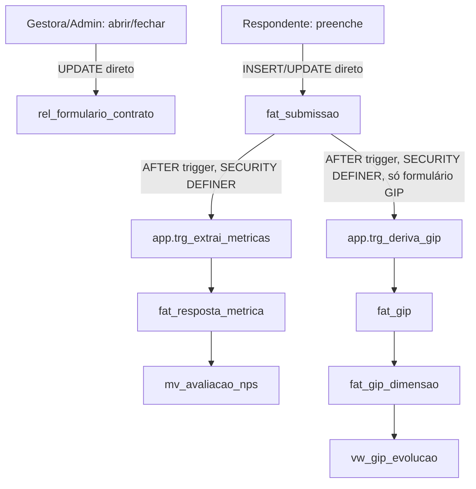

# Formulários dos Produtos Design

**Spec**: `.specs/features/formularios-produto/spec.md`
**Context**: `.specs/features/formularios-produto/context.md`
**Status**: Draft

---

## Architecture Overview

Nenhuma camada de RPC nova. Toda a consistência multi-tabela (extração de métrica, derivação do
GIP) acontece via **trigger no banco**, exatamente como o resto do projeto já resolve cascata
(`app.recalcula_atingimento`, AD-035) — o app só faz 1 escrita de 1 linha por vez em
`fat_submissao`/`rel_formulario_contrato`, direto via PostgREST (AD-024: "escrita de uma linha só
continua sendo insert/update direto").



### Approach considered and rejected

| Approach | Por que não |
| --- | --- |
| RPC única (`app.responder_formulario`) orquestrando `fat_submissao` + extração + derivação GIP numa função só | Diverge do padrão já estabelecido (kanban/planejamento resolvem cascata com trigger, não RPC); AD-024 já classifica escrita de 1 linha como direta — criar RPC aqui adicionaria superfície sem necessidade, pois não há "múltiplas linhas de tabelas diferentes escritas pelo app na mesma chamada", só 1 linha + cascata de banco |
| Extração de métrica/derivação do GIP em JS, 2-3 chamadas sequenciais do frontend | Contradiz o comentário do próprio schema aprovado ("Escrita por trigger... não pela leitura do painel") e duplicaria em TS uma regra que já existe em SQL; sem transação real entre as chamadas, uma falha no meio deixaria `fat_resposta_metrica`/`fat_gip` dessincronizados do JSONB de `respostas` |

**Escolhido**: triggers no banco (mesma decisão de design do schema aprovado), 1 escrita direta por
vez do app. Aprovado por Pedro antes do detalhamento de componentes abaixo.

---

## Code Reuse Analysis

### Existing Components to Leverage

| Component | Location | How to Use |
| --- | --- | --- |
| `rel_formulario_contrato` RLS + GRANT | `20260812001234_regua_instanciacao_rls.sql`, `20260812001310_regua_instanciacao_grants.sql` | **Já cobre FRM-01/02/03 sem migration nova**: Gestora/Admin já têm `GRANT UPDATE` (blanket `ALL TABLES`, régua rodou depois que a tabela existia) + `p_por_contrato` já permite a escrita; Mentor/Assessor só têm `GRANT SELECT` — a role já barra, RLS nem precisa decidir |
| `app.trg_extrai_metricas()` | `docs/schema_sistema.sql:1836-1856` | Reaproveitado verbatim, só ganha `SECURITY DEFINER SET search_path` (ver Tech Decisions) |
| `app.trg_valida_gip_dimensao()` | `docs/schema_sistema.sql:1864-1877` | Reaproveitado verbatim, sem alteração — já valida faixa por dimensão |
| Padrão RLS `p_por_contrato`/`p_heranca` | `20260813192341_incidencia_encontros_rls.sql` (irmã mais recente) | Mesmo texto de policy, adaptado para `fat_submissao`/`fat_gip` (`p_por_contrato`, com cláusula extra de autoria) e `fat_resposta_metrica`/`fat_gip_dimensao` (`p_heranca`, EXISTS contra o pai) |
| `usePapelGlobal()` | `src/frontend/hooks/use-papel-global.ts` | Reaproveitado para decidir quem vê o quê na lista (FRM-14) e quem pode reabrir edição (FRM-11). Estende o hook para também devolver `idUsuario` (hoje só devolve `papel`) — ver Components |
| `<CarregandoSkeleton>`/`<ErroInline>`/`<EstadoVazio>` | `components/ui/` (AD-029) | Estados padrão da lista e da página de resposta |
| `RouteTabs` / `FichaContratoChrome` | `components/app-shell/route-tabs.tsx`, `components/produtos/ficha-contrato-chrome.tsx` | Aba "Formulários" já existe (`abas` array, NAV-06) — só troca o `<EmDesenvolvimento>` pelo componente real |
| `mapeiaErroRpc` | `src/backend/rpc/errors.ts` | **Não se aplica diretamente** (essa feature não chama `.rpc()`) — precisa de um mapeamento próprio para erro de `.insert()`/`.update()` direto (`PostgrestError.code`), ver Error Handling Strategy |

### Integration Points

| System | Integration Method |
| --- | --- |
| `ref_formulario`/`ref_metrica_formulario`/`rel_formulario_contrato` | Leitura pura — já provisionadas e seedadas, nenhuma migration aqui |
| `fat_contrato` | Leitura de `status` para bloquear abertura/submissão em contrato encerrado (FRM-13) |
| `ref_dimensao_gip` | Leitura pura, já provisionada e seedada (4 dimensões) — alimenta a tela sob medida do GIP |

---

## Components

### `queries/formulario.ts` (novo)

- **Purpose**: Leituras da aba Formulários e da página de resposta — nunca escreve.
- **Location**: `src/backend/queries/formulario.ts`
- **Interfaces**:
  - `buscarFormulariosDoContrato(client, idContrato: number, papel: PapelGlobal, idUsuario: number): Promise<FormularioListado[]>` — join `rel_formulario_contrato` + `ref_formulario`, filtrado: Gestora/Admin veem os 16; Mentor/Assessor só os endereçados ao papel dele (mapeamento fixo, ver Tech Decisions) que estão abertos ou já respondidos por ele. Cada item carrega `estado`, `exigeAnexo`, `permiteEdicaoAberta`, `jaRespondeu` (bool para o usuário atual).
  - `buscarMetricasAtivas(client, idFormulario: number): Promise<MetricaFormulario[]>` — linhas `ativo=true` de `ref_metrica_formulario`.
  - `buscarSubmissaoPropria(client, idContrato, idFormulario, idUsuario, momento?: string | null): Promise<Submissao | null>` — 1 linha de `fat_submissao` do próprio usuário (chave de negócio, nunca por `id_submissao` adivinhado).
  - `buscarDimensoesGipAtivas(client): Promise<DimensaoGip[]>` — `ref_dimensao_gip` ativo=true, ordenado por `ordem`.
  - `buscarGipDoContrato(client, idContrato): Promise<GipEvolucao[]>` — lê `vw_gip_evolucao` filtrado por contrato, para a tela do GIP mostrar o que já foi aplicado.
  - `buscarAvaliacaoNps(client, idProduto): Promise<AvaliacaoNps[]>` — lê `mv_avaliacao_nps` filtrado pelos formulários do produto; RLS/GRANT nega a leitura pra quem não é Gestora/Admin (FRM-23) — a função propaga o erro mapeado, não devolve lista vazia, para não confundir "sem dado" com "sem permissão".
- **Dependencies**: `SupabaseClient<Database>`.
- **Reuses**: mesmo estilo de `queries/etapa-contrato.ts`/`queries/kanban.ts` (funções puras, 1 responsabilidade, testadas com client mockado).

### `rpc/formulario.ts` (novo)

- **Purpose**: Único ponto de chamada de `.rpc()` desta feature — refresh sob demanda da
  `mv_avaliacao_nps` (não é escrita de linha, é manutenção de MV; precisa de `SECURITY DEFINER`
  porque `REFRESH MATERIALIZED VIEW` exige privilégio do dono do objeto).
- **Location**: `src/backend/rpc/formulario.ts`
- **Interfaces**: `atualizarAvaliacaoNps(client: SupabaseClient<Database>): Promise<void>` — chama
  `app.atualiza_avaliacao_nps()`, mapeia erro com `mapeiaErroRpc` (reaproveitado de `rpc/errors.ts`).
- **Dependencies**: `SupabaseClient<Database>`, `mapeiaErroRpc`.
- **Reuses**: mesmo padrão de `rpc/vinculo.ts` (função fina, 1 chamada, mapeamento de erro).

### `hooks/use-papel-global.ts` (estendido, não novo arquivo)

- **Purpose**: Hoje só devolve `papel`; passa a devolver também `idUsuario` (a mesma consulta a
  `dim_usuario` já traz `id_usuario`, só não era exposto).
- **Location**: `src/frontend/hooks/use-papel-global.ts`
- **Interfaces**: `usePapelGlobal(): { papel: PapelGlobal | null; idUsuario: number | null; carregando: boolean }`
- **Dependencies**: nenhuma nova.
- **Reuses**: consumidores existentes (`usuarios/page.tsx`) continuam funcionando — campo novo é aditivo.

### `FormulariosLista` (novo)

- **Purpose**: Conteúdo da aba Formulários — lista os formulários visíveis para o papel do usuário,
  com estado e ação de abrir/fechar (só Gestora/Admin).
- **Location**: `src/frontend/components/produtos/formularios-lista.tsx`
- **Interfaces**: `<FormulariosLista idContrato={number} idProduto={number} />`
- **Dependencies**: `usePapelGlobal`, `buscarFormulariosDoContrato`.
- **Reuses**: `Table` (shadcn), `<CarregandoSkeleton>`/`<ErroInline>`/`<EstadoVazio>`, `Badge` para estado.
- Escreve direto (sem RPC) via `.from("rel_formulario_contrato").update(...)` no toggle abrir/fechar
  — mesmo padrão de escrita direta já usado em `sucesso-mensal-form.tsx`.

### `FormularioGenericoForm` (novo)

- **Purpose**: Página de resposta dos 13 formulários sem forma fixa (os 16 menos GIP, menos os 2
  fora de escopo da inscrição PLL). Constrói o Zod schema em runtime a partir de
  `buscarMetricasAtivas`.
- **Location**: `src/frontend/components/produtos/formulario-generico-form.tsx`
- **Interfaces**: `<FormularioGenericoForm idContrato idFormulario codigo respondentePermitido />`
- **Dependencies**: `react-hook-form`, `zod` (schema montado com `z.object(Object.fromEntries(...))`,
  1 entrada por `codigo_campo`), `buscarMetricasAtivas`, `buscarSubmissaoPropria`.
- **Reuses**: mesmo padrão RHF+Zod de `sucesso-mensal-form.tsx`/`contrato-form.tsx`, só com schema
  dinâmico em vez de schema fixo do módulo `backend/schemas`.
- Trata os 3 estados: (a) sem métrica ativa → aviso de bloqueio (FRM-05); (b) com métrica, sem
  submissão prévia → formulário editável; (c) com submissão prévia — editável se
  `permite_edicao_aberta` ou se `papel ∈ {admin, gestora}` (reabrir), somente leitura caso contrário.

### `FormularioGipForm` (novo)

- **Purpose**: Tela sob medida do GIP — 3 ações (Início/Meio/Fim), campos fixos + 4 dimensões via
  `ref_dimensao_gip`, e leitura de `vw_gip_evolucao` já aplicado.
- **Location**: `src/frontend/components/produtos/formulario-gip-form.tsx`
- **Interfaces**: `<FormularioGipForm idContrato />`
- **Dependencies**: `buscarDimensoesGipAtivas`, `buscarGipDoContrato`, `buscarSubmissaoPropria` (com
  `momento`).
- **Reuses**: mesmo RHF+Zod; grava com o mesmo `.from("fat_submissao")` direto — a derivação para
  `fat_gip`/`fat_gip_dimensao` é 100% responsabilidade do trigger, o componente nunca escreve nessas
  2 tabelas.

### `NpsAvaliacoesCard` (novo)

- **Purpose**: Card de NPS agregado (P3) — só visível para Gestora/Admin (`usePapelGlobal`), com
  botão "Atualizar" que chama o RPC de refresh antes de reler `mv_avaliacao_nps`.
- **Location**: `src/frontend/components/produtos/nps-avaliacoes-card.tsx`
- **Interfaces**: `<NpsAvaliacoesCard idProduto={number} />`
- **Dependencies**: `usePapelGlobal`, `buscarAvaliacaoNps` (query), `atualizarAvaliacaoNps` (RPC wrapper).
- **Reuses**: `Card`/`Table`/`Button` (shadcn), mesmo padrão de estado (`<CarregandoSkeleton>`/`<ErroInline>`/`<EstadoVazio>`).
- Mentor/Assessor nunca veem este card (gate por `papel`, reforçado pelo `GRANT` do banco que já
  nega a leitura — dupla camada, UI não é a única defesa).

### Rotas

- `src/frontend/app/(app)/contratos/[id]/formularios/page.tsx` — troca o `<EmDesenvolvimento>` por
  `<FormulariosLista>` (herda `idContrato`/`idProduto` do layout, mesmo padrão de
  `contratos/[id]/vinculos/page.tsx`).
- `src/frontend/app/(app)/contratos/[id]/formularios/[codigo]/page.tsx` (nova) — resolve `codigo`;
  se `codigo === 'gip'` renderiza `<FormularioGipForm>`, senão `<FormularioGenericoForm>`.
- `src/frontend/app/(app)/produtos/[slug]/dashboard/page.tsx` (existente, modificada) — acrescenta
  `<NpsAvaliacoesCard idProduto={produto.idProduto} />` abaixo dos cards de contagem já existentes,
  só quando `papel` (viewer) ∈ {admin, gestora}. Página já é `"use client"` e já busca `produto` via
  `useProdutoAtual` — nenhuma mudança estrutural, só um card a mais.

---

## Data Models

### `fat_submissao` (nova, verbatim `docs/schema_sistema.sql:747-771`)

```sql
CREATE TABLE fat_submissao (
  id_submissao            BIGSERIAL PRIMARY KEY,
  id_contrato             BIGINT   NOT NULL REFERENCES fat_contrato(id_contrato) ON DELETE RESTRICT,
  id_formulario           BIGINT   NOT NULL REFERENCES ref_formulario(id_formulario),
  versao_formulario       SMALLINT NOT NULL,
  id_usuario_respondente  BIGINT   REFERENCES dim_usuario(id_usuario),
  respostas               JSONB    NOT NULL,
  momento                 TEXT,
  aceite_em               TIMESTAMPTZ,
  enviada_em              TIMESTAMPTZ NOT NULL DEFAULT now(),
  atualizada_em           TIMESTAMPTZ,
  CONSTRAINT ck_submissao_momento CHECK (momento IS NULL OR momento IN ('inicio','meio','fim','parcial','final')),
  CONSTRAINT ck_submissao_respostas CHECK (jsonb_typeof(respostas) = 'object')
);
CREATE UNIQUE INDEX uq_submissao_respondente
  ON fat_submissao (id_contrato, id_formulario, id_usuario_respondente, COALESCE(momento, 'unico'))
  WHERE id_usuario_respondente IS NOT NULL;
```

**Contrato JSONB do GIP** (documentado aqui porque `ref_metrica_formulario`/`schema_campos` ficam
vazios para este formulário — a chave é fixa, não descoberta em metadado):

```typescript
interface RespostasGip {
  posicao_lideranca: boolean;
  rotina_trabalho: string;
  comunicacao_interna: string;
  rotinas_feedback: string;
  gip_estrutura_organizada: boolean;
  gip_entregas_acontecendo: boolean;
  dimensoes: Record<string, number>; // chave = ref_dimensao_gip.codigo, valor 1..4
}
```

**Relationships**: `fat_gip.id_submissao → fat_submissao.id_submissao` (rastreabilidade — qual
envio gerou qual linha derivada).

### `fat_resposta_metrica` (nova, verbatim `:776-783`) — escrita só por trigger, sem GRANT direto a mentor/assessor.

### `fat_gip` / `fat_gip_dimensao` (novas, verbatim `:983-1025`, seção Planejamento do schema aprovado)

Sem alteração de coluna — só a inclusão do `ON CONFLICT (id_contrato, momento)` na derivação (ver
trigger abaixo), que depende da `UNIQUE (id_contrato, momento)` já declarada.

### `app.trg_deriva_gip()` (nova função, análoga a `app.trg_extrai_metricas()`)

```sql
CREATE OR REPLACE FUNCTION app.trg_deriva_gip() RETURNS trigger
LANGUAGE plpgsql SECURITY DEFINER SET search_path = public, pg_temp AS $$
DECLARE v_id_gip BIGINT; v_eixo TEXT; v_id_formulario_gip BIGINT;
BEGIN
  SELECT id_formulario INTO v_id_formulario_gip FROM ref_formulario WHERE codigo = 'gip';
  IF NEW.id_formulario IS DISTINCT FROM v_id_formulario_gip THEN
    RETURN NULL;
  END IF;

  INSERT INTO fat_gip (id_contrato, momento, id_submissao, posicao_lideranca, rotina_trabalho,
                        comunicacao_interna, rotinas_feedback, gip_estrutura_organizada,
                        gip_entregas_acontecendo, aplicado_em)
  VALUES (NEW.id_contrato, NEW.momento, NEW.id_submissao,
          (NEW.respostas ->> 'posicao_lideranca')::BOOLEAN,
          NEW.respostas ->> 'rotina_trabalho',
          NEW.respostas ->> 'comunicacao_interna',
          NEW.respostas ->> 'rotinas_feedback',
          (NEW.respostas ->> 'gip_estrutura_organizada')::BOOLEAN,
          (NEW.respostas ->> 'gip_entregas_acontecendo')::BOOLEAN,
          CURRENT_DATE)
  ON CONFLICT (id_contrato, momento) DO UPDATE SET
    id_submissao = EXCLUDED.id_submissao,
    posicao_lideranca = EXCLUDED.posicao_lideranca,
    rotina_trabalho = EXCLUDED.rotina_trabalho,
    comunicacao_interna = EXCLUDED.comunicacao_interna,
    rotinas_feedback = EXCLUDED.rotinas_feedback,
    gip_estrutura_organizada = EXCLUDED.gip_estrutura_organizada,
    gip_entregas_acontecendo = EXCLUDED.gip_entregas_acontecendo
  RETURNING id_gip INTO v_id_gip;

  v_eixo := CASE WHEN NEW.momento = 'inicio' THEN 'regua_sonhos' ELSE 'onde_chegamos' END;

  DELETE FROM fat_gip_dimensao WHERE id_gip = v_id_gip AND eixo = v_eixo;
  INSERT INTO fat_gip_dimensao (id_gip, id_dimensao, eixo, valor)
  SELECT v_id_gip, d.id_dimensao, v_eixo, (NEW.respostas -> 'dimensoes' ->> d.codigo)::SMALLINT
    FROM ref_dimensao_gip d
   WHERE d.ativo AND NEW.respostas -> 'dimensoes' ? d.codigo;

  RETURN NULL;
END $$;

CREATE TRIGGER trg_submissao_gip
  AFTER INSERT OR UPDATE OF respostas ON fat_submissao
  FOR EACH ROW EXECUTE FUNCTION app.trg_deriva_gip();
```

Convive com `trg_submissao_metricas` (o outro trigger AFTER na mesma tabela/evento) sem conflito:
para os outros 15 formulários, o `SELECT ... WHERE codigo = 'gip'` não bate e a função retorna cedo;
`app.trg_extrai_metricas()` roda para todos, mas encontra 0 linhas em `ref_metrica_formulario` para
o GIP (nunca cadastrada) e não escreve nada — os dois triggers são independentes por desenho.

### `mv_avaliacao_nps` / `app.atualiza_avaliacao_nps()` (novas, verbatim `:1272-1300` + wrapper novo)

Materialized view verbatim do schema aprovado, `WITH NO DATA` na criação (mesmo padrão de
`mv_iip_contrato`). `GRANT SELECT` só para `legisla_app`/`legisla_admin`/`legisla_gestora` — nunca
para `legisla_mentor`/`legisla_assessor` (FRM-23, achado de Tasks, ver correção no `spec.md`).

```sql
CREATE OR REPLACE FUNCTION app.atualiza_avaliacao_nps() RETURNS void
LANGUAGE plpgsql SECURITY DEFINER SET search_path = public, pg_temp AS $$
BEGIN
  REFRESH MATERIALIZED VIEW CONCURRENTLY mv_avaliacao_nps;
END $$;
```

`SECURITY DEFINER` aqui não é sobre `GRANT` de tabela (não escreve nenhuma tabela) — é porque
`REFRESH MATERIALIZED VIEW` exige ser dono do objeto ou superusuário; sem isso nem a Gestora
conseguiria rodar o refresh. `GRANT EXECUTE ON ALL FUNCTIONS IN SCHEMA app` já cobre todos os papéis
(`docs/schema_sistema.sql:2072`) — a barreira real de acesso continua sendo o `GRANT SELECT` da MV
em si: Mentor/Assessor podem chamar a função (ela roda e atualiza a MV normalmente), mas continuam
sem conseguir ler o resultado depois.

---

## Error Handling Strategy

| Error Scenario | Handling | User Impact |
| --- | --- | --- |
| RLS nega escrita em `rel_formulario_contrato` (Mentor/Assessor tentando abrir/fechar) | `PostgrestError.code = '42501'` mapeado para mensagem fixa | "Você não tem permissão para abrir/fechar este formulário." |
| RLS nega `fat_submissao` (formulário fechado, ou contrato sem vínculo) | mesmo código `42501`, mensagem contextual | "Este formulário está fechado no momento." / "Você não tem acesso a este contrato." |
| Violação de `uq_submissao_respondente` (2ª tentativa de INSERT em vez de UPDATE — bug de client, não deveria acontecer se a leitura prévia funcionou) | `code = '23505'` | "Já existe uma resposta sua para este formulário — recarregando." (força novo fetch e vira UPDATE) |
| Violação de `uq_gip_contrato_momento` (GIP reaplicado sem passar pelo fluxo de edição) | `code = '23505'` | "Este momento do GIP já foi aplicado para este contrato." |
| Valor de dimensão do GIP fora da faixa (`app.trg_valida_gip_dimensao`) | exceção customizada da função (`RAISE EXCEPTION`), sem SQLSTATE dedicado — cai no branch genérico | Validado primeiro no Zod (client, min/max de `ref_dimensao_gip`) — o erro de banco só aparece se o client for contornado |
| Formulário sem métrica ativa (`ref_metrica_formulario` vazio) | Detectado antes do envio, no fetch inicial — não é erro de escrita | Aviso de bloqueio (FRM-05), botão de envio desabilitado |

---

## Risks & Concerns

| Concern | Location | Impact | Mitigation |
| --- | --- | --- | --- |
| `app.trg_extrai_metricas()` verbatim é `SECURITY INVOKER` (implícito) mas escreve em `fat_resposta_metrica`, onde Mentor/Assessor não têm `GRANT` (só o approved schema list tabelas 2080-2098, `fat_resposta_metrica` nunca aparece) | `docs/schema_sistema.sql:1836-1856` + `:2080-2098` | Qualquer Assessor/Mentor respondendo QUALQUER formulário com métrica ativa (hoje, os 7 de avaliação com NPS) quebra com `42501` no meio do próprio envio — mesma classe de bug que travou o P1 inteiro de `planejamento-planilha-monitoramento` (AD-035) | `ALTER FUNCTION app.trg_extrai_metricas() SECURITY DEFINER SET search_path = public, pg_temp` desde o primeiro commit desta feature — conformando com AD-035 (função de recômputo determinístico, sem parâmetro de escrita livre do chamador), não uma AD nova |
| `app.trg_deriva_gip()` (nova) tem o mesmo risco por construção, já que só Gestora escreve `fat_submissao` do GIP mas a tabela-alvo (`fat_gip`/`fat_gip_dimensao`) também não tem `GRANT` a ninguém além do bypass de Gestora/Admin | Nova função, `design.md` acima | Sem `SECURITY DEFINER`, funciona hoje só porque Gestora tem `GRANT ALL` — mas quebra o instante em que Mentor precisar aplicar GIP (não previsto hoje, mas frágil) | Nasce `SECURITY DEFINER SET search_path` desde o primeiro commit, mesma conformidade com AD-035, por precaução e paridade com a outra função |
| `GRANT ... ALL TABLES IN SCHEMA public` (para `legisla_app/admin/gestora`) só cobre tabelas que já existiam no momento em que rodou — `fat_submissao`/`fat_resposta_metrica`/`fat_gip`/`fat_gip_dimensao` são todas novas | AD-025 (achado repetido em `catalogos-referencia`, `regua-instanciacao`, `convite-contrato`) | Sem re-GRANT explícito, nem a Gestora consegue escrever nas 4 tabelas novas | Migration de grants explícita nas 4 tabelas, para `legisla_app/admin/gestora` (full) e `legisla_mentor/legisla_assessor` (só `fat_submissao`, `SELECT/INSERT/UPDATE`, igual ao schema aprovado `:2082`/`:2094`) — nunca em `fat_resposta_metrica`/`fat_gip`/`fat_gip_dimensao` |
| `uq_submissao_respondente` é um índice único **parcial e por expressão** (`COALESCE(momento, 'unico')`, `WHERE id_usuario_respondente IS NOT NULL`) | `docs/schema_sistema.sql:763-765` | `upsert(...).onConflict(...)` do PostgREST/supabase-js não mira de forma confiável um índice de expressão — arriscaria inserir duplicata ou falhar silenciosamente | Fluxo do frontend nunca usa `upsert`: sempre `buscarSubmissaoPropria` primeiro (SELECT explícito pela chave de negócio) e decide `insert` vs `update(id_submissao)` no código, nunca dependendo do `ON CONFLICT` do PostgREST |
| `WITH CHECK` de `fat_submissao` precisa permitir Gestora/Admin reabrirem e editarem a resposta de **outra pessoa** (FRM-11), mas o padrão já usado em `fat_registro` (`AND id_usuario_autor = app.id_usuario()`, sem exceção) bloquearia exatamente esse caso | `20260813192341_incidencia_encontros_rls.sql:52-54` (padrão irmão) | Copiar o padrão de `fat_registro` sem ajuste impediria a FRM-11 (decisão explícita de Pedro) | `WITH CHECK` desta tabela usa `(id_usuario_respondente = app.id_usuario() OR app.papel_atual() IN ('admin','gestora'))` — a autoria só é travada para quem não é Gestora/Admin, deliberadamente diferente do precedente |
| Nenhum teste de UI automatizado no projeto (débito já conhecido, L-006/L-007) | geral | Componentes novos (`FormulariosLista`, `FormularioGenericoForm`, `FormularioGipForm`) sem cobertura automatizada | Mesma mitigação já aceita nas features anteriores: `build`+`lint` limpos + inspeção de código; UAT manual recomendado no fechamento |

> Nenhum outro concern novo identificado além dos listados.

---

## Tech Decisions

| Decision | Choice | Rationale |
| --- | --- | --- |
| Orquestração da cascata (métrica + GIP) | 2 triggers `AFTER INSERT OR UPDATE OF respostas ON fat_submissao`, não RPC | Consistente com o padrão já estabelecido (`recalcula_atingimento`), AD-024 classifica isso como escrita de 1 linha |
| `SECURITY DEFINER` em `trg_extrai_metricas`/`trg_deriva_gip` | Sim, desde o primeiro commit | Conforma com AD-035 (classe já coberta: recômputo determinístico de coluna derivada, sem parâmetro de escrita livre) — não é uma AD nova |
| GIP: motor genérico vs. tela sob medida | Tela sob medida, chave JSONB fixa e documentada aqui | Decisão de Pedro (context.md) — campos já conhecidos no schema aprovado, mesma exceção do Kanban |
| Escrita de `fat_submissao`/`rel_formulario_contrato` | Direto via `.from(...).insert/update()`, sem `upsert` | Índice único de destino é parcial + por expressão; `upsert`/`onConflict` do PostgREST não mira isso com segurança |
| Mapeamento `respondente` → papel real | Constante fixa em código (`gestora→gestora`, `assessor→assessor`, `mentor→mentor`, `mentorado→assessor`, `cargo_cg_parlamentar`/`mandato`→gestora/admin como procurador) | Só 6 valores fixos do `CHECK` já aprovado (baixa probabilidade de crescer); não é limiar/regra de negócio variável no sentido do AD-004, é tradução fixa de um enum já fechado no schema |
| RLS de `fat_submissao`/`fat_gip` | `p_por_contrato` (mesmo texto de `20260813192341_incidencia_encontros_rls.sql`) + cláusula extra de autoria no `WITH CHECK` | Reaproveita o padrão já estabelecido; a cláusula extra é o mínimo necessário para FRM-11/FRM-12 |
| RLS de `fat_resposta_metrica`/`fat_gip_dimensao` | `p_heranca` (EXISTS contra o pai, que já tem `FORCE ROW LEVEL SECURITY`) | Mesmo padrão já usado por `rel_encontro_participante` etc. em `incidencia-encontros` |
| `usePapelGlobal` | Estendido para devolver `idUsuario`, não duplicado num hook novo | Já existe exatamente a consulta necessária (`dim_usuario` por email); duplicar seria 2 fontes da mesma verdade |

> **Nenhuma destas decisões cria convenção nova a registrar como AD-NNN** — todas conformam com
> decisões já ativas (AD-024, AD-025, AD-035). Se o Verifier ou Pedro discordarem de alguma na
> revisão, ela volta para esta tabela antes de virar precedente de projeto.
