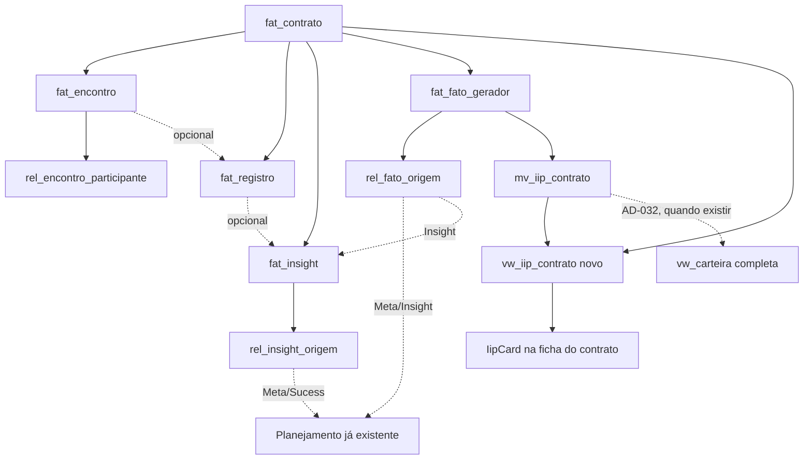

# Incidência & Encontros Design

**Spec**: `.specs/features/incidencia-encontros/spec.md`
**Context**: `.specs/features/incidencia-encontros/context.md`
**Status**: Draft

---

## Architecture Overview

As decisões de produto (onde o IIP aparece, refresh síncrono, Dialog vs. inline) já foram
fechadas no Discuss (`context.md`) — não há mais fork de UX a explorar aqui. O que resta é
100% extração incremental (AD-025) de tabelas/triggers/view já aprovados
(`docs/schema_sistema.sql`, AD-008) + 2 peças novas de conveniência (não redesenho): 2 RPCs
`SECURITY INVOKER` para as 2 escritas que cruzam mais de uma tabela numa ação só (AD-024) e 1
função `SECURITY DEFINER` de refresh de materialized view (AD-035).



---

## Code Reuse Analysis

### Existing Components to Leverage

| Component | Location | How to Use |
| --- | --- | --- |
| Padrão `p_por_contrato` (RLS de tabela com `id_contrato` direto) | `supabase/migrations/20260812001234_regua_instanciacao_rls.sql` | Réplica exata (`DO $$ FOREACH`) para `fat_encontro`/`fat_registro`/`fat_insight`/`fat_fato_gerador` — `USING`/`WITH CHECK` idênticos e explícitos (lição FND-USR-02, já convenção) |
| Padrão de RLS por `EXISTS` em tabela filha sem `id_contrato` | `supabase/migrations/0011_fundacao_rls.sql` (`rel_mandato_candidatura`) | Réplica para `rel_encontro_participante` (via `fat_encontro`), `rel_insight_origem` (via `fat_insight`), `rel_fato_origem` (via `fat_fato_gerador`) |
| Padrão de re-GRANT em bloco + GRANT column/tabela-scoped a mentor/assessor (AD-025) | `supabase/migrations/20260812145817_planejamento_planilha_grants.sql`, `20260812090141_kanban_etapas_rls_grants.sql` | Template literal para o GRANT das 7 tabelas novas |
| `app.trg_auditoria()` (auditoria genérica, `dt_criacao`/`autor`) | `0012_fundacao_auditoria_gap.sql` | Reaplicar trigger de auditoria às 7 tabelas novas, mesmo padrão idempotente (`IF NOT EXISTS (SELECT 1 FROM pg_trigger ...)`) usado por `kanban-etapas`/`planejamento` |
| `SECURITY DEFINER SET search_path = public, pg_temp` p/ recômputo determinístico sem parâmetro (AD-035) | `20260812151909_planejamento_planilha_cascata_security_definer_fix.sql` | Mesmo padrão para `app.atualiza_iip_contrato()` — `REFRESH MATERIALIZED VIEW` exige ser owner da MV, nenhuma role `legisla_*` é |
| `mapeiaErroRpc` + `MENSAGENS_CHECK`/`MENSAGENS_UNICA` | `src/backend/rpc/errors.ts` | Adicionar entradas para `ck_fato_niveis`, `ck_encontro_planejado`, `ck_encontro_realizado`, `ck_participante_identificacao`, `uq_registro_sequencia`, `uq_encontro_sequencia`, `uq_encontro_participante_usuario` |
| Padrão de RPC wrapper `(client, input) => Promise<T>` | `src/backend/rpc/kanban.ts`, `convite.ts` | Modelo para `src/backend/rpc/fato-gerador.ts`/`insight.ts`/`iip.ts` |
| Padrão de query view-model (`client` por parâmetro, interface camelCase, `.map()` campo a campo) | `src/backend/queries/etapa-contrato.ts` | Modelo para `src/backend/queries/incidencia.ts` |
| Padrão de schema Zod com `.refine()` por `CHECK` | `src/backend/schemas/contrato.ts`, `planejamento.ts` | Modelo para `registro.ts`/`insight.ts`/`fato-gerador.ts`/`encontro.ts` |
| `<Dialog>`+`<DialogTrigger>`+`<DialogContent>` envolvendo formulário "burro" (RHF, sem saber que está num Dialog) | `src/frontend/app/(app)/usuarios/page.tsx` + `components/fundacao/usuario-form.tsx` | **Correção pós-Discuss**: a referência dada na conversa (`objetivo-form.tsx`) não usa `Dialog` — esse é o precedente real. Ver `context.md` |
| Shape de formulário RHF+Zod (fetch de catálogo em `useEffect`, `Select` com `RefOption[]`, erro via `mapeiaErroRpc`) | `src/frontend/components/planejamento/objetivo-form.tsx` | Modelo de **forma** do componente (não de Dialog) para os 4 forms novos |
| `RouteTabs` | `src/frontend/components/app-shell/route-tabs.tsx` | Nova aba "Encontros" no array `abas` de `ficha-contrato-chrome.tsx` |
| `<ErroInline>`/`<CarregandoSkeleton>`/`<EstadoVazio>` | `components/ui/` (AD-029) | Estados padrão do `IipCard`, da lista de Encontros e da lista de Registros na aba de etapa |
| `usePapelGlobal` (`auth.getUser()` + `dim_usuario.select(...).eq("email", ...)`) | `src/frontend/hooks/use-papel-global.ts` | **Estende** para também retornar `idUsuario` (só adiciona `id_usuario` ao `.select()` existente) — é o único ponto do repo que já resolve "meu próprio `dim_usuario`" a partir da sessão; `RegistroForm` precisa disso pra preencher `id_usuario_autor` (`NOT NULL`, sem RPC — ver Achado abaixo) |

### Integration Points

| System | Integration Method |
| --- | --- |
| Supabase (tabelas novas) | `security_invoker = true` na view nova (`vw_iip_contrato`); RLS `p_por_contrato`/`EXISTS` nas 7 tabelas — mesmo `app.papel_atual()`/`app.contratos_do_usuario()` já usados em toda a base |
| `fat_registro.id_encontro` / `rel_fato_origem.id_meta`/`rel_insight_origem.id_meta`/`id_sucesso` | Sem `CHECK`/trigger de "mesmo contrato" no schema aprovado (achado, `spec.md` Assumptions). Onde há RPC nova (Fato Gerador, Insight), a validação de mesmo-contrato entra na função (ver Data Models). Onde não há RPC (Registro→Encontro), a UI só lista opções do próprio contrato — mesmo padrão já aceito para `fat_insight.id_registro` antes de existir trigger pra ele |
| `database.types.ts` | `npm run db:types` depois das migrations — 1ª feature a expor as 7 tabelas + `vw_iip_contrato` |
| `ficha-contrato-chrome.tsx` | Os 2 botões trocam `toast(...)` por `<Dialog>`; ganha `<IipCard idContrato={...} />`; `abas` ganha `{ href: `${base}/encontros`, label: "Encontros" }` |
| `etapas/[codigo]/page.tsx` | Ganha lista de `fat_registro` da etapa + botão "Registrar" (form inline, mesmo padrão de `objetivo-form.tsx` — sem Dialog, página já é dedicada) |

---

## Achado real de Design — grão errado para o card por contrato

`vw_carteira` (aprovada, AD-032) tem **1 linha por vínculo ativo** (`rel_usuario_contrato`), não 1
linha por contrato — o mesmo problema que o fix `f36fdd7` de `visao-gerencial-g1-g2` já corrigiu
para a carteira agregada (Gestora sem contrato ativo não aparecia). Para o card de IIP **de um
contrato específico** isso quebraria de um jeito diferente: se aquele contrato não tem nenhum
vínculo ativo no momento (`dt_fim` no passado para todos), `vw_carteira` filtrada por
`id_contrato` retorna **zero linhas**, mesmo que o contrato tenha Fatos Geradores reais e um IIP
calculável — o card mostraria "sem dado" incorretamente, não porque falta Fato Gerador, mas porque
falta vínculo ativo (uma condição sem relação com a pergunta "este contrato tem IIP?").

**Resolução**: view nova, não reaproveitar `vw_carteira` para este caso — `vw_iip_contrato`
(abaixo, Data Models), com granularidade de **1 linha por contrato**, `security_invoker = true`,
raiz em `fat_contrato` (RLS já resolvida por `p_por_carteira`) em vez de
`rel_usuario_contrato`. Mesmo espírito de `vw_carteira_ponderada`/`vw_ciclo_etapa`
(`visao-gerencial-g1-g2`): view nova na Saída (AD-003), não redesenho da aprovada.

**2º achado real de Design — `fat_registro.id_usuario_autor` é `NOT NULL`, mas nenhum caminho do
frontend hoje resolve "meu próprio `id_usuario`".** Como Registro é `INSERT` direto (sem RPC — ver
Tech Decisions), o cliente precisa enviar `id_usuario_autor` no payload — diferente de
`fat_insight`/`fat_fato_gerador` (nullable no schema aprovado, e as 2 RPCs novas resolvem via
`app.id_usuario()` internamente, nunca recebem isso como parâmetro). Busquei um hook existente
("Step 1" da Knowledge Verification Chain) e `usePapelGlobal` já faz exatamente
`auth.getUser()` + `dim_usuario.select(...).eq("email", ...)` — só falta `id_usuario` no
`.select()`. Resolvido estendendo esse hook (ver Code Reuse Analysis) em vez de criar um 2º
hook redundante. RLS ganha `WITH CHECK` extra pra impedir spoofing de autoria (Migrations Plan,
item 4).

---

## Migrations Plan (ordem, `supabase migration new <nome>`)

Checar o que já está provisionado (AD-025) antes de cada arquivo — nenhuma das 7 tabelas, a view
nova, as 2 RPCs ou a função de refresh existem hoje (`supabase db diff`/introspecção confirmará).

1. **`incidencia_encontros_seed_catalogos`** — `INSERT` de `ref_nivel_iip` (`codigo='maximo'`,
   `valor=4`, `ordem=4`, Assumption #1a) + `INSERT` das 51 linhas de `ref_tipologia`, verbatim do
   CSV (`docs/DB_Fatos_Geradores - Ref_Tipologias.csv`, Assumption #1), com o mapeamento
   `Preditor_1`/`Preditor_2` → `ref_preditor.nome` (ver Tech Decisions) e `"—"` → `NULL`. Roda
   **antes** da estrutura porque não depende dela (`ref_tipologia`/`ref_nivel_iip` já existem desde
   a Trilha C) — só precisa vir antes de qualquer teste de integração que insira `fat_fato_gerador`.
2. **`incidencia_encontros_estrutura`** — DDL das 7 tabelas, verbatim:
   `fat_encontro` (`:786-808`) + `rel_encontro_participante` (`:820-829`) + índice/comentário
   (`:812-817`/`:831-835`); `fat_registro` (`:1035-1050`) + índice (`:1052-1054`)/comentários
   (`:1056-1060`); `fat_insight` (`:1063-1074`)/comentário (`:1076-1077`) +
   `rel_insight_origem` (`:1080-1085`) + índices (`:1088-1091`)/comentário (`:1093-1094`);
   `fat_fato_gerador` (`:1098-1117`)/comentários (`:1119-1123`) + `rel_fato_origem` (`:1126-1131`) +
   índices (`:1134-1137`)/comentário (`:1139-1140`). `CREATE TABLE IF NOT EXISTS`, mesmo padrão
   idempotente de toda feature anterior. **Inclui também `mv_iip_contrato`** (`:1247-1267`,
   `WITH NO DATA`) + `uq_mv_iip_contrato` (`:1269`) — o escopo original já a cita, só não estava
   explícita nesta lista de arquivos. **Achado real de Design**: `REFRESH MATERIALIZED VIEW
   CONCURRENTLY` (usada por `app.atualiza_iip_contrato()`, item 8) exige que a MV já tenha sido
   populada **sem** `CONCURRENTLY` ao menos uma vez — criar `WITH NO DATA` e só usar `CONCURRENTLY`
   depois falha com "materialized view has not been populated". Esta migration termina com
   `REFRESH MATERIALIZED VIEW mv_iip_contrato;` (sem `CONCURRENTLY`, populando 0 linhas — nenhum
   Fato Gerador existe ainda nesse ponto) logo após o `CREATE`, só pra satisfazer esse requisito do
   Postgres antes de qualquer `CONCURRENTLY` futuro.
3. **`incidencia_encontros_triggers`** — `app.trg_valida_registro_produto` (`:1908-1928`) +
   `app.trg_valida_insight_contrato` (`:1931-1945`), verbatim, **sem** `ERRCODE` customizado (ver
   Tech Decisions — não é deviation da AD-008 acrescentar `ERRCODE` a função nova, mas é deviation
   fazer isso numa função extraída verbatim). `app.trg_auditoria()` reaplicado às 7 tabelas (padrão
   `0012`/kanban/planejamento).
4. **`incidencia_encontros_rls`** — `p_por_contrato` (`fat_encontro`, `fat_registro`,
   `fat_insight`, `fat_fato_gerador`, `USING`+`WITH CHECK` explícitos) + `EXISTS` filho
   (`rel_encontro_participante` via `fat_encontro`, `rel_insight_origem` via `fat_insight`,
   `rel_fato_origem` via `fat_fato_gerador`). **Refinamento em `fat_registro`** (única tabela nova
   com coluna de autoria `NOT NULL` recebida por `INSERT` direto, sem RPC): `WITH CHECK` ganha uma
   2ª cláusula, `AND id_usuario_autor = app.id_usuario()` — sem RPC nesta tabela (Tech Decisions),
   o cliente é quem preenche `id_usuario_autor` no payload, e sem esta cláusula um usuário poderia
   gravar outro `id_usuario` como autor de um Registro que não escreveu (`fat_insight`/
   `fat_fato_gerador` não precisam disso: as 2 RPCs novas resolvem `id_usuario_autor` internamente
   via `app.id_usuario()`, nunca recebem esse valor como parâmetro do chamador).
5. **`incidencia_encontros_grants`** — re-GRANT em bloco (`legisla_app`/`admin`/`gestora`, AD-025)
   + GRANT scoped a `legisla_mentor`/`legisla_assessor` por tabela (ver Data Models) + **achado
   novo**: `GRANT USAGE, SELECT ON ALL SEQUENCES IN SCHEMA public TO legisla_assessor` — `legisla_assessor`
   nunca teve `INSERT` real em nenhuma tabela em nenhuma migration anterior (confirmado por busca em
   todo `supabase/migrations/`); sem este GRANT, o primeiro `INSERT` do Assessor falha em
   `nextval()` com `42501` — mesma classe de achado já documentada por `planejamento-planilha-monitoramento`
   para o Mentor, mas nunca corrigida pro Assessor porque nenhuma feature anterior tinha dado a ele
   um `INSERT` de verdade.
6. **`incidencia_encontros_fn_criar_fato_gerador`** — `app.criar_fato_gerador(...)`, novo,
   `SECURITY INVOKER` (AD-024).
7. **`incidencia_encontros_fn_criar_insight`** — `app.criar_insight(...)`, novo,
   `SECURITY INVOKER` (AD-024).
8. **`incidencia_encontros_vw_iip_contrato`** — `CREATE OR REPLACE VIEW vw_iip_contrato`, nova (não
   está no schema aprovado — ver "Achado real de Design" acima) + `app.atualiza_iip_contrato()`,
   `SECURITY DEFINER SET search_path = public, pg_temp` (AD-035) + GRANT `SELECT` na view/`EXECUTE`
   na função a `legisla_mentor`/`legisla_assessor` (as demais roles já têm via bloco).
9. **`incidencia_encontros_vw_carteira_completa`** — tarefa obrigatória (spec AC8): `CREATE OR
   REPLACE VIEW vw_carteira`, agora com `mv_iip_contrato` e `fat_registro` provisionadas, pela
   versão completa aprovada (`docs/schema_sistema.sql:1327-1352`, incluindo `dt_ultimo_registro`) —
   substitui a versão reduzida de `20260812175507_visao_gerencial_vw_carteira.sql` (AD-032). Roda
   **por último** (depende de todas as anteriores já existirem).

---

## Components

### Migrations (schema) — ver "Migrations Plan" acima

### `src/backend/rpc/fato-gerador.ts` (novo)

- **Purpose**: wrapper de `app.criar_fato_gerador`.
- **Interfaces**: `criarFatoGerador(client, input: CriarFatoGeradorInput): Promise<{ idFatoGerador: number }>`.
- **Reuses**: `mapeiaErroRpc` (`errors.ts`), assinatura de `rpc/kanban.ts`.

### `src/backend/rpc/insight.ts` (novo)

- **Purpose**: wrapper de `app.criar_insight`.
- **Interfaces**: `criarInsight(client, input: CriarInsightInput): Promise<{ idInsight: number }>`.

### `src/backend/rpc/iip.ts` (novo)

- **Purpose**: wrapper de `app.atualiza_iip_contrato` (refresh síncrono, Assumption #3).
- **Interfaces**: `atualizaIipContrato(client): Promise<void>` — sem parâmetro (a função recalcula
  a MV inteira; escopar por contrato exigiria `REFRESH` de tudo mesmo assim, não há refresh
  parcial de materialized view no Postgres).

### `src/backend/queries/incidencia.ts` (novo)

- **Purpose**: leituras da camada de Incidência + catálogos que os formulários consomem.
- **Interfaces**:
  - `buscarIipContrato(client, idContrato): Promise<{ nrFatos: number | null; iipProvisorio: number | null } | null>` — lê `vw_iip_contrato`.
  - `buscarRegistrosDaEtapa(client, idContrato, idEtapa): Promise<RegistroResumo[]>` — `fat_registro` filtrado por `id_contrato` + `id_tipo_registro.id_etapa` (join client-side com `ref_tipo_registro`, mesmo padrão de `buscarBoardKanban`).
  - `buscarTiposRegistroDaEtapa(client, idEtapa): Promise<RefOption[]>` — `ref_tipo_registro` ativo, pra popular o `Select` do form de Registro.
  - `buscarEncontrosDoContrato(client, idContrato): Promise<EncontroResumo[]>`.
  - `buscarInsightsDoContrato(client, idContrato): Promise<InsightResumo[]>`.
  - `buscarFatosGeradoresDoContrato(client, idContrato): Promise<FatoGeradorResumo[]>`.
  - `buscarTipologiasAtivas(client): Promise<RefOption[]>` (catálogo, sem `id_contrato`).
  - `buscarPilaresInsight(client): Promise<RefOption[]>`.
  - `buscarNiveisIip(client): Promise<{ codigo: string; rotulo: string }[]>`.
- **Reuses**: shape de `etapa-contrato.ts` (client por parâmetro, `.map()` campo a campo, `if (!data) return []`).

### `src/backend/schemas/{registro,insight,fato-gerador,encontro}.ts` (novos)

- **Purpose**: Zod, fonte de verdade dos 4 formulários (`CLAUDE.md`).
- **Reuses**: `.refine()` por `CHECK` verbatim, mesmo padrão de `schemas/planejamento.ts` (ex.:
  `fatoGeradorSchema.refine(v => v.nivel_d1 || v.nivel_d2 || v.nivel_d3, "..." )` espelha
  `ck_fato_niveis`; `encontroSchema.refine(...)` espelha `ck_encontro_planejado`/`ck_encontro_realizado`).

### `src/frontend/components/incidencia/` (novo diretório)

- `iip-card.tsx` — **Purpose**: card na ficha do contrato (spec AC6/AC7). Chama
  `atualizaIipContrato` (síncrono) e depois `buscarIipContrato` ao montar; mostra "IIP
  (provisório): X · Y fatos geradores" ou "sem dado suficiente" (`iipProvisorio === null`).
- `fato-gerador-form.tsx` — RHF+Zod, campos Tipologia/níveis D1-D3/preditores/contribuição/data/
  vínculo opcional (Meta OU Insight); chama `criarFatoGerador`.
- `insight-form.tsx` — RHF+Zod, campos conteúdo/desdobramentos/comprovação/data/Pilar/vínculo
  opcional (Registro de origem + Meta e/ou Sucesso); chama `criarInsight`.
- `registro-form.tsx` — RHF+Zod, campo Tipo de Registro (escopado à etapa)/sequência/canal/resumo/
  Encontro de origem opcional (lista só Encontros do próprio contrato); `INSERT` direto (sem RPC —
  ver Tech Decisions), payload inclui `id_usuario_autor` via `usePapelGlobal` estendido (ver
  "2º achado real de Design").
- `encontro-form.tsx` — RHF+Zod, status/datas condicionais/modalidade/local; `INSERT`/`UPDATE`
  direto (sem RPC).
- `encontros-lista.tsx` — lista + participantes (adicionar/remover linha por linha, `INSERT`/`DELETE`
  direto em `rel_encontro_participante`).

### `ficha-contrato-chrome.tsx` (edita)

- Os 2 `<Button onClick={() => toast(...)}>` viram `<Dialog>` (padrão `usuarios/page.tsx`)
  envolvendo `FatoGeradorForm`/`InsightForm`.
- `<IipCard idContrato={idContrato} />` perto dos botões.
- `abas` ganha `{ href: `${base}/encontros`, label: "Encontros" }`.

### `etapas/[codigo]/page.tsx` (edita)

- Seção nova abaixo da tabela de régua: lista de `fat_registro` da etapa + `RegistroForm` inline
  (mesmo padrão de `objetivo-form.tsx` — sem Dialog).

### `src/frontend/app/(app)/contratos/[id]/encontros/page.tsx` (novo)

- Lista de Encontros do contrato (`EncontrosLista`) + botão que abre `EncontroForm` (Dialog).

---

## Data Models

```sql
-- Assumption #1a: nível que o CSV de ref_tipologia usa e a Trilha C não tinha seedado.
INSERT INTO ref_nivel_iip (codigo, rotulo, valor, ordem) VALUES ('maximo', 'Máximo', 4, 4)
ON CONFLICT (codigo) DO NOTHING;

-- Assumption #1: 51 linhas do CSV. id_indicador sempre NULL (Assumption #1b) --
-- nenhuma coluna de peso nesta migration.
-- Mapeamento Preditor_1/Preditor_2 do CSV -> ref_preditor.nome (rótulos completos,
-- já seedados pela Trilha C): "Priorizar Agenda"->"Priorizam sua Agenda",
-- "Pautar Debates"->"Pautam os Debates", "Protagonizar Espaços"->"Ocupam lugar
-- nos espaços de decisão", "Construir Partido"->"Constroem Partido",
-- "Articular Entrega"->"Articulam e mobilizam para a entrega de resultados".
-- "—" no CSV = NULL.
INSERT INTO ref_tipologia (grupo, tipologia, estado, id_preditor_1, id_preditor_2,
                           nivel_d1_padrao, nivel_d2_padrao, nivel_d3_padrao, observacao)
SELECT v.grupo, v.tipologia, v.estado, p1.id_preditor, p2.id_preditor,
       v.nivel_d1, v.nivel_d2, v.nivel_d3, v.observacao
  FROM (VALUES (...51 linhas do CSV...)) AS v(grupo, tipologia, estado, preditor_1, preditor_2,
                                                nivel_d1, nivel_d2, nivel_d3, observacao)
  LEFT JOIN ref_preditor p1 ON p1.nome = <mapa>(v.preditor_1)
  LEFT JOIN ref_preditor p2 ON p2.nome = <mapa>(v.preditor_2)
ON CONFLICT (grupo, tipologia, estado) DO NOTHING;

-- fat_encontro, rel_encontro_participante, fat_registro, fat_insight,
-- rel_insight_origem, fat_fato_gerador, rel_fato_origem: DDL verbatim,
-- docs/schema_sistema.sql (linhas no "Migrations Plan" acima). Nenhuma coluna,
-- CHECK, índice ou comentário alterado.

-- Novo, fora do texto aprovado -- ver "Achado real de Design".
CREATE OR REPLACE VIEW vw_iip_contrato WITH (security_invoker = true) AS
SELECT c.id_contrato, iip.nr_fatos, iip.iip_provisorio
FROM fat_contrato c
LEFT JOIN mv_iip_contrato iip ON iip.id_contrato = c.id_contrato;

-- Novo, AD-035 (recômputo determinístico sem parâmetro do chamador).
CREATE OR REPLACE FUNCTION app.atualiza_iip_contrato() RETURNS void
LANGUAGE plpgsql SECURITY DEFINER SET search_path = public, pg_temp AS $$
BEGIN
  REFRESH MATERIALIZED VIEW CONCURRENTLY mv_iip_contrato;
END $$;

-- Novo, AD-024 (2 tabelas numa ação só -- fato + vínculo opcional).
CREATE OR REPLACE FUNCTION app.criar_fato_gerador(
  p_id_contrato BIGINT, p_id_tipologia BIGINT,
  p_nivel_d1 TEXT DEFAULT NULL, p_nivel_d2 TEXT DEFAULT NULL, p_nivel_d3 TEXT DEFAULT NULL,
  p_id_preditor_1 BIGINT DEFAULT NULL, p_id_preditor_2 BIGINT DEFAULT NULL,
  p_contribuicao_legisla SMALLINT DEFAULT NULL, p_descricao_evidencia TEXT DEFAULT NULL,
  p_dt_ocorrencia DATE DEFAULT CURRENT_DATE,
  p_id_meta_origem BIGINT DEFAULT NULL, p_id_insight_origem BIGINT DEFAULT NULL
) RETURNS BIGINT LANGUAGE plpgsql AS $$
DECLARE v_id BIGINT;
BEGIN
  -- Validação de mesmo-contrato que o schema aprovado não tem trigger pra cobrir
  -- (rel_fato_origem sem CHECK/trigger cross-contrato -- achado, spec.md Assumptions).
  IF p_id_meta_origem IS NOT NULL AND NOT EXISTS (
    SELECT 1 FROM fat_meta m JOIN fat_objetivo_especifico o ON o.id_objetivo = m.id_objetivo
      JOIN dim_planejamento pl ON pl.id_planejamento = o.id_planejamento
     WHERE m.id_meta = p_id_meta_origem AND pl.id_contrato = p_id_contrato
  ) THEN
    RAISE EXCEPTION 'Meta % não pertence ao contrato %', p_id_meta_origem, p_id_contrato;
  END IF;
  IF p_id_insight_origem IS NOT NULL AND NOT EXISTS (
    SELECT 1 FROM fat_insight i WHERE i.id_insight = p_id_insight_origem AND i.id_contrato = p_id_contrato
  ) THEN
    RAISE EXCEPTION 'Insight % não pertence ao contrato %', p_id_insight_origem, p_id_contrato;
  END IF;

  INSERT INTO fat_fato_gerador (id_contrato, id_tipologia, nivel_d1, nivel_d2, nivel_d3,
    id_preditor_1, id_preditor_2, contribuicao_legisla, descricao_evidencia, dt_ocorrencia, id_usuario_autor)
  VALUES (p_id_contrato, p_id_tipologia, p_nivel_d1, p_nivel_d2, p_nivel_d3,
    p_id_preditor_1, p_id_preditor_2, p_contribuicao_legisla, p_descricao_evidencia, p_dt_ocorrencia,
    app.id_usuario())  -- helper já estabelecido (0012_fundacao_auditoria_gap.sql), nunca parâmetro do chamador
  RETURNING id_fato_gerador INTO v_id;

  IF p_id_meta_origem IS NOT NULL OR p_id_insight_origem IS NOT NULL THEN
    INSERT INTO rel_fato_origem (id_fato_gerador, id_meta, id_insight) VALUES (v_id, p_id_meta_origem, p_id_insight_origem);
  END IF;

  RETURN v_id;
END $$;
-- app.criar_insight: mesma forma, validando id_registro (mesmo contrato -- redundante com
-- trg_valida_insight_contrato, mas falha melhor dentro da função) e id_meta/id_sucesso
-- (cadeia EXISTS de 4 níveis igual a p_heranca, planejamento-planilha-monitoramento) antes
-- de inserir fat_insight + até 2 linhas em rel_insight_origem.
```

```typescript
// src/backend/queries/incidencia.ts
export interface RegistroResumo {
  idRegistro: number;
  tipoRegistro: string;
  ocorridoEm: string;
  resumo: string | null;
  nomeAutor: string;
}
export interface EncontroResumo {
  idEncontro: number;
  titulo: string;
  status: "planejado" | "realizado" | "cancelado" | "remarcado";
  dtPrevistaInicio: string | null;
  dtRealizada: string | null;
}
export interface InsightResumo {
  idInsight: number;
  conteudo: string;
  pilar: string | null;
  ocorridoEm: string | null;
}
export interface FatoGeradorResumo {
  idFatoGerador: number;
  tipologia: string; // grupo · tipologia · estado, concatenado
  niveis: { d1: string | null; d2: string | null; d3: string | null };
  dtOcorrencia: string;
}
```

**Relationships**: idênticas ao schema aprovado (`fat_encontro (1) -> rel_encontro_participante
(N)`, `fat_insight (1) -> rel_insight_origem (0..2)`, `fat_fato_gerador (1) -> rel_fato_origem
(0..2)`, todas com `id_contrato -> fat_contrato`). `vw_iip_contrato.id_contrato -> fat_contrato`
(1:1, `LEFT JOIN`).

---

## Error Handling Strategy

| Error Scenario | Handling | User Impact |
| --- | --- | --- |
| `23514` em `ck_fato_niveis`/`ck_encontro_planejado`/`ck_encontro_realizado`/`ck_participante_identificacao` | Nova entrada em `MENSAGENS_CHECK` | Mensagem de campo específica no form (ex.: "Preencha ao menos um nível (D1, D2 ou D3).") |
| `23505` em `uq_registro_sequencia`/`uq_encontro_sequencia`/`uq_encontro_participante_usuario` | Nova entrada em `MENSAGENS_UNICA` | "Já existe um registro/encontro com este número de sequência." / "Este participante já está na lista." |
| `trg_valida_registro_produto`/`trg_valida_insight_contrato` (RAISE EXCEPTION sem `ERRCODE`, `P0001`) | **Sem mapeamento novo** — mensagem do trigger já é português legível e parametrizada; `mapeiaErroRpc` deixa passar (fallback `return error`), UI mostra `error.message` direto | "Tipo de registro X não pertence à régua do produto do contrato Y." (texto do trigger) |
| `app.criar_fato_gerador`/`app.criar_insight`: Meta/Insight/Sucesso de outro contrato | `RAISE EXCEPTION` dentro da função (texto próprio, sem `ERRCODE` — função nova, mas sem necessidade de código customizado: mensagem já é suficiente) | "Meta X não pertence ao contrato Y." — inatingível pela UI normal (Select só lista opções do próprio contrato), defesa em profundidade |
| `mv_iip_contrato` sem linha pro contrato (0 Fatos Geradores) | `vw_iip_contrato.iip_provisorio`/`nr_fatos` = `NULL` via `LEFT JOIN` | Card mostra "sem fato gerador ainda" |
| Toda `ref_tipologia` sem `id_indicador` (Assumption #1b) | `iip_provisorio` = `NULL` mesmo com Fatos Geradores reais | Card mostra "sem dado suficiente" — mesmo texto do caso anterior é aceitável (a UI não distingue "0 fatos" de "fatos sem peso", ambos são "provisório, sem número ainda") |

---

## Risks & Concerns

| Concern | Location | Impact | Mitigation |
| --- | --- | --- | --- |
| `legisla_assessor` nunca teve `INSERT` real em nenhuma migration anterior — sem `GRANT ... ON ALL SEQUENCES` explícito, o 1º `INSERT` falha em `nextval()` com `42501` | `supabase/migrations/incidencia_encontros_grants` (nova) | Bloquearia toda escrita do Assessor (o papel mais numeroso do sistema) nesta feature inteira | Grant explícito incluído no plano de migration (item 5), achado documentado antes de Execute em vez de descoberto empiricamente (diferente do que aconteceu em `planejamento-planilha-monitoramento` para o Mentor) |
| `fat_registro.id_encontro`/`rel_fato_origem.id_meta`/`rel_insight_origem.id_meta`/`id_sucesso` sem `CHECK`/trigger de mesmo-contrato no schema aprovado | `docs/schema_sistema.sql` (ausência, não presença) | Um cliente poderia, em tese, vincular fato/insight/registro a objeto de outro contrato se a UI não escopar corretamente o seletor | Onde há RPC nova (Fato Gerador, Insight): validação explícita dentro da função. Onde não há (Registro→Encontro): formulário só lista opções do próprio contrato — mesmo padrão já aceito pra `fat_insight.id_registro` antes desta feature |
| `vw_carteira` (grão por vínculo) não serve pro card por contrato — zero linhas se o contrato não tiver vínculo ativo, mesmo com IIP calculável | `docs/schema_sistema.sql:1327-1349` | Card mostraria "sem dado" mesmo com Fato Gerador real | `vw_iip_contrato` nova, raiz em `fat_contrato` — ver "Achado real de Design" |
| `REFRESH MATERIALIZED VIEW` exige ser owner do objeto — nenhuma role `legisla_*` é | Postgres, não específico deste projeto | Refresh síncrono (Assumption #3) falharia com `42501` se chamado direto pelas roles de app | `app.atualiza_iip_contrato()` `SECURITY DEFINER` (AD-035) |
| `ref_tipologia`/`ref_nivel_iip` seed novo toca 2 catálogos que a Trilha C já marcou "concluída" (`catalogos-referencia`) | `.specs/features/catalogos-referencia/validation.md` | Reabre, em espírito, uma feature fechada — risco de "achado silencioso" se não registrado | Registrado explicitamente aqui + confirmado com Pedro (`spec.md` Assumptions #1/#1a) — migration forward-only, nunca edita a seed original da Trilha C |
| Nenhum harness de teste de componente React no projeto | Débito conhecido (L-006/L-007) | 6 componentes novos (`IipCard`, 4 forms, `EncontrosLista`) sem cobertura automatizada | Mesmo padrão aceito em toda feature anterior — `npm run build && npm run lint:all` + inspeção de código; UAT manual no Success Criteria |

> Nenhum concern acima bloqueia o MVP — todos têm mitigação.

---

## Tech Decisions

| Decision | Choice | Rationale |
| --- | --- | --- |
| Registro: `INSERT` direto (sem RPC) | `fat_registro` é 1 tabela só — `id_encontro` é coluna, não vínculo em tabela separada | AD-024: escrita de uma linha só continua direta. `trg_valida_registro_produto` já valida sem precisar de função wrapper |
| Encontro/Participante: `INSERT`/`UPDATE` direto (sem RPC) | Criar Encontro e adicionar cada participante são ações distintas do usuário (1 clique = 1 linha) | AD-024: não há 1 ação do usuário escrevendo >1 linha atomicamente — diferente de Fato Gerador/Insight, onde "salvar" already inclui o vínculo opcional no mesmo clique |
| Fato Gerador / Insight: RPC nova `SECURITY INVOKER` | `app.criar_fato_gerador`/`app.criar_insight`, cada uma insere o fato + até 2 linhas de vínculo | AD-024: 1 clique de "Salvar" escreve fato + vínculo(s) — sequência de chamadas soltas do cliente deixaria estado parcial se a 2ª falhar |
| Validação de mesmo-contrato pra Meta/Insight/Sucesso de origem | Dentro das 2 RPCs novas (não trigger genérico) | Schema aprovado não tem trigger pra isso (achado); como já existe RPC por outro motivo (AD-024), adicionar a validação ali é a superfície mais barata — não precisa de trigger novo em tabela que o aprovado não previu |
| `app.atualiza_iip_contrato()` `SECURITY DEFINER` | Refresh de `mv_iip_contrato` inteira, sem parâmetro | AD-035: recômputo determinístico sem parâmetro do chamador — mesma classe já aprovada pra `app.recalcula_atingimento`. `REFRESH MATERIALIZED VIEW` exige ownership, nenhuma role de app tem |
| `vw_iip_contrato` nova (não redesenho de `vw_carteira`) | Raiz em `fat_contrato`, 1 linha por contrato | `vw_carteira` é grão-por-vínculo (ver "Achado real de Design") — errado pro card de 1 contrato |
| `GRANT EXECUTE` nas 3 funções novas | Nenhum `GRANT EXECUTE` explícito | Precedente: nenhuma RPC de nenhuma feature anterior (`mover_etapa_kanban`, `criar_mandato`, `recalcula_atingimento`, `atualiza_sucessos_mensais_lote`) tem `GRANT EXECUTE` dedicado — funções em `schema app` têm `EXECUTE` de `PUBLIC` por padrão do Postgres, nunca revogado desse schema (só de `anon`/`authenticated`/`service_role` em `20260810121100_alinha_grants_app_com_producao.sql`, que não afeta roles `legisla_*`) |
| Triggers verbatim (`trg_valida_registro_produto`/`trg_valida_insight_contrato`) sem `ERRCODE` customizado | Nenhuma mudança na função extraída | AD-008: extrair verbatim. `ERRCODE` novo (como `KAN01`) só foi usado em função **nova** (`app.mover_etapa_kanban`, que não existe no aprovado) — não em extração verbatim |
| Encontro: `GRANT INSERT/UPDATE` também a `legisla_mentor` | Spec.md nomeia só "Gestora/Assessor" no título da P2 story, mas nenhuma AC restringe papel | **SPEC_DEVIATION registrada aqui**: Mentoria (PLL) é conduzida pelo Mentor — restringir Encontro a Gestora/Assessor contradiria o domínio (Mentor não poderia registrar sua própria mentoria). Nenhuma AC do spec proíbe; extensão de escopo, não redução |
| Seed do CSV: `Grupo` mantém o prefixo numérico ("1. Planejamento e Agenda") | Verbatim, sem strip | Nenhuma instrução de transformar; AD-008 (não redesenhar dado aprovado) aplica também a conteúdo, não só estrutura |
| `fat_registro`: `WITH CHECK` ganha `id_usuario_autor = app.id_usuario()` | Cláusula extra, só nesta tabela | `INSERT` direto (sem RPC) + coluna `NOT NULL` = cliente controla o valor enviado; sem esta cláusula, RLS aceitaria um `id_usuario_autor` diferente de quem de fato está autenticado (spoofing de autoria, contra o espírito de AD-006) |
| `usePapelGlobal` ganha `idUsuario` no retorno (em vez de um hook novo) | Estende `.select("papel_global")` para `.select("id_usuario, papel_global")` | Já é o único ponto do repo que resolve "meu `dim_usuario`" a partir da sessão (`auth.getUser()` + match por email); 3 consumidores existentes (`Topbar`, `planejamento-arvore.tsx`, `kanban-board.tsx`) continuam funcionando sem alteração (campo novo, não removido) |

---

## Requirement → Component Mapping

| Requirement | Component |
| --- | --- |
| INC-01, INC-02 | `app.criar_fato_gerador` + `fato-gerador-form.tsx` |
| INC-03 | `mv_iip_contrato` (verbatim) + `app.atualiza_iip_contrato` |
| INC-04 | `app.atualiza_iip_contrato` + `iip-card.tsx` (chama ao montar) |
| INC-05 | `iip-card.tsx` (rótulo "provisório") |
| INC-06 | Migration 9 (`vw_carteira` completa) + entrada AD-032 em `STATE.md` |
| INC-07 | `vw_iip_contrato` (`LEFT JOIN`, `NULL` natural) |
| INC-08 | Mesmo — `iip_provisorio NULL` até `ref_indicador` ter peso |
| INC-09, INC-10, INC-11 | `fat_registro` (verbatim) + `registro-form.tsx` + `buscarTiposRegistroDaEtapa` |
| INC-12, INC-13, INC-14 | `app.criar_insight` + `insight-form.tsx` |
| INC-15, INC-16, INC-17 | `fat_encontro`/`rel_encontro_participante` (verbatim) + `encontro-form.tsx`/`encontros-lista.tsx` |
| INC-18 | Ver `context.md` — Dialog nos botões existentes + novos, aba "Encontros", seção na aba de etapa |
| INC-19 | Migration 1 (seed `ref_tipologia`) |
| INC-20 | Migration 1 (seed `ref_nivel_iip.maximo`) |
