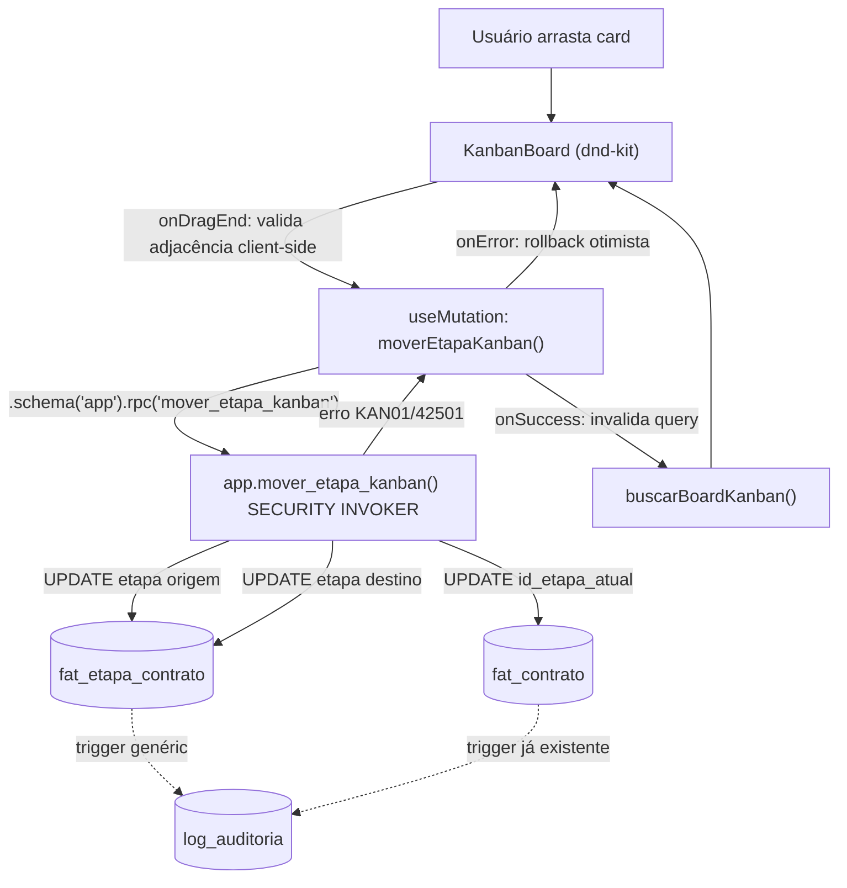

# Kanban de Etapas Design

**Spec**: `.specs/features/kanban-etapas/spec.md`
**Context**: `.specs/features/kanban-etapas/context.md`
**Status**: Approved

---

## Architecture Overview

Board por produto — uma coluna por `ref_etapa` (ordenada por `ordem`), um card por `fat_contrato`.
Arrastar um card chama uma função Postgres `SECURITY INVOKER` (AD-024) que orquestra as 2-3 escritas
da transição numa única transação; o trigger genérico de auditoria (já aprovado, só nunca ligado
nesta tabela) cobre AD-006 de graça. RLS + GRANT de tabela continuam sendo a fronteira real de quem
pode escrever o quê — a função só adiciona a regra de negócio (adjacência + papel na reversão) que
uma policy de linha não consegue expressar.



---

## Code Reuse Analysis

### Existing Components to Leverage

| Component | Location | How to Use |
| --- | --- | --- |
| `usePapelGlobal()` | `src/frontend/hooks/use-papel-global.ts` | Gate client-side de "mover pra trás" (só admin/gestora) — UX, não segurança; a segurança real é a RPC |
| Filtro papel+pessoa (Select em cascata) | `src/frontend/app/(app)/produtos/[slug]/dashboard/page.tsx` | Extrair para um componente compartilhado e reusar como o filtro Gestora/Mentor do board (KAN-03) — já implementa exatamente essa cascata |
| `buscarPessoasComPapelNoProduto` | `src/backend/queries/contrato.ts` | Popula o Select de pessoa do filtro, sem duplicar |
| `mapeiaErroRpc` + as 4 classes de erro | `src/backend/rpc/errors.ts` | Estender com o código novo `KAN01`; `42501` já mapeia para `PermissaoNegadaError` (reversão negada cai aqui de graça) |
| `app.trg_auditoria()` + padrão `trg_audit_<tabela>` | `docs/schema_sistema.sql:1674-1732`, `0012_fundacao_auditoria_gap.sql` | Só **ligar** em `fat_etapa_contrato` (nunca foi ligado — achado novo, ver Risks) — zero código PL/pgSQL novo |
| `app.papel_atual()` / `app.contratos_do_usuario()` | `docs/schema_sistema.sql:1459-1473` | Usadas dentro da função nova para a regra de reversão e como base do `WITH CHECK` |
| Padrão de função RPC `SECURITY INVOKER` (`app.substituir_vinculo`) | `supabase/migrations/0017_fn_substituir_vinculo.sql` | Modelo direto de estilo (assinatura, `RAISE EXCEPTION`, comentário) pra `app.mover_etapa_kanban` |
| `<CarregandoSkeleton>` / `<ErroInline>` / `<EstadoVazio>` | `src/frontend/components/ui/` | Estados padrão do board (AD-029) |
| `EmDesenvolvimento` (placeholder atual) | `src/frontend/app/(app)/produtos/[slug]/dashboard/page.tsx:138-141` | **Removido** — o próprio texto do placeholder ("Kanban... chegam em uma próxima etapa") já era a intenção registrada de onde o board deveria morar |
| `vw_etapa_contrato` / `buscarReguaDoContrato` | `src/backend/queries/etapa-contrato.ts` | Não usada diretamente pelo board (o board precisa de todos os contratos, não de um só) — mas o board invalida a régua daquele contrato via `queryClient.invalidateQueries` pra manter a tela de detalhe em dia |

### Integration Points

| System | Integration Method |
| --- | --- |
| `fat_etapa_contrato` / `fat_contrato` | Escrita exclusivamente via `app.mover_etapa_kanban` (RPC), nunca via `UPDATE` solto do PostgREST na tela — RLS/GRANT continuam sendo a fronteira real, a RPC é o caminho oficial |
| `log_auditoria` | Automático via trigger genérico — nenhum INSERT explícito no código da feature |
| TanStack Query (AD-021) | Board é o **primeiro consumidor real de `useMutation`** no projeto (até aqui só `useQuery` tinha consumidor, roadmap linha 97/128) |

---

## Components

### DB — `app.mover_etapa_kanban` (RPC, `SECURITY INVOKER`)

- **Purpose**: Orquestra a transição de etapa de um contrato em uma única transação — a única forma
  sancionada de gravar avanço/retrocesso.
- **Location**: `supabase/migrations/<timestamp>_kanban_etapas_fn_mover_etapa.sql`
- **Assinatura**: `app.mover_etapa_kanban(p_id_contrato BIGINT, p_id_etapa_destino BIGINT) RETURNS void`
- **Lógica**:
  1. `SELECT id_produto, id_etapa_atual FROM fat_contrato WHERE id_contrato = p_id_contrato` — se não
     achar linha (contrato não existe OU RLS de `fat_contrato` já filtrou por falta de vínculo),
     `RAISE EXCEPTION` com mensagem genérica (mesmo espírito de `PermissaoNegadaError`: nunca revelar
     se é "não existe" ou "sem permissão").
  2. `v_id_etapa_origem := COALESCE(id_etapa_atual, (SELECT id_etapa FROM ref_etapa WHERE id_produto = v_id_produto AND ordem = 1))`
     — cobre o caso `id_etapa_atual IS NULL` (card na coluna 1 por default, contexto confirmado).
  3. Resolve `v_ordem_origem`/`v_ordem_destino` via `ref_etapa`, validando que `p_id_etapa_destino`
     pertence ao mesmo `id_produto` (senão, mesma exceção genérica do passo 1 — etapa de outro
     produto não é "salto inválido", é entrada malformada).
  4. `v_delta := v_ordem_destino - v_ordem_origem`.
     - `v_delta = 1` → **avanço**: `UPDATE` etapa origem (`concluida`, `dt_conclusao =
       COALESCE(dt_conclusao, CURRENT_DATE)`), `UPDATE` etapa destino (`em_andamento`, `dt_inicio =
       COALESCE(dt_inicio, CURRENT_DATE)`), `UPDATE fat_contrato.id_etapa_atual`.
     - `v_delta = -1` → **retrocesso**: se `app.papel_atual() NOT IN ('admin','gestora')`,
       `RAISE EXCEPTION ... USING ERRCODE = '42501'` (reaproveita `PermissaoNegadaError` do
       frontend, zero código novo de mapeamento). Senão: `UPDATE` etapa destino (reabre,
       `em_andamento`, `dt_conclusao = NULL`), `UPDATE` etapa origem (`nao_iniciada`, `dt_inicio =
       NULL`, `dt_conclusao = NULL`), `UPDATE fat_contrato.id_etapa_atual` para a etapa destino.
     - qualquer outro `delta` (0 ou `|delta| > 1`) → `RAISE EXCEPTION ... USING ERRCODE = 'KAN01'`
       (código novo, mesmo padrão de `MDU01`).
- **Dependencies**: `ref_etapa`, `fat_etapa_contrato`, `fat_contrato`, `app.papel_atual()`.
- **Reuses**: estilo/estrutura de `app.substituir_vinculo` (0017); `app.papel_atual()` já aprovada.

### DB — trigger de auditoria em `fat_etapa_contrato`

- **Purpose**: Fechar o gap real (achado nesta sessão, ver Risks) — `fat_etapa_contrato` nunca teve
  `trg_audit_fat_etapa_contrato` ligado, nem no loop original do schema aprovado nem no gap-fix de
  `0012`. `fat_contrato` **já tem** o seu (`0012`), então o `UPDATE` de `id_etapa_atual` já é
  auditado sem ação nova.
- **Location**: mesma migration do RPC, ou uma migration-irmã dedicada (decisão de Tasks).
- **Interfaces**: `CREATE TRIGGER trg_audit_fat_etapa_contrato AFTER INSERT OR UPDATE OR DELETE ON
  fat_etapa_contrato FOR EACH ROW EXECUTE FUNCTION app.trg_auditoria('id_etapa_contrato');`
- **Reuses**: `app.trg_auditoria()`, já provisionada e aprovada — nenhum PL/pgSQL novo.

### DB — RLS/GRANT fix (`fat_contrato`, `fat_etapa_contrato`)

- **Purpose**: Fechar os 2 gaps de infraestrutura achados durante Design (ver Risks & Concerns) —
  sem isso, a US "Mentor/Assessor move pra frente" (P1, KAN-04/05) é impossível pelo `GRANT`, e
  `fat_contrato` continua sem `WITH CHECK` explícito quando finalmente ganha um caminho de escrita
  não-Admin/Gestora.
- **Location**: migration própria de grants desta feature.
- **Interfaces**:
  - `ALTER POLICY p_por_carteira ON fat_contrato WITH CHECK (app.papel_atual() IN ('admin','gestora') OR id_contrato = ANY(app.contratos_do_usuario()));`
  - `GRANT UPDATE (status, dt_inicio, dt_conclusao) ON fat_etapa_contrato TO legisla_mentor, legisla_assessor;`
  - `GRANT UPDATE (id_etapa_atual) ON fat_contrato TO legisla_mentor, legisla_assessor;`
  - (`legisla_admin`/`legisla_gestora`/`legisla_app` já têm `UPDATE` irrestrito nas duas tabelas via
    o `GRANT ... ALL TABLES` re-emitido por `operacao-regua-instanciacao` — nada a fazer ali.)
- **Reuses**: mesmo racional de "não confiar em reuso implícito" já aplicado por
  `operacao-regua-instanciacao` às suas 3 tabelas novas — aqui aplicado a uma tabela **existente**
  que nunca tinha precisado disso até agora.

### Backend — `src/backend/queries/kanban.ts` (novo)

- **Purpose**: Leitura do board (colunas + cards) e dos dados de apoio dos filtros.
- **Location**: `src/backend/queries/kanban.ts`
- **Interfaces**:
  - `buscarBoardKanban(client, idProduto: number, filtro?: FiltroBoard): Promise<ColunaKanban[]>` —
    uma query em `ref_etapa` (colunas) + uma em `fat_contrato` (cards, com join manual pra
    `dim_contratante.nome` e pra `fat_etapa_contrato.dt_inicio` da etapa atual, mesmo padrão de
    join-em-TypeScript já usado em `buscarContratosAtivosPorProduto`) + resolução dos filtros
    (papel+pessoa via `rel_usuario_contrato`, projeto via `fat_contrato.id_projeto`, "minha
    carteira" via `app.id_usuario()`/sessão atual) combinados por `AND` (intersecção de conjuntos de
    `id_contrato`, mesmo padrão de `contarContratosEAssessoresAtivos`).
  - `buscarProjetosDoProduto(client, idProduto: number): Promise<{idProjeto: number; nome: string}[]>`
    — projetos distintos entre os contratos do produto (popula o Select de projeto).
- **Dependencies**: `ref_etapa`, `fat_contrato`, `dim_contratante`, `fat_etapa_contrato`,
  `rel_usuario_contrato`, `ref_projeto`.
- **Reuses**: padrão de join manual + filtro combinável de `src/backend/queries/contrato.ts`.

### Backend — `src/backend/rpc/kanban.ts` (novo)

- **Purpose**: Único ponto de chamada de `app.mover_etapa_kanban`.
- **Location**: `src/backend/rpc/kanban.ts`
- **Interfaces**: `moverEtapaKanban(client, input: { idContrato: number; idEtapaDestino: number }): Promise<void>`
- **Reuses**: `mapeiaErroRpc` (`src/backend/rpc/errors.ts`), estendida com `KAN01`.

### Backend — `src/backend/rpc/errors.ts` (estendido)

- Nova classe `TransicaoInvalidaError extends Error` para `KAN01` — mensagem: "Não é possível pular
  etapas — mova o card para a coluna adjacente."
- `42501` já existe e cai em `PermissaoNegadaError` — cobre a reversão negada a Mentor/Assessor sem
  nenhuma linha nova de mapeamento.

### Frontend — `KanbanBoard` (novo componente)

- **Purpose**: Renderiza colunas + cards, gerencia o `DndContext`, chama a mutation no `onDragEnd`.
- **Location**: `src/frontend/components/kanban/kanban-board.tsx` (+ `kanban-coluna.tsx`,
  `kanban-card.tsx` como filhos, "3+ coisas → divide componente")
- **Interfaces**: `<KanbanBoard idProduto={produto.idProduto} filtro={filtro} />`
- **Dependencies**: `@dnd-kit/core`, `@dnd-kit/utilities`, `@tanstack/react-query`.
- **Comportamento**:
  - `useQuery` em `buscarBoardKanban` — chave inclui `idProduto` + filtro (revalida ao mudar filtro
    ou reconectar/focar aba, cobre a Assumption de concorrência).
  - `onDragEnd`: calcula a coluna de destino pelo `id` do droppable; se não for adjacente à coluna de
    origem do card **OU** (retrocesso e `usePapelGlobal().papel` não é admin/gestora), mostra `toast`
    de rejeição e não chama a mutation — nunca envia um request que o servidor rejeitaria de
    qualquer forma (mas o servidor rejeita igual se esse guard for burlado, ver Risks).
  - `useMutation(moverEtapaKanban)` com `onMutate` (snapshot + atualização otimista do cache),
    `onError` (rollback pro snapshot — cobre literalmente o Edge Case "devolve o card pra posição
    original"), `onSettled` (invalida a query do board **e** a de `buscarReguaDoContrato` daquele
    `idContrato`, se a tela de régua estiver montada em outra aba).
  - Card mostra: nome do contratante, badge de status quando `fat_contrato.status !== 'ativo'`
    (Edge Case — contrato encerrado continua visível, com indicação visual), e "há N dias na etapa
    atual".

### Frontend — regra de "há N dias na etapa atual" (Agent's Discretion, decidida aqui)

- Se a etapa atual (`id_etapa_atual` resolvido, ou etapa `ordem = 1` quando `NULL`) tem `dt_inicio`
  setado: `dias = hoje - dt_inicio`.
- Se `dt_inicio IS NULL` (card ainda na coluna 1, nenhuma transição jamais aconteceu): usa
  `fat_contrato.dt_inicio` (data de início do próprio contrato) como âncora — é o único marco real
  disponível pra "desde quando esse contrato está parado aqui", e AD-005 já proíbe qualquer
  sentinela no lugar de um número derivável.

### Frontend — onde o board vive

- Substitui o placeholder `<EmDesenvolvimento>` dentro da aba **Dashboard** de
  `/produtos/[slug]/dashboard` (`ProdutoDashboardPage`) — o próprio texto do placeholder já
  anunciava isso. Os 2 cards de contagem (contratos ativos/assessores ativos) e o filtro papel+pessoa
  existentes **permanecem** acima do board; o filtro é estendido com um Select de projeto e um
  `Switch`/`Checkbox` "Minha carteira" (KAN-10), na mesma barra.
- Nenhuma rota nova é criada — evita duplicar a validação de slug que `produtos/[slug]/layout.tsx`
  (NAV-02) já faz.

---

## Data Models

```typescript
// src/backend/queries/kanban.ts
interface ColunaKanban {
  idEtapa: number;
  codigo: string;
  nome: string;
  ordem: number;
  cards: CardKanban[];
}

interface CardKanban {
  idContrato: number;
  nomeContratante: string;
  statusContrato: "ativo" | "concluido" | "nao_concluido";
  diasNaEtapaAtual: number;
}

interface FiltroBoard {
  idGestora?: number;
  idMentor?: number;
  idProjeto?: number;
  minhaCarteira?: boolean; // restringe a contratos com vínculo ativo do usuário logado
}
```

**Relationships**: `ColunaKanban.idEtapa` → `ref_etapa.id_etapa`; `CardKanban.idContrato` →
`fat_contrato.id_contrato`. Um `CardKanban` aparece em exatamente uma `ColunaKanban` — o
posicionamento (KAN-02) é decidido no backend (`buscarBoardKanban`), nunca recalculado no cliente.

---

## Error Handling Strategy

| Error Scenario | Handling | User Impact |
| --- | --- | --- |
| Salto de coluna não-adjacente | Client-side: guard em `onDragEnd` impede o request. Server-side (bypass/race): `KAN01` → `TransicaoInvalidaError` | Toast: "Não é possível pular etapas — mova para a coluna adjacente." Card volta pra posição original |
| Retrocesso por Mentor/Assessor | Client-side: guard via `usePapelGlobal()`. Server-side: `42501` → `PermissaoNegadaError` (já existente) | Toast genérico de permissão (mesma mensagem já usada em todo o projeto) |
| Contrato sem vínculo do usuário (tentativa direta, fora da UI normal) | RPC não encontra a linha em `fat_contrato` (RLS já filtrou) → exceção genérica, mapeada como `PermissaoNegadaError` | Mesmo toast genérico — nunca revela se o contrato existe |
| Falha de rede no meio do drag | `useMutation.onError` restaura o snapshot anterior do cache | Card volta pra posição original, sem toast alarmante (é reconectável) — `onSettled` revalida em seguida |
| Produto sem nenhuma etapa cadastrada (não deveria acontecer) | `buscarBoardKanban` retorna `[]` | `<EstadoVazio>`, mesmo padrão de `produtos/[slug]/contratos` |

---

## Risks & Concerns

| Concern | Location (file:line) | Impact | Mitigation |
| --- | --- | --- | --- |
| `legisla_mentor`/`legisla_assessor` nunca receberam `GRANT UPDATE` em `fat_contrato`/`fat_etapa_contrato` em nenhuma migration (confirmado por grep na história completa) | `supabase/migrations/0004_plataforma_roles_grants.sql`, `20260812001310_regua_instanciacao_grants.sql` (só `SELECT`) | Sem correção, a US P1 "Mentor move pra frente" (KAN-04) é impossível — não é bug de RLS, é ausência total de privilégio na camada de `GRANT`, que é avaliada antes da RLS | Nova migration com `GRANT UPDATE` column-scoped (least privilege) pras 2 tabelas — task própria, ver Components acima |
| `fat_contrato.p_por_carteira` (`0011_fundacao_rls.sql:60-68`) nunca teve `WITH CHECK` explícito — só `USING`, reuso implícito | `supabase/migrations/0011_fundacao_rls.sql:66-68` | Latente até hoje porque só Admin/Gestora (que sempre passam pela cláusula `papel_atual()`) escreviam em `fat_contrato`. Esta feature é a primeira a abrir escrita não-Admin/Gestora nessa tabela — o mesmo padrão de risco que `operacao-regua-instanciacao` já preveniu por antecipação em suas 3 tabelas novas | `ALTER POLICY ... WITH CHECK` explícito idêntico ao `USING`, mesma migration do fix de grant acima |
| AD-023 já registra o trade-off: "superfície de gestão adquire responsabilidade transacional... cuidado para não virar porta de escrita para outros campos" — a regra de adjacência/reversão-por-papel vive **só** na função RPC, não em constraint/trigger; um usuário com `UPDATE` na tabela (agora ampliado por esta feature) tecnicamente consegue um `PATCH` direto via PostgREST que bypassa a função | `app.mover_etapa_kanban` (novo) | Um Mentor mal-intencionado poderia, em tese, gravar uma transição não-adjacente via REST direto, sem passar pela função | Aceito como risco residual — mesma categoria de exposição que **já existe** hoje em `app.substituir_vinculo`/`app.criar_mandato`/`app.criar_coalizao` (nenhuma delas tem trigger de validação além da própria função); endurecer isso é decisão de arquitetura transversal (viraria um novo AD), não escopo desta feature isolada |
| `@dnd-kit/core` não tem confirmação pública explícita de teste contra React 19 (só o peer range `>=16.8.0`, sem teto) — diferente do pacote-irmão `@dnd-kit/react` (0.5.0, que declara `^18\|\|^19` mas é pré-1.0) | `package.json` (dependência nova) | Risco baixo, não-bloqueante: o range do peer dep não impede a instalação, e a API usada (`DndContext`/`useDraggable`/`useDroppable`) é puramente client-side, sem depender de Server Components | Se algum comportamento estranho aparecer em runtime, é o primeiro lugar a revisitar; não foi encontrada nenhuma issue aberta específica de `@dnd-kit/core` (só de `@dnd-kit/react`) |
| Nenhum harness de teste de componente React neste projeto (lição candidata `L-006`/`L-007`) | `vitest.config.ts:6` | O comportamento de drag-and-drop em si (`onDragEnd`, guards client-side) fica sem cobertura automatizada — só a camada de queries/RPC (`kanban.ts`, `errors.ts`) é testável hoje | Mesmo débito já documentado em 3 features anteriores; testes desta feature cobrem queries+RPC+RLS (backend), UI fica para UAT manual, registrado em `validation.md` |

> Nenhum outro concern novo encontrado na leitura de `ref_etapa`/`fat_etapa_contrato`/`fat_contrato`/
> `rel_usuario_contrato`/`log_auditoria` além dos listados acima.

---

## Tech Decisions

| Decision | Choice | Rationale |
| --- | --- | --- |
| Biblioteca de drag-and-drop | `@dnd-kit/core` + `@dnd-kit/utilities` (não `@dnd-kit/sortable`, não `@dnd-kit/react`, não `@atlaskit/pragmatic-drag-and-drop`) | Comparados 3 candidatos via web search (Context7 indisponível nesta sessão — nenhum servidor conectado). `@dnd-kit/core` v6.3.1: maduro, peer dep `react >=16.8.0` (sem teto, instala sob React 19.2.4 deste projeto), ~2.8M downloads/semana, `KeyboardSensor` de acessibilidade pronto (WCAG, relevante — `ui-ux-pro-max`), exemplo oficial "multi-container" é literalmente um Kanban. `@dnd-kit/sortable` não é necessário: não há reordenação manual **dentro** de uma coluna, só movimento **entre** colunas — `useDraggable`/`useDroppable` puro do `core` já resolve. `@dnd-kit/react` (0.5.0) é reescrita pré-1.0 (API ainda instável) e tem issue aberta de "use client" pendente. Pragmatic DnD é mais leve e é o que o Jira/Trello usam em escala real, mas exige montar a própria camada de acessibilidade/colisão do zero — overkill para um board de dezenas de cards por coluna, não milhares |
| Regra de "dias na etapa atual" sem `dt_inicio` | Usa `fat_contrato.dt_inicio` como âncora | Ver Components → "há N dias na etapa atual" acima; único marco real disponível, sem sentinela (AD-005) |
| Onde o board vive | Aba Dashboard de `/produtos/[slug]/dashboard`, substituindo o placeholder existente | O próprio código já anunciava isso (`EmDesenvolvimento` cita "Kanban... chegam em uma próxima etapa"); nenhuma rota nova, reaproveita a validação de slug e o filtro papel+pessoa já implementados |
| Retorno de `app.mover_etapa_kanban` | `void` | A mutation só precisa saber sucesso/falha; o board relê o estado real via `invalidateQueries`, nunca confia no retorno da função pra atualizar a UI |

> **Project-level**: a escolha de `@dnd-kit/core` estabelece o padrão de drag-and-drop pro projeto
> (primeira feature a precisar de um) — registrada como **AD-034** em `.specs/STATE.md`.
