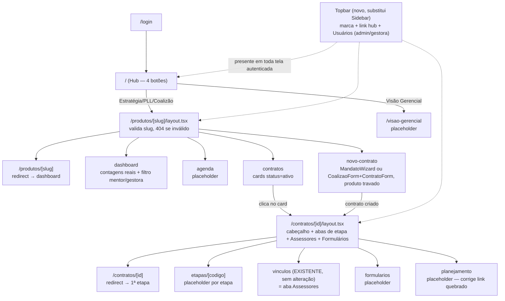

# Navegação por Produto — Design

**Spec**: `.specs/features/navegacao-por-produto/spec.md`
**Context**: `.specs/features/navegacao-por-produto/context.md` (7/7 pontos confirmados por Pedro em 2026-08-11)
**Status**: Draft

---

## Architecture Overview

100% reorganização de frontend/rotas sobre tabelas já provisionadas — nenhuma migration nova
(confirma Goal 4 do spec, `supabase db diff` deve continuar vazio ao fim da feature). Duas
famílias de rota novas, cada uma com layout próprio que valida o segmento dinâmico e monta uma
barra de abas **baseada em rota** (não em estado de client, ver Tech Decisions) — mesmo padrão
usado hoje pela sidebar (`Link` + `usePathname`), só que reaproveitado como componente
compartilhado (`RouteTabs`) em vez de reimplementado 3 vezes.



`(app)/layout.tsx` deixa de montar `<Sidebar/>` e passa a montar `<Topbar/>` — mesmo papel
estrutural (AD-027: toda tela autenticada nova nasce dentro de `(app)/`), conteúdo novo.

---

## Code Reuse Analysis

### Existing Components to Leverage

| Componente | Localização | Como reaproveitar |
| --- | --- | --- |
| `ContratoForm` | `src/frontend/components/fundacao/contrato-form.tsx` | Ganha 2 props novas (`produtoTravado`, retorno do `id_contrato` criado) — ver Components. Reaproveitado em `novo-contrato` (Coalizão) sem duplicar formulário |
| `MandatoWizard` | `src/frontend/components/fundacao/mandato-wizard.tsx` | Ganha 2 props novas (`produtoTravado`, `destino`) — reaproveitado em `novo-contrato` (Estratégia/PLL); já resolve contratante novo vs. existente (fluxo `buscar/revisar/manual/existente`), nada disso é reconstruído |
| `CoalizaoForm` | `src/frontend/app/(app)/coalizoes/coalizao-form.tsx` | Reaproveitado sem alteração dentro do orquestrador `NovoContratoView` (produto Coalizão, sub-fluxo "nova coalizão") |
| `VinculoForm`/`VinculoTable` + rota `/contratos/[id]/vinculos` | `components/fundacao/vinculo-*.tsx`, `app/(app)/contratos/[id]/vinculos/page.tsx` | **Zero alteração** — passam a herdar o novo `layout.tsx` de `/contratos/[id]/` automaticamente (mecanismo de layout aninhado do App Router), viram a aba Assessores de graça |
| `EstadoVazio`, `ErroInline`, `CarregandoSkeleton` (AD-029) | `components/ui/*.tsx` | Reaproveitados como estão nas listas novas (Contratos tab) e erros de fetch; `EstadoVazio` também vira a base do novo `EmDesenvolvimento` (ver Components) |
| Padrão `Link` + `usePathname` + `cn` para nav ativa | `components/app-shell/sidebar.tsx` (a ser removido) | Extraído para `RouteTabs`, componente novo compartilhado — evita reimplementar o mesmo cálculo de "ativo" 3 vezes (produto tabs, ficha tabs, e o que sobrar do padrão de sidebar) |
| `mapeiaErroRpc` / `PermissaoNegadaError` | `src/backend/rpc/errors.ts` | Reaproveitado sem alteração no fluxo de criação de contrato dentro de `novo-contrato` (edge case: RLS nega escrita → `<ErroInline>`) |
| `Toaster` global (sonner, AD-029) | montado em `app/layout.tsx` raiz | Reaproveitado para os botões "Registrar Insight"/"Registrar Fato Gerador" (`toast("Em desenvolvimento")`) — não precisa de dialog nem rota nova |

### Integration Points

| Sistema | Como a feature se conecta |
| --- | --- |
| `ref_produto` | Leitura por `nome` (`'Estratégia'`, `'PLL'`, `'Coalizão'` — confirmado em `supabase/migrations/0007_catalogos_fundacao.sql:67`) para resolver `id_produto` a partir do `slug` da URL. Mapeamento slug→nome é constante de frontend (ver Tech Decisions) |
| `ref_etapa` | Leitura por `id_produto`, ordenada por `ordem`, para montar as abas de etapa da ficha. **Ainda não tipada em `database.types.ts`** (ver Risks) |
| `fat_contrato`, `dim_contratante`, `dim_mandato`, `dim_coalizao` | Leitura via joins manuais em TypeScript (mesmo padrão de `contratos/page.tsx` hoje) — **não** via `vw_contrato`, que existe só no schema aprovado (`docs/schema_sistema.sql:1167`) e nunca foi migrada (ver Risks) |
| `rel_usuario_contrato` | Leitura para contagem de assessores ativos (Dashboard) e para a lista de mentores/gestoras do filtro — nenhuma escrita nova |
| RLS existente (AD-002, migrations `0001`/`0008`/`0011`) | Nenhuma policy nova — a feature só lê/escreve nas mesmas tabelas já cobertas; hub sempre visível, RLS decide o que aparece dentro (decisão confirmada) |
| `app.criar_mandato` / `app.criar_coalizao` (RPCs existentes) | Chamadas sem alteração de assinatura — só o `id_produto` passado muda (vem travado pelo slug em vez de escolhido no formulário) |

---

## Components

### `Topbar` (novo, substitui `Sidebar`)

- **Purpose**: barra superior fixa da área autenticada — marca, link de volta ao hub, e o menu
  "Usuários" condicionado a `papel_global`.
- **Location**: `src/frontend/components/app-shell/topbar.tsx` (substitui
  `components/app-shell/sidebar.tsx`, que é **deletado** — único consumidor era `(app)/layout.tsx`)
- **Interfaces**: `Topbar()` — sem props, client component.
- **Dependencies**: `usePapelGlobal()` (novo hook, abaixo).
- **Reuses**: estrutura visual (`cn`, ícones lucide) da sidebar atual; `(app)/layout.tsx` troca
  `<div className="flex min-h-full"><Sidebar/><main>...` por `<div className="flex min-h-full flex-col"><Topbar/><main>...` (deixa de ser layout em coluna lateral, vira barra + conteúdo abaixo).

### `usePapelGlobal` (novo hook)

- **Purpose**: centraliza o padrão hoje duplicado ad-hoc em `usuarios/page.tsx:56-63`
  (`auth.getUser()` + `dim_usuario.select("papel_global").eq("email", ...)`) para qualquer
  componente que precise decidir visibilidade por papel.
- **Location**: `src/frontend/hooks/use-papel-global.ts` (pasta `hooks/` é nova neste projeto).
- **Interfaces**: `usePapelGlobal(): { papel: "admin" | "gestora" | "mentor" | "assessor" | null; carregando: boolean }`.
- **Dependencies**: `createClient()` (browser).
- **Reuses**: nada de novo, só extrai um padrão existente. **Não** refatora `usuarios/page.tsx`
  para usá-lo — fora do escopo desta feature (ver Risks).
- Implementação: `useState`+`useEffect` simples (não `useQuery`) — o `Topbar` monta uma única vez
  por sessão dentro do layout raiz de `(app)/`, não há remount entre navegações que justifique
  cache de query (ver Tech Decisions).

### `RouteTabs` (novo componente compartilhado)

- **Purpose**: barra de abas onde cada aba é uma rota real (não estado de client) — extrai o
  padrão `Link` + `usePathname` + `cn` para "ativo" que a sidebar atual já usa inline, para não
  reimplementar em `ProdutoShell` e em `FichaContratoChrome`.
- **Location**: `src/frontend/components/app-shell/route-tabs.tsx`.
- **Interfaces**: `RouteTabs({ items }: { items: { href: string; label: string; ativoSe?: (pathname: string) => boolean }[] })`.
- **Dependencies**: `usePathname` (next/navigation).
- **Reuses**: lógica de "ativo" (`pathname === href || pathname?.startsWith(...)`) copiada e
  generalizada de `sidebar.tsx:44-47`.

### `EmDesenvolvimento` (novo componente compartilhado)

- **Purpose**: placeholder padronizado "X em desenvolvimento" — usado por Agenda, Visão Gerencial,
  Formulários, Planejamento, e o bloco de Kanban/indicadores dentro do Dashboard. Evita repetir o
  mesmo JSX 5+ vezes com textos ligeiramente diferentes.
- **Location**: `src/frontend/components/app-shell/em-desenvolvimento.tsx`.
- **Interfaces**: `EmDesenvolvimento({ titulo, mensagem }: { titulo: string; mensagem?: string })`.
- **Reuses**: `<EstadoVazio>` (AD-029) por baixo — mesmo componente, título/mensagem
  padronizados para o caso "feature ainda não construída" (semanticamente diferente de "sem
  linhas na tabela", mas visualmente idêntico, que é o que a AD-029 já cobre).

### Hub (`(app)/page.tsx`, reescrito)

- **Purpose**: NAV-01 — 4 botões grandes (Estratégia, PLL, Coalizão, Visão Gerencial), substitui
  inteiramente o bento grid + explorador TSE atual (739 linhas removidas, nenhuma chamada a
  `tse.mv_candidatura_resumo` sobrevive).
- **Location**: `src/frontend/app/(app)/page.tsx` (mesma rota, conteúdo 100% novo).
- **Interfaces**: componente de página, sem props.
- **Dependencies**: nenhuma query — os 4 botões são estáticos (3 slugs fixos + 1 link fixo pra
  Visão Gerencial), a decisão de "sempre visíveis" (confirmada) elimina a necessidade de
  qualquer fetch antes de renderizar.
- **Reuses**: `Card`/`Button` shadcn.

### `/produtos/[slug]/layout.tsx` (novo)

- **Purpose**: NAV-02 AC4 — valida `slug` contra o mapa fixo de 3 produtos operados pelo sistema;
  `notFound()` se inválido. Server Component (Next 16 — `params` é `Promise`).
- **Location**: `src/frontend/app/(app)/produtos/[slug]/layout.tsx`.
- **Interfaces**: `Layout({ children, params }: { children: ReactNode; params: Promise<{ slug: string }> })`.
- **Dependencies**: `PRODUTO_SLUGS` (novo, `src/backend/queries/produto.ts`).
- **Reuses**: nenhuma query — validação é comparação de string contra constante (ver Tech
  Decisions), então roda sem round-trip ao banco.
- Renderiza `<ProdutoShell slug={slug}>{children}</ProdutoShell>` (client, abaixo).

### `ProdutoShell` (novo)

- **Purpose**: cabeçalho da área de produto (nome do produto + link "voltar ao hub") + `RouteTabs`
  com as 4 abas (Dashboard/Agenda/Contratos/Cadastro de novo Contrato).
- **Location**: `src/frontend/components/produtos/produto-shell.tsx`.
- **Interfaces**: `ProdutoShell({ slug, children }: { slug: ProdutoSlug; children: ReactNode })`.
- **Dependencies**: `useProdutoAtual(slug)` (novo hook, abaixo) — resolve `id_produto` uma vez,
  compartilhado por `react-query` entre este componente e as 4 páginas-filhas.
- **Reuses**: `RouteTabs`.

### `useProdutoAtual` (novo hook)

- **Purpose**: resolve `{ id_produto, nome }` a partir do `slug`, com cache por `queryKey`
  (`["produto", slug]`) — evita 4 fetches idênticos quando o usuário navega entre as abas do
  mesmo produto.
- **Location**: `src/frontend/hooks/use-produto-atual.ts`.
- **Interfaces**: `useProdutoAtual(slug: ProdutoSlug): UseQueryResult<{ idProduto: number; nome: string }>`.
- **Dependencies**: `@tanstack/react-query` (`useQuery` — **primeiro consumidor real do provider
  instalado pela Trilha D**, ver Tech Decisions), `createClient()`.
- **Reuses**: `QueryClientProvider` já montado em `app/layout.tsx` raiz (AD-029) — nenhum setup
  novo de infraestrutura.

### `/produtos/[slug]/page.tsx` (novo)

- **Purpose**: NAV-01 AC2 — redireciona para a aba Dashboard por padrão.
- **Location**: `src/frontend/app/(app)/produtos/[slug]/page.tsx`.
- **Interfaces**: Server Component, `redirect(`/produtos/${slug}/dashboard`)` — alvo é sempre o
  mesmo, não precisa de dado nenhum antes de redirecionar.

### `/produtos/[slug]/dashboard/page.tsx` (novo)

- **Purpose**: NAV-10/NAV-11 — contagem de contratos ativos e de assessores ativos do produto,
  filtro por mentor/gestora, placeholder de Kanban/indicadores.
- **Location**: `src/frontend/app/(app)/produtos/[slug]/dashboard/page.tsx`.
- **Interfaces**: client component; usa `useProdutoAtual(slug)` para `idProduto`.
- **Dependencies**: `src/backend/queries/contrato.ts` (funções novas, abaixo).
- **Reuses**: `EmDesenvolvimento` (bloco de Kanban/indicadores), `Card` (KPIs), `Select` shadcn
  (filtro).
- Filtro mentor/gestora: dois `Select` em cascata — papel (Gestora/Mentor) → pessoa (populada
  dinamicamente a partir de quem tem vínculo ativo nesse papel em algum contrato ativo do
  produto). Ao escolher pessoa, as duas contagens recalculam restritas aos contratos onde ela
  tem vínculo ativo naquele papel (AC2, literal ao spec).

### `/produtos/[slug]/agenda/page.tsx` (novo)

- **Purpose**: NAV-12 — placeholder único ("Agenda em desenvolvimento") para os 3 produtos.
- **Location**: `src/frontend/app/(app)/produtos/[slug]/agenda/page.tsx`.
- **Interfaces**: `<EmDesenvolvimento titulo="Agenda em desenvolvimento" />`, sem lógica.

### `/produtos/[slug]/contratos/page.tsx` (novo)

- **Purpose**: NAV-03 — card por `fat_contrato` do produto com `status = 'ativo'`.
- **Location**: `src/frontend/app/(app)/produtos/[slug]/contratos/page.tsx`.
- **Dependencies**: `buscarContratosAtivosPorProduto` (`queries/contrato.ts`).
- **Reuses**: `EstadoVazio` (sem contrato ativo, com atalho pra aba Cadastro de novo Contrato),
  `Card`. Join manual `fat_contrato` + `dim_contratante` em TypeScript, mesmo padrão de
  `contratos/page.tsx:1-50` (não usa `vw_contrato`, ver Risks).
- Clique no card → `router.push(`/contratos/${idContrato}`)` (NAV-03 AC3).

### `NovoContratoView` (novo, orquestrador)

- **Purpose**: NAV-09 — hospeda o fluxo de cadastro dentro da aba "Cadastro de novo Contrato",
  ramificando por produto: Estratégia/PLL usam `MandatoWizard`; Coalizão usa
  `CoalizaoForm`+`ContratoForm` encadeados.
- **Location**: `src/frontend/components/produtos/novo-contrato-view.tsx`.
- **Interfaces**: `NovoContratoView({ slug, idProduto, nomeProduto }: { slug: ProdutoSlug; idProduto: number; nomeProduto: string })`.
- **Dependencies**: `MandatoWizard`, `CoalizaoForm`, `ContratoForm`.
- **Reuses**: os 3 formulários existentes, sem duplicar nenhum campo/validação.
- Fluxo Coalizão (estado local `"escolher" | "nova" | "existente"`):
  1. `"escolher"`: dois botões — "Nova coalizão" / "Coalizão existente".
  2. `"nova"`: `<CoalizaoForm onCriada={(c) => setContratanteAlvo(c.idContratante)} />` → ao
     concluir, avança para o passo de abrir contrato (3).
  3. `"existente"`: `Select` de `dim_contratante.eq("tipo_contratante","coalizao")` → escolhida a
     coalizão, mesmo passo (3).
  4. Passo comum: `<ContratoForm idContratante={contratanteAlvo} contratosExistentes={[]} modo={{tipo:"abrir"}} produtoTravado={{id: idProduto, nome: nomeProduto}} onConcluido={(criado) => router.push(`/contratos/${criado.idContrato}`)} />`.
- Fluxo Estratégia/PLL: `<MandatoWizard produtoTravado={{id: idProduto, nome: nomeProduto}} destino={(r) => `/contratos/${r.idContrato}`} onCriado={() => {}} />` — todo o resto (TSE/manual/existente) já funciona sem mudança de lógica.

### `ContratoForm` — alterações

- **Purpose (do que muda)**: permitir produto pré-travado (NAV-09 AC1) e devolver o
  `id_contrato` criado (necessário pra navegar até a ficha nova, NAV-09 AC3).
- **Location**: `src/frontend/components/fundacao/contrato-form.tsx` (mesmo arquivo).
- **Interface nova**: `ContratoFormProps` ganha `produtoTravado?: { id: number; nome: string }`;
  `onConcluido` passa a ser `(criado?: { idContrato: number }) => void` (parâmetro opcional —
  compatível com os 3 call-sites existentes que hoje chamam `onConcluido()` sem argumento,
  nenhum precisa mudar).
- Mudança de comportamento: quando `produtoTravado` está presente, o campo Produto renderiza como
  rótulo fixo (não `Select` editável) e `defaultValues.id_produto` já nasce com esse valor. O
  `insert` de "abrir" ganha `.select("id_contrato").single()` para poder repassar o id criado.

### `MandatoWizard` — alterações

- **Purpose (do que muda)**: mesma necessidade do `ContratoForm` — produto travado (NAV-09 AC1) e
  destino de navegação configurável (NAV-09 AC3, hoje sempre `/mandatos/${idMandato}`).
- **Location**: `src/frontend/components/fundacao/mandato-wizard.tsx` (mesmo arquivo).
- **Interface nova**: `MandatoWizardProps` ganha `produtoTravado?: { id: number; nome: string }` e
  `destino?: (resultado: MandatoCriado) => string` (default preserva o comportamento atual:
  `(r) => `/mandatos/${r.idMandato}``, então `/mandatos/novo` não muda de comportamento).
- Mudança de comportamento: as 4 ocorrências de `id_produto: 1` (linhas 134, 171, 223, 234) usam
  `produtoTravado?.id ?? 1`; o campo Produto na seção "CONTRATO & COALIZAO" vira rótulo fixo
  quando travado, igual ao `ContratoForm`.

### `MandatoCriado` — correção de tipo (achado durante o Design)

- **Purpose**: `rpc/mandato.ts:64-65` já retorna `idContrato` em runtime (a RPC
  `app.criar_mandato` sempre devolveu `id_contrato`) mas o tipo declarado `MandatoCriado`
  (`src/backend/types/fundacao.ts:30-34`) não declara esse campo — o código de produção contorna
  isso com um cast inline (`as MandatoCriado & { idContrato?: number | null }`). Sem essa
  correção, `destino` (acima) não teria como ler `resultado.idContrato` de forma tipada.
- **Location**: `src/backend/types/fundacao.ts`.
- Mudança: `MandatoCriado` ganha `idContrato: number | null`; o cast inline em `rpc/mandato.ts:65`
  é removido (fica redundante).

### `/visao-gerencial/page.tsx` (novo)

- **Purpose**: NAV-13 — placeholder único, sem abas.
- **Location**: `src/frontend/app/(app)/visao-gerencial/page.tsx`.
- **Interfaces**: `<EmDesenvolvimento titulo="Indicadores em desenvolvimento" />`.

### `/contratos/[id]/layout.tsx` + `FichaContratoChrome` (novo)

- **Purpose**: NAV-04 — cabeçalho (contratante + produto) e barra de abas (etapas + Assessores +
  Formulários) compartilhados por todas as sub-rotas de um contrato; ação row (Insight/Fato
  Gerador/Planejamento).
- **Location**: `layout.tsx` em `src/frontend/app/(app)/contratos/[id]/layout.tsx` (Server
  Component, só resolve `id`); `FichaContratoChrome` em
  `src/frontend/components/produtos/ficha-contrato-chrome.tsx` (client, faz o fetch).
- **Interfaces**: `FichaContratoChrome({ idContrato, children }: { idContrato: number; children: ReactNode })`.
- **Dependencies**: `buscarContratoParaFicha`, `buscarEtapasDoProduto` (`queries/contrato.ts`).
- **Reuses**: `RouteTabs`, `Toaster`/`toast()` (Insight/Fato Gerador), `EstadoVazio` (edge case:
  0 linhas em `ref_etapa` para o produto → aba única "Nenhuma etapa cadastrada", nunca zero
  abas).
- Cabeçalho ramifica por `tipo_contratante` (NAV-04 AC1): `'mandato'` → cargo/partido/UF atuais
  (via `dim_mandato.id_cargo_atual`/`id_partido_atual`, **não** via `fat_contrato.id_cargo_no_contrato`/`id_partido_no_contrato`, que são o snapshot nunca populado, `FND-CTR-05`); `'coalizao'` →
  nome + projeto de origem (`dim_coalizao.id_projeto_origem`); qualquer outro valor → cabeçalho
  genérico (edge case do spec).
- Contrato inexistente: fetch retorna `null` → `if (contrato === null) notFound()` **no corpo do
  render**, nunca dentro do `useEffect` que popula o estado (ver Tech Decisions, por que o local
  importa).

### `/contratos/[id]/page.tsx` (novo)

- **Purpose**: redireciona para a 1ª etapa (ordenada por `ordem`) assim que carrega — cliente,
  porque a etapa-alvo depende de uma query (diferente do redirect estático do Hub de produto).
- **Location**: `src/frontend/app/(app)/contratos/[id]/page.tsx`.
- **Interfaces**: client component, `router.replace(`/contratos/${id}/etapas/${codigo}`)` dentro
  de `useEffect`, `<CarregandoSkeleton>` enquanto isso.

### `/contratos/[id]/etapas/[codigo]/page.tsx` (novo)

- **Purpose**: NAV-04 AC2 — cada etapa é uma aba real, vazia de conteúdo por ora.
- **Location**: `src/frontend/app/(app)/contratos/[id]/etapas/[codigo]/page.tsx`.
- **Interfaces**: mostra nome/ordem da etapa (via `ref_etapa`) + `<EmDesenvolvimento>` no lugar do
  conteúdo (que dependeria de `fat_etapa_contrato`, não provisionada).

### `/contratos/[id]/formularios/page.tsx` e `/contratos/[id]/planejamento/page.tsx` (novos)

- **Purpose**: NAV-06 e NAV-08 — placeholders; o segundo **corrige** os dois links quebrados
  hoje existentes em `contratos/page.tsx` (botão "Plan.") e `mandatos/[id]/page.tsx` (link
  "Planejamento") — nenhum dos dois precisa ser tocado, o link já apontava pra essa rota, só
  faltava a página existir.
- **Location**: `src/frontend/app/(app)/contratos/[id]/formularios/page.tsx` e
  `.../planejamento/page.tsx`.
- **Interfaces**: `<EmDesenvolvimento>` com o texto específico de cada um.

### `src/backend/queries/produto.ts` (novo)

- **Purpose**: fonte única do mapeamento slug ↔ `ref_produto.nome`.
- **Interfaces**: `PRODUTO_SLUGS: Record<"estrategia"|"pll"|"coalizao", { nome: string; label: string }>`; `type ProdutoSlug = keyof typeof PRODUTO_SLUGS`; `isProdutoSlug(v: string): v is ProdutoSlug`; `buscarIdProdutoPorNome(client, nome): Promise<number | null>`.

### `src/backend/queries/contrato.ts` (novo)

- **Purpose**: toda leitura nova de `fat_contrato`/`dim_contratante`/`dim_mandato`/`dim_coalizao`/
  `rel_usuario_contrato` que esta feature introduz, num só lugar (hoje não existe
  `queries/contrato.ts` — todo CRUD de contrato mora dentro de componentes de página).
- **Interfaces** (assinaturas, sem código):
  - `buscarContratosAtivosPorProduto(client, idProduto): Promise<ContratoAtivoResumo[]>`
  - `buscarContratoParaFicha(client, idContrato): Promise<ContratoParaFicha | null>`
  - `contarContratosEAssessoresAtivos(client, idProduto, filtro?: { papel: "gestora"|"mentor"; idUsuario: number }): Promise<{ contratosAtivos: number; assessoresAtivos: number }>`
  - `buscarPessoasComPapelNoProduto(client, idProduto, papel: "gestora"|"mentor"): Promise<{ idUsuario: number; nome: string }[]>`
  - `buscarEtapasDoProduto(client, idProduto): Promise<{ idEtapa: number; codigo: string; nome: string; ordem: number }[]>`

### `not-found.tsx` (2 novos)

- **Purpose**: UI de 404 com a marca do produto em vez do 404 genérico do Next, para os dois
  pontos onde `notFound()` é chamado.
- **Location**: `src/frontend/app/(app)/produtos/[slug]/not-found.tsx`,
  `src/frontend/app/(app)/contratos/[id]/not-found.tsx`.

---

## Data Models

Nenhuma tabela nova. Os únicos "modelos" desta feature são formas de leitura (view-models
client-side), montadas em `queries/contrato.ts`:

```typescript
interface ContratoAtivoResumo {
  idContrato: number;
  nomeContratante: string;
  dtInicio: string;
}

interface ContratoParaFicha {
  idContrato: number;
  idProduto: number;
  nomeProduto: string;
  idContratante: number;
  nomeContratante: string;
  tipoContratante: string; // 'mandato' | 'coalizao' | outro (edge case)
  // presentes só quando tipoContratante === 'mandato':
  cargoAtual?: string | null;
  partidoAtual?: string | null;
  sgUf?: string | null;
  // presentes só quando tipoContratante === 'coalizao':
  nomeProjetoOrigem?: string | null;
}
```

**Relacionamentos**: `ContratoParaFicha` é montado por 2-3 queries encadeadas (contrato+contratante
primeiro, depois `dim_mandato` OU `dim_coalizao` conforme `tipo_contratante`) — não por uma view
nova (ver Risks, `vw_contrato` não provisionada).

---

## Error Handling Strategy

| Cenário | Tratamento | Impacto pro usuário |
| --- | --- | --- |
| `slug` de produto inválido (`/produtos/xis/...`) | `notFound()` no `layout.tsx` (Server Component, comparação de string, sem round-trip ao banco) | 404 com `not-found.tsx` de produto |
| `id` de contrato inexistente | Fetch client-side retorna `null`; `notFound()` chamado **no corpo do render**, não no `useEffect` (ver Tech Decisions) | 404 com `not-found.tsx` de contrato |
| `codigo` de etapa que não existe pra aquele produto | Mesma técnica — 404 | 404 |
| `ref_etapa` sem nenhuma linha pro produto (não deveria acontecer, régua já seedada) | `FichaContratoChrome` renderiza 1 aba informativa fixa em vez de 0 abas | Aba única "Nenhuma etapa cadastrada" |
| RLS nega escrita na aba Cadastro de novo Contrato | `mapeiaErroRpc`/`PermissaoNegadaError` já existentes, propagados até `<ErroInline>` | Mensagem genérica de permissão negada, nunca falha silenciosa |
| Clique em Insight/Fato Gerador/Kanban/indicadores | Nenhuma chamada de rede — botão dispara `toast()` ou renderiza `<EmDesenvolvimento>` estático | Aviso "Em desenvolvimento", nunca número inventado |

---

## Risks & Concerns

| Concern | Location | Impact | Mitigation |
| --- | --- | --- | --- |
| `ref_etapa` não está tipada em `database.types.ts` (só `ref_produto`, `fat_contrato`, `rel_usuario_contrato` estão) | `src/backend/supabase/database.types.ts` | Qualquer query tipada contra `ref_etapa` não compila | Task inicial de Execute roda `npm run db:types` (projeto dev já linkado, `npnvoolkebhabjkjzqwn`) antes de qualquer código que leia `ref_etapa` |
| `vw_contrato` existe só em `docs/schema_sistema.sql:1167`, nunca migrada pro banco real (`grep` em `supabase/migrations/*.sql` não encontra `CREATE VIEW vw_contrato`) | Design assumia inicialmente reaproveitar a view | Usar a view exigiria uma migration nova, contradizendo a decisão confirmada "sem migration nova" | Todas as queries novas fazem join manual em TypeScript (mesmo padrão de `contratos/page.tsx` hoje), documentado explicitamente nos Components acima |
| `fat_contrato.id_cargo_no_contrato`/`id_partido_no_contrato` nunca populados (`FND-CTR-05`, débito conhecido de `fundacao-entidades-pessoas`) | `fat_contrato` | Se o cabeçalho da ficha usasse esses campos (como `vw_contrato.cargo_no_contrato` faria), cargo/partido apareceriam sempre `NULL` | Cabeçalho usa `dim_mandato.id_cargo_atual`/`id_partido_atual` (cargo/partido **atuais**, que é literalmente o que o spec pede — AC1 diz "atuais", não "no momento do contrato") — o bug nem chega a nascer nesta feature |
| Nenhuma tela do projeto usa `@tanstack/react-query` ainda (instalado pela Trilha D, provider montado, zero consumidor real) | todo o app | `useProdutoAtual` é o primeiro uso real — risco de reintroduzir um padrão nunca testado em produção | Escopo do uso é mínimo e isolado (1 hook, 1 query key) — se algo quebrar, o fallback é trivial (trocar por `useEffect`+`useState` igual ao resto do app) |
| `MandatoWizard`/`ContratoForm` ganham props novas opcionais em componentes com histórico de uso em 4 rotas diferentes (`/mandatos/novo`, `/mandatos/[id]/contratos/novo`, `/coalizoes/[id]`, `/coalizoes/novo`) | `mandato-wizard.tsx`, `contrato-form.tsx` | Regressão silenciosa nessas 4 rotas se a mudança não for cuidadosa | Props são opcionais com default que preserva 100% do comportamento atual (`produtoTravado` ausente → Select como hoje; `destino` ausente → `/mandatos/${idMandato}` como hoje); Tasks inclui reteste manual das 4 rotas antigas, não só das novas |
| `notFound()` chamado dentro de `useEffect` não é capturado pelo error boundary do Next (só funciona lançado durante o render) | `FichaContratoChrome`, páginas de etapa | Se implementado errado, a tela ficaria "carregando" pra sempre em vez de 404 | Documentado explicitamente em Components/Tech Decisions: fetch em `useEffect` só atualiza estado; `notFound()` é chamado no corpo da função de render, condicionado ao estado já resolvido |

> Nenhum risco de segurança, RLS ou schema novo identificado — feature é puramente de
> apresentação/roteamento sobre tabelas e políticas já existentes.

---

## Tech Decisions

| Decisão | Escolha | Racional |
| --- | --- | --- |
| Abas (produto e ficha) são rotas, não estado de client | `RouteTabs` (Link + `usePathname`) | Consistente com o resto do app (só existe esse padrão hoje, na sidebar); permite deep-link direto pra uma aba, back/forward do navegador funcionam de graça, e satisfaz literalmente "`/contratos/[id]/vinculos` continua existindo" sem precisar decidir se é "a mesma rota, elemento diferente" |
| Mapeamento slug→produto é constante de frontend, não lookup dinâmico contra `ref_produto.operado_pelo_sistema` | `PRODUTO_SLUGS` fixo com 3 entradas | `ref_produto` é catálogo estável, GRANT-only (AD-030), revisado só por migration; validar contra 3 strings literais evita um round-trip de rede só pra decidir 404, e o próprio spec já enumera os 3 produtos por nome |
| `useProdutoAtual` usa `useQuery` (TanStack); `usePapelGlobal` usa `useState`+`useEffect` | Diferenciado por caso de uso | `useProdutoAtual` é consumido por 5 componentes que remontam a cada navegação entre abas do mesmo produto (cache genuíno evita 5 fetches idênticos); `Topbar` monta 1x por sessão dentro do layout raiz — não há remount que justifique cache de query |
| `notFound()` chamado no corpo do render, nunca em `useEffect`/callback | Padrão explícito em `FichaContratoChrome` e páginas de etapa | `notFound()` lança um erro especial (`NEXT_HTTP_ERROR_FALLBACK;404`) que só é capturado pelo error boundary de rota quando lançado durante a fase de render — lançar de dentro de um efeito não é capturado, a tela trava |
| `MandatoCriado` ganha `idContrato: number | null` tipado (não mais cast inline) | Correção de tipo em `types/fundacao.ts` | Achado durante o Design: a RPC já devolvia o campo, só o tipo TypeScript estava incompleto; a nova feature depende desse campo de forma tipada (`destino` callback), então corrigir na origem é mais simples que repetir o cast |
| Contagem de "assessores ativos" (Dashboard) conta vínculos (linhas de `rel_usuario_contrato`), não pessoas distintas | `contarContratosEAssessoresAtivos` | Uma pessoa pode ter vínculo de assessor em mais de um contrato ativo do mesmo produto legitimamente (`uq_vinculo` é por contrato+usuário+papel, não global); o spec pede "contagem de assessores ativos" sem exigir deduplicação, e deduplicar exigiria uma segunda semântica não pedida |

---

## Fora do escopo deste design (reafirmando o spec)

- Nenhuma migration — `ref_etapa`/`fat_contrato`/etc. já existem; a única ação de schema desta
  feature é regenerar `database.types.ts` (leitura, não DDL).
- Nenhuma tela nova de `/mandatos`, `/coalizoes`, `/usuarios` — essas rotas e seus componentes
  internos não são tocados, só deixam de estar na navegação de topo.
- `usuarios/page.tsx` não é refatorado para usar `usePapelGlobal` — o hook é infraestrutura nova
  para o `Topbar`, não um retrofit de tela existente (mesmo espírito do §9 do roadmap: "não
  refatora telas existentes sem necessidade").
- `coalizoes/[id]/page.tsx` não muda seu próprio fluxo de "Novo contrato" (continua no padrão
  atual, fica na própria página) — só o fluxo **novo**, iniciado a partir da aba de produto, usa
  o `id_contrato` de retorno.
