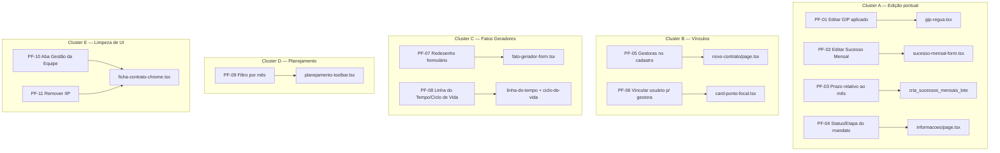

# Pente-Fino 2026-09 Design

**Spec**: `.specs/features/pente-fino-2026-09/spec.md`
**Status**: Draft

---

## Architecture Overview

Não é uma feature com arquitetura própria — é um lote de 11 correções pontuais
espalhadas por 5 telas/áreas já existentes. Cada cluster abaixo é
independente dos outros (podem ser implementados e commitados em qualquer
ordem); a única dependência real é dentro de cada cluster.



---

## Code Reuse Analysis

### Existing Components to Leverage

| Componente | Localização | Como usar |
| --- | --- | --- |
| `EmDesenvolvimento` | `src/frontend/components/app-shell/em-desenvolvimento.tsx` | Já usado por Diagnóstico; PF-10 reusa exatamente igual para a nova aba Gestão da Equipe |
| `CardPontoFocal` | `src/frontend/components/fundacao/card-ponto-focal.tsx` | PF-06 estende a seção "Gestoras" (linha 142) com o mesmo padrão de botão/Select que a seção "Ponto Focal" já usa (linha 96-139), mas multi-seleção |
| `VinculoForm` / `VinculoTable` | `src/frontend/components/fundacao/vinculo-form.tsx`, `vinculo-table.tsx` | PF-05 reusa o mesmo componente de seleção de pessoa por papel (já aceita `papel_no_contrato: "gestora"`) dentro do formulário de novo contrato |
| `vinculoSchema` | `src/backend/schemas/vinculo.ts` | PF-05/PF-06 — já valida `papel_no_contrato: "gestora"`, nenhuma mudança de schema necessária |
| `moverEtapaKanban` (RPC) | `src/backend/rpc/kanban.ts` | PF-04 — reusa para escrever a Etapa a partir da Ficha, mesma trilha que o Kanban já usa (garante estado único, sem campo duplicado) |
| `RouteTabs` / `todasAbas` | `src/frontend/components/produtos/ficha-contrato-chrome.tsx` | PF-10 — adiciona uma entrada `{ href: `${base}/equipe`, label: "Gestão da Equipe" }` |
| `sucesso-mensal-form.tsx` | `src/frontend/components/planejamento/` | PF-02 — já existe form de criação; PF-02 estende com um `modo: "editar"` no mesmo padrão de `VinculoFormModo` |
| `atualiza_sucessos_mensais_lote`, `cria_sucessos_mensais_lote` (RPC) | `src/backend/rpc/planejamento.ts` | PF-03 — a lógica de "prazo relativo ao mês" entra na função de banco `app.cria_sucessos_mensais_lote` (ou numa nova, ver Data Models) que já recebe a lista de meses |
| `PlanejamentoToolbar` (`busca`/`onBuscaChange`) | `src/frontend/components/planejamento/planejamento-toolbar.tsx` | PF-09 — mesmo padrão de estado controlado, adiciona `mes`/`onMesChange` |
| `iip-card.tsx`, uso em `ficha-contrato-chrome.tsx:108` | — | PF-11 — troca de componente no mesmo ponto de montagem |

### Integration Points

| Sistema | Método de integração |
| --- | --- |
| `fat_submissao` (GIP) | Hoje só recebe `INSERT` direto via PostgREST (`gip-regua.tsx:103`); PF-01 precisa que a mesma linha aceite `UPDATE` sob RLS, ver Data Models |
| `app.mover_etapa_kanban` (RPC `SECURITY INVOKER`) | PF-04 chama a mesma RPC que o Kanban já usa — nenhuma RPC nova para Etapa |
| `contrato.status` (coluna já existe, `ck_contrato_status`) | PF-04 — falta só o caminho de escrita a partir da Ficha (schema já valida) |
| `rel_usuario_contrato` | PF-05/PF-06 — mesmo insert usado por `VinculoForm` hoje, sem mudança de RLS (papel gestora já é aceito) |

---

## Components

### PF-01 — Edição de GIP aplicado

- **Purpose**: Permitir `UPDATE` nos dados de um momento de GIP já submetido.
- **Location**: `src/frontend/components/produtos/gip-regua.tsx` (linha ~60-66, hoje só mostra texto "já aplicado")
- **Interfaces**: novo caminho de escrita — `supabase.from("fat_submissao").update(...).eq(...)` no lugar do estado somente-leitura; reusa o mesmo formulário de preenchimento já montado, só troca o modo (leitura → edição) e o verbo (insert → update).
- **Dependencies**: RLS de `fat_submissao` precisa permitir `UPDATE` pelo mesmo papel que já tem `INSERT` (hoje provavelmente só permite `INSERT`, ver Risks & Concerns).
- **Reuses**: `formulario-gip-form.tsx` (campos), `ref_nivel_dimensao_gip` (descritores).

### PF-02 — Edição de Sucesso Mensal

- **Purpose**: Editar mês, data-limite e peso de um Sucesso Mensal já lançado.
- **Location**: `src/frontend/components/planejamento/sucesso-mensal-form.tsx`
- **Interfaces**: `atualizarSucessoMensal(client, { idSucesso, mes, dtLimite, peso }): Promise<void>` — nova função em `src/backend/rpc/planejamento.ts`, chamando uma RPC nova `app.atualiza_sucesso_mensal` (ver Data Models — as RPCs existentes só cobrem lote de `pct_atingimento` e criação, nenhuma edita mês/prazo/peso de uma linha já existente).
- **Dependencies**: nova migration.
- **Reuses**: mesmo padrão `VinculoFormModo` (`{tipo: "adicionar"} | {tipo: "editar", ...}`) já usado em `vinculo-form.tsx`.

### PF-03 — Prazo relativo ao mês

- **Purpose**: Ao criar Sucesso Mensal em lote (multi-mês), calcular a data-limite de cada instância relativa ao mês dela.
- **Location**: função de banco `app.cria_sucessos_mensais_lote` (chamada por `criarSucessosEmLote`, `src/backend/rpc/planejamento.ts:71`)
- **Interfaces**: sem mudança de assinatura no client — `base.dtLimite` hoje é tratado como data única fixa; a função de banco passa a interpretar o **dia** do prazo informado e aplicá-lo a cada mês de `p_meses`.
- **Dependencies**: migration alterando `app.cria_sucessos_mensais_lote`.
- **Reuses**: mesma RPC, mesmo client wrapper — é mudança de comportamento na função de banco, não de contrato.

### PF-04 — Status/Etapa do mandato na Ficha

- **Purpose**: Expor edição de `contrato.status` e da Etapa (via `mover_etapa_kanban`) na página de informações gerais.
- **Location**: `src/frontend/app/(app)/contratos/[id]/informacoes/page.tsx`
- **Interfaces**: reusa `moverEtapaKanban` (kanban.ts) sem mudança; novo `atualizarStatusContrato(client, idContrato, status, motivoEncerramento?)` em `src/backend/rpc/contrato.ts` (ou arquivo equivalente hoje inexistente — checar `queries/contrato.ts` no Tasks) respeitando `ck_contrato_motivo` (motivo obrigatório quando `status = 'nao_concluido'`).
- **Dependencies**: nenhuma migration certa ainda — `contrato.status` já existe; só falta confirmar se já existe RPC de update genérico de contrato reutilizável antes de criar um novo (verificar em Tasks).
- **Reuses**: `contratoSchema` (`src/backend/schemas/contrato.ts`), já valida o enum e o `refine` de motivo.

### PF-05 — Gestoras no cadastro de contrato

- **Purpose**: Selecionar gestoras já no formulário de novo contrato.
- **Location**: `src/frontend/app/(app)/produtos/[slug]/novo-contrato/`
- **Interfaces**: após criar o contrato, um loop de insert em `rel_usuario_contrato` (`papel_no_contrato: "gestora"`) por gestora selecionada — mesmo formato que `VinculoForm` já grava.
- **Dependencies**: nenhuma nova — schema e tabela já suportam.
- **Reuses**: `vinculoSchema`, seletor de usuário já usado em `vinculo-form.tsx`.

### PF-06 — Vincular usuário como gestora (Ficha)

- **Purpose**: Adicionar ação de vínculo na seção "Gestoras" do `CardPontoFocal`.
- **Location**: `src/frontend/components/fundacao/card-ponto-focal.tsx` (linha 142-155)
- **Interfaces**: mesma função de submit que "Ponto Focal" já usa, mas para lista (multi-seleção, não substituição de um único valor).
- **Dependencies**: nenhuma.
- **Reuses**: mesmo `Select` + botão "Vincular usuário" da seção acima, adaptado para adicionar à lista em vez de substituir um valor único.

### PF-07 — Redesenho do formulário de Fato Gerador

- **Purpose**: Corrigir sobreposição de campos, seguir os 2 frames do Figma.
- **Location**: `src/frontend/components/incidencia/fato-gerador-form.tsx`, `fato-gerador-wizard.tsx`
- **Interfaces**: sem mudança de contrato de dados — é CSS/layout.
- **Dependencies**: consultar os 2 frames via skill `figma-dominio-legisla` antes de tocar no JSX (vocabulário de campos/enums já é canônico ali — evita reinventar rótulo).
- **Reuses**: todos os campos e validações atuais do formulário.

### PF-08 — Linha do Tempo e Ciclo de Vida — ajustes de UI

- **Purpose**: Diferenciar visualmente "projetado", ação "marcar como realizado", KPIs no Ciclo de Vida, clique-para-detalhe, remover botão "Registrar Registro".
- **Location**: componentes da feature `fatos-geradores-ciclo-vida` (linha do tempo e ciclo de vida) — ver `.specs/features/fatos-geradores-ciclo-vida/design.md` para os componentes já existentes antes de recriar algo.
- **Interfaces**: reusa `RealizarFatoDialog` já citado no handoff de `fatos-geradores-ciclo-vida` (transição projetado→realizado) — o handoff registra que esse fluxo **existe** mas "sem teste de integração de UI acoplado a um consumidor real"; PF-08 é provavelmente esse consumidor real faltando, não uma feature nova.
- **Dependencies**: nenhuma óbvia — investigar em Tasks se KPIs do Ciclo de Vida já têm query pronta (`estrategia-kpi.ts`?) só sem consumidor na tela.
- **Reuses**: `RealizarFatoDialog`, padrão visual "projetado" já definido em algum lugar da Linha do Tempo (confirmar em Tasks se já existe e só falta propagar pro Ciclo de Vida, ou se não existe em nenhum dos dois).

### PF-09 — Filtro por mês no planejamento

- **Purpose**: Filtro por mês + coluna Mês em formato "Mês/Ano".
- **Location**: `src/frontend/components/planejamento/planejamento-toolbar.tsx`, `planejamento-grade.tsx`
- **Interfaces**: `mes: string | null`, `onMesChange(v: string | null)` — mesmo padrão de `busca`/`onBuscaChange`; formatação de coluna usa util de data já usado em outro lugar do app (confirmar utilitário existente em Tasks antes de criar um novo `formatarMesAno`).
- **Dependencies**: nenhuma.
- **Reuses**: `PlanejamentoGrade` já aplica os filtros vindos do toolbar (comentário linha 16) — só estende o predicado.

### PF-10 — Aba Gestão da Equipe

- **Purpose**: Nova aba com placeholder.
- **Location**: `src/frontend/components/produtos/ficha-contrato-chrome.tsx` (`todasAbas`), nova rota `src/frontend/app/(app)/contratos/[id]/equipe/page.tsx`
- **Interfaces**: página nova, uma linha (mesmo padrão de `diagnostico/page.tsx`).
- **Dependencies**: nenhuma.
- **Reuses**: `EmDesenvolvimento`.

### PF-11 — Remover IIP provisório

- **Purpose**: Tirar `IipCard` da ficha, trocar por link para a aba de Incidência + botão voltar.
- **Location**: `src/frontend/components/produtos/ficha-contrato-chrome.tsx:104-109`
- **Interfaces**: remove `<IipCard idContrato={idContrato} />`; adiciona `<Button asChild><Link href={`${base}/fatos-registros`}>Fatos Geradores e Registros</Link></Button>` + botão voltar para `/produtos/[slug]/estrategia/dashboard`.
- **Dependencies**: confirmar em Tasks se `IipCard`/`atualizaIipContrato`/`buscarIipContrato` ficam órfãos após a remoção (deletar código morto) ou se algum outro consumidor real ainda os usa (a busca do Design só achou este ponto de montagem).
- **Reuses**: nenhum componente novo.

---

## Data Models

### `app.atualiza_sucesso_mensal` (nova RPC, PF-02)

```sql
-- SECURITY INVOKER (AD-024). UPDATE de uma linha existente de sucesso mensal:
-- mes, dt_limite, peso. Não mexe em pct_atingimento (isso já é
-- atualiza_sucessos_mensais_lote) nem em status (deriva, não é setado aqui).
app.atualiza_sucesso_mensal(p_id_sucesso int, p_mes date, p_dt_limite date, p_peso numeric)
```

**Relationships**: opera sobre a mesma tabela que `cria_sucessos_mensais_lote` grava.

### `fat_submissao` — RLS `UPDATE` (PF-01)

Sem mudança de shape de tabela — é política de RLS nova (ou existente
ampliada) permitindo `UPDATE` na própria submissão já feita, pelo mesmo
critério de autoria/papel que hoje permite o `INSERT`. Confirmar em Tasks a
policy atual antes de escrever a migration (pode já existir e só não estar
sendo usada pelo front).

---

## Error Handling Strategy

| Cenário | Tratamento | Impacto no usuário |
| --- | --- | --- |
| RLS recusa `UPDATE` em `fat_submissao` (PF-01) sem a policy nova aplicada ainda | `mapeiaErroRpc`/erro do PostgREST já vira mensagem amigável no padrão atual do app | Toast de erro, edição não salva |
| `app.atualiza_sucesso_mensal` com `dt_limite` fora de faixa | Mesma validação Zod já usada no form de criação, reaplicada no form de edição | Erro inline no campo, sem round-trip ao banco |
| `contrato.status = 'nao_concluido'` sem motivo (PF-04) | `ck_contrato_motivo` já existe no banco; formulário reusa `contratoSchema.refine` para bloquear antes do submit | Campo "Motivo" fica obrigatório na UI quando status = Não Concluído |
| Vínculo duplicado de gestora (PF-05/PF-06) | Mesma constraint de unicidade que `VinculoForm` já respeita hoje | Erro amigável "já vinculada", sem duplicar badge |

---

## Risks & Concerns

| Concern | Location | Impact | Mitigation |
| --- | --- | --- | --- |
| PF-01 reverte, só neste ponto, uma decisão de integridade deliberada (FMC-27 AC7) | `gip-regua.tsx:60-66`, `.specs/STATE.md` AD-063 | Qualquer feature futura que trate `fat_submissao` como snapshot imutável de um momento aplicado passa a estar errada | Registrado como AD-063 (supersede parcial) — próxima feature que leia GIP precisa checar AD-063 antes de assumir imutabilidade |
| PF-11 remove `IipCard` — mas isso é a entrega literal de uma feature já commitada (`incidencia-encontros`, INC-04..INC-08) 3 semanas atrás | `iip-card.tsx`, `AD-005` sobre `iip_provisorio` | Remover pode deixar `atualizaIipContrato`/`buscarIipContrato`/`mv_iip_contrato` órfãos, ou uma feature futura de "Saída" (AD-015/AD-056, adiada não cancelada) pode precisar reaproveitar essa leitura | Tasks deve confirmar se `mv_iip_contrato`/`vw_iip_contrato` têm outro consumidor antes de tratar como dead code — se não tiverem, documentar a remoção no handoff para quando a feature de Saída retomar o indicador definitivo |
| PF-08 pode estar pedindo algo que já existe parcialmente (`RealizarFatoDialog` citado como não-testado, não como inexistente) | `.specs/STATE.md`, handoff `fatos-geradores-ciclo-vida` | Risco de reimplementar em vez de conectar/testar o que já existe | Tasks abre com uma leitura de `.specs/features/fatos-geradores-ciclo-vida/design.md` antes de qualquer código novo em PF-08 |
| PF-04 pode já ter um caminho de escrita para `contrato.status` que este design não achou (busca cobriu `rpc/` e `queries/` só por nome de arquivo, não findou RPC genérica de update de contrato) | `src/backend/queries/contrato.ts`, `src/backend/rpc/` | Criar RPC nova quando já existe uma seria retrabalho e duas fontes de verdade | Tasks confirma com leitura completa de `contrato.ts`/`ficha-mandato.ts` antes de escrever migration nova |
| PF-09 formatação "Mês/Ano" — nenhum utilitário `formatarMesAno` confirmado no design | `src/frontend/components/planejamento/` | Risco de duplicar um formatter de data já existente em outro lugar do app | Tasks faz `grep` por formatters de mês/ano existentes (`Intl.DateTimeFormat`, `date-fns`?) antes de criar um novo |

---

## Tech Decisions (only non-obvious ones)

| Decisão | Escolha | Racional |
| --- | --- | --- |
| PF-01 é `UPDATE` em `fat_submissao`, nunca um segundo `INSERT` | Reaproveita a linha existente | Preserva `uq_gip_contrato_momento` intocada — ver AD-063 |
| PF-11 vira link para a aba, não formulário inline | Um botão leva para `/contratos/[id]/fatos-registros` | Mantém AD-057 (único ponto de escrita); resolve o incômodo real (card provisório sem dado) sem reabrir 2 pontos de criação |
| PF-03 muda a função de banco `cria_sucessos_mensais_lote`, não o client | Lógica de "dia do prazo relativo ao mês" fica no banco | É onde o loop por mês já acontece (`p_meses`); replicar no client duplicaria a regra |
| PF-10 vira aba nova, não aviso dentro de rota inexistente | Cria `/contratos/[id]/equipe` + entrada em `todasAbas` | Sem isso, "Gestão da Equipe" não tem onde o aviso aparecer — o item original assumia que a aba já existia |

> Nenhuma dessas decisões cria convenção de projeto nova além da já registrada
> em AD-063 — as demais são escolhas locais desta feature de manutenção.
