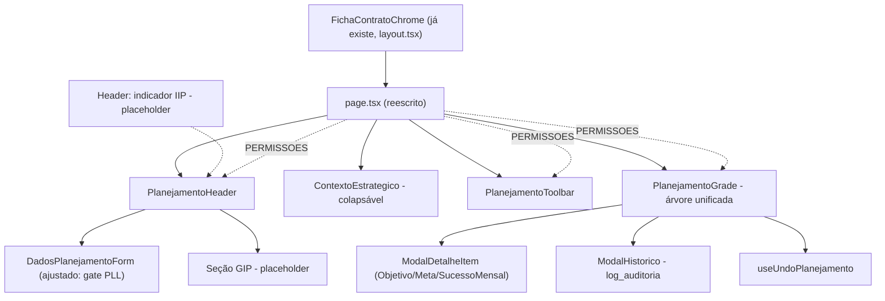

# Planejamento Estratégico — Redesenho da Tela — Design

**Spec**: `.specs/features/planejamento-estrategico-redesenho/spec.md`
**Context**: `.specs/features/planejamento-estrategico-redesenho/context.md`
**Status**: Approved (decisões de escopo confirmadas por Pedro; D-C/D-D com default documentado,
não confirmados — ver `context.md`)

---

## Achado de Design — o que já existe cobre mais do que parecia

`planejamento-planilha-monitoramento` já resolveu RLS/GRANT/RPC/cascata das 4 tabelas
(`fat_objetivo_especifico`/`fat_meta`/`fat_sucesso_mensal`/`rel_planejamento_preditor`) e
`dim_planejamento`. Este redesenho **não toca nenhuma migration daquela feature** — é 100%
frontend + 1 query de leitura nova (histórico de auditoria). Nenhuma tabela nova, nenhum RPC novo
(undo reaproveita os mesmos caminhos de escrita já existentes: `UPDATE` direto e
`app.atualiza_sucessos_mensais_lote`).

`FichaContratoChrome` (`src/frontend/components/produtos/ficha-contrato-chrome.tsx`), que já
envolve **toda** sub-rota de `/contratos/[id]/*` via `layout.tsx`, já renderiza um h1 (nome do
contratante) + subtítulo (produto/cargo/partido/UF ou projeto de origem) + `RouteTabs`, comuns a
todas as abas (Informações Gerais/Etapas/Assessores/Formulários). **Decisão de escopo**: o cabeçalho
novo desta feature (zona 0 do pedido original) renderiza **dentro** de `children`, abaixo do que o
chrome já mostra — não duplica "Carteira › Mandato › Contrato" (o chrome já ancora essa identidade
para todas as abas da ficha); adiciona só o que é específico do Planejamento: h1=`objetivo_ano`,
chips, indicadores, faixa de recálculo. Mexer no `FichaContratoChrome` compartilhado por 4 outras
abas para construir um breadcrumb completo novo é fora de escopo deste redesenho — risco desproporcional
ao pedido (mudaria a experiência de Informações Gerais/Etapas/Assessores/Formulários também).
Registrado aqui como interpretação, não como corte de requisito: PLR-02 é satisfeito com um breadcrumb
curto ("… › Planejamento", complementando o que o chrome já mostra), não uma reconstrução do trail
inteiro.

---

## Architecture Overview



`PERMISSOES` é lido uma vez no `page.tsx` (a partir de `usePapelGlobal`) e passado como prop para
`PlanejamentoHeader`/`ContextoEstrategico`/`PlanejamentoToolbar`/`PlanejamentoGrade` — nenhum desses
componentes chama `usePapelGlobal()` por conta própria (hoje `planejamento-arvore.tsx` chama, e é
exatamente a fonte da checagem espalhada que PLR-07 corrige).

---

## `PERMISSOES` — fonte única de verdade

```typescript
// src/frontend/components/planejamento/permissoes.ts

export type PapelPlanejamento = "gestora" | "mentor" | "assessor" | "admin";
export type ModoPlanejamento = "construir" | "monitorar" | "ler";

export interface PermissoesModo {
  modosDisponiveis: ModoPlanejamento[];
  modoPadrao: ModoPlanejamento;
  crudHierarquia: boolean;          // criar/editar Objetivo/Meta (modal)
  editaPctTodasAsMetas: boolean;    // Mentor/Gestora/Admin: qualquer Meta da carteira/contrato
  editaPctSóMetasProprias: boolean; // Assessor: só fat_meta.id_usuario_responsavel = auth.uid()
  veIip: boolean;                  // placeholder enquanto incidencia-encontros não conclui
  veIncidencia: boolean;            // idem
  veAuditoria: boolean;
  veColunaResponsavel: boolean;
}

export const PERMISSOES: Record<PapelPlanejamento, PermissoesModo> = {
  gestora:  { modosDisponiveis: ["construir","monitorar","ler"], modoPadrao: "monitorar",
              crudHierarquia: true,  editaPctTodasAsMetas: true,  editaPctSóMetasProprias: false,
              veIip: true, veIncidencia: true, veAuditoria: true, veColunaResponsavel: true },
  mentor:   { modosDisponiveis: ["monitorar","ler"], modoPadrao: "monitorar",
              crudHierarquia: false, editaPctTodasAsMetas: true,  editaPctSóMetasProprias: false,
              veIip: true, veIncidencia: true, veAuditoria: false, veColunaResponsavel: true },
  assessor: { modosDisponiveis: ["monitorar"], modoPadrao: "monitorar",
              crudHierarquia: false, editaPctTodasAsMetas: false, editaPctSóMetasProprias: true,
              veIip: false, veIncidencia: false, veAuditoria: false, veColunaResponsavel: false },
  admin:    { modosDisponiveis: ["construir","monitorar","ler"], modoPadrao: "monitorar",
              crudHierarquia: true,  editaPctTodasAsMetas: true,  editaPctSóMetasProprias: false,
              veIip: true, veIncidencia: true, veAuditoria: true, veColunaResponsavel: true },
};

// veIip/veIncidencia ficam true no objeto (é o alvo final, já confirmado pelo GRANT aprovado —
// AD-008), mas os componentes que os consomem (indicador de IIP no header, contador de incidência
// na Meta) renderizam placeholder fixo "em desenvolvimento" nesta feature, independente do valor
// aqui — ver ContextoEstrategico/PlanejamentoHeader. Quando incidencia-encontros/formularios-produto
// concluírem, só o componente de leitura muda, não este objeto.
```

Nenhum componente abaixo checa `papel === "..."` diretamente — todos recebem `permissoes:
PermissoesModo` (e, quando precisam saber o papel bruto só para exibição, ex. faixa "Interno
Legisla" no modo Ler, recebem `papel: PapelPlanejamento` também, mas nunca decidem capacidade a
partir dele).

**Coluna de matriz modo → colunas visíveis** (do pedido original, reproduzida literalmente — não
reinventada):

| Coluna | Construir | Monitorar | Ler |
| --- | :-: | :-: | :-: |
| Árvore (descrição) | ✓ | ✓ | ✓ |
| Preditor 1º | ✓ | | |
| Preditor 2º (oculto se produto=PLL) | ✓ | | |
| Agenda temática | ✓ | | |
| Prioridade | ✓ | | |
| Classe | ✓ | | |
| Responsável (oculto p/ Assessor) | ✓ | ✓ | ✓ |
| Data limite | | ✓ | |
| Mês (Construir) / uma coluna por mês do ciclo (Ler) | ✓ | | ✓ |
| Peso | ✓ | ✓ | ✓ |
| % Atingimento | (via modal) | ✓ editável (só SM) | ✓ leitura |
| Situação | | ✓ | ✓ |

Construir tem `min-width` = soma das colunas (rolagem horizontal aceitável, é grade de digitação).
Monitorar/Ler cabem sem rolagem — menos colunas.

---

## Components

### `PlanejamentoHeader` (PLR-02, PLR-03, PLR-04)

- **Location**: `src/frontend/components/planejamento/planejamento-header.tsx`
- **Props**: `{ planejamento, contrato, etapaAtual: EtapaResumo | null, permissoes, onRecalcular }`
- **Conteúdo**: breadcrumb curto ("… › Planejamento", ver "Achado de Design" acima); h1 =
  `planejamento.objetivoAno ?? "Planejamento Estratégico"` (fallback para nunca ficar vazio); chips
  (produto — já em `contrato.nomeProduto`; projeto — `contrato.nomeProjetoOrigem` quando coalizão,
  N/A quando mandato **[verificar em Tasks se contrato de mandato carrega projeto — se não, chip
  fica ausente, não "—", regra AD-005]**; coalizão — só quando `tipoContratante==='coalizao'`;
  etapa atual + mês do ciclo + atraso — de `etapaAtual` via `vw_etapa_contrato`, que
  `buscarEtapasDoProduto`/`buscarReguaDoContrato` já leem em `queries/etapa-contrato.ts`, **reaproveitado**,
  não reconsultado do zero); 3 indicadores (% planejamento com barra + `n/N` — `n` = SMs do ciclo
  corrente com `pctAtingimento != null`, `N` = total; IIP — placeholder fixo `"IIP: em
  desenvolvimento"` quando `permissoes.veIip`, ausente quando não; cobertura `n/N` reaproveita o
  mesmo cálculo do indicador de %).
- **Faixa de recálculo** (PLR-04, regra inegociável §4 do pedido original): renderiza só quando
  `planejamento.atingimentoDesatualizado === true` (campo já existe em `PlanejamentoCompleto`? —
  **verificar em Tasks**: se a interface hoje não expõe esse campo, `buscarPlanejamentoCompleto`
  ganha 1 coluna a mais na projeção, sem migration). Botão "Recalcular agora" chama
  `onRecalcular` (que no `page.tsx` chama `recalcularAtingimento` + refetch) — substitui a chamada
  automática e silenciosa de hoje (`idPlanejamentoRecalculadoRef`, `page.tsx:117-123`, **removida**).

### `ContextoEstrategico` (PLR-05, PLR-06)

- **Location**: `src/frontend/components/planejamento/contexto-estrategico.tsx`
- **Props**: `{ planejamento, preditoresAtuais, produtoNome, permissoes, colapsado, onToggle,
  children_dados_form }`
- Coluna esquerda colapsável (~220–240px; botão de colapsar; `<1024px` vira accordion acima da
  grade — usa `useMediaQuery`-lite via `matchMedia` ou classe Tailwind responsiva, sem lib nova).
  Conteúdo: `legado`/`analiseConjuntura` (leitura, com botão "Editar dados do Planejamento" que abre
  `DadosPlanejamentoForm` — mesma UI de hoje, só realocada); `perfilAtuacao` **só quando
  `produtoNome === "PLL"`** (gate que falta hoje — `dados-planejamento-form.tsx` mostra sempre,
  corrigido nesta feature); preditores prioritários em ordem (já existe,
  `buscarPreditoresPlanejamento`); seção GIP com `EstadoVazio`/texto fixo "Em desenvolvimento — a
  régua × onde chegamos aparece aqui quando a feature de Formulários concluir o GIP" (placeholder,
  PLR-06).

### `PlanejamentoToolbar` (PLR-11)

- **Location**: `src/frontend/components/planejamento/planejamento-toolbar.tsx`
- **Props**: `{ permissoes, busca, onBusca, soMinhasMetas, onSoMinhasMetas, soPendentes,
  onSoPendentes, onExpandirTudo, onRecolherTudo, onCriarObjetivo, celulasMarcadas: Set<number>,
  onAplicarEmMassa }`
- "Só as minhas metas": visível só para `assessor`/`mentor` (Gestora/Admin já veem a carteira
  inteira por padrão — filtro não faz sentido pra eles neste toolbar; se Pedro quiser diferente, é
  1 linha de condição). Precisa de `idUsuario` do usuário logado — ver nota de coordenação abaixo.
- "Só pendentes": filtra linhas de SM com `pctAtingimento == null` (client-side, sobre `linhas` já
  carregadas — sem query nova).
- "Aplicar % em massa": habilitado só quando `celulasMarcadas.size > 0` (populado pelo
  shift+clique da grade, PLR-17); abre um input inline/popover pedindo o valor, chama
  `onAplicarEmMassa(valor)` que delega ao mesmo caminho de `onColarFaixa` (RPC de lote já existente).
- "Criar Objetivo": só quando `permissoes.crudHierarquia && modoAtual === 'construir'`.

**Nota de coordenação**: `usePapelGlobal` (`src/frontend/hooks/use-papel-global.ts`) hoje só
devolve `papel`. `idUsuario` é necessário para "só minhas metas" (comparar com
`fat_meta.idUsuarioResponsavel`). `.specs/features/incidencia-encontros/tasks.md` (T17, ainda
pendente naquela feature) já planeja estender exatamente este hook com `idUsuario`. **Antes de
tocar este arquivo**: rodar `git log -1 -- src/frontend/hooks/use-papel-global.ts` — se T17 já
aplicou a extensão, só consumir `idUsuario` do hook; se não, esta feature adiciona (sem duplicar
hook novo), documentando a extensão aqui para quem chegar depois não duplicar de novo.

### `PlanejamentoGrade` (PLR-09, PLR-10, PLR-15 a PLR-19) — substitui `planejamento-arvore.tsx`

- **Location**: `src/frontend/components/planejamento/planejamento-grade.tsx`
- **Reaproveita integralmente**: `@tanstack/react-table` v9 (`useTable`/`tableFeatures`, mesmo
  padrão de `planejamento-arvore.tsx`), a lógica de agrupamento por Meta/Objetivo, o cálculo de
  `idsMetaComPesoDivergente`, a ordem visual para paste (`ordemVisual`).
- **O que muda**: em vez de `<div>` por Objetivo/Meta com um `<Table>` só para SM aninhado, monta
  **uma única `useTable`** cujo `data` é a lista achatada (`flatMap`) de linhas com um discriminador
  `tipo: "obj" | "meta" | "sm"` e `nivel: number` (indentação), estado de expandido/recolhido por
  `id` mantido num `Set` (mesmo padrão de `aberto`/`setAberto` de hoje, só que centralizado em vez
  de local a cada `<NoMeta>`/`<NoObjetivo>`). Colunas visíveis vêm da matriz modo→coluna acima
  (`design.md`), computadas por `columnHelper.columns([...])` condicional a `modo`.
- **Célula calculada** (PLR-10): `<span tabIndex={-1} aria-readonly className="bg-[repeating-linear-gradient(...)] ...">`
  — fundo hachurado real (CSS `repeating-linear-gradient`, não só cor sólida), marcador textual
  `fx` antes do valor (ex. `fx 42%`), sem `onClick`/`onFocus` nenhum. Célula editável (SM %) mantém
  borda + fundo de campo visível em repouso (já é o caso hoje, `CelulaPct`, `border-input`).
- **Teclado** (PLR-15): `onKeyDown` no `<input>` de célula — `Enter`/`ArrowDown` → foca o próximo
  input de célula editável na ordem visual (reaproveita `ordemVisual`, já existe); `ArrowUp` →
  anterior; `Escape` → restaura `defaultValue` sem commitar (novo: hoje só `onBlur` comita, não há
  cancelamento); `Home`/`End` → primeiro/último input editável **da mesma linha visual** (linha de
  SM tem só 1 célula editável hoje — `Home`/`End` ficam sem efeito prático até a grade ganhar mais
  de 1 coluna editável por linha, ex. em Construir; implementado de forma genérica desde já, não
  gated por modo).
- **Colar em faixa** (PLR-16): estende `validaPct`/parsing — nova função utilitária compartilhada
  `normalizaEntradaPct(texto: string): number | null` em `src/frontend/lib/planejamento-formato.ts`
  (`texto.trim().replace(",", ".").replace("%", "")`, então mesma validação 0–100). Usada tanto no
  commit de célula única quanto no split de faixa colada.
- **Edição em massa** (PLR-17): `shift+click` no `<input>`/célula adiciona/remove `idSucesso` de um
  `Set<number>` de selecionados (estado local da grade, exposto via callback pro toolbar
  `onSelecaoMudou`); aplicar em massa reusa o mesmo `app.atualiza_sucessos_mensais_lote` (RPC já
  existente) com a lista de `{idSucesso, pctAtingimento: valorAplicado}` para todos os selecionados.
- **Undo** (PLR-18): ver `useUndoPlanejamento` abaixo.
- **Modais**: duplo clique na linha (ou botão "⋯" no fim dela) abre `ModalDetalheItem`; ícone
  discreto abre `ModalHistorico` (só quando `permissoes.veAuditoria`).

### `useUndoPlanejamento` (PLR-18, D-D)

- **Location**: `src/frontend/components/planejamento/use-undo-planejamento.ts`
- **Assinatura**: `function useUndoPlanejamento(): { empilhar: (entrada: EntradaUndo) => void,
  desfazer: () => Promise<void>, temHistorico: boolean }`, onde `EntradaUndo = { idSucesso: number,
  valorAnterior: number | null, valorNovo: number }`.
- Pilha em `useRef<EntradaUndo[]>([])` (sessão do componente — perde ao sair da tela, aceitável:
  não há requisito de undo persistente entre sessões). `Ctrl+Z` (listener no container da grade,
  `document`-level dentro de um `useEffect` da própria `PlanejamentoGrade`) chama `desfazer()`, que
  faz `pop()` e reescreve `valorAnterior` pelo **mesmo caminho de escrita já usado** (`onEdicaoCelula`
  se veio de célula única, `onColarFaixa`/lote se veio de faixa ou massa — o tipo de escrita
  original viaja na própria `EntradaUndo`). `// TODO(D-D)`: mecanismo aceito como default, não
  confirmado por Pedro — ver `context.md`.
- **Não decrementa nem reescreve `log_auditoria`** — a reescrita gera uma nova linha de auditoria
  automaticamente via `app.trg_auditoria()` (já conectado), preservando o histórico completo
  (AD-006, append-only).

### `ModalDetalheItem` (PLR-12, PLR-14)

- **Location**: `src/frontend/components/planejamento/modal-detalhe-item.tsx`
- Envolve `ObjetivoForm`/`MetaForm`/`SucessoMensalForm` (já existem, sem mudança de schema/props
  relevante — só o `onCancelar` passa a fechar o `Dialog` em vez de colapsar um `<div>` inline) num
  `<Dialog>` do shadcn (`components/ui/dialog.tsx`, já usado em `usuarios/page.tsx`/convite — Radix
  já garante Esc/foco/`role="dialog"`/`aria-modal` de graça, sem código novo). Um `useState<{tipo,
  item} | null>` no componente pai (`PlanejamentoGrade`) garante nunca mais de 1 modal aberto por
  vez (PLR-14, "nunca empilhar").

### `ModalHistorico` (PLR-13, PLR-14)

- **Location**: `src/frontend/components/planejamento/modal-historico.tsx`
- **Backend novo**: `buscarHistoricoAuditoria(client, tabela: string, idRegistro: number):
  Promise<HistoricoAuditoria[]>` em `src/backend/queries/planejamento.ts` — `SELECT` em
  `log_auditoria` filtrado por `tabela`/`id_registro` (nomes de coluna a confirmar em Tasks contra
  o schema real de `log_auditoria`, `docs/schema_sistema.sql:346-360`), ordenado por `criado_em
  DESC`. Mesmo padrão de `queries/etapa-contrato.ts` (view-model camelCase, `if (!data) return []`).
  **Nenhuma tabela/RLS nova** — `log_auditoria` e a RLS que já a protege existem desde a Fundação.

---

## Data / Queries — mudanças em `src/backend/queries/planejamento.ts`

| Função | Mudança |
| --- | --- |
| `buscarPlanejamentoCompleto` | Garantir que a projeção inclui `atingimentoDesatualizado` (para a faixa de recálculo, PLR-04) — hoje pode já vir e só não ser consumida; **confirmar em Tasks** lendo o arquivo atual antes de assumir. |
| `buscarGradeSucessosMensais` | D-C: parâmetro `mesReferencia` passa a ser opcional/removido — busca todos os SM do ciclo das Metas informadas, com `dtLimite` já presente na interface (`SucessoMensalGrade.dtLimite` já existe, só não é usada hoje para escopo). `// TODO(D-C)` no comentário da função. |
| `buscarHistoricoAuditoria` (nova) | Ver `ModalHistorico` acima. |

Nenhuma mudança em `src/backend/rpc/planejamento.ts` (undo/massa reaproveitam
`atualizarSucessosEmLote`/`recalcularAtingimento` como estão) nem em `src/backend/schemas/planejamento.ts`.

---

## `page.tsx` — recomposição

`src/frontend/app/(app)/contratos/[id]/planejamento/page.tsx` reescrito para:
1. Ler `permissoes = PERMISSOES[papel ?? "assessor"]` uma vez (fallback conservador enquanto
   `papel` carrega — nunca renderiza CRUD antes de saber o papel real).
2. Remover a chamada automática de `recalcularAtingimento` no `useEffect` (linhas 117-123 hoje) —
   vira `onRecalcular` passado ao `PlanejamentoHeader`, disparado só por clique.
3. Compor `PlanejamentoHeader` + layout 2 colunas (`ContextoEstrategico` + `PlanejamentoToolbar` +
   `PlanejamentoGrade`) no lugar do `<div className="grid gap-8">` atual.
4. Estado de modo (`useState<ModoPlanejamento>(permissoes.modoPadrao)`), com os botões de modo não
   presentes em `permissoes.modosDisponiveis` renderizados `disabled`, não omitidos (regra do
   pedido original — "modos não permitidos ficam desabilitados, não escondidos").
5. `PlanejamentoAgregadoCoalizao` passa a reusar `PlanejamentoGrade` (com `somenteLeitura`) no lugar
   de `PlanejamentoArvore` — mesmo ponto de reuso de hoje, só troca o componente de destino.

`planejamento-arvore.tsx` é removido depois que `PlanejamentoGrade` cobre os dois consumidores
(`page.tsx` e `planejamento-agregado-coalizao.tsx`) — nunca os dois componentes coexistindo como
fonte de verdade da árvore.

---

## Error Handling / Testing Strategy

Herda integralmente de `planejamento-planilha-monitoramento/design.md` (mesmos códigos de erro,
mesmo `mapeiaErroRpc`, nenhuma constraint nova). Testes novos desta feature:
- **Unit**: `permissoes.test.ts` (matriz papel×modo, nenhuma combinação fora da tabela);
  `planejamento-formato.test.ts` (`normalizaEntradaPct` — vírgula, ponto, `%`, valores inválidos);
  `queries/planejamento.test.ts` estendido (`buscarHistoricoAuditoria`, `buscarGradeSucessosMensais`
  sem filtro de mês).
- **Componente/hook**: sem harness no projeto (débito conhecido L-006/L-007) — `useUndoPlanejamento`/
  `PlanejamentoGrade`/modais verificados por `npm run build && npm run lint:all` + inspeção de
  código, mesmo padrão de toda feature de UI anterior.
- **UAT manual recomendado** (mesma categoria de risco de adoção da AD-028): tabulação entre
  células, colar de faixa com vírgula/`%`, shift+clique em massa, `Ctrl+Z` — nenhum harness
  automatizado cobre interação de teclado/mouse de verdade.

## Non-Goals (reafirmados)

GIP funcional, IIP funcional, contador/modal de incidência funcional, papel `legisla`, impersonation
de Admin, mudança de fórmula da cascata (D-B), migração de `app.recalcula_atingimento`,
`vw_pendencias`, qualquer tabela/RLS/GRANT nova.
