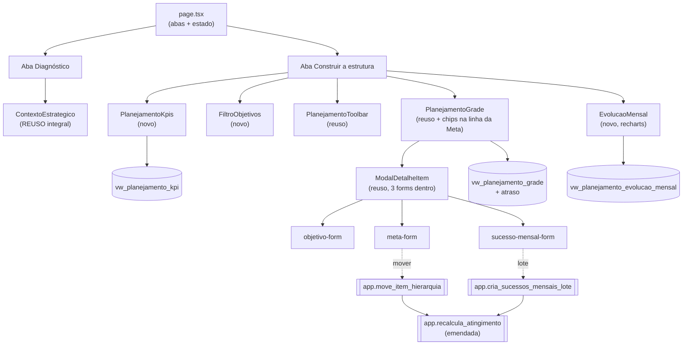

# Planejamento Estratégico v2 Design

**Spec**: `.specs/features/planejamento-estrategico-v2/spec.md`
**Context**: `.specs/features/planejamento-estrategico-v2/context.md`
**Status**: Draft
**Abordagem escolhida** (Pedro, 2026-09-15): **evoluir no lugar**, extraindo o
que é novo como módulos puros testados. Não reescrever `planejamento-grade.tsx`.

---

## Architecture Overview

A tela ganha uma camada de **abas** acima do que já existe. A aba
*Diagnóstico* reaproveita `ContextoEstrategico` inteiro; a aba *Construir a
estrutura* mantém `PlanejamentoGrade` no miolo e acrescenta faixa de KPIs,
cartões de filtro por Objetivo e gráfico de evolução ao redor.



**Princípio que organiza tudo:** nenhum número de gestão é somado no cliente
(AD-003). KPIs, séries do gráfico e atraso saem de view; o cliente só formata.

---

## Code Reuse Analysis

### Componentes aproveitados sem alteração

| Componente | Local | Como usar |
| --- | --- | --- |
| `ContextoEstrategico` | `components/planejamento/contexto-estrategico.tsx` | Vira o conteúdo inteiro da aba Diagnóstico. Hoje é `<details>` colapsável na coluna esquerda; passa a render direto. Os 3 cartões do mockup são os 3 campos que ele já edita |
| `DadosPlanejamentoForm` | `components/planejamento/dados-planejamento-form.tsx` | Já gateia Perfil de atuação a PLL (`:161-189`) — exatamente o comportamento que PLV-14 AC2 exige. Nada a mudar |
| `PERMISSOES` | `components/planejamento/permissoes.ts` | Fonte única de papel×modo. Ganha **2 capacidades** novas (ver Componentes) |
| `ModalDetalheItem` | `components/planejamento/modal-detalhe-item.tsx` | Envelope dos 3 forms; já resolve Esc/foco/aria via Radix `Dialog` (PLV-04 AC8 sai de graça) |
| `PlanejamentoToolbar` | `components/planejamento/planejamento-toolbar.tsx` | Busca, filtros, aplicar % em massa — inalterada |
| `normalizaEntradaPct` | `components/planejamento/planejamento-formato.ts` | Colar com vírgula/`%` (Edge Case). Já testado, 11 casos |
| `ui/chart.tsx` + `recharts@3.8` | `components/ui/` | **Já são dependência.** O gráfico não traz pacote novo |
| `ErroInline` | `components/ui/erro-inline.tsx` | Erro de RLS (L-008 — lição que já cobrou esse ponto uma vez) |
| `atualizarSucessosEmLote` | `rpc/planejamento.ts:49` | Precedente direto do padrão de escrita em lote via RPC |

### Pontos de integração

| Sistema | Como conecta |
| --- | --- |
| `app.recalcula_atingimento` | **Emendada** (AD-052): filtro `status='ativo'` no nível raiz. Única mudança autorizada na função |
| `log_auditoria` | Já conectado às 5 tabelas por trigger; as colunas novas entram sem trabalho extra |
| RLS | Colunas novas em tabelas existentes herdam a política. **Nenhuma tabela nova** nesta feature — AD-001 não é acionada |
| `dim_planejamento` | Aba Diagnóstico lê/escreve os 3 campos que já existem |

---

## Components

### `PlanejamentoAbas` (novo)
- **Purpose**: alterna Diagnóstico ↔ Construir a estrutura, preservando a aba na navegação.
- **Location**: `src/frontend/components/planejamento/planejamento-abas.tsx`
- **Interfaces**: `{ abaAtiva: AbaPlanejamento; onTrocar(aba): void }`
- **Dependencies**: nenhuma além de `cn`
- **Reuses**: padrão de abas já usado em `ficha-contrato-chrome.tsx`

### `PlanejamentoKpis` (novo)
- **Purpose**: os 4 cartões de topo.
- **Location**: `components/planejamento/planejamento-kpis.tsx`
- **Interfaces**: `{ kpis: PlanejamentoKpi | null; carregando: boolean }`
- **Nota**: KPI de Fatos Geradores fica **placeholder** até
  `fatos-geradores-ciclo-vida` concluir — mesmo padrão que o IIP já usa hoje.
  Vazio é `—`, nunca `0` (PLV-11 AC4).

### `FiltroObjetivos` (novo)
- **Purpose**: cartões de Objetivo com % que filtram a árvore.
- **Location**: `components/planejamento/filtro-objetivos.tsx`
- **Interfaces**: `{ objetivos: ObjetivoResumo[]; idSelecionado: number | null; onSelecionar(id): void }`
- **Reuses**: `pct_atingimento` já vem de `buscarPlanejamentoCompleto`

### `EvolucaoMensal` (novo)
- **Purpose**: curvas Esperado × Atingido + leitura do avanço do mês.
- **Location**: `components/planejamento/evolucao-mensal.tsx`
- **Interfaces**: `{ serie: LinhaEvolucaoMensal[]; idResponsavel: number | null; onFiltrar(id): void }`
- **Reuses**: `ui/chart.tsx`, `recharts`
- **Regra**: o componente **não calcula** — recebe a série pronta da view e o
  avanço já derivado por `calculaAvancoMensal` (módulo puro).

### Módulos puros novos (o coração testável)

| Módulo | Local | Responsabilidade |
| --- | --- | --- |
| `planejamento-series.ts` | `components/planejamento/` | `calculaAvancoMensal(serie)` → delta mês a mês. A view entrega o acumulado; o delta é aritmética pura, testável sem banco |
| `planejamento-lote.ts` | `components/planejamento/` | `expandeMesesEmSucessos(base, meses[])` → N payloads irmãos. É o coração de PLV-06 |
| `planejamento-responsavel.ts` | `components/planejamento/` | `resolveResponsavel(sm, meta)` → `{ pessoa, herdado }`. Cobre os 4 casos de PLV-03 (próprio / herdado / nenhum / sem vínculo) |

> Estes três existem para que a regra tenha teste unitário além do teste de
> render exigido por AD-042 — não para substituí-lo.

### `permissoes.ts` — 1 capacidade nova

```ts
moveHierarquia: boolean;    // PLV-09 — só quem tem crudHierarquia
```

> `reordenaItens` foi removida em 2026-09-16 junto com PLV-10.

Mantém a regra de PLR-07: nenhum componente checa `papel === "..."` direto.

---

## Data Models

### Migrations (forward-only, criadas com `supabase migration new`)

| # | Arquivo (sufixo) | Conteúdo |
| --- | --- | --- |
| 1 | `planejamento_v2_objetivo_status` | `ALTER TABLE fat_objetivo_especifico ADD COLUMN status TEXT NOT NULL DEFAULT 'ativo'` + `ck_objetivo_status CHECK (status IN ('ativo','pausado','descartado'))` |
| 2 | `planejamento_v2_cascata_status_objetivo` | `CREATE OR REPLACE FUNCTION app.recalcula_atingimento` com `AND o.status = 'ativo'` no nível raiz (AD-052) |
| 3 | `planejamento_v2_sucesso_responsavel` | `ADD COLUMN id_usuario_responsavel BIGINT REFERENCES dim_usuario`. **Sem `ordem`** — cortada em 2026-09-16 com PLV-10; coluna sem consumidor não entra, porque forward-only só a removeria com outro arquivo |
| 4 | `planejamento_v2_views_kpi_evolucao` | `vw_planejamento_kpi`, `vw_planejamento_evolucao_mensal`, atraso na view de grade |
| 5 | `planejamento_v2_rpc_lote_e_mover` | `app.cria_sucessos_mensais_lote`, `app.move_item_hierarquia` |

**Ordem importa**: 2 depende de 1; 4 depende de 3 (a série filtra por responsável).

### `vw_planejamento_evolucao_mensal` — a definição que PLV-13 exige

```sql
-- P = soma dos pesos dos SM de Metas ATIVAS do plano.
-- Esperado(M)  = Σ peso            dos SM com mes_referencia <= M  / P * 100
-- Atingido(M)  = Σ peso*pct/100    dos SM com mes_referencia <= M  / P * 100
-- Acumulado por mês via window function; o delta do mês sai no cliente
-- (calculaAvancoMensal), porque é subtração de dois pontos já retornados.
```

Pontos que a view precisa acertar, cada um amarrado a uma AC:

- **Metas não-ativas fora** (PLV-13 AC4) — `JOIN fat_meta ... WHERE status='ativa'`,
  coerente com o nível 2 da cascata.
- **`pct` nulo conta 0** (AC6) — `COALESCE(pct_atingimento, 0)`, o mesmo
  `COALESCE` que a cascata aprovada já usa. Não inventar regra nova.
- **`P = 0` não vira linha em 0%** (AC7) — `CASE WHEN SUM(peso) > 0` devolvendo
  `NULL`, espelhando `app.recalcula_atingimento`. A tela trata `NULL` como
  estado vazio.
- **Filtro por responsável** (AC5) — parâmetro, com `P` recalculado sobre o
  subconjunto. Como é view, vira `vw_` + filtro no `select`, não função.

### RPCs (AD-024 — `SECURITY INVOKER`, nunca `service_role`)

| Função | Por que precisa ser RPC |
| --- | --- |
| `app.cria_sucessos_mensais_lote(p_id_meta, p_base jsonb, p_meses date[])` | Escreve N linhas + dispara **uma** cascata (PLV-06 AC6) e precisa ser atômica (Edge Case: nada de registro parcial). Sequência de `insert` do cliente não dá nenhuma das duas |
| `app.move_item_hierarquia(p_tipo, p_id, p_novo_pai)` | Invariante multi-tabela: muda a FK **e** marca origem e destino como desatualizados (PLV-09 AC1/AC2). Valida contrato de destino (AC4) |

`SECURITY INVOKER` mantém a RLS do usuário valendo — é o que AD-024 exige e o
que impede a RPC de virar porta dos fundos.

---

## Error Handling Strategy

| Cenário | Tratamento | O que o usuário vê |
| --- | --- | --- |
| RLS nega escrita | `mapeiaErroRpc` → `ErroInline` | Mensagem no formulário, não toast solto (L-008) |
| Peso ou mês ausente no SM | Zod barra antes do envio | Erro no campo; salvar bloqueado (PLV-04 AC1) |
| Lote falha no meio | RPC é atômica — rollback total | "Nenhum sucesso foi criado", nada parcial |
| Mover para contrato alheio | RPC recusa; `ck`/validação explícita | Erro claro; destino não aparece na lista |
| `P = 0` no gráfico | View devolve `NULL` | `EstadoVazio`, nunca linha em 0% |
| Cascata desatualizada | Faixa + botão "Recalcular agora" | Comportamento de PLR-04, preservado |

---

## Risks & Concerns

| Concern | Local | Impacto | Mitigação |
| --- | --- | --- | --- |
| `planejamento-grade.tsx` com **1036 linhas** | `components/planejamento/planejamento-grade.tsx` | Adicionar chips na linha da Meta e coluna de responsável mexe no arquivo mais arriscado do projeto; regressão de teclado/colar não aparece em lint | Abordagem escolhida **não reescreve**. As regras novas saem em módulos puros; o que entra no arquivo é render. Teste de componente (AD-042) passa a cobrir a linha da Meta, que hoje não tem |
| Emenda à cascata atinge **toda tela** que lê `pct_atingimento` do plano | `app.recalcula_atingimento` | Mudar o nível raiz muda número em Visão Gerencial e Números de Impacto, não só aqui | Migration isolada (#2), com teste de integração cobrindo o caso "objetivo pausado sai da média" antes de qualquer UI |
| **`CREATE OR REPLACE FUNCTION` reseta atributos não declarados** | `app.recalcula_atingimento` | A função é `SECURITY DEFINER SET search_path` desde **AD-035**. Recriá-la sem re-declarar isso a devolve para `INVOKER` e reintroduz o `42501` que quebrava Assessor e Mentor escrevendo na planilha — a tela mais acessada do sistema. **Este design não tinha previsto**; achado do worker do Lote 1 ao ler AD-035 | T2 re-declara o atributo e tem teste de integração que **fixa `SECURITY DEFINER`**, não só o resultado do cálculo. AD-035 já registra que esse bug só apareceu em teste de integração real, nunca por leitura de código |
| **AC3 de PLV-02 sem trigger** | `fat_objetivo_especifico` | "Objetivo não-ativo marca o planejamento como desatualizado" não tem mecanismo; sem ele o número muda e a faixa "Recalcular agora" nunca aparece | T2 cria o trigger espelhando `app.trg_marca_por_meta_upd`, que já existe (AD-035) |
| Dois nomes quase idênticos de atraso na mesma view | `vw_sucesso_mensal` | `dias_atraso` (defeituoso: 0 quando `dt_limite` é NULL) ao lado de um `atraso_dias` novo seria armadilha permanente | **Não criar o gêmeo.** A view já tem `esta_atrasado` com a regra correta de PLV-12 AC1; T9 combina os dois campos existentes em TS, testado em unidade |
| `modal-historico` já tem gap conhecido de RLS | `modal-historico.tsx` | `p_log_admin` bloqueia Gestora de ver auditoria — achado documentado em PLR-13, **não corrigido** | Fora do escopo desta feature. Registrado aqui para não ser redescoberto como bug novo |
| Nenhum `pg_cron` provisionado | `app.recalcula_pendentes` existe sem consumidor | A cascata depende de ação explícita | Já é o comportamento aprovado (PLR-04, faixa + botão). Não regredir para recálculo silencioso |
| Criação em lote pode gerar dezenas de linhas | `cria_sucessos_mensais_lote` | Marcar 12 meses × várias metas cresce rápido | Limitar `p_meses` a 12 na própria função; a grade de meses do modal só oferece 12 |

---

## Tech Decisions

| Decisão | Escolha | Racional |
| --- | --- | --- |
| Gráfico | `recharts` + `ui/chart.tsx` | **Já são dependência** do frontend; zero pacote novo |
| Onde mora o delta mensal | Módulo puro no cliente | A view já devolve o acumulado; o delta é subtração de dois pontos. Fazer na view exigiria segunda window function sem ganho |
| Abas | Estado no `page.tsx` + querystring | Preserva a aba na navegação (PLV-14 AC5) sem rota nova |
| Reparent | RPC única para Meta e SM | O invariante é o mesmo (muda FK + marca dois lados); duas funções duplicariam a marcação |
| Nome das colunas de status | `ativo/pausado/descartado` no Objetivo | Concordância de gênero com "Objetivo"; a Meta é feminina e fica como está |

> Nenhuma decisão aqui é project-level nova — AD-052 a AD-057 já cobrem o que
> cruza fronteira de feature.

---

## Nota de teste (AD-042 / AD-044)

Harness existe: `@testing-library/react` + `jsdom`, `.test.tsx` coletado por
`vitest.config.ts` com `environmentMatchGlobs`, dependências na **raiz**.

Profundidade **integral** nesta feature — os dois lados de cada condicional,
estado vazio e estado de erro. O corte de AD-046 não alcança aqui, e esta tela
é majoritariamente escrita, que é onde AD-046 manteve a profundidade mesmo
durante o corte de ritmo.

Alvos de teste de componente, por AC de UI: chips da linha da Meta (valor certo
**e** ausência quando nulo), célula calculada travada vs. célula de SM editável,
KPI com `—` quando vazio, gráfico em estado vazio quando `P=0`, responsável
herdado vs. próprio vs. `—`, e ausência do texto "Arraste para reordenar"
(a tela não reordena — PLV-10 cortada).
