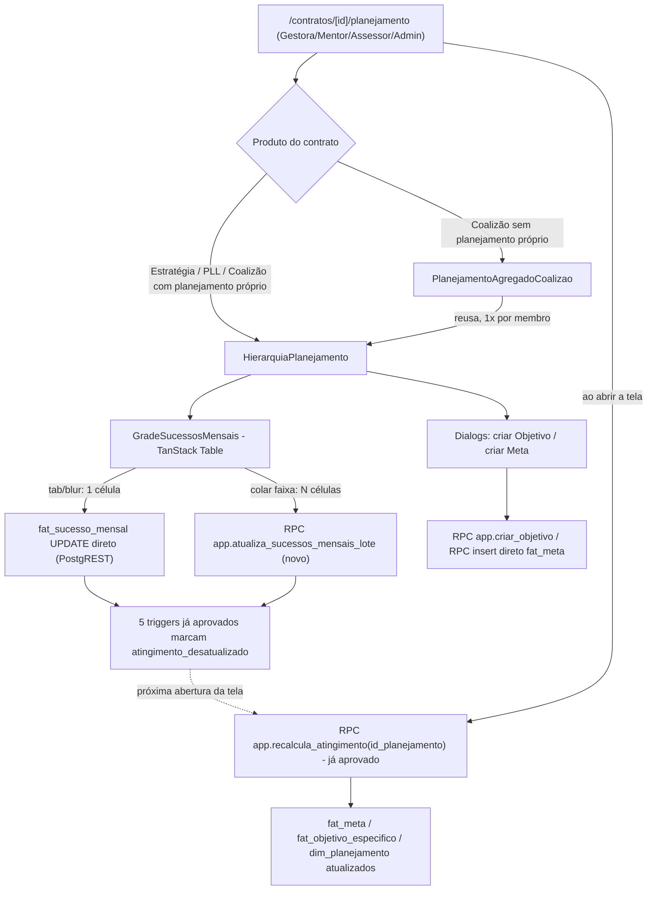

# Planejamento do Contrato / Planilha de Monitoramento — Design

**Spec**: `.specs/features/planejamento-planilha-monitoramento/spec.md`
**Context**: `.specs/features/planejamento-planilha-monitoramento/context.md`
**Status**: Approved (decisões confirmadas por Pedro em 2026-08-12, achados de Design abaixo não
mudam nenhuma tabela do schema aprovado — só corrigem leituras erradas do `spec.md`)

---

## Achado de Design mais importante — o schema aprovado já resolve o que o spec.md achava em aberto

Antes de desenhar qualquer coisa nova, a leitura de `docs/schema_sistema.sql` (Passo 1 da Knowledge
Verification Chain) mostrou que **duas das quatro perguntas que levamos ao Pedro já tinham resposta
escrita no schema aprovado** — o `spec.md` estava incorreto ao marcá-las como "não documentado":

1. **Fórmula de cascata**: `app.recalcula_atingimento(p_id_planejamento)`
   (`docs/schema_sistema.sql:1476-1512`) já existe, verbatim, com a fórmula completa dos 3 níveis:
   - Meta = **média ponderada por `peso`** dos seus Sucessos Mensais (`SUM(peso*pct)/SUM(peso)`,
     `COALESCE(pct_atingimento,0)` quando pendente).
   - Objetivo = **média simples** das Metas com `status='ativa'` (`AVG(COALESCE(pct,0))`).
   - Planejamento = **média simples** dos Objetivos (`AVG(COALESCE(pct,0))`).

   A resposta do Pedro ("média simples nos dois níveis de cima") **bate exatamente** com o texto já
   aprovado — não havia ambiguidade real de negócio, só uma lacuna de leitura na fase Specify. A
   AC2 da User Story "Cascata de atingimento" do próprio `spec.md` já descrevia essa fórmula
   corretamente (linha "fat_meta.pct_atingimento (média ponderada pelo peso)...") — só a tabela de
   Assumptions estava desalinhada com a AC ao lado dela. Corrigido nesta sessão de Design.

2. **Escopo de escrita do Assessor**: o GRANT aprovado (`docs/schema_sistema.sql:2093`) já é
   `GRANT SELECT, UPDATE ON fat_sucesso_mensal TO legisla_assessor;` — **tabela inteira**, sem lista
   de colunas. A proposta original do `spec.md` (`GRANT UPDATE (pct_atingimento, status)`, só 2
   colunas) era, ela mesma, um desvio do texto aprovado que exigiria justificativa (AD-008). A
   correção do Pedro durante a confirmação ("o correto é o assessor poder editar todos os campos")
   **restaura a fidelidade ao schema aprovado** em vez de abrir uma exceção nova — feliz coincidência
   entre a instrução de negócio e o texto já aprovado, registrada aqui para não parecer
   redesenho.

3. **Job de recálculo**: `app.recalcula_pendentes(p_limite INT DEFAULT 200)`
   (`docs/schema_sistema.sql:1515-1525`) e os 5 triggers que marcam
   `atingimento_desatualizado = true` (`docs/schema_sistema.sql:1738-1831`) também já existem
   verbatim no documento aprovado — a "decisão de implementação" deixada em aberto no `context.md`
   ("Agent's Discretion") já tem função pronta; falta só decidir **quem chama**
   `app.recalcula_atingimento` (ver "Tech Decisions" abaixo, item Recálculo).

4. **`rel_planejamento_preditor` não recebe GRANT nenhum** para `legisla_mentor`/`legisla_assessor`
   no texto aprovado (não está em nenhuma das duas listas, `docs/schema_sistema.sql:2080-2098`) —
   os preditores prioritários do planejamento (nível `dim_planejamento`) são visíveis só para
   Gestora/Admin. Não é lacuna a corrigir — é leitura literal do aprovado, mantida como está
   (AD-008).

**Consequência prática**: esta feature é, na maior parte, **extração incremental** (AD-025) de SQL
já aprovado — no mesmo espírito de `operacao-regua-instanciacao` — não desenho novo. As poucas peças
que o documento aprovado não especifica (quando exatamente `recalcula_atingimento` é chamado; como
uma edição de faixa colada vira uma escrita atômica; onde a tela vive) são o que este `design.md`
resolve.

---

## Confirmed Decisions (spec.md "Confirmada?" n → y)

| Assumption | Default proposto | Confirmado |
| --- | --- | --- |
| Fórmula de cascata (2 níveis de cima) | Média simples — **bate com `app.recalcula_atingimento` já aprovado** | y |
| `fat_meta.classe='governanca'` no PLL | Só via UI, sem CHECK novo | y |
| Escopo de escrita do Assessor em `fat_sucesso_mensal` | **Revisado**: todas as colunas da linha — **bate com o GRANT já aprovado** | y |
| Soma de `peso`=100 por Meta | Alerta visual, sem bloqueio | y |
| Mecanismo de restrição do Assessor | GRANT de tabela inteira (não mais coluna), sem exceção nova à AD-010 | y |

Nenhum ponto ficou sem confirmação. Ver `context.md` para o texto completo de cada resposta.

---

## Architecture Overview



A função `app.recalcula_atingimento` e os 5 triggers de marcação já existem no schema aprovado — a
única peça de arquitetura nova é **quando** chamá-la (ao abrir a tela, não em `pg_cron` — ver Tech
Decisions) e a RPC nova para escrita em lote da faixa colada.

---

## Code Reuse Analysis

### Existing Components to Leverage

| Component | Location | How to Use |
| --- | --- | --- |
| `EmDesenvolvimento`/`EstadoVazio` | `src/frontend/components/app-shell/em-desenvolvimento.tsx`, `components/ui/estado-vazio.tsx` | Placeholder atual de `.../planejamento/page.tsx` — é o arquivo que esta feature substitui pelo conteúdo real |
| Padrão de query "view-model" | `src/backend/queries/etapa-contrato.ts` | Mesmo formato: `client` por parâmetro, interface camelCase, `if (!data) return []`, `.map()` campo a campo |
| Padrão de RPC wrapper | `src/backend/rpc/convite.ts`, `src/backend/rpc/kanban.ts` | Mesma assinatura `(client, input) => Promise<T>`, `client.schema("app").rpc(nome, {p_...})`, erro sempre via `mapeiaErroRpc` |
| `mapeiaErroRpc` + hierarquia de erros | `src/backend/rpc/errors.ts` | Adicionar entradas novas em `MENSAGENS_CHECK` para `ck_sucesso_pct`/`ck_sucesso_mes`/`ck_meta_preditores`/`ck_objetivo_preditores` — mesmo padrão dos `ck_*` já mapeados |
| Padrão de schema Zod com `.refine()` por CHECK | `src/backend/schemas/contrato.ts` | Réplica do padrão para `objetivoEspecificoSchema`/`metaSchema`/`sucessoMensalSchema` |
| RLS `p_heranca` (EXISTS chain) | `docs/schema_sistema.sql:1584-1613` | Extraído verbatim para as 4 tabelas novas (régua já usou o mesmo estilo de `DO $$ FOREACH` para `p_por_contrato`) |
| Padrão de teste de RLS (`signInAs`, fixture, `afterAll`) | `supabase/tests/operacao/regua-rls.integration.test.ts` | Réplica exata da estrutura para `supabase/tests/planejamento/*.integration.test.ts` |
| `@tanstack/react-table` | já em `package.json` (`^9.1.2`), **zero uso real hoje** | Esta feature é o primeiro consumidor real — sem padrão local de célula editável a reaproveitar (ver Risks & Concerns) |
| `dim_coalizao.possui_planejamento_proprio` | tabela já existente (`docs/schema_sistema.sql:450`) | Decide, na própria página, se renderiza a hierarquia real ou a leitura agregada |

### Integration Points

| System | Integration Method |
| --- | --- |
| `dim_planejamento` (já existe, vazia, de `operacao-regua-instanciacao`) | Ponto de partida de toda a hierarquia — 1:1 com `fat_contrato`, `id_planejamento` é a FK de todo o resto |
| RLS de `fat_contrato`/`app.contratos_do_usuario()` | Reaproveitada por herança (EXISTS chain) — nenhuma tabela nova carrega `id_contrato` direto |
| `app.trg_auditoria()` (já existe, `0012_fundacao_auditoria_gap.sql`) | Só falta **conectar** às 5 tabelas desta feature — não recriar a função |

---

## Data Model

Zero desenho novo nas 4 tabelas + 1 view — extraídas verbatim de `docs/schema_sistema.sql:895-980`
(`rel_planejamento_preditor`, `fat_objetivo_especifico`, `fat_meta`, `fat_sucesso_mensal`) e `:1196-1200`
(`vw_sucesso_mensal`). `dim_planejamento` **já existe** (`operacao-regua-instanciacao`) e não é
recriada — só ganha as 4 tabelas filhas e as peças de wiring que a régua deixou fora do escopo dela
(RLS herdada dessas 4, cascata, auditoria).

```typescript
// View-model de leitura da grade (src/backend/queries/planejamento.ts)
interface SucessoMensalGrade {
  idSucesso: number
  idMeta: number
  descricaoMeta: string
  descricaoSucesso: string
  mesReferencia: string        // YYYY-MM-01
  dtLimite: string | null
  peso: number
  pctAtingimento: number | null
  status: "pendente" | "realizado" | "nao_realizado"
  diasAtraso: number
  estaAtrasado: boolean
}

// View-model da hierarquia (leitura)
interface ObjetivoComMetas {
  idObjetivo: number
  descricao: string
  idPreditorPrimario: number | null
  idPreditorSecundario: number | null
  pctAtingimento: number | null
  metas: MetaResumo[]
}

interface MetaResumo {
  idMeta: number
  descricao: string
  classe: "programatica" | "governanca" | null
  status: "ativa" | "pausada" | "descartada"
  pctAtingimento: number | null
  somaPeso: number   // calculado no client a partir dos Sucessos Mensais carregados — alerta se != 100
}
```

**Relationships**: `dim_planejamento (1) → fat_objetivo_especifico (N) → fat_meta (N) → fat_sucesso_mensal (N)`,
`dim_planejamento (1) → rel_planejamento_preditor (até 3)`. Nenhuma tabela nova carrega `id_contrato`
— RLS sobe a cadeia até `dim_planejamento.id_contrato` via `EXISTS`.

---

## Migrations Plan (5 arquivos, `supabase migration new <nome>`)

1. **`planejamento_planilha_estrutura`** — DDL: `rel_planejamento_preditor`, `fat_objetivo_especifico`,
   `fat_meta`, `fat_sucesso_mensal` (`CREATE TABLE IF NOT EXISTS`, verbatim
   `docs/schema_sistema.sql:895-980`) + `vw_sucesso_mensal`
   (`CREATE OR REPLACE VIEW ... WITH (security_invoker = true)`, verbatim `:1196-1200`).

2. **`planejamento_planilha_rls`** — `ENABLE`/`FORCE ROW LEVEL SECURITY` + `CREATE POLICY p_heranca`
   nas 4 tabelas novas, predicados EXISTS verbatim (`docs/schema_sistema.sql:1589-1597`). Segue o
   mesmo desvio deliberado já estabelecido por `operacao-regua-instanciacao`
   (`20260812001234_regua_instanciacao_rls.sql`): acrescenta `WITH CHECK` idêntico à `USING`
   explicitamente, mesma categoria de correção documentada da FND-USR-02 — o texto aprovado só
   declara `USING` para `p_heranca`, mas a convenção do projeto (desde a régua) é nunca depender do
   fallback implícito de uma policy `FOR ALL`. `dim_planejamento` não é tocada aqui — já tem
   `p_por_contrato` com `WITH CHECK` explícito desde a régua.

3. **`planejamento_planilha_grants`** — Re-`GRANT SELECT, INSERT, UPDATE, DELETE ON ALL TABLES IN
   SCHEMA public TO legisla_app, legisla_admin, legisla_gestora` (AD-025, obrigatório pra tabela
   nova em `public`) + fatia do GRANT aprovado que agora tem tabela pra apontar
   (`docs/schema_sistema.sql:2080-2098`, verbatim):
   - Mentor: `GRANT SELECT, INSERT, UPDATE ON fat_sucesso_mensal` + `GRANT SELECT ON
     fat_objetivo_especifico, fat_meta, vw_sucesso_mensal` (`dim_planejamento` já concedida pela
     régua).
   - Assessor: `GRANT SELECT, UPDATE ON fat_sucesso_mensal` (**tabela inteira**, ver Achado de
     Design acima) + `GRANT SELECT ON fat_objetivo_especifico, fat_meta, vw_sucesso_mensal`
     (`dim_planejamento` já concedida pela régua).
   - `rel_planejamento_preditor`: nenhum GRANT a mentor/assessor (leitura literal do aprovado).
   - **Achado novo**: `GRANT USAGE, SELECT ON ALL SEQUENCES IN SCHEMA public TO legisla_mentor`
     precisa ser refeito aqui — é a primeira feature desde o bootstrap (`0004`) que dá ao Mentor
     `INSERT` de verdade (em `fat_sucesso_mensal`), e o sequence da nova tabela
     (`fat_sucesso_mensal_id_sucesso_seq`) não existia quando `0004` rodou. Sem isso, o primeiro
     `INSERT` do Mentor falha em `nextval()` com `42501`, um erro que só aparece em teste de
     integração real (mesma classe de achado do `db:types`/GRANT da régua e do convite).

4. **`planejamento_planilha_cascata`** — verbatim `docs/schema_sistema.sql`:
   - `app.recalcula_atingimento(p_id_planejamento BIGINT)` (`:1476-1512`)
   - `app.recalcula_pendentes(p_limite INT DEFAULT 200)` (`:1515-1525`) — criada por completude/AD-008
     (extrair o texto aprovado inteiro), mesmo sem consumidor nesta feature (ver Tech Decisions,
     "Recálculo" — não é chamada por `pg_cron` nesta rodada).
   - `app.trg_marca_desatualizado_novos/antigos/upd()` + `app.trg_marca_por_meta_upd/ins()`
     (`:1738-1831`) + os 5 `CREATE TRIGGER` (`trg_sm_ins/upd/del` em `fat_sucesso_mensal`,
     `trg_meta_upd/ins` em `fat_meta`) — todas `SECURITY INVOKER` (sem cláusula), AD-024.

5. **`planejamento_planilha_auditoria`** — conecta `app.trg_auditoria()` (já existe,
   `0012_fundacao_auditoria_gap.sql`, não recriada) às 5 tabelas que o próprio comentário de `0012`
   e de `20260812090853_kanban_etapas_audit_trigger.sql` já apontam como "fora de escopo daquelas
   features, tabelas de Planejamento que ainda não existiam": `dim_planejamento`,
   `fat_objetivo_especifico`, `fat_meta`, `fat_sucesso_mensal`, `rel_planejamento_preditor`
   (`docs/schema_sistema.sql:1716-1720`, pk de cada uma). Guarda `IF NOT EXISTS (SELECT 1 FROM
   pg_trigger WHERE tgname = 'trg_audit_' || tabela)`, mesmo padrão idempotente de `0012`/kanban.

**RPC novo, fora do texto aprovado** (não é migration de schema, é `CREATE FUNCTION` isolada dentro
da migration 4, ou uma 6ª migration `planejamento_planilha_fn_lote` — decisão de Tasks): ver Tech
Decisions, "Paste de faixa".

---

## Components

### `GradeSucessosMensais` (P1, PLM-01 a PLM-04)

- **Purpose**: grade editável dos Sucessos Mensais do mês corrente, agrupados por Meta.
- **Location**: `src/frontend/components/planejamento/grade-sucessos-mensais.tsx`
- **Interfaces**: `<GradeSucessosMensais idPlanejamento={number} linhas={SucessoMensalGrade[]} onEdicaoCelula={...} onColarFaixa={...} />`
- **Dependencies**: `@tanstack/react-table` (`useReactTable`, `getCoreRowModel`, `getGroupedRowModel`
  agrupado por `idMeta`), `src/backend/rpc/planejamento.ts`.
- **Reuses**: `components/ui/table.tsx` (primitiva shadcn) como base visual das linhas/cabeçalho;
  `components/ui/badge.tsx` pro status/atraso (mesmo padrão de `vw_etapa_contrato` na tela da régua).
- **Interação**: célula de `pctAtingimento` vira `<input type="number">` no foco; `Tab`/`blur` dispara
  1 `UPDATE` direto (PostgREST); seleção de faixa + `Ctrl+V` dispara 1 chamada à RPC de lote (ver
  Tech Decisions). Validação 0–100 no `onChange` do input, antes de qualquer round-trip (AC4).

### `HierarquiaPlanejamento` (P1 leitura + P2 criação, PLM-08/09/10/11)

- **Purpose**: árvore Objetivo → Meta com `pct_atingimento` de cada nível e alerta de soma de peso.
- **Location**: `src/frontend/components/planejamento/hierarquia-planejamento.tsx`
- **Interfaces**: `<HierarquiaPlanejamento planejamento={PlanejamentoCompleto} papel={PapelUsuario} />`
- **Dependencies**: `objetivo-form-dialog.tsx`, `meta-form-dialog.tsx` (P2, botões "+ Objetivo"/"+ Meta"
  só visíveis para `gestora`/`mentor`/`admin` — mesmo gate de papel já usado em telas de convite/kanban).
- **Reuses**: `components/ui/badge.tsx` para o alerta visual de soma de peso ≠ 100 (Edge Case do
  `spec.md` — alerta, nunca bloqueio).

### `PlanejamentoAgregadoCoalizao` (Edge Case do `spec.md`)

- **Purpose**: para Coalizão sem planejamento próprio, mostra a planilha de cada mandato membro —
  sem agregação nova, uma seção por membro.
- **Location**: `src/frontend/components/planejamento/planejamento-agregado-coalizao.tsx`
- **Dependencies**: `rel_coalizao_membro` (já existe) pra listar `id_contrato` dos membros; reusa
  `HierarquiaPlanejamento`/`GradeSucessosMensais` **uma vez por membro**, sem SQL de agregação novo
  — decisão confirmada em `context.md`.

### Backend

| Arquivo | Função | Notas |
| --- | --- | --- |
| `src/backend/queries/planejamento.ts` | `buscarPlanejamentoCompleto(client, idContrato)`, `buscarGradeSucessosMensais(client, idPlanejamento, mesReferencia)` | Padrão de `etapa-contrato.ts` — view-model camelCase, `if (!data) return []` |
| `src/backend/rpc/planejamento.ts` | `recalcularAtingimento(client, idPlanejamento)`, `atualizarSucessosEmLote(client, updates)`, `criarObjetivoEspecifico(client, input)`, `criarMeta(client, input)` | Padrão de `convite.ts`/`kanban.ts` — `client.schema("app").rpc(...)`, erro via `mapeiaErroRpc` |
| `src/backend/schemas/planejamento.ts` | `objetivoEspecificoSchema`, `metaSchema`, `sucessoMensalSchema` | Padrão de `contrato.ts` — `.refine()` por `ck_*` (preditores, `mes_referencia` dia 1, `peso`/`pct` 0–100) |

---

## Error Handling Strategy

| Error Scenario | Handling | User Impact |
| --- | --- | --- |
| `42501` (RLS/GRANT nega escrita) | `mapeiaErroRpc` → `PermissaoNegadaError` (já existe) | Mensagem genérica, sem revelar a linha negada |
| `23514` em `ck_sucesso_pct`/`ck_objetivo_pct`/`ck_meta_pct` | Novas entradas em `MENSAGENS_CHECK` | "Valor deve estar entre 0 e 100." inline na célula, sem salvar |
| `23514` em `ck_meta_preditores`/`ck_objetivo_preditores` | Nova entrada em `MENSAGENS_CHECK` | "Preditor secundário não pode repetir o primário." no form de Meta/Objetivo |
| `23514` em `ck_sucesso_mes` | Nova entrada em `MENSAGENS_CHECK` | Inatingível pela UI (seletor de mês nunca gera dia != 1) — defesa em profundidade |
| RPC de lote falha no meio de uma faixa colada | `UPDATE` único é atômico (all-or-nothing) — nenhuma célula salva parcialmente | Toda a faixa recusada, erro inline no ponto de colagem, usuário tenta de novo |
| Soma de `peso` ≠ 100 numa Meta | Não é erro — alerta visual (`Badge` amarelo) na `HierarquiaPlanejamento`, nunca bloqueia | Gestora vê o aviso, decide corrigir quando quiser |

---

## Risks & Concerns

| Concern | Location | Impact | Mitigation |
| --- | --- | --- | --- |
| Grade editável com paste-de-faixa não tem NENHUM precedente no repo (`@tanstack/react-table` instalado, zero uso real) | `src/frontend/components/planejamento/grade-sucessos-mensais.tsx` (novo) | Maior risco de adoção do projeto (AD-028) sem gate de protótipo prévio (AD-028 revogou AD-022) | Prioridade explícita pedida por Pedro nesta sessão; UAT manual no Success Criteria do `spec.md`; código isolado num componente único, fácil de reescrever se a UX não performar |
| `rel_planejamento_preditor` sem GRANT a mentor/assessor no schema aprovado | `docs/schema_sistema.sql:2080-2098` | Mentor/Assessor não veem os preditores prioritários do planejamento (só Gestora/Admin) | Leitura literal do aprovado (AD-008) — não é bug desta feature, não corrigido |
| Sem trigger de `atingimento_desatualizado` para `DELETE` em `fat_meta` nem para qualquer mudança em `fat_objetivo_especifico` | `docs/schema_sistema.sql:1738-1831` (conjunto de triggers aprovado) | Se uma Meta for apagada (fora do MVP: não há UI de delete nesta feature), a média do Objetivo fica desatualizada pra sempre, sem marcação | Fora do MVP (spec.md não tem User Story de deletar Objetivo/Meta) — flag para quem construir "editar/apagar hierarquia" depois |
| `dim_planejamento`/tabelas novas sem `trg_upd_*` (bump automático de `atualizado_em` em UPDATE manual) | Débito already-documented em `0009_fundacao_tabelas.sql:142-147` | Edição manual de `objetivo_ano`/`legado`/`analise_conjuntura` não atualiza `atualizado_em` (a cascata mesma seta explicitamente, então não afeta o recálculo) | Débito de projeto pré-existente, mesmo padrão aplicado a `dim_usuario`/outras tabelas — não corrigido aqui, consistente com o precedente |
| Paste de faixa exige RPC nova (`app.atualiza_sucessos_mensais_lote`), fora do texto aprovado | novo, `planejamento_planilha_cascata` ou migration própria | Superfície de escrita nova que o schema não previu | Justificada por AD-024 (escrita multi-linha precisa de atomicidade); `SECURITY INVOKER`; escopo travado só em `pct_atingimento` (não abre coluna nenhuma que o GRANT já não libere) |

> Nenhum concern acima bloqueia o MVP — todos têm mitigação ou são fora de escopo documentado.

---

## Tech Decisions

| Decision | Choice | Rationale |
| --- | --- | --- |
| Quando chamar `app.recalcula_atingimento` | Síncrono, ao abrir a tela de planejamento (RPC direto, 1 linha de `dim_planejamento`) — **não** `pg_cron`/`app.recalcula_pendentes` | Projeto não tem `pg_cron` provisionado em nenhuma migration (só documentado como "recomendado" em `docs/schema_sistema.sql:2332-2337`); recalcular 1 planejamento é barato (poucas dezenas de linhas); `context.md` já deixa a escolha do mecanismo a critério do Design. `app.recalcula_pendentes` é extraída verbatim mesmo assim (AD-008 — texto aprovado não se edita por omissão), mas fica sem consumidor nesta feature; débito documentado, não bloqueante, mesmo padrão do AD-032 |
| Escrita de 1 célula (tab/blur) | `UPDATE` direto via PostgREST (supabase-js), sem RPC | AD-024: escrita de uma linha só continua direta; não há invariante multi-tabela numa edição de célula única |
| Escrita de faixa colada (N células) | RPC nova `app.atualiza_sucessos_mensais_lote(p_valores jsonb)`, 1 `UPDATE ... FROM jsonb_to_recordset(...)`, `SECURITY INVOKER` | AD-024: escrita que cruza mais de uma linha precisa de atomicidade real — N chamadas `Promise.all` deixaria estado parcial se uma falhar no meio (exatamente o problema que AD-024 documenta). Escopo travado em `pct_atingimento` — não é escrita "genérica de coluna", é a ação específica da AC3 do spec.md |
| Onde editar `peso`/`descricao`/`mes_referencia`/`dt_limite` | Dialog "editar detalhes" por linha, fora da grade — não célula inline | O GRANT permite todas as colunas (decisão revisada do Pedro), mas as ACs da grade (`PLM-02`/`PLM-03`) só falam de `pct_atingimento`; operação rara (corrigir cadastro) não precisa da UX de tab/paste |
| Restrição de `classe='governanca'` no PLL | Só na UI (formulário de Meta do PLL não oferece a opção) | Confirmado por Pedro; nenhuma migração de CHECK — AD-008 |
| Validação de soma de `peso`=100 | Client-side, alerta visual (`Badge`), nunca bloqueio de salvar `pct_atingimento` | Confirmado por Pedro; Postgres não valida `SUM()` de linhas-irmãs em `CHECK` de linha |
| Coalizão sem planejamento próprio | Reusa `HierarquiaPlanejamento`/`GradeSucessosMensais` 1x por membro, sem SQL de agregação nova | Confirmado em `context.md`: "visão filtrada por Projeto", já é leitura |
| Rota da tela | Substitui o placeholder existente em `src/frontend/app/(app)/contratos/[id]/planejamento/page.tsx` | Já reservada pela Trilha F (NAV-08) — não cria rota nova |

---

## Testing Strategy

- **Integração, RLS** (`supabase/tests/planejamento/planejamento-rls.integration.test.ts`): réplica
  do padrão de `regua-rls.integration.test.ts` — Mentor/Assessor com e sem vínculo, subindo a cadeia
  EXISTS nos 4 níveis (`fat_sucesso_mensal` → `fat_meta` → `fat_objetivo_especifico` →
  `dim_planejamento`); Assessor `UPDATE` em todas as colunas de `fat_sucesso_mensal` do contrato
  vinculado (sucesso) e em `fat_meta`/`fat_objetivo_especifico`/`dim_planejamento` (falha `42501`);
  Assessor em contrato não vinculado (falha `42501`); Mentor `INSERT` em `fat_sucesso_mensal` (prova
  o fix de sequence do item 3 da Migrations Plan).
- **Integração, cascata** (`supabase/tests/planejamento/planejamento-cascata.integration.test.ts`):
  monta hierarquia via SQL cru (Objetivo → 2 Metas → Sucessos Mensais com pesos != 100/25/25/50),
  uma Meta `pausada`; edita `pct_atingimento` de 3 Sucessos, chama `app.recalcula_atingimento`,
  confere os 3 níveis batendo com cálculo manual (média ponderada na Meta, simples no Objetivo
  excluindo a pausada, simples no Planejamento); confirma `atingimento_desatualizado` vira `true`
  nos triggers de INSERT/UPDATE/DELETE de `fat_sucesso_mensal` e `false` após o recálculo.
- **Unit** (`src/backend/queries/planejamento.test.ts`, `src/backend/rpc/planejamento.test.ts`):
  mock de client, mapeamento de campos, agrupamento por Meta, erro mapeado de `mapeiaErroRpc`.
- **UAT manual** (Success Criteria do `spec.md`): Assessora de teste edita 5+ Sucessos Mensais e cola
  uma faixa — sem gate formal de protótipo (AD-028), mas com verificação humana antes de considerar
  a feature pronta.

---

## Non-Goals (reafirmados do spec.md)

GIP, migração de planilhas legadas, notificação de Sucesso Mensal não atualizado, `pg_cron`/job de
recálculo em background, reordenação em lote/drag de Objetivos, deletar Objetivo/Meta.
