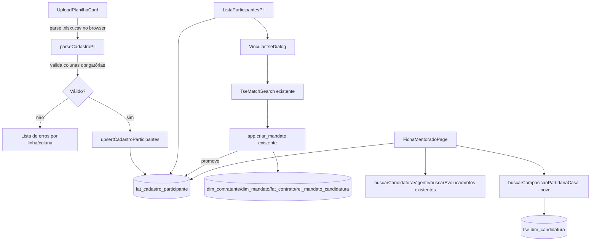

# PLL — Cadastro de Participantes e Ficha do Mentorado Design

**Spec**: `.specs/features/pll-cadastro-participantes/spec.md`
**Status**: Draft

## Decisions ativas conferidas (`.specs/STATE.md`)

AD-002 (RLS decide autorização), AD-005 (`—` para ausência), AD-010 (lista fechada de 4 exceções que usam
`service_role`/Edge Function — **importação de planilha do PLL não é uma delas**: é escrita comum,
respeitando RLS, feita pelo papel autenticado, não um bypass), AD-011 (parse do arquivo acontece no
browser — não existe camada de servidor própria), AD-012 (tabela nova é genérica, discriminada por
`id_produto`, nunca `_pll` no nome), AD-024 (o vínculo TSE cruza 4 tabelas → RPC `SECURITY INVOKER`, e
**já existe**: `app.criar_mandato`), AD-040 (precedente estrutural: entidade pré-contrato com conversão
explícita — mesmo princípio de `fat_prospeccao`, mas **não** a mesma tabela, ver Tech Decisions).

---

## Architecture Overview



---

## Approach Exploration (Large/Complex — 2 abordagens)

### Abordagem A — Tabela de staging própria (recomendada)

Uma tabela nova `fat_cadastro_participante` guarda os 19 campos autodeclarados + os campos editáveis
depois (desafios, destaques, ambição, SWOT). O vínculo TSE chama `app.criar_mandato` (já existe) e
atualiza a linha de staging com o `id_contrato`/`id_vinculo_tse` resultantes.

- **Prós**: isola dado não confirmado (autodeclarado) do dado oficial (`dim_mandato`); reaproveita
  `app.criar_mandato` sem alteração; import e re-import não tocam em tabela nenhuma que outro produto lê.
- **Contras**: mais uma tabela no schema; exige RLS e GRANTs próprios.

### Abordagem B — Gravar direto em `dim_usuario`/`dim_mandato`/`fat_contrato` na importação

A importação já cria as linhas definitivas; o vínculo TSE só preenche `rel_mandato_candidatura` para
registrar confiança/validação.

- **Prós**: sem tabela nova.
- **Contras**: **rejeitada por Pedro** (2026-09-22, D-4 da spec) — dado autodeclarado sem validação
  entraria direto nas tabelas que `mv_numeros_impacto`, `vw_carteira` e a Estratégia também leem;
  reimportação de planilha (PLL-CP-03) teria que fazer `UPDATE` em `dim_mandato` já vinculado, arriscando
  sobrescrever dado confirmado do TSE com um valor de planilha desatualizado. `dim_usuario` também não tem
  colunas para os campos pessoais sensíveis (mesmo problema já identificado em D-2 da spec
  `pll-dashboard-agenda`).

**Recomendação: Abordagem A**, confirmada pela decisão de Pedro em D-4.

---

## Code Reuse Analysis

### Existing Components to Leverage

| Component | Location | How to Use |
| --- | --- | --- |
| `TseMatchSearch`, `useBuscaTse`, `ResultadosBuscaTse` | `src/frontend/components/fundacao/tse-match-search.tsx` | Reaproveitado **sem alteração** — mesma busca de candidatura que a Estratégia usa (PLL-CP-10) |
| `buscarCandidaturas` | `src/backend/queries/tse.ts` | Sem alteração |
| `criarMandato` (RPC `app.criar_mandato`) | `src/backend/rpc/mandato.ts` | Reaproveitado para materializar `dim_contratante`/`dim_mandato`/`fat_contrato`/`rel_mandato_candidatura` a partir do vínculo TSE (PLL-CP-11) — **nenhuma RPC nova para o match em si** |
| `marcarCandidaturaVigente` | `src/backend/rpc/mandato.ts` | Reaproveitado se o participante tiver candidatura vigente a trocar (PLL-CP-12) |
| `informacoes-tse-mandato.tsx` | `src/frontend/components/fundacao/` | Referência de layout para o bloco "Dados TSE" da Ficha (PLL-CP-14) — mesma fonte de dado (`tse.dim_candidatura`/`tse.fat_votacao_zona`), adaptado ao novo conjunto de campos (D-2: sem Número do Candidato/Classificação/Despesa) |
| `EstadoVazio`, `ErroInline`, `CarregandoSkeleton` | `components/ui/*` | Padrão em toda a feature |
| `Table`/`TableHeader`/etc. | `components/ui/table.tsx` | Lista de participantes |

### Integration Points

| System | Integration Method |
| --- | --- |
| Parse de planilha | Biblioteca client-side (a confirmar: `xlsx` ou `papaparse`, já não estão em `package.json` — **verificar licença/tamanho antes de adicionar dependência nova**, é decisão de Design que falta pesquisa) |
| Supabase Postgres | `fat_cadastro_participante` gravada via `insert`/`update` direto (array de linhas), sem RPC — é escrita de N linhas na **mesma** tabela, não invariante multi-tabela (AD-024 não se aplica) |
| `app.criar_mandato` | Chamada existente, só ganha o parâmetro de origem (staging) para saber qual linha atualizar depois — **checar assinatura atual antes de estender** (`CriarMandatoInput` em `mandato.ts:23-31` já aceita `idContratanteExistente`; falta um retorno explícito de `id_contrato` para a chamada desta feature usar) |
| `pll-dashboard-agenda` (PLL-DB-15/17) | Lê `fat_cadastro_participante` por `id_contrato` — nenhuma escrita cruzada, só leitura |

---

## Components

### `fat_cadastro_participante` (schema — ver Data Models)

### `UploadPlanilhaCard`

- **Purpose**: Upload + parse + validação + import (PLL-CP-01…04).
- **Location**: `src/frontend/components/pll/upload-planilha-card.tsx`
- **Interfaces**: `onImportar(linhas: LinhaPlanilhaValidada[]): void`
- **Dependencies**: lib de parse (a definir), `parseCadastroPll` (função pura de validação/mapeamento)
- **Reuses**: `EstadoVazio`/`ErroInline` para os estados de erro de importação

### `parseCadastroPll` / `validarLinhasCadastroPll`

- **Purpose**: Funções puras — parse do arquivo em objetos, validação contra o Anexo A (25 colunas, 3
  grupos), sem I/O.
- **Location**: `src/backend/schemas/cadastro-participante-pll.ts` (Zod, fonte de verdade dos campos —
  CLAUDE.md: `src/backend/schemas/` é onde formulário valida)
- **Interfaces**: `validarLinhasCadastroPll(linhas: unknown[]): { validas: LinhaValidada[]; erros: ErroLinha[] }`

### `upsertCadastroParticipantes`

- **Purpose**: Grava/atualiza N linhas de staging (PLL-CP-03: upsert por e-mail + contrato/projeto).
- **Location**: `src/backend/queries/pll-cadastro.ts` (novo arquivo — mistura leitura e escrita porque a
  feature é essencialmente CRUD sobre uma tabela só; `rpc/` fica reservado para o que cruza tabelas)
- **Interfaces**: `upsertCadastroParticipantes(client, { idProjeto, linhas }): Promise<{ inseridos: number; atualizados: number }>`

### `buscarCadastroParticipantesPll`

- **Purpose**: Lista + busca + filtro (PLL-CP-05…09).
- **Location**: `src/backend/queries/pll-cadastro.ts`
- **Interfaces**: `buscarCadastroParticipantesPll(client, { idProjeto?, busca?, partido?, uf?, pagina, tamanhoPagina }): Promise<{ linhas: ParticipantePll[]; total: number }>`

### `VincularTseDialog`

- **Purpose**: Abre `TseMatchSearch` pré-preenchido, confirma e chama `criarMandato` (PLL-CP-10…13).
- **Location**: `src/frontend/components/pll/vincular-tse-dialog.tsx`
- **Dependencies**: `TseMatchSearch`, `criarMandato`
- **Reuses**: 100% da lógica de busca; só a composição (dialog + botão "não encontrado") é nova.

### `FichaMentoradoPage`

- **Purpose**: Tela de detalhe (PLL-CP-14…25).
- **Location**: `src/frontend/app/(app)/produtos/pll/participantes/[id]/page.tsx`
- **Reuses**: `informacoes-tse-mandato.tsx` como referência de bloco TSE.

### `buscarComposicaoPartidariaCasa` (capacidade nova)

- **Purpose**: Agrega `tse.dim_candidatura` por Casa/UF/ano/cargo, contando eleitos por partido
  (PLL-CP-17…19).
- **Location**: `src/backend/queries/tse.ts` (mesmo arquivo das outras leituras de TSE)
- **Interfaces**: `buscarComposicaoPartidariaCasa(client, { anoEleicao, cdCargo, sgUf }): Promise<ComposicaoPartido[]>`
- **Dependencies**: `tse.dim_candidatura` filtrado por `ds_sit_tot_turno` indicando eleito — **verificar os
  valores exatos de `ds_sit_tot_turno` na base de dev antes de implementar o filtro** (não documentado no
  schema, é texto livre do TSE)

### `EditorListaTexto`, `EditorSwot`

- **Purpose**: Edição de Desafios/Destaques (lista) e SWOT (4 quadrantes) — PLL-CP-20…25.
- **Location**: `src/frontend/components/pll/`
- **Reuses**: padrão de "lista editável" — verificar se existe componente genérico antes de criar (busca
  rápida por `TagInput`/`ListaEditavel` no repo — se não existir, é novo, pequeno, sem dependência externa)

---

## Data Models

### Migration: `fat_cadastro_participante` (nova)

```sql
CREATE TABLE fat_cadastro_participante (
  id_cadastro_participante BIGSERIAL PRIMARY KEY,
  id_produto               BIGINT NOT NULL REFERENCES ref_produto(id_produto),
  id_projeto               BIGINT REFERENCES ref_projeto(id_projeto),
  id_contrato              BIGINT REFERENCES fat_contrato(id_contrato), -- nulo até vínculo TSE
  id_vinculo_tse           BIGINT REFERENCES rel_mandato_candidatura(id_vinculo_tse),

  -- Dados Pessoais (12 campos do Anexo A)
  papel                texto_limpo NOT NULL, -- 'mentorado' | 'mentor'
  nome_completo        texto_limpo NOT NULL,
  dt_nascimento        DATE,
  email                TEXT NOT NULL,
  telefone             texto_limpo,
  identidade_genero    texto_limpo,
  orientacao_sexual    texto_limpo,
  cor_raca             TEXT,
  deficiencias         texto_limpo,
  partido_filiado      texto_limpo,
  tempo_na_politica    texto_limpo,
  conhecia_legisla     BOOLEAN,

  -- Dados do Mandato autodeclarados (7 campos) — pré-vínculo, nunca sobrescreve dim_mandato
  nome_parlamentar       texto_limpo,
  cor_raca_parlamentar   TEXT,
  partido_parlamentar    texto_limpo,
  estado_eleicao         CHAR(2),
  cargos_anteriores      texto_limpo,
  mandatos_anteriores    texto_limpo,
  rede_social            texto_limpo,

  -- Pautas Prioritárias (6 campos, D-5)
  nota_educacao             SMALLINT,
  nota_seguranca_publica    SMALLINT,
  nota_modernizacao_estado  SMALLINT,
  nota_clima                SMALLINT,
  outras_pautas             TEXT[],
  especifique_pauta         texto_limpo,

  -- Editáveis no sistema (PLL-CP-20…25), não vêm da planilha
  desafios              TEXT[] NOT NULL DEFAULT '{}',
  destaques             TEXT[] NOT NULL DEFAULT '{}',
  ambicao_texto         texto_limpo,
  ambicao_tags          TEXT[] NOT NULL DEFAULT '{}',
  swot_forcas           TEXT[] NOT NULL DEFAULT '{}',
  swot_fraquezas        TEXT[] NOT NULL DEFAULT '{}',
  swot_oportunidades    TEXT[] NOT NULL DEFAULT '{}',
  swot_ameacas          TEXT[] NOT NULL DEFAULT '{}',

  status_cadastro    TEXT NOT NULL DEFAULT 'incompleto',
  importado_em       TIMESTAMPTZ NOT NULL DEFAULT now(),
  importado_por      BIGINT REFERENCES dim_usuario(id_usuario),
  atualizado_em      TIMESTAMPTZ NOT NULL DEFAULT now(),

  CONSTRAINT ck_cadastro_papel CHECK (papel IN ('mentorado', 'mentor')),
  CONSTRAINT ck_cadastro_email CHECK (email = lower(btrim(email)) AND email LIKE '%@%.%'),
  CONSTRAINT ck_cadastro_status CHECK (status_cadastro IN ('completo', 'incompleto', 'pendente_revisao')),
  CONSTRAINT ck_cadastro_notas CHECK (
    (nota_educacao IS NULL OR nota_educacao BETWEEN 1 AND 5) AND
    (nota_seguranca_publica IS NULL OR nota_seguranca_publica BETWEEN 1 AND 5) AND
    (nota_modernizacao_estado IS NULL OR nota_modernizacao_estado BETWEEN 1 AND 5) AND
    (nota_clima IS NULL OR nota_clima BETWEEN 1 AND 5)
  ),
  CONSTRAINT ck_cadastro_estado_eleicao CHECK (estado_eleicao IS NULL OR estado_eleicao ~ '^[A-Z]{2}$')
);

-- Um e-mail não se repete dentro do mesmo projeto/edição — sustenta o upsert de reimportação (PLL-CP-03).
CREATE UNIQUE INDEX uq_cadastro_participante_email_projeto
  ON fat_cadastro_participante (id_projeto, email);

COMMENT ON TABLE fat_cadastro_participante IS
'Staging da inscrição do PLL: dado autodeclarado pela planilha externa, promovido a dim_mandato/fat_contrato
só quando vinculado ao TSE (id_contrato/id_vinculo_tse). Nunca sobrescreve dado confirmado do TSE.';
```

**RLS/GRANT** (a detalhar em Tasks): mesma política `p_por_contrato`/`p_por_produto` que outras tabelas de
Operação já usam — Gestora e Admin leem/escrevem tudo; Mentor lê/escreve só os participantes cuja
`id_contrato` (quando existe) está na própria carteira; **antes** do vínculo (`id_contrato IS NULL`), só
Gestora/Admin veem a linha (participante ainda não pareado a ninguém).

### `ParticipantePll` (TS, leitura)

```typescript
interface ParticipantePll {
  idCadastroParticipante: number;
  papel: "mentorado" | "mentor";
  nomeCompleto: string;
  siglaPartido: string | null; // partido_filiado ou partido do mandato, a decidir em Tasks
  siglaUf: string | null;
  nomeParlamentar: string | null;
  email: string;
  telefone: string | null;
  nomeMentorPareado: string | null;
  vinculadoTse: boolean;
  statusCadastro: "completo" | "incompleto" | "pendente_revisao";
}
```

---

## Error Handling Strategy

| Error Scenario | Handling | User Impact |
| --- | --- | --- |
| Planilha com coluna obrigatória faltando | Validação client-side (Zod) rejeita antes de qualquer `insert` | Lista de erros por linha/coluna, nenhuma linha entra parcialmente |
| E-mail duplicado dentro do mesmo arquivo | Mesma validação client-side, antes do upsert | Import inteiro rejeitado, mesma mensagem |
| Vínculo a candidatura já usada por outro participante do mesmo contrato | `dim_contratante.id_contratante UNIQUE` já impede duas vezes o mesmo mandato — erro do Postgres mapeado por `mapeiaErroRpc` (mesma função de `mandato.ts`) | Mensagem clara, não erro genérico |
| `tse.dim_candidatura` sem dado para a Casa/ano da Configuração Partidária | `EstadoVazio` "Dados indisponíveis para esta Casa/ano" | Nunca gráfico vazio sem explicação |

---

## Risks & Concerns

| Concern | Location | Impact | Mitigation |
| --- | --- | --- | --- |
| Biblioteca de parse de planilha ainda não escolhida/instalada | `package.json` (não verificado nesta sessão) | Bloqueia a primeira task de import se a escolha exigir aprovação de dependência nova | Task de Design "spike": confirmar `xlsx` (SheetJS) vs. `papaparse` antes de codar — `xlsx` cobre `.xlsx`+`.csv` num pacote só |
| `ds_sit_tot_turno` (usado para "eleito") é texto livre do TSE, valores não documentados no schema | `docs/schema_sistema.sql:631` | Filtro de "eleito" pode ficar errado silenciosamente se o valor não bater | Consultar `SELECT DISTINCT ds_sit_tot_turno FROM tse.dim_candidatura` na base de dev antes de escrever o filtro (Knowledge Verification Chain, Step 1) |
| `CriarMandatoInput.contrato`/`.coalizao` tipados como `any` | `src/backend/rpc/mandato.ts:28-29` | Débito pré-existente — esta feature não piora, mas reintroduz `any` na chamada nova | Não corrigir aqui (fora do diff da spec-irmã); se travar o tipo TS da chamada nova, tipar localmente sem tocar no arquivo genérico |
| Tabela nova compartilha `id_produto`/`id_projeto` com o resto do sistema, mas os 19 campos autodeclarados são específicos do formulário do PLL | — | Se Estratégia um dia importar planilha parecida, os nomes de coluna genéricos (`nome_parlamentar`, não `nome_deputado_pll`) já servem, mas os 6 campos de Pautas são hoje fixos ao PLL | Aceito — `ref_agenda_tematica` genérico continua existindo para quando algum produto migrar para catálogo real; esta tabela não tenta ser esse catálogo |

---

## Tech Decisions

| Decision | Choice | Rationale |
| --- | --- | --- |
| Nome da tabela | `fat_cadastro_participante`, sem sufixo `_pll` | AD-012: tabelas são genéricas, discriminadas por `id_produto`, nunca por nome — mesmo padrão de `fat_registro`/`fat_encontro` |
| Não reaproveitar `fat_prospeccao` (AD-040) | Tabela nova e distinta | `fat_prospeccao` exige `id_contratante` já existente (linha 569) — o cadastro do PLL começa de dado de planilha, sem contratante nenhum ainda, e carrega campos pessoais sensíveis que não fazem sentido numa tabela de prospecção de mandato |
| Import grava direto via `insert`/`update` em array, sem RPC | Sim | É escrita de N linhas na mesma tabela — não é a invariante multi-tabela que AD-024 reserva para RPC |
| Vínculo TSE reaproveita `app.criar_mandato` sem RPC nova | Sim | Único ponto de chamada de criação de mandato já existe e é auditado; escrever um segundo caminho duplicaria a invariante |
| Desafios/Destaques/SWOT como `TEXT[]` na mesma tabela, não tabelas filhas | Sim | Evita 3 tabelas novas para dado de baixa cardinalidade (poucos itens por participante); mesmo precedente de `rel_usuario_contrato.areas TEXT[]` |
