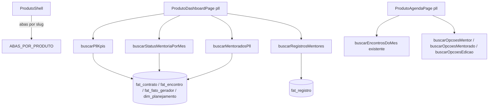

# PLL — Dashboard e Agenda Design

**Spec**: `.specs/features/pll-dashboard-agenda/spec.md`
**Status**: Draft

## Decisions ativas conferidas (`.specs/STATE.md`)

Conforma com: AD-002 (autorização sempre via RLS), AD-003 (número calculado nunca editável), AD-005
(ausência é `—`), AD-011 (frontend fala direto com Supabase, sem camada de API), AD-012 (tabelas
compartilhadas entre produtos, discriminadas por `id_produto`/`id_contrato`, nunca schema por produto),
AD-024 (escrita multi-tabela só via RPC `SECURITY INVOKER`), AD-029 (`CarregandoSkeleton`/`ErroInline`/
`EstadoVazio` já existem), AD-046 (tela de leitura → profundidade de teste reduzida, caminho feliz de cada
AC). Nenhuma decisão ativa é superseded por este design.

**Nova decisão de projeto** (vira AD no fechamento desta feature): PLL não usa o Quadro de Acompanhamento /
Pendências / KPIs de atraso da Estratégia — decisão de produto (D-8 da spec), formalizada aqui como AD
porque estabelece que a área de produto **não é mais 1 conjunto de abas único para os 3 produtos**
(quebra a suposição implícita de `produto-shell.tsx` hoje).

---

## Architecture Overview



A página de Dashboard e a de Agenda do PLL são **rotas próprias** (não reaproveitam
`ProdutoDashboardPage`/`ProdutoAgendaPage` genéricas de Estratégia/Coalizão) porque o conteúdo diverge
demais (sem Kanban/Pendências, com painéis analíticos que não existem nos outros produtos). O shell
(`ProdutoShell`) continua único, só passa a receber a lista de abas por produto.

---

## Code Reuse Analysis

### Existing Components to Leverage

| Component | Location | How to Use |
| --- | --- | --- |
| `ProdutoShell` | `src/frontend/components/produtos/produto-shell.tsx` | Recebe `abas` como prop em vez de hardcoded — único ponto de mudança para suportar tabs diferentes por produto |
| `AgendaMes`, `EncontroPopover` | `src/frontend/components/estrategia/agenda-mes.tsx`, `encontro-popover.tsx` | Reaproveitados **sem alteração** — a grade e o popover de detalhe de Encontro já cobrem PLL-AG-01…07 e PLL-AG-05 |
| `buscarEncontrosDoMes`, `intervaloDoMes`, `FUSO_HORARIO_PRODUTO` | `src/backend/queries/agenda.ts` | Reaproveitados. Filtro troca `idsGestora`/`idsContrato` por `idsMentor`/`idsMentorado` (D-4) |
| `marcarPresenca` | `src/backend/rpc/encontro.ts` | Sem alteração — popover de Encontro já usa |
| `KpiRow` (padrão visual, não o componente em si) | `src/frontend/components/estrategia/kpi-row.tsx` | Referência de layout para o novo `PllKpiRow` — 5 cards em vez de 6, sem reaproveitar o componente porque os KPIs do PLL não vêm de `vw_estrategia_kpi` |
| `CarregandoSkeleton`, `ErroInline`, `EstadoVazio` | `src/frontend/components/ui/*` | Usados em todo bloco novo, mesmo padrão do Dashboard de Estratégia (erro por bloco, não a tela inteira) |
| `Table`, `TableHeader`, etc. | `src/frontend/components/ui/table.tsx` | Tabela de mentorados e lista de encontros do mês |
| `PALETA_BADGE_TIPO`/`corBadgeTipo`, `AvatarResponsavel` | `src/frontend/app/(app)/produtos/[slug]/agenda/page.tsx:310-346` | Padrão de cor determinística por hash — reaproveitado para a paleta de **status** do Encontro (D-6), não por tipo |
| `useProdutoAtual` | `src/frontend/hooks/use-produto-atual.ts` | Sem alteração |

### Integration Points

| System | Integration Method |
| --- | --- |
| Supabase Postgres | Leitura direta via `supabase-js`, RLS decide o recorte (Mentor vê só a carteira, D-14) |
| `fat_contrato.origem_encerramento` (nova) | Coluna lida por `buscarPllKpis`/`buscarMentoradosPll` para status Ativo/Desistente/Desligado |
| `pll-cadastro-participantes` (tabela `fat_cadastro_participante`) | PLL-DB-15/17 leem essa tabela por `LEFT JOIN` via `id_contrato`; se a tabela ainda não existir quando este Dashboard for implementado primeiro, os dois blocos entram como "Em desenvolvimento" (ver Error Handling) |

---

## Components

### `ABAS_POR_PRODUTO` (config, não componente React)

- **Purpose**: Resolve o conjunto de abas por `ProdutoSlug`, substituindo a lista fixa hardcoded hoje.
- **Location**: `src/frontend/components/produtos/abas-por-produto.ts` (novo arquivo)
- **Interfaces**: `ABAS_POR_PRODUTO: Record<ProdutoSlug, { href: string; label: string }[]>`
- **Dependencies**: `ProdutoSlug` de `@backend/queries/produto`
- **Reuses**: nenhum — é dado estático

```ts
export const ABAS_POR_PRODUTO: Record<ProdutoSlug, { href: string; label: string }[]> = {
  estrategia: [Dashboard, Agenda, "Fatos Geradores", Mandatos, "Novo Contrato"], // como hoje
  coalizao:   [Dashboard, Agenda, "Fatos Geradores", Mandatos, "Novo Contrato"], // como hoje
  pll:        [Dashboard, Agenda, Participantes, Avaliações, "Fatos Geradores"], // PLL-SH-01
};
```

### `ProdutoShell` (alteração)

- **Purpose**: Deixa de montar `abas` internamente; consome `ABAS_POR_PRODUTO[slug]`.
- **Location**: `src/frontend/components/produtos/produto-shell.tsx`
- **Interfaces**: sem mudança de assinatura pública (`{ slug, children }`) — a mudança é interna.
- **Reuses**: `RouteTabs` (`src/frontend/components/app-shell/route-tabs.tsx`), sem alteração.

### `buscarPllKpis`

- **Purpose**: Os 5 KPIs do Dashboard (PLL-DB-02), recortados por filtro.
- **Location**: `src/backend/queries/pll-dashboard.ts` (novo arquivo)
- **Interfaces**: `buscarPllKpis(client, { idProduto, idsMentor?, idsProjeto? }): Promise<PllKpi>`
- **Reuses**: mesmo padrão de `buscarEstrategiaKpi` (uma função, uma query agregada, sem cálculo no componente — AD-003).

```ts
export interface PllKpi {
  totalMentorados: number;
  distribuicaoStatus: { ativo: number; desistente: number; desligado: number; concluido: number };
  mentoriasRealizadas: number;
  mentoriasPlanejadas: number; // realizado + planejado (D-11)
  atingimentoMedio: number | null; // — quando não há dim_planejamento no recorte
  fatosGeradoresRegistrados: number;
}
```

### `buscarStatusMentoriaPorMes`

- **Purpose**: Série mensal de Encontros por status (PLL-DB-05), últimos 6 meses (Jul–Dez no mock; janela
  real = mês corrente − 5 até mês corrente).
- **Location**: `src/backend/queries/pll-dashboard.ts`
- **Interfaces**: `buscarStatusMentoriaPorMes(client, { idProduto, idsMentor?, idsProjeto? }): Promise<SerieMensalStatus[]>`
- **Reuses**: `intervaloDoMes` de `agenda.ts` para os limites de cada mês da janela.

### `buscarMentoradosPll`

- **Purpose**: Tabela de mentorados (PLL-DB-07…11).
- **Location**: `src/backend/queries/pll-dashboard.ts`
- **Interfaces**: `buscarMentoradosPll(client, { idProduto, filtro, busca?, ordenacao? }): Promise<MentoradoPll[]>`
- **Reuses**: mesmo formato de paginação/ordenação client-side já usado em `TabelaPendencias`.

### `buscarRegistrosMentores`

- **Purpose**: Feed de Registros dos mentores (PLL-DB-12…14).
- **Location**: `src/backend/queries/pll-dashboard.ts`
- **Interfaces**: `buscarRegistrosMentores(client, { idProduto, filtro, limite = 10 }): Promise<RegistroMentor[]>`
- **Reuses**: mesma tabela `fat_registro` já consultada em `registros-agenda.ts` — nova função porque o
  recorte (produto inteiro, não um mês) e o formato de retorno diferem.

### `PllKpiRow`, `PllStatusMensalChart`, `TabelaMentoradosPll`, `FeedRegistrosMentores`

- **Purpose**: Componentes de apresentação puros, um por bloco do Dashboard (PLL-DB-02, 05, 07, 12).
- **Location**: `src/frontend/components/pll/`
- **Reuses**: `Table`/`Badge`/`Avatar` de `components/ui`; gráfico de barras empilhadas com a mesma lib
  já usada em `evolucao-mensal.tsx` (Recharts, confirmar import exato ao implementar).

### Ajuste de `FiltrosAgenda` → `FiltrosAgendaPll`

- **Purpose**: PLL-AG-08 precisa de mentor(a)/mentorado/edição, não gestora/projeto/contrato.
- **Location**: `src/frontend/components/pll/filtros-agenda-pll.tsx` (novo, não altera `filtros-agenda.tsx`
  para não quebrar Estratégia/Coalizão)
- **Reuses**: mesmo componente de Select múltiplo de `filtros-agenda.tsx`, só troca os 3 rótulos/opções.

---

## Data Models

### Migration: `fat_contrato.origem_encerramento` (D-1)

```sql
ALTER TABLE fat_contrato
  ADD COLUMN origem_encerramento TEXT;

ALTER TABLE fat_contrato
  ADD CONSTRAINT ck_contrato_origem_encerramento
  CHECK (origem_encerramento IS NULL OR origem_encerramento IN ('desistencia', 'desligamento'));

ALTER TABLE fat_contrato
  ADD CONSTRAINT ck_contrato_origem_obrigatoria
  CHECK (status <> 'nao_concluido' OR origem_encerramento IS NOT NULL);
```

Nullable e sem `DEFAULT`: linhas existentes com `status = 'nao_concluido'` (se houver, de outros produtos)
quebrariam o segundo `CHECK` em `ADD CONSTRAINT` — **verificar na base de dev antes de aplicar** (`SELECT
count(*) FROM fat_contrato WHERE status = 'nao_concluido'`); se houver linhas, o `CHECK` entra como `NOT
VALID` + `VALIDATE CONSTRAINT` depois de backfill manual, migration separada.

### `MentoradoPll` (TS, leitura)

```typescript
interface MentoradoPll {
  idContrato: number;
  nomeMentorado: string;
  nomeParlamentar: string;
  siglaPartido: string | null;
  siglaUf: string | null;
  nomeMentor: string | null;
  mentoriasRealizadas: number;
  pctAtingimento: number | null;
  status: "ativo" | "desistente" | "desligado" | "concluido";
  nomeEdicao: string | null; // ref_projeto.nome
}
```

---

## Error Handling Strategy

| Error Scenario | Handling | User Impact |
| --- | --- | --- |
| Falha ao carregar 1 dos 5 KPIs | `ErroInline` só naquele card (mesmo padrão do Dashboard de Estratégia) | Os outros 4 KPIs e os demais blocos continuam visíveis |
| `pll-cadastro-participantes` ainda não implementada quando este Dashboard sobe | PLL-DB-15/17 mostram `EstadoVazio` "Em desenvolvimento" em vez de quebrar a query | Dashboard funciona parcialmente até a spec irmã fechar |
| RLS nega leitura de `fat_contrato` para o papel atual | `ErroInline` padrão, nunca lista vazia disfarçada de "sem dado" | Usuário entende que é permissão, não ausência de contrato |

---

## Risks & Concerns

| Concern | Location | Impact | Mitigation |
| --- | --- | --- | --- |
| `ProdutoShell` hoje assume as mesmas 5 abas para os 3 produtos | `produto-shell.tsx:20-26` | Sem o `ABAS_POR_PRODUTO`, qualquer mudança de aba de um produto vaza para os outros dois | Extrair a config antes de tocar em qualquer aba (task própria, primeira do Design) |
| `buscarStatusMentoriaPorMes` faz agregação mensal que não existe hoje em nenhuma view | Nova | Se implementada como N queries (uma por mês) em vez de 1 `GROUP BY`, fica lenta com filtro amplo | Uma query só com `date_trunc('month', COALESCE(dt_realizada, dt_prevista_inicio))` + `GROUP BY` |
| Coluna nova em `fat_contrato` é tabela compartilhada entre os 3 produtos (AD-012) | `docs/schema_sistema.sql:490` | Migration em tabela de alto uso — qualquer erro de `CHECK` afeta Estratégia e Coalizão também | `CHECK` só ativa quando `status = 'nao_concluido'`; Estratégia/Coalizão continuam sem preencher a coluna enquanto não adotarem o conceito |

> Nenhum outro risco de segurança/performance identificado além dos listados.

---

## Tech Decisions

| Decision | Choice | Rationale |
| --- | --- | --- |
| Dashboard/Agenda do PLL são rotas próprias, não a mesma `ProdutoDashboardPage`/`ProdutoAgendaPage` | Sim — arquivos novos em `app/(app)/produtos/[slug]/dashboard/page.tsx` continuam servindo Estratégia/Coalizão; o roteamento por slug decide qual componente renderiza (`if (slug === "pll") return <PllDashboardPage/>`) | Conteúdo diverge demais (sem Kanban) para caber em um componente com flags condicionais — ficaria ilegível |
| `ABAS_POR_PRODUTO` como config estática, não coluna nova em `ref_produto` | Config no frontend | As abas são decisão de UI/navegação, não dado de negócio — não justifica schema novo (AD-025, provisionamento incremental) |
| Migration da coluna `origem_encerramento` **entra nesta feature**, não espera o Design de `pll-cadastro-participantes` | Sim | D-1 é só desta spec; a tabela de staging da spec irmã é independente |
| Nova AD a registrar no fechamento: "Nem todo produto usa o mesmo conjunto de abas/Kanban" | Substitui a suposição implícita de `navegacao-por-produto` (NAV-02, "4 abas fixas" para os 3 produtos) | `navegacao-por-produto/spec.md` NAV-02 dizia "as 4 abas" no singular para os 3 produtos; este design supersede isso para o PLL especificamente |
