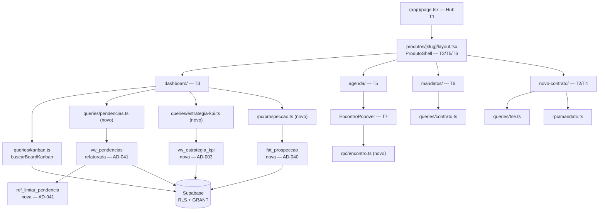

# Redesenho tela-first do produto Estratégia — Design

**Spec**: `.specs/features/redesenho-estrategia-tela-first/spec.md`
**Status**: Draft

---

## Architecture Overview

Abordagem **híbrida**, confirmada por Pedro em 2026-09-10: o que é comum aos três produtos
evolui uma vez (Topbar, Hub, `ProdutoShell`); o que é específico da Estratégia é construído
nas rotas que já existem. PLL e Coalizão herdam o shell novo e mantêm suas telas atuais —
não têm design validado no Figma, e inventá-las violaria AD-038.

A descoberta central do levantamento de reuso: **as 7 telas são majoritariamente adaptação**.
O `ProdutoShell` já tem "Voltar ao hub", título do produto e exatamente as 4 abas do Figma;
`buscarBoardKanban` já devolve colunas e cards; `vw_pendencias` já é consumida em 6 pontos de
`queries/visao-gerencial.ts`. O greenfield real é **Agenda + popover** (hoje placeholder
`EmDesenvolvimento`) e as duas estruturas novas de banco.



---

## Code Reuse Analysis

### Componentes existentes a aproveitar

| Componente | Localização | Como usar |
| :-- | :-- | :-- |
| `ProdutoShell` | `components/produtos/produto-shell.tsx` | **Estender** — já tem voltar-ao-hub, título e as 4 abas. Muda só o label `Contratos` → `Mandatos` e o href correspondente |
| `RouteTabs` | `components/app-shell/route-tabs.tsx` | **Reusar sem alteração** — marcação de aba ativa (EST-03 AC2) |
| `Topbar` | `components/app-shell/topbar.tsx` | **Estender** — Figma mostra "Hub" e "Gestão de Usuários" |
| `KanbanBoard/Coluna/Card` | `components/kanban/` | **Estender** — base do Quadro de Acompanhamento; ganha a raia de Prospecção e o badge de limiar |
| `buscarBoardKanban`, `ColunaKanban`, `CardKanban`, `FiltroBoard` | `queries/kanban.ts` | **Reusar** — já resolve carteira por papel e filtro de projeto |
| `moverEtapaKanban` | `rpc/kanban.ts` | **Reusar** — `app.mover_etapa_kanban` (AD-023) |
| `NovoContratoView` | `components/produtos/novo-contrato-view.tsx` | **Estender** — T4 (busca) e T2 (formulário) são os dois estados dele |
| `buscarCandidaturasTse` | `queries/tse.ts` | **Reusar** — busca do espelho TSE (EST-10) |
| `criarMandatoContrato` | `rpc/mandato.ts` | **Reusar** — transação única mandato+contrato (EST-11 AC6) |
| `mapearErroConstraint` | `rpc/errors.ts` | **Reusar** — mensagem específica de título duplicado (EST-11 AC7) |
| `schemas/mandato.ts`, `contrato.ts`, `encontro.ts`, `registro.ts` | `src/backend/schemas/` | **Reusar** — fonte de verdade dos formulários |
| `PRODUTO_SLUGS`, `isProdutoSlug`, `buscarIdProdutoPorNome` | `queries/produto.ts` | **Reusar** — validação de slug e resolução de `id_produto` |
| `EstadoVazio`, `ErroInline`, `CarregandoSkeleton` | `components/ui/` | **Reusar** — estados padrão (AD-029) |
| `Popover`, `Card`, `Badge`, `Table`, `Select`, `Dialog` | `components/ui/` | **Reusar** — kit shadcn já instalado |
| `useProdutoAtual` | `hooks/use-produto-atual.ts` | **Reusar** |
| `usePapelGlobal` | `hooks/use-papel-global.ts` | **Reusar** como defesa em profundidade, **nunca como autorização** (AD-001) |

### Pontos de integração

| Sistema | Método |
| :-- | :-- |
| Supabase (leitura) | Direto do cliente com chave anônima (AD-011), sempre sob RLS/GRANT |
| Escritas multi-linha | RPC Postgres `SECURITY INVOKER` (AD-024) — conversão de prospect, marcar presença |
| Escritas de uma linha | `insert`/`update` direto via PostgREST (AD-024) |
| Camada Saída | Somente leitura (AD-015); KPIs vêm de view, nunca calculados no componente (AD-003) |
| Auditoria | `app.trg_auditoria()` — `fat_prospeccao` entra na mesma lista das 7 tabelas de `20260813192032` |

---

## Components

### `HubProdutos` (T1 — EST-02)

- **Purpose**: Listar os produtos que a usuária efetivamente alcança, com contadores reais.
- **Location**: `src/frontend/app/(app)/page.tsx` + `components/app-shell/hub-card.tsx`
- **Interfaces**:
  - `buscarCardsHub(client): Promise<CardHub[]>` — devolve só os cards cuja consulta de contador **não** foi negada pelo banco
  - `interface CardHub { slug, titulo, descricao, icone, badge?: string }`
- **Dependencies**: `queries/produto.ts`, `queries/estrategia-kpi.ts`
- **Reuses**: `Card`, `PRODUTO_SLUGS`
- **Nota AD-001**: a visibilidade dos cards "Visão Gerencial" e "Números de Impacto" **deriva do
  resultado da leitura** — `mv_numeros_impacto`/`mv_avaliacao_nps` têm `REVOKE` para
  `legisla_mentor`/`legisla_assessor` (`schema_sistema.sql:2103-2104`), então a negação vem do
  banco. Nunca `if (papel === 'x')` como decisão de acesso.

### `QuadroAcompanhamento` (T3 — EST-07)

- **Purpose**: Uma coluna por etapa do produto, mais a raia de Prospecção, com estado por limiar.
- **Location**: `components/estrategia/quadro-acompanhamento.tsx`
- **Interfaces**:
  - `buscarQuadro(client, { idProduto, filtros }): Promise<ColunaQuadro[]>`
  - `interface ColunaQuadro extends ColunaKanban { tipo: 'prospeccao' | 'etapa' }`
  - `classificarLimiar(diasNaEtapa, limiares): 'normal' | 'atencao' | 'atrasado'`
- **Dependencies**: `queries/kanban.ts`, `queries/prospeccao.ts`, `queries/limiar.ts`
- **Reuses**: `KanbanBoard`, `KanbanColuna`, `KanbanCard`, `moverEtapaKanban`
- **Nota EST-07 AC1**: colunas vêm de `ref_etapa` por `id_produto`, ordenadas por `ordem`.
  Nenhuma lista literal no código — é o que impede o board de repetir o erro que a migration
  `20260812163617` teve de desfazer.

### `TabelaPendencias` (T3 — EST-07)

- **Purpose**: As 5 categorias de `vw_pendencias`, acionáveis.
- **Location**: `components/estrategia/tabela-pendencias.tsx`
- **Interfaces**: `buscarPendencias(client, filtros): Promise<Pendencia[]>`
- **Reuses**: `Table`, `Badge`, `EstadoVazio`

### `KpiRow` (T3 — EST-08)

- **Purpose**: Os 6 números do topo do Dashboard.
- **Location**: `components/estrategia/kpi-row.tsx`
- **Interfaces**: `buscarKpisEstrategia(client, filtros): Promise<KpisEstrategia>`
- **Nota AD-003/AD-005**: cada KPI vem de `vw_estrategia_kpi`. Ausência de dado renderiza `—`,
  nunca `0`.

### `ListaMandatos` (T6 — EST-09)

- **Purpose**: Cards de contrato com os 5 filtros do Figma.
- **Location**: `components/estrategia/lista-mandatos.tsx`
- **Interfaces**: `buscarMandatos(client, filtros): Promise<ContratoCard[]>`
- **Reuses**: `queries/contrato.ts`, `Card`, `Badge`, `Select`, `EstadoVazio`
- **Nota EST-04 AC5**: lê `fat_contrato`. Prospects **não** aparecem aqui.

### `AgendaMes` + `EncontroPopover` (T5/T7 — EST-12, EST-13)

- **Purpose**: Grade mensal de encontros e o detalhe acionável.
- **Location**: `components/estrategia/agenda-mes.tsx`, `components/estrategia/encontro-popover.tsx`
- **Interfaces**:
  - `buscarEncontrosDoMes(client, { idProduto, ano, mes, filtros }): Promise<EncontroAgenda[]>`
  - `buscarRegistrosDaAgenda(client, { idEncontro? }): Promise<RegistroAgenda[]>`
  - `marcarPresenca(client, { idEncontro }): Promise<void>` → RPC (AD-024)
- **Dependencies**: `queries/incidencia.ts`, `schemas/encontro.ts`
- **Reuses**: `Popover`, `Badge`, `Table`, `EstadoVazio`
- **Maior greenfield da leva** — a rota é hoje `EmDesenvolvimento`.

### `NovoContratoView` (T2/T4 — EST-10, EST-11)

- **Purpose**: Dois estados — busca TSE e formulário em 4 seções.
- **Location**: `components/produtos/novo-contrato-view.tsx` (estender)
- **Reuses**: `queries/tse.ts`, `rpc/mandato.ts`, `rpc/errors.ts`, `schemas/mandato.ts`
- **Nota EST-10 AC3**: campos vindos do TSE ficam `readOnly` — a origem é `rel_mandato_candidatura`.

---

## Data Models

### `fat_prospeccao` (novo — AD-040)

```sql
CREATE TABLE fat_prospeccao (
  id_prospeccao      BIGSERIAL PRIMARY KEY,
  id_contratante     BIGINT NOT NULL REFERENCES dim_contratante(id_contratante) ON DELETE RESTRICT,
  id_produto         BIGINT NOT NULL REFERENCES ref_produto(id_produto),
  id_projeto         BIGINT REFERENCES ref_projeto(id_projeto),
  id_usuario_resp    BIGINT REFERENCES dim_usuario(id_usuario),
  status             TEXT NOT NULL DEFAULT 'aberta',
  dt_abertura        DATE NOT NULL DEFAULT CURRENT_DATE,
  dt_desfecho        DATE,
  id_contrato_gerado BIGINT REFERENCES fat_contrato(id_contrato),
  observacao         texto_limpo,
  criado_em          TIMESTAMPTZ NOT NULL DEFAULT now(),
  criado_por         BIGINT REFERENCES dim_usuario(id_usuario),
  atualizado_em      TIMESTAMPTZ NOT NULL DEFAULT now(),
  CONSTRAINT ck_prospeccao_status CHECK (status IN ('aberta','convertida','descartada')),
  CONSTRAINT ck_prospeccao_convertida CHECK (status <> 'convertida' OR id_contrato_gerado IS NOT NULL),
  CONSTRAINT ck_prospeccao_desfecho CHECK (status = 'aberta' OR dt_desfecho IS NOT NULL)
);

CREATE UNIQUE INDEX uq_prospeccao_aberta_contratante
  ON fat_prospeccao (id_contratante, id_produto) WHERE status = 'aberta';
```

**Relacionamentos**: não carrega `id_contrato` — é a exceção deliberada à invariante "toda
tabela de operação carrega `id_contrato NOT NULL`", porque a prospecção existe **antes** do
contrato. `id_contrato_gerado` é o ponteiro do desfecho, não a âncora.

**Por que o índice parcial**: impede duas prospecções abertas para o mesmo contratante no mesmo
produto — a trava de concorrência do edge case de conversão simultânea (EST-04).

**RLS (AD-001, no mesmo DDL)**: prospecção não tem contrato, logo `rel_usuario_contrato` não
serve de chave. Política por `id_usuario_resp` + papel global de Gestora/Admin.

### `ref_limiar_pendencia` (novo — AD-041)

```sql
CREATE TABLE ref_limiar_pendencia (
  id_limiar    BIGSERIAL PRIMARY KEY,
  codigo       TEXT NOT NULL UNIQUE,
  nome         TEXT NOT NULL,
  dias         SMALLINT NOT NULL,
  ativo        BOOLEAN NOT NULL DEFAULT true,
  CONSTRAINT ck_limiar_dias CHECK (dias > 0)
);
```

Seed inicial preserva o comportamento atual — `formulario_aberto: 30`, `sem_registro_recente: 45`
— mais os limiares do Quadro: `etapa_atencao`, `etapa_atrasado`.

**GRANT-only (AD-030)**, não RLS: é catálogo `ref_*` sem `id_contrato` para filtrar por linha.

### `vw_estrategia_kpi` (nova — AD-003)

Agrega por produto os números que hoje existem por contrato/formulário: mandatos ativos, IIP
médio (`mv_iip_contrato`), contratos com etapa atrasada, NPS (`mv_avaliacao_nps`), atingimento
(`dim_planejamento.pct_atingimento`), fatos geradores (`fat_fato_gerador`). **Só lê e agrega**
(AD-015) e **não recalcula** o IIP (AD-014).

---

## Error Handling Strategy

| Cenário | Tratamento | Impacto para a usuária |
| :-- | :-- | :-- |
| Espelho TSE indisponível (EST-10 AC8) | `try/catch` na query; estado de erro do componente | `ErroInline` + botão "Cadastro manual" continua acessível |
| Título eleitoral duplicado (EST-11 AC7) | `mapearErroConstraint` sobre `dim_mandato_nr_titulo_eleitoral_key` | Mensagem específica no campo, formulário preservado |
| Conversão de prospect já convertido (EST-04 AC4) | `CHECK` + índice parcial recusam; RPC devolve erro tipado | Toast explicando que já virou contrato |
| Conversão simultânea | `uq_prospeccao_aberta_contratante` faz a 2ª falhar | Segunda usuária vê erro; nenhum contrato duplicado |
| Leitura negada pela RLS/GRANT (EST-02 AC2) | Erro de permissão tratado como "não visível" | Card do Hub simplesmente não aparece |
| Mês sem encontros (EST-12) | Lista vazia não é erro | Grade completa + `EstadoVazio` |
| Contrato sem etapa atual | Coluna "Sem etapa" | Card visível, nunca sumido |

---

## Risks & Concerns

| Concern | Localização | Impacto | Mitigação |
| :-- | :-- | :-- | :-- |
| **AD-027 diz "sidebar fixa"; o código usa Topbar desde CAD-14/CAD-15** | `.specs/STATE.md` AD-027 vs `app/(app)/layout.tsx:1` | Feature futura pode construir sidebar seguindo a AD e quebrar a consistência que o Figma assume | **AD-043** registra a correção forward-only (não editar o texto de AD-027) |
| `vw_pendencias` com limiar cravado | `supabase/migrations/20260814162237_*.sql` | Violação de AD-004 já em produção; tela e banco discordam (60 vs 45 dias) | EST-06 refatora a view para ler `ref_limiar_pendencia` (AD-041) |
| `BOTOES_PRODUTO` é lista literal no Hub | `app/(app)/page.tsx:6-24` | Card visível a quem não pode ler o dado por trás — risco de AD-001 | EST-02 troca por derivação do resultado da leitura |
| Toda a camada de render sem gate de teste | `vitest.config.ts:10` | ACs de UI sem evidência automatizada (L-006/L-007) | EST-01 instala o harness (AD-042) — é a Fase 0 |
| `fat_prospeccao` quebra a invariante `id_contrato NOT NULL` | modelo | Consultas de carteira podem incluir prospect por engano e inflar número de impacto | Documentado em AD-040; default é **não incluir**; `vw_carteira` e `mv_numeros_impacto` seguem lendo só `fat_contrato` |
| Agenda é o único greenfield real e o mais tardio nas fases | `produtos/[slug]/agenda/` | Se o orçamento acabar, a jornada fica sem a superfície de encontro | Fatiar Agenda em fase própria, entregável sozinha |
| `ref_etapa` tem 6 etapas; Figma mostra 5 + Prospecção | seed vs T3 | Pontapé pode aparecer inesperadamente no board | Board data-driven; discrepância vira decisão de seed, registrada como assumption no spec |

---

## Tech Decisions

| Decisão | Escolha | Rationale |
| :-- | :-- | :-- |
| Encaixe das telas | Híbrido — shell compartilhado evolui, telas da Estratégia nas rotas existentes | Confirmado por Pedro; evita duplicar rota e evita inventar telas de PLL/Coalizão sem Figma validado (AD-038) |
| Colunas do Quadro | Lidas de `ref_etapa`, nunca literais | Colunas cravadas já causaram a correção `20260812163617` |
| Raia de Prospecção | Coluna do board alimentada por `fat_prospeccao`, visualmente distinta | AD-040: prospect não é contrato e não pode ser arrastado para etapa |
| Conversão de prospect | RPC `SECURITY INVOKER` | AD-024 — escrita que cruza duas tabelas |
| Marcar presença | RPC `SECURITY INVOKER` | Atualiza `fat_encontro` + `rel_encontro_participante` |
| Visibilidade de card no Hub | Derivada do resultado da leitura | AD-001 — autorização na RLS, nunca na UI |
| `ref_limiar_pendencia` | GRANT-only | AD-030 — catálogo `ref_*` sem chave de carteira |
| Aba "Mandatos" | Renomeia "Contratos" | Vocabulário da operação; T6 nomeia a própria página |

> **Decisão de nível de projeto:** o encaixe Topbar-vs-sidebar vira **AD-043** em `.specs/STATE.md`.

---

## Fases propostas

| Fase | Conteúdo | Requisitos |
| :-- | :-- | :-- |
| **F0** | Harness de teste de componente | EST-01 |
| **F1** | Banco: `ref_limiar_pendencia` + refactor `vw_pendencias`; seed Rota-X | EST-05, EST-06 |
| **F2** | Banco: `fat_prospeccao` + RLS + grants + auditoria + RPC de conversão | EST-04 |
| **F3** | Shell: Hub com contadores e visibilidade por leitura; aba Mandatos | EST-02, EST-03 |
| **F4** | Dashboard: Quadro de Acompanhamento + Pendências | EST-07 |
| **F5** | Mandatos: lista + filtros | EST-09 |
| **F6** | Novo Contrato: busca TSE + formulário | EST-10, EST-11 |
| **F7** | Agenda: calendário + registros + popover + presença | EST-12, EST-13 |
| **F8** | KPIs do Dashboard (`vw_estrategia_kpi`) | EST-08 |

F1 e F2 são independentes entre si e ambas precedem F4. F7 é entregável isoladamente.
