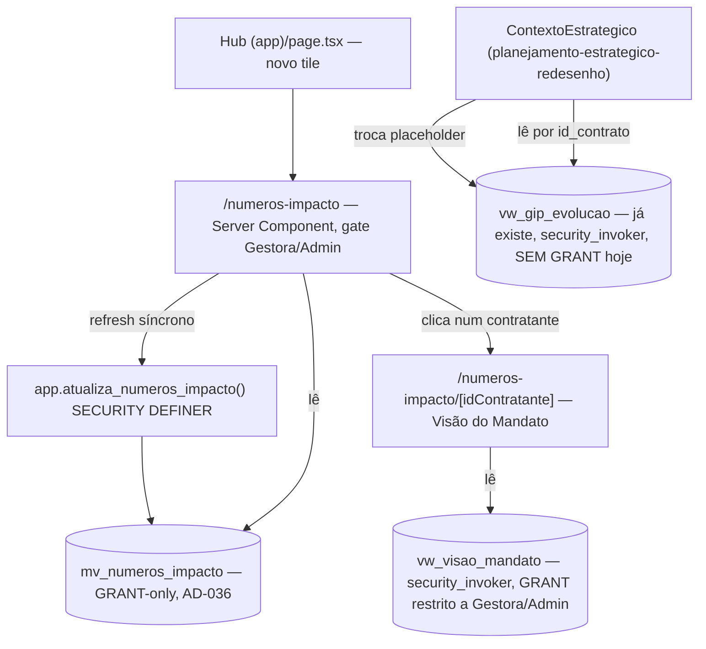

# Saída — Números de Impacto, Visão do Mandato e Evolução do GIP Design

**Spec**: `.specs/features/saida-numeros-impacto/spec.md`
**Context**: `.specs/features/saida-numeros-impacto/context.md`
**Status**: Approved

---

## Architecture Overview

Três leituras independentes da camada Saída, cada uma com seu próprio gate de acesso, todas
extraídas verbatim de `docs/schema_sistema.sql` (AD-008) e sem nenhuma escrita nova (AD-015):



`mv_numeros_impacto` é GRANT-only (não respeita RLS, comentário do próprio schema) — o gate real é
o `GRANT SELECT` na migration, reforçado por um gate de papel no Server Component (2ª camada,
mesmo padrão de `NpsAvaliacoesCard`/`VisaoGerencialPage`, nunca a única defesa — L-034).
`vw_visao_mandato` e `vw_gip_evolucao` são `security_invoker = true` (verbatim do schema aprovado)
— o gate real vira o `GRANT SELECT` **na view em si**, não RLS nova em `fat_contrato`/
`dim_contratante`/`fat_gip` (que já existe e não muda).

---

## Code Reuse Analysis

### Existing Components to Leverage

| Component | Location | How to Use |
| --- | --- | --- |
| Padrão de refresh síncrono `SECURITY DEFINER` (AD-035) | `supabase/migrations/20260813194110_incidencia_encontros_iip.sql` (`app.atualiza_iip_contrato`), `20260815132800_formularios_produto_nps_refresh.sql` (`app.atualiza_avaliacao_nps`) | Copiar o mesmo padrão para `app.atualiza_numeros_impacto()`: `REFRESH MATERIALIZED VIEW CONCURRENTLY mv_numeros_impacto;`, `SECURITY DEFINER SET search_path = public, pg_temp` |
| `rpc/iip.ts` (wrapper de RPC sem parâmetro) | `src/backend/rpc/iip.ts` | Mesmo formato para `src/backend/rpc/numeros-impacto.ts` (`atualizaNumerosImpacto`) |
| `IipCard` (refresh-then-read on mount) | `src/frontend/components/incidencia/iip-card.tsx` | Mesma sequência (`await atualiza...; await busca...`) na página `/numeros-impacto`, mas via `useQuery` (AD-021, já cumprida em features mais recentes) em vez de `useState`/`useEffect` manual — ver Tech Decisions |
| Gate de papel server-side + `<NaoAutorizado>` | `src/frontend/app/(app)/visao-gerencial/page.tsx:52-66` | Copiar padrão exato: `buscarPapelGlobalAtual(client)`, bloquear quem não for `gestora`/`admin` antes de qualquer bloco renderizar |
| Tile do Hub | `src/frontend/app/(app)/page.tsx:62-84` (tile "Visão Gerencial") | Duplicar o bloco `<Link href="/numeros-impacto">` com ícone próprio (ex.: `TrendingUp` do lucide-react, a decidir em Tasks) |
| `PRODUTO_SLUGS` / padrão de query "buscar\*" | `src/backend/queries/produto.ts`, `visao-gerencial.ts` | Mesma convenção de nomes (`buscarNumerosImpacto`, `buscarVisaoMandato`) e de mapear `snake_case` do banco para `camelCase` no retorno |
| `ContextoEstrategico` + `PlanejamentoCompleto`/`PreditorPrioritarioLinha` | `src/frontend/components/planejamento/contexto-estrategico.tsx`, `src/backend/queries/planejamento.ts` | Adicionar `buscarEvolucaoGip` em `queries/planejamento.ts` (mesmo arquivo, já é o import site de `ContextoEstrategico`) e uma nova prop `evolucaoGip` no componente |
| `<EstadoVazio>`/`<ErroInline>`/`<CarregandoSkeleton>` (AD-029) | `components/ui/` | Reuso direto nas 3 telas novas, sem componente próprio |
| `usePapelGlobal` (gate client-side onde precisar) | `src/frontend/hooks/use-papel-global.ts` | Só como 2ª camada de UI (ex.: esconder o tile do Hub para quem não é Gestora/Admin) — nunca a única defesa |

### Integration Points

| System | Integration Method |
| --- | --- |
| `docs/schema_sistema.sql:1205-1245` | `mv_numeros_impacto` extraída verbatim (colunas, `WITH NO DATA`, índice único, comentário) |
| `docs/schema_sistema.sql:1304-1324` | `vw_visao_mandato` extraída verbatim |
| `vw_gip_evolucao` (já provisionada, `20260814174709_formularios_produto_gip_view.sql`) | Nenhuma migration de estrutura — só `GRANT SELECT` (achado desta fase, ver Risks) + consumo novo no frontend |
| `dim_usuario.papel_global` | Gate de acesso server-side, mesmo padrão de `visao-gerencial-g3-g6` |
| `PostgREST` / roles `legisla_*` | `GRANT SELECT` explícito nas 2 relações novas + na relação já existente sem grant (AD-025 — toda relação nova ou esquecida precisa de grant próprio, nunca herda de "ALL TABLES" retroativamente) |

---

## Components

### `app.atualiza_numeros_impacto()` (SQL)

- **Purpose**: Recômputo determinístico sem parâmetro do chamador (AD-035) — `REFRESH MATERIALIZED
  VIEW CONCURRENTLY mv_numeros_impacto`.
- **Location**: nova migration `supabase/migrations/<timestamp>_saida_numeros_impacto_refresh.sql`
- **Interfaces**: `app.atualiza_numeros_impacto() RETURNS void`, `SECURITY DEFINER SET search_path
  = public, pg_temp` (mesma razão de `app.atualiza_iip_contrato`: `REFRESH ... CONCURRENTLY` exige
  ownership, nenhuma role `legisla_*` é dona do objeto).
- **Dependencies**: `mv_numeros_impacto` já populada 1x sem `CONCURRENTLY` (na própria migration de
  estrutura, logo após o `CREATE MATERIALIZED VIEW ... WITH NO DATA`).
- **Reuses**: padrão de `app.atualiza_iip_contrato`/`app.atualiza_avaliacao_nps`.

### `src/backend/rpc/numeros-impacto.ts`

- **Purpose**: único ponto de chamada de `app.atualiza_numeros_impacto`.
- **Interfaces**: `atualizaNumerosImpacto(client: SupabaseClient<Database>): Promise<void>`
- **Reuses**: `rpc/iip.ts` como molde exato (`mapeiaErroRpc`, sem parâmetro).

### `src/backend/queries/numeros-impacto.ts` (novo arquivo)

- **Purpose**: leitura de `mv_numeros_impacto` (lista agregada) e de `vw_visao_mandato` (timeline
  por contratante).
- **Interfaces**:
  - `buscarNumerosImpacto(client): Promise<LinhaNumerosImpacto[]>` — sem filtro de status (D4,
    verbatim); ordenar por `nome_contratante` no backend (a MV não define ordem).
  - `buscarVisaoMandato(client, idContratante: number): Promise<LinhaVisaoMandato[]>` — `.eq(
    "id_contratante", idContratante).order("ordem_contrato")`.
- **Dependencies**: `Database` types regenerados (`npm run db:types`) após a migration de
  estrutura — as duas relações são novas, não têm tipo ainda.
- **Reuses**: convenção de `visao-gerencial.ts`/`produto.ts` (interface `LinhaXxx` em camelCase +
  interface `RowXxx` privada espelhando o retorno cru do PostgREST).

### `queries/planejamento.ts` — `buscarEvolucaoGip` (função nova, arquivo existente)

- **Purpose**: leitura de `vw_gip_evolucao` filtrada por `id_contrato`, para `ContextoEstrategico`.
- **Interfaces**: `buscarEvolucaoGip(client, idContrato: number): Promise<LinhaEvolucaoGip[]>` —
  `.eq("id_contrato", idContrato).order("momento").order("ordem")`.
- **Reuses**: mesmo arquivo que já exporta `PlanejamentoCompleto`/`PreditorPrioritarioLinha`,
  consumidos por `ContextoEstrategico` — mesma convenção de tipos, mesmo import site.

### `/numeros-impacto` (Server Component)

- **Purpose**: tela nova — gate de papel, refresh síncrono, lista agregada, link pro tile do Hub.
- **Location**: `src/frontend/app/(app)/numeros-impacto/page.tsx`
- **Dependencies**: `buscarPapelGlobalAtual`, `atualizaNumerosImpacto`, `buscarNumerosImpacto`.
- **Reuses**: gate de `visao-gerencial/page.tsx` (bloqueia `mentor`/`assessor` com
  `<NaoAutorizado>` antes de renderizar qualquer bloco).

### `/numeros-impacto/[idContratante]` (Server Component — Visão do Mandato)

- **Purpose**: timeline consolidada de um contratante (Constituição §2.6: "ao clicar em um
  mandato... abre-se uma visão consolidada").
- **Location**: `src/frontend/app/(app)/numeros-impacto/[idContratante]/page.tsx`
- **Dependencies**: mesmo gate de papel (repetido — rota acessível por URL direta, não só pelo
  clique); `buscarVisaoMandato`.
- **Reuses**: mesmo padrão de `<CarregandoSkeleton>`/`<EstadoVazio>` (contratante com 0 contratos
  não deveria existir por FK, mas a tela trata como `<EstadoVazio>` defensivamente, não erro).

### `ContextoEstrategico` (ajuste, feature `planejamento-estrategico-redesenho`)

- **Purpose**: substituir o placeholder de GIP por leitura real.
- **Location**: `src/frontend/components/planejamento/contexto-estrategico.tsx` (edição, não
  arquivo novo).
- **Interfaces**: nova prop `evolucaoGip: LinhaEvolucaoGip[]` (buscada pelo `page.tsx` pai do
  Planejamento Estratégico, mesmo nível de `planejamento`/`preditoresAtuais` hoje — Server
  Component busca, Client Component só recebe dado serializável, mesma lição de
  `visao-gerencial-g3-g6` sobre não passar função como prop).
- **Reuses**: `<EstadoVazio>` para `fat_gip` vazio; estrutura de lista/tabela simples (a decidir em
  Tasks: agrupar por dimensão ou por momento — spec.md não fixa isso, é Agent's Discretion do
  `context.md`).

---

## Data Models

### `LinhaNumerosImpacto` (`queries/numeros-impacto.ts`)

```typescript
interface LinhaNumerosImpacto {
  idContrato: number;
  idContratante: number;
  nomeContratante: string;
  tipoContratante: string; // 'mandato' | 'coalizao'
  sgUf: string | null;
  nmMunicipio: string | null;
  nomeProduto: string;
  nomeProjeto: string | null;
  tematica: string | null;
  dtInicio: string;
  dtFim: string | null;
  anoInicio: number;
  status: string;
  cargoNoContrato: string | null;
  partidoNoContrato: string | null;
  nrContratosContratante: number;
  dtPrimeiraContratacao: string;
  ordemContrato: number;
}
```

**Relationships**: 1 linha = 1 `fat_contrato`; `nrContratosContratante`/`dtPrimeiraContratacao`/
`ordemContrato` são window functions já resolvidas pela MV (nunca recalculadas no frontend, spec.md
P1.AC1).

### `LinhaVisaoMandato` (`queries/numeros-impacto.ts`)

```typescript
interface LinhaVisaoMandato {
  idContrato: number;
  dtInicio: string;
  dtFim: string | null;
  status: string;
  nomeProduto: string;
  nomeProjeto: string | null;
  cargoNoContrato: string | null;
  partidoNoContrato: string | null;
  idContratoAnterior: number | null;
  ordemContrato: number;
}
```

**Relationships**: N linhas por `id_contratante` (1 timeline); `idContratoAnterior` liga
renovações — a UI usa isso pra desenhar continuidade, nunca dois cards desconexos quando ele não é
`null`.

### `LinhaEvolucaoGip` (`queries/planejamento.ts`)

```typescript
interface LinhaEvolucaoGip {
  idContrato: number;
  momento: "inicio" | "meio" | "fim";
  aplicadoEm: string;
  dimensao: string;
  nomeDimensao: string;
  ordem: number;
  reguaSonhos: number | null;
  ondeChegamos: number | null;
  gap: number | null;
  situacao: "atingiu" | "proximo" | "distante" | null;
  quadrante: string | null;
}
```

**Relationships**: N linhas por `id_contrato` × dimensão ativa × momento (`fat_gip` CROSS JOIN
`ref_dimensao_gip` filtrado por `ativo`). `quadrante` é o mesmo valor em toda linha do mesmo
`momento` (coluna gerada em `fat_gip`, não por dimensão) — a UI mostra 1x por momento, não repete
por dimensão.

---

## Error Handling Strategy

| Error Scenario | Handling | User Impact |
| --- | --- | --- |
| Papel sem GRANT tenta ler `mv_numeros_impacto`/`vw_visao_mandato`/`vw_gip_evolucao` diretamente (URL, não pelo gate de UI) | Postgres retorna `42501` (permission denied) antes de qualquer RLS ser avaliada (GRANT é checado primeiro) | Query falha com erro de permissão — mapeado por `mapeiaErroRpc`/tratamento padrão de query, nunca dado parcial |
| `mv_numeros_impacto` sendo refrescada por 2 requisições concorrentes (`REFRESH CONCURRENTLY` não bloqueia leitura, mas 2 `REFRESH` simultâneos podem colidir) | Postgres serializa `REFRESH CONCURRENTLY` na mesma MV via lock próprio — a 2ª chamada espera a 1ª terminar, nenhuma falha (comportamento nativo, não é lógica de aplicação) | Segunda aba pode demorar um pouco mais na 1ª carga; nunca erro nem dado inconsistente |
| Contratante sem nenhum contrato (não deveria existir por FK `fat_contrato.id_contratante NOT NULL`) | `buscarVisaoMandato` retorna `[]`; página mostra `<EstadoVazio>` | Nunca crash — defensivo, mesmo padrão AD-005 |
| `fat_gip` vazio para o `id_contrato` do Planejamento aberto | `buscarEvolucaoGip` retorna `[]`; `ContextoEstrategico` mostra `<EstadoVazio>` no lugar do placeholder fixo atual | Texto muda de "em desenvolvimento" pra "nenhuma aplicação de GIP ainda" (redação exata, Tasks) |
| Refresh falha (ex.: timeout, banco sob carga) | `atualizaNumerosImpacto` propaga o erro (`mapeiaErroRpc`); página mostra `<ErroInline>` com retry — nunca serve dado sem tentar refrescar primeiro nem trava a tela indefinidamente | Usuário vê erro com botão de retry, mesmo padrão de `IipCard` |

---

## Risks & Concerns

| Concern | Location (file:line) | Impact | Mitigation |
| --- | --- | --- | --- |
| **Achado real desta sessão de Design**: `vw_gip_evolucao` já existe (`formularios-produto`, T9) mas **nunca recebeu nenhum `GRANT`** — nem legisla_gestora/admin têm `SELECT` nela hoje, apesar de terem `SELECT` em `fat_gip`/`fat_gip_dimensao`/`ref_dimensao_gip` (as tabelas de base). Confirmado por grep exaustivo em `supabase/migrations/` — zero ocorrência de `GRANT` citando esta view. | `supabase/migrations/20260814174709_formularios_produto_gip_view.sql` (criação, sem grant) | Sem este fix, P3 inteira (Evolução do GIP) é inalcançável mesmo depois do frontend pronto — toda leitura de `vw_gip_evolucao` retornaria `42501` para qualquer papel, inclusive Gestora | Task nova nesta feature: `GRANT SELECT ON vw_gip_evolucao TO legisla_gestora, legisla_admin;` (mesmo escopo de papel de `fat_gip`, T7 — nenhum Mentor/Assessor previsto respondendo GIP) |
| `mv_numeros_impacto`/`vw_visao_mandato` são relações **novas** em `public` | N/A (migration a criar) | Sem `GRANT` explícito, nenhuma role `legisla_*` as lê — nem Gestora/Admin, que só têm `ALL TABLES IN SCHEMA public` retroativo até `0004` (AD-025, gotcha já documentado 4x no projeto) | `GRANT SELECT` explícito nas 2 relações, escopado a `legisla_gestora, legisla_admin` (nunca `legisla_mentor`/`legisla_assessor`, por decisão de Discuss Q4/AD-036) |
| `mv_numeros_impacto` nasce `WITH NO DATA` — `REFRESH CONCURRENTLY` falha se a MV nunca foi populada sem `CONCURRENTLY` antes | `docs/schema_sistema.sql:1240` | Sem o `REFRESH` inicial não-concorrente, a 1ª chamada de `app.atualiza_numeros_impacto()` falha com erro do Postgres ("materialized view has not been populated") | `REFRESH MATERIALIZED VIEW mv_numeros_impacto;` (sem `CONCURRENTLY`) na própria migration de estrutura, logo após o `CREATE MATERIALIZED VIEW`, mesmo padrão já usado 2x no projeto |
| Nenhum sistema de agendamento (`pg_cron`) para refresh periódico | Decisão de projeto, não desta feature | `mv_numeros_impacto` só atualiza quando alguém abre `/numeros-impacto` — se ninguém abrir por dias, o dado fica obsoleto sem aviso | Aceito conscientemente (decisão de Pedro, Discuss Q2) — mesmo padrão de `mv_iip_contrato`/`mv_avaliacao_nps`; fora de escopo introduzir `pg_cron` nesta feature |
| `mv_numeros_impacto` faz `LEFT JOIN dim_mandato m ON m.id_contratante = c.id_contratante` sem filtro de `eh_mandato_vigente` — se um contratante-coalizão nunca tiver linha em `dim_mandato` (join correto, `LEFT JOIN`), os campos `ds_raca`/`ds_genero`/`fl_pcd` saem `NULL` (AD-005, esperado); mas se um `id_contratante` (mandato) tiver **múltiplas** linhas de `dim_mandato` por algum motivo de dado legado, a MV duplicaria a linha do contrato | `docs/schema_sistema.sql:1239` (verbatim, não é desvio desta feature) | Duplicação silenciosa de linha na listagem, caso o dado permita | Nenhuma mitigação de código — é o schema aprovado verbatim (AD-008); registrar como suposição a confirmar via teste de integração (checar `dim_mandato.id_contratante` é praticamente 1:1 na prática, dado real de dev) — se o teste achar duplicata real, é achado a levar ao Pedro, não a corrigir silenciosamente redesenhando a MV |

---

## Tech Decisions (only non-obvious ones)

| Decision | Choice | Rationale |
| --- | --- | --- |
| **Nova entrada AD-036** (GRANT-only de `mv_numeros_impacto`) | Escrita em `.specs/STATE.md` nesta fase de Design, antes de qualquer migration (ver seção própria abaixo) | Decisão de Pedro (Discuss Q1) — AD-030 documentaria a razão errada; AD-036 é uma classe distinta e precisa de texto próprio |
| Refresh: `useQuery` (TanStack) em vez do `useState`/`useEffect` manual de `IipCard` | `useQuery({ queryFn: async () => { await atualizaNumerosImpacto(client); return buscarNumerosImpacto(client); } })` | `IipCard` é anterior à consolidação de AD-021 em telas de Saída (`visao-gerencial-g3-g6` já usa TanStack em todos os blocos); replicar o padrão mais recente evita reintroduzir o padrão manual antigo numa feature nova. Mesmo comportamento observável (refresh-then-read on mount), só o mecanismo de estado muda. |
| Visão do Mandato é rota própria (`/numeros-impacto/[idContratante]`), não modal | Rota dedicada | Constituição §2.6 diz "abre-se uma visão consolidada" (não "abre-se um modal"); conteúdo é uma timeline, potencialmente longa — rota própria é bookmarkável e consistente com o padrão já usado para fichas (`/contratos/[id]`) |
| `buscarEvolucaoGip` entra em `queries/planejamento.ts` (arquivo existente), não em `queries/numeros-impacto.ts` (arquivo novo desta feature) | `queries/planejamento.ts` | É o import site atual de `ContextoEstrategico` (`PlanejamentoCompleto`/`PreditorPrioritarioLinha`) — colocar a nova função ali evita um import cruzado desnecessário entre "numeros-impacto" (tela nova) e "planejamento" (tela existente) por um dado que não tem nada a ver com Números de Impacto |
| Gate de papel: bloquear `mentor`/`assessor`, permitir `gestora`/`admin` (sem checar um papel "área cliente" específico) | Mesmo enum de `papel_global` já existente (AD-018) | Decisão de Pedro (Discuss Q4) — "áreas clientes" não é papel de RBAC, é sinônimo de acesso via Gestora/Admin |

> **Project-level decision**: AD-036 é escrita abaixo, no bloco de STATE.md desta sessão (Design), não deferida para o fechamento da feature — decisão de segurança/arquitetura, mesmo critério das features anteriores (AD-033, AD-034, AD-035, todas registradas durante Design/Execute, não só no handoff final).

---

## AD-036 (a inserir em `.specs/STATE.md` § Decisions)

> ### AD-036
> - **Decision**: `mv_numeros_impacto` (Saída, Números de Impacto) é GRANT-only (exceção ao
>   AD-001), mas por uma razão **diferente** da AD-030: ela tem coluna de granularidade por
>   contrato/contratante (`id_contrato`/`id_contratante`) — a exceção aqui não é "não há coluna
>   para filtrar por linha" (razão da AD-030, catálogos `ref_*`), é "a leitura é deliberadamente
>   organização-inteira" (números de impacto agregados para áreas clientes/Interno Legisla, nunca
>   uma carteira pessoal recortada por Gestora/Mentor). GRANT restrito a `legisla_gestora,
>   legisla_admin` — nunca `legisla_mentor`/`legisla_assessor`.
> - **Reason**: Achado de Design de `saida-numeros-impacto`. Reaproveitar o texto da AD-030 por
>   analogia registraria uma justificativa técnica que não é verdadeira para este caso — uma
>   leitura futura do STATE.md concluiria erroneamente que a MV não tem coluna de carteira, quando
>   na verdade tem. Decisão de Pedro (Discuss Q1, `AskUserQuestion`, 2026-08-30): nova entrada em
>   vez de estender AD-030.
> - **Trade-off**: A lista de exceções ao AD-001 cresce (agora 2 classes distintas de GRANT-only:
>   AD-030 por ausência de coluna, AD-036 por escopo deliberadamente organizacional) — quem revisar
>   `STATE.md` precisa ler as duas para entender o padrão geral "GRANT-only" do projeto, não uma só.
>   Qualquer MV/view futura de Saída que precise do mesmo tratamento (leitura organização-inteira,
>   não recortada por carteira) deve avaliar se se qualifica para esta classe ou para uma 3ª.
> - **Scope**: `mv_numeros_impacto`; qualquer objeto futuro de Saída com a mesma característica
>   (coluna de contrato presente, mas leitura deliberadamente não recortada por carteira pessoal).
> - **Date**: 2026-08-30
> - **Status**: active

---

## Tips (não incluído no doc final — lembrete do processo)

- **Confirm before Tasks** — este `design.md` está marcado "Approved" porque as 4 decisões de
  produto/segurança já foram fechadas com Pedro no Discuss; a única coisa nova desta fase (achado
  do `GRANT` ausente em `vw_gip_evolucao`) é factual, não uma escolha de produto — não precisa de
  nova rodada de confirmação antes de Tasks.
