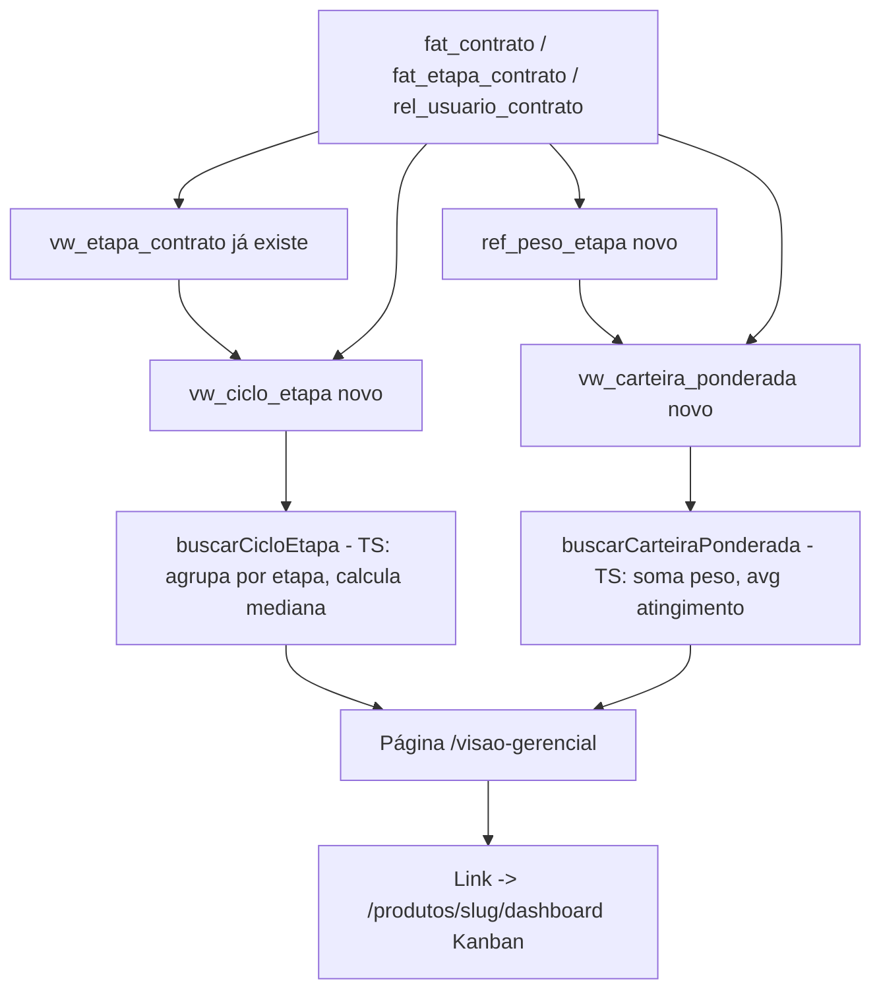

# G1 + G2 — Primeira Fatia de Visão Gerencial Design

**Spec**: `.specs/features/visao-gerencial-g1-g2/spec.md`
**Status**: Draft

---

## Architecture Overview

Duas views novas na camada Saída (AD-003: "nenhum número de gestão sai de tabela transacional") +
uma tabela de catálogo GRANT-only (`ref_peso_etapa`, AD-030) + `vw_carteira` reduzida (AD-032,
achado adicional documentado abaixo). O frontend lê as duas views via backend queries TypeScript
que agregam em memória (soma/média para G1, mediana para G2) — nunca agregação SQL pré-fixada, pelo
motivo descrito em Tech Decisions (composição de filtro sem a armadilha "mediana de medianas").



---

## Code Reuse Analysis

### Existing Components to Leverage

| Component | Location | How to Use |
| --- | --- | --- |
| `vw_etapa_contrato` (view já provisionada) | `supabase/migrations/20260812001130_regua_instanciacao_estrutura.sql` | Base de `vw_ciclo_etapa` (view-on-view) — já expõe `nome_etapa`/`ordem`/`dt_inicio`/`dt_conclusao`/`status` |
| Padrão de agregação em TS a partir de rows de view | `src/backend/queries/kanban.ts` (`buscarBoardKanban`, cálculo de `diasNaEtapaAtual`) | Mesmo estilo: fetch tipado → `Map`/`reduce` em TS, nunca SQL ad-hoc solto |
| Padrão de migration GRANT-only (3 arquivos: estrutura/grants/revoke-default) | `supabase/migrations/20260810191659_catalogos_referencia_estrutura.sql` + `..._grants.sql` + `..._revoke_default_privileges.sql` | Template literal para `ref_peso_etapa` — mesma exceção AD-030 |
| Padrão de re-GRANT em bloco (AD-025) | `supabase/migrations/20260812001310_regua_instanciacao_grants.sql` | `GRANT ... ON ALL TABLES IN SCHEMA public TO legisla_app, legisla_admin, legisla_gestora` precisa rodar de novo nesta feature (views novas contam como relations novas) |
| `<CarregandoSkeleton>`/`<ErroInline>`/`<EstadoVazio>` | `components/ui/` (AD-029) | Os 3 estados da tela de G1/G2, mesmo padrão do Dashboard do produto |
| Filtro Select em cascata | `src/frontend/app/(app)/produtos/[slug]/dashboard/page.tsx` (`filtroBoard`) | Modelo para os Selects de produto/papel desta tela |
| `PRODUTO_SLUGS` / `ProdutoSlug` | `src/backend/queries/produto.ts` | Resolve `id_produto -> slug` para o link "ir pro Kanban" |
| `<EmDesenvolvimento>` | `src/frontend/components/app-shell/em-desenvolvimento.tsx` | Placeholder G3-G6 dentro da mesma página (P2 AC3) |
| Rota `/visao-gerencial` | `src/frontend/app/(app)/visao-gerencial/page.tsx` | Já existe (NAV-13, placeholder). Esta feature substitui o conteúdo, não cria rota nova |

### Integration Points

| System | Integration Method |
| --- | --- |
| Supabase (views) | `security_invoker = true` em ambas as views novas — RLS de `fat_contrato`/`rel_usuario_contrato`/`dim_planejamento` já resolve quem vê o quê (`p_por_carteira`/`p_por_contrato`: admin/gestora sem restrição, mentor/assessor só a própria carteira — confirmado em `0011_fundacao_rls.sql`/`20260812001234_regua_instanciacao_rls.sql`) |
| `database.types.ts` | `npm run db:types` depois das migrations (1ª feature a expor `ref_peso_etapa`/`vw_carteira`/`vw_carteira_ponderada`/`vw_ciclo_etapa` ao frontend) |

---

## Achado real de Design (confirmar antes de Tasks)

**`vw_carteira`, na forma aprovada em `docs/schema_sistema.sql:1327-1349`, tem uma 2ª dependência que
falha `CREATE VIEW` além da já documentada em AD-032.** A subquery `dt_ultimo_registro` lê
`fat_registro`, que **não está provisionada em nenhuma migration** (confirmado por busca em todo
`supabase/migrations/`) — e depende por sua vez de `fat_encontro`, que só existe na mesma onda de
Incidência (`.specs/roadmap.md` §6.2) que já bloqueia `mv_iip_contrato`. AD-032 só documentou o
`LEFT JOIN mv_iip_contrato`; a coluna `dt_ultimo_registro` é um segundo bloqueio estrutural
idêntico em natureza (mesma categoria: `CREATE VIEW` falha sem o objeto referenciado existir), só
que não estava escrito.

**Resolução proposta** (mesmo espírito de AD-032, mesmo gatilho de resolução — não abre uma decisão
nova, é uma extensão do mesmo achado): a versão reduzida desta feature também omite
`dt_ultimo_registro`, junto com `iip_provisorio`/`nr_fatos`. Volta junto quando a Incidência (§6.2)
provisionar `fat_registro`/`mv_iip_contrato` — mesma tarefa de substituição, mesmo débito.
Registrado como adendo à AD-032 em `.specs/STATE.md` (não supersede — mesma decisão, achado
adicional).

---

## Components

### Migration: `ref_peso_etapa` (estrutura + grants + seed)

- **Purpose**: catálogo de peso por etapa (GG-02), padrão GRANT-only AD-030.
- **Location**: `supabase/migrations/<timestamp>_visao_gerencial_peso_etapa_estrutura.sql` +
  `..._grants.sql` + `..._revoke_default_privileges.sql` + `..._seed.sql`
- **Reuses**: template de `catalogos_referencia_estrutura.sql`/`_grants.sql`/`_revoke_default_privileges.sql`

### Migration: `vw_carteira` (reduzida, AD-032 + adendo acima)

- **Purpose**: pré-requisito técnico de G1 (GG-01), view aprovada sem IIP nem `dt_ultimo_registro`.
- **Location**: `supabase/migrations/<timestamp>_visao_gerencial_vw_carteira.sql`

### Migration: `vw_carteira_ponderada` (G1) + `vw_ciclo_etapa` (G2) + grants

- **Purpose**: as duas views de agregação que alimentam G1 (GG-05, GG-06) e G2 (GG-03, GG-04).
- **Location**: `supabase/migrations/<timestamp>_visao_gerencial_views_g1_g2.sql` +
  `..._grants.sql` (re-GRANT em bloco + `GRANT SELECT` explícito a `legisla_mentor`/`legisla_assessor`,
  mesmo padrão de `regua_instanciacao_grants.sql`)

### `src/backend/queries/visao-gerencial.ts` (novo)

- **Purpose**: 2 funções de leitura + agregação em TS, mesmo estilo de `kanban.ts`.
- **Location**: `src/backend/queries/visao-gerencial.ts`
- **Interfaces**:
  - `buscarCarteiraPonderada(client, filtro: { papel: "gestora" | "mentor"; idProduto?: number }): Promise<LinhaCarteiraPonderada[]>` — 1 linha por usuário, soma `peso` (excluindo `NULL`), `qtdContratosSemPeso` (conta os excluídos — alimenta o alerta de dado incompleto), `atingimentoMedio` (`AVG` ignorando `NULL`).
  - `buscarCicloEtapa(client, filtro: { idProduto?: number; idGestora?: number }): Promise<LinhaCicloEtapa[]>` — 1 linha por etapa, `mediana` (`null` quando amostra vazia) + `amostra` (contagem).
- **Dependencies**: `database.types.ts` regenerado.
- **Reuses**: padrão de `filtroVinculoAtivo`/agregação em `Map` de `kanban.ts`.
- **Achado do Execute (T9, fix `f36fdd7`, pós-Validate)**: `vw_carteira_ponderada` só tem linha para
  usuário com pelo menos 1 vínculo ativo × contrato ativo — uma Gestora/Mentor sem nenhum contrato
  ativo nunca aparece na view, o que faria `buscarCarteiraPonderada` omiti-la em vez de mostrar
  `somaPeso: 0` (Edge Case do spec.md, "zero é contagem real"). Corrigido lendo um backbone
  independente de `dim_usuario` filtrado por `papel_global` (mesmo papel do filtro) antes de agregar
  — mesmo padrão já usado pro backbone de `ref_etapa` em `buscarBoardKanban`/`buscarCicloEtapa`
  (`kanban.ts:101-104`). Não é uma 2ª fonte de dado nova, é o mesmo catálogo (`dim_usuario`) já lido
  em `vw_carteira_ponderada`/`vw_ciclo_etapa`, só consultado direto pra garantir a linha zero.

### `src/frontend/app/(app)/visao-gerencial/page.tsx` (substitui o placeholder)

- **Purpose**: GG-07 — G1 + G2 na mesma tela, filtros próprios, link pro Kanban, placeholder G3-G6.
- **Location**: mesmo arquivo já existente (rota não muda, NAV-13 permanece válido)
- **Reuses**: `<CarregandoSkeleton>`/`<ErroInline>`/`<EstadoVazio>`, `<EmDesenvolvimento titulo="G3-G6 em desenvolvimento" />`, `PRODUTO_SLUGS` pro link `/produtos/{slug}/dashboard`.

---

## Data Models

```sql
-- Catálogo GRANT-only (AD-030). id_etapa já determina id_produto via ref_etapa —
-- sem coluna id_produto redundante (simplificação vs. o texto literal do spec).
CREATE TABLE ref_peso_etapa (
  id_etapa  BIGINT PRIMARY KEY REFERENCES ref_etapa(id_etapa),
  peso      NUMERIC(5,2) NOT NULL DEFAULT 1,
  CONSTRAINT ck_peso_etapa_positivo CHECK (peso > 0)
);
-- Seed: peso = 1 em toda linha de ref_etapa hoje existente.

-- G1: 1 linha por vínculo ativo × contrato ativo, com o peso já resolvido
-- (id_etapa_atual, ou a 1ª etapa do produto quando NULL — mesma leitura do Kanban).
CREATE VIEW vw_carteira_ponderada WITH (security_invoker = true) AS
SELECT v.id_usuario, u.nome AS nome_usuario, v.papel_no_contrato,
       c.id_contrato, c.id_produto, p.nome AS nome_produto,
       rpe.peso, pl.pct_atingimento
FROM rel_usuario_contrato v
JOIN fat_contrato c           ON c.id_contrato = v.id_contrato
JOIN dim_usuario u             ON u.id_usuario = v.id_usuario
JOIN ref_produto p             ON p.id_produto = c.id_produto
LEFT JOIN ref_peso_etapa rpe   ON rpe.id_etapa = COALESCE(
                                    c.id_etapa_atual,
                                    (SELECT e1.id_etapa FROM ref_etapa e1
                                     WHERE e1.id_produto = c.id_produto AND e1.ordem = 1))
LEFT JOIN dim_planejamento pl  ON pl.id_contrato = c.id_contrato
WHERE c.status = 'ativo' AND (v.dt_fim IS NULL OR v.dt_fim >= CURRENT_DATE);

-- G2: 1 linha por etapa concluída, com produto e Gestora denormalizados.
-- view-on-view de vw_etapa_contrato (já existe) -- reuse, não redesenho.
CREATE VIEW vw_ciclo_etapa WITH (security_invoker = true) AS
SELECT vec.id_contrato, vec.id_etapa, vec.nome_etapa, vec.ordem,
       c.id_produto, p.nome AS nome_produto,
       v.id_usuario AS id_usuario_gestora, u.nome AS nome_gestora,
       (vec.dt_conclusao - vec.dt_inicio) AS dias_ciclo
FROM vw_etapa_contrato vec
JOIN fat_contrato c               ON c.id_contrato = vec.id_contrato
JOIN ref_produto p                 ON p.id_produto = c.id_produto
LEFT JOIN rel_usuario_contrato v   ON v.id_contrato = c.id_contrato AND v.papel_no_contrato = 'gestora'
                                     AND (v.dt_fim IS NULL OR v.dt_fim >= CURRENT_DATE)
LEFT JOIN dim_usuario u            ON u.id_usuario = v.id_usuario
WHERE vec.status = 'concluida';
```

```typescript
// src/backend/queries/visao-gerencial.ts
interface LinhaCarteiraPonderada {
  idUsuario: number;
  nomeUsuario: string;
  somaPeso: number;
  qtdContratos: number;
  qtdContratosSemPeso: number; // peso NULL -- lacuna de seed, excluído da soma
  atingimentoMedio: number | null;
}

interface LinhaCicloEtapa {
  idEtapa: number;
  nomeEtapa: string;
  ordem: number;
  mediana: number | null; // null = amostra vazia (AD-005, nunca 0)
  amostra: number;
}
```

**Relationships**: `vw_carteira_ponderada.id_usuario` -> `dim_usuario`; `vw_ciclo_etapa.id_etapa` ->
`ref_etapa` (mesmo catálogo do Kanban).

---

## Error Handling Strategy

| Error Scenario | Handling | User Impact |
| --- | --- | --- |
| Erro de rede/RLS ao buscar qualquer uma das 2 views | `<ErroInline>` (AD-029), mesmo padrão do Dashboard | Mensagem de erro, sem quebrar o resto da tela |
| G2: etapa sem nenhuma ocorrência `concluida` | `mediana: null` no retorno da query | "sem dado suficiente" (AC3), nunca 0 |
| G1: Gestora sem nenhum contrato ativo | `somaPeso: 0` (linha real, não omitida) | "0" mostrado (Edge Case — zero é contagem real) |
| G1: lacuna de seed em `ref_peso_etapa` (`peso IS NULL`) | contrato excluído da soma, contado em `qtdContratosSemPeso` | Alerta visual de dado incompleto ao lado do número, não erro silencioso |

---

## Risks & Concerns

| Concern | Location | Impact | Mitigation |
| --- | --- | --- | --- |
| `vw_carteira` aprovada referencia `fat_registro` (não provisionada) além de `mv_iip_contrato` | `docs/schema_sistema.sql:1340` | `CREATE VIEW` falharia se copiada verbatim | Ver seção "Achado real de Design" acima — reduzida omite as duas colunas, adendo à AD-032 |
| Mediana calculada em TS, não em SQL | `buscarCicloEtapa` | Com volume de teste (dezenas de linhas) irrelevante; se a base crescer para milhares de etapas concluídas por corte, mover para `percentile_cont` em função Postgres | Não é bloqueio desta fatia (dado de teste); documentado como próximo passo se o volume mudar |
| `vw_ciclo_etapa`/`vw_carteira_ponderada` duplicam linha se um contrato tiver 2 vínculos ativos como `gestora` simultaneamente (schema permite, sem `CHECK` que impeça) | `rel_usuario_contrato` (`uq_vinculo` só impede duplicar o mesmo usuário, não impede 2 usuários diferentes) | Inflaria a amostra/soma naquele caso raro | Mesmo comportamento não-deduplicado de `vw_carteira` já aprovada (não é regressão desta feature); fora de escopo corrigir aqui |

> Nenhum outro concern novo encontrado na leitura de `fat_contrato`/`rel_usuario_contrato`/RLS desta
> feature (já auditados por `kanban-etapas`/`operacao-regua-instanciacao`).

---

## Tech Decisions

| Decision | Choice | Rationale |
| --- | --- | --- |
| `ref_peso_etapa`: 2 colunas (`id_etapa`, `peso`) em vez das 3 sugeridas no spec (`id_produto`, `id_etapa`, `peso`) | `id_etapa BIGINT PRIMARY KEY REFERENCES ref_etapa` | `ref_etapa.id_produto` já determina o produto de cada etapa — duplicar a coluna é redundância sem ganho (nenhum outro catálogo do schema aprovado repete uma FK só por conveniência de query) |
| G1/G2: agregação (soma/média/mediana) em TypeScript sobre rows de view, não view SQL pré-agrupada | Views expõem grão fino (1 linha por vínculo/etapa-concluída); `buscarCarteiraPonderada`/`buscarCicloEtapa` agregam depois de aplicar o filtro | Uma view pré-agrupada por (etapa, produto, Gestora) quebraria ao combinar filtros parciais — mediana/soma de sub-grupos já agregados não é recompútavel corretamente ("mediana de medianas"). Filtrar as linhas cruas e agregar depois evita a armadilha e ainda respeita AD-003 (a fonte é sempre uma view, nunca a tabela transacional direta) |
| `vw_ciclo_etapa` construída sobre `vw_etapa_contrato` (view-on-view), não sobre `fat_etapa_contrato` direto | `FROM vw_etapa_contrato` | Reuso — evita duplicar o `JOIN ref_etapa` que a view já faz; `security_invoker=true` compõe corretamente entre views |
| "Corte por mandato" (mencionado só na tabela de Assumptions, não nas ACs de G2) | Coberto pelo filtro de produto (Estratégia/PLL = mandato, Coalizão = coalizão) — sem dimensão de filtro própria | As ACs de G2 (`spec.md`) só declaram filtro por produto e por Gestora; "mandato" como filtro adicional não tem um AC próprio para testar contra — tratar como sinônimo do filtro de produto evita inventar comportamento não especificado |

> **Nenhuma decisão aqui é project-level (AD-NNN) nova** — o achado de `vw_carteira`/`fat_registro`
> é registrado como adendo à AD-032 já existente, não uma decisão nova.

---

## Requirement → Component Mapping

| Requirement | Component |
| --- | --- |
| GG-01 (`vw_carteira` reduzida) | Migration `vw_carteira` |
| GG-02 (`ref_peso_etapa`) | Migration `ref_peso_etapa` (estrutura+grants+seed) |
| GG-03/GG-04 (G2 mediana + cortes) | `vw_ciclo_etapa` + `buscarCicloEtapa` |
| GG-05/GG-06 (G1 soma ponderada + atingimento) | `vw_carteira_ponderada` + `buscarCarteiraPonderada` |
| GG-07 (página mínima) | `visao-gerencial/page.tsx` |
