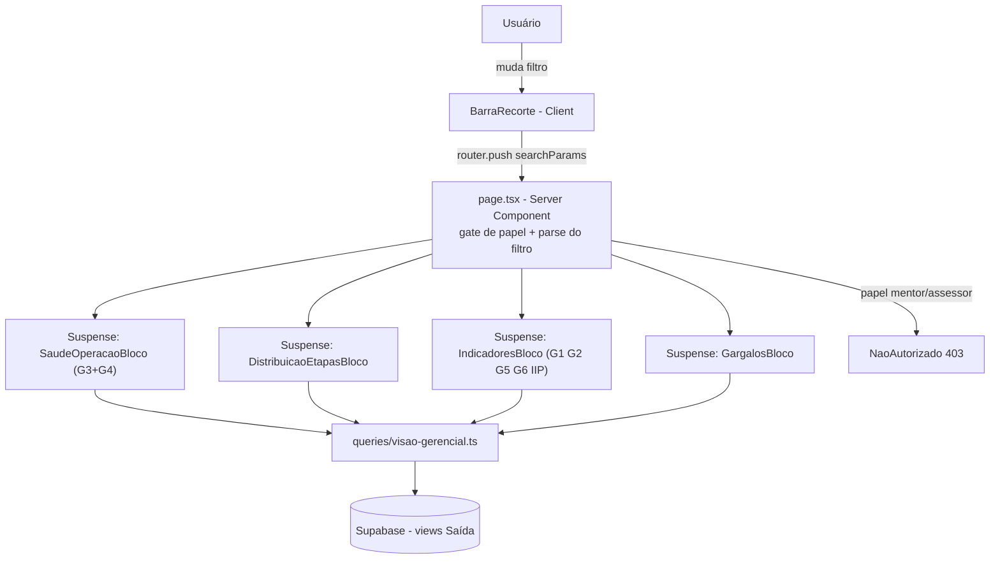

# Visão Gerencial G3-G6 (Tela Gerencial completa) Design

**Spec**: `.specs/features/visao-gerencial-g3-g6/spec.md`
**Status**: Draft

---

## Achado que reverte uma decisão do Discuss (leia antes do resto)

`context.md` registrava "G6 evolução: constrói agora" (decisão tomada durante
o Discuss desta sessão, depois de eu confirmar que `log_auditoria` tem
`valor_anterior`/`valor_novo` JSONB de linha inteira e trigger já ligado em
`dim_mandato`). Ao desenhar a view de fato, encontrei um bloqueio real que não
tinha conferido antes de perguntar: **`log_auditoria` tem RLS `p_log_admin
USING (app.papel_atual() = 'admin')`** (`0008_plataforma_tabelas.sql:146`) —
só Admin lê, nunca Gestora. Como esta tela é `gestora`+`admin` e uma view
`security_invoker=true` (padrão de toda a Saída) herdaria essa RLS, o card de
G6 evolução simplesmente viria vazio pra Gestora — o público principal da
tela. Resolver isso exigiria um 6º precedente de exceção à lista fechada da
AD-010/AD-035 (expor leitura agregada via `SECURITY DEFINER` sobre uma tabela
de auditoria), decisão que não é minha pra tomar sozinho meio a uma sessão de
Design.

**Decisão**: revertendo para o recomendado original — G6 nasce **sem**
evolução, `TODO(G6-evolucao)`, mesmo padrão de G5. Se você quiser abrir essa
exceção de segurança depois, é uma decisão explícita separada (equivalente à
AD-033), não algo que decido por analogia.

---

## Architecture Overview

Primeiro Server Component + `<Suspense>` por bloco do projeto (hoje toda tela
é Client Component + `useQuery`, AD-021 nunca proibiu isso, só nunca foi
usado). A barra de recorte é o único Client Component "puro" de nível de
página — escreve filtros na URL; o Next re-renderiza a page (Server Component)
com `searchParams` novos, e cada bloco filho recebe o filtro como prop e busca
os próprios dados no servidor.



---

## Code Reuse Analysis

### Existing Components to Leverage

| Component | Location | How to Use |
| --- | --- | --- |
| `CarteiraPonderadaCard`/`CicloEtapaCard` | `src/frontend/components/visao-gerencial/*.tsx` | Refatorar: remove `Select` próprio de produto/papel/Gestora, passa a receber `FiltroRecorte` via prop (vindo do Server Component pai); mantém o "alternador Gestora/Mentor" de G1 como controle client-side legítimo (é modo de agregação, não recorte — ver nota abaixo) |
| `buscarCarteiraPonderada`/`buscarCicloEtapa` | `src/backend/queries/visao-gerencial.ts` | Reutiliza integralmente a lógica de agregação (mediana/soma em TS) — só o parâmetro de filtro muda de forma local pra `FiltroRecorte` compartilhado |
| `CarregandoSkeleton`/`ErroInline`/`EstadoVazio` | `src/components/ui/*.tsx` | Usado em todo bloco novo, igual ao padrão de G1/G2 |
| `usePapelGlobal` (padrão de leitura) | `src/frontend/hooks/use-papel-global.ts` | Não reutilizável diretamente (é client-only, `"use client"`) — inspira a versão server-side nova (`buscarPapelGlobalAtual`), mesmo shape de query (`auth.getUser()` → email → `dim_usuario`) |
| `createClient` (server) | `src/backend/supabase/server.ts` | Usado por todo bloco Server Component novo — client anon-key com cookie bridge, RLS igual ao client browser |
| `PRODUTO_SLUGS`/`buscarIdProdutoPorNome` | `src/backend/queries/produto.ts` | Reaproveitado pela `BarraRecorte` pra popular o Select de Produto |
| Rota do Kanban por produto | `/produtos/{slug}/dashboard` | Destino de navegação do modal de etapa (Bloco 1) e de linhas `etapa_atrasada` do Bloco 3 |

### Integration Points

| System | Integration Method |
| --- | --- |
| Supabase (views Saída) | Todo bloco novo lê via `createClient()` server-side, nunca `service_role` — `security_invoker=true` em toda view nova (AD-011, AD-015) |
| `mv_iip_contrato` | Leitura server-only (regra de segurança §9 do pedido original — MV sem RLS, nunca em client component) |
| Next.js App Router (`searchParams`) | `page.tsx` recebe `searchParams: Promise<Record<string,string|string[]|undefined>>` (Next 16), faz `await` e parseia pra `FiltroRecorte` |
| Recharts (via shadcn `chart`) | Componentes de gráfico novos (`chart-linha-evolucao.tsx`, `chart-barra-horizontal.tsx`) — dependência nova, ver Tech Decisions |

---

## Components

### `buscarPapelGlobalAtual`

- **Purpose**: versão server-side de `usePapelGlobal`, pra gate de rota.
- **Location**: `src/backend/queries/usuario.ts` (nova função no arquivo existente, ou criado se não existir)
- **Interfaces**: `buscarPapelGlobalAtual(client: SupabaseClient<Database>): Promise<PapelGlobal | null>`
- **Dependencies**: `auth.getUser()` + `dim_usuario`
- **Reuses**: mesmo shape de query de `use-papel-global.ts:30-38`

### `page.tsx` (Server Component, gate + composição)

- **Purpose**: gate de papel (403 antes de qualquer bloco) + parse de `searchParams` → `FiltroRecorte` + monta os 4 blocos em `<Suspense>`.
- **Location**: `src/frontend/app/(app)/visao-gerencial/page.tsx`
- **Dependencies**: `buscarPapelGlobalAtual`, `createClient` (server)

### `BarraRecorte` (Client)

- **Purpose**: os 5 filtros + chips removíveis + "limpar tudo", grava em `searchParams` via `useRouter`/`usePathname`.
- **Location**: `src/frontend/components/visao-gerencial/barra-recorte.tsx`
- **Interfaces**: sem props de dado — lê/escreve a própria URL
- **Reuses**: `PRODUTO_SLUGS`, `Select`/`Badge`/`Button` de `components/ui`

### `NaoAutorizado`

- **Purpose**: componente de bloqueio 403 (primeiro do projeto — nenhum precedente encontrado).
- **Location**: `src/frontend/components/app-shell/nao-autorizado.tsx`
- **Interfaces**: `NaoAutorizado({ titulo?, mensagem? })`

### `SaudeOperacaoBloco` (Server, Bloco 0 — G3+G4)

- **Purpose**: renderiza G3+G4, estado atual + evolução.
- **Location**: `src/frontend/components/visao-gerencial/saude-operacao-bloco.tsx`
- **Dependencies**: `buscarSaudeCobertura`, `buscarSaudeFormularios` (novas, `queries/visao-gerencial.ts`)

### `DistribuicaoEtapasBloco` (Server, Bloco 1) + `EtapaContratosModal` (Client)

- **Purpose**: barras por etapa (ordem da régua) com segmento de atraso; modal com lista de contratos ao clicar.
- **Location**: `src/frontend/components/visao-gerencial/distribuicao-etapas-bloco.tsx`, `.../etapa-contratos-modal.tsx`
- **Dependencies**: `buscarDistribuicaoEtapas` (nova)

### `IndicadoresBloco` (Server, Bloco 2 — grade 2 colunas)

- **Purpose**: compõe G1 (refatorado), G2 (refatorado), G5, G6, IIP.
- **Location**: `src/frontend/components/visao-gerencial/indicadores-bloco.tsx`
- Sub-componentes novos: `g5-atingimento-card.tsx`, `g6-completude-card.tsx`, `iip-consolidado-card.tsx`
- **Dependencies**: `buscarCarteiraPonderadaMensal` (G1 evolução), `buscarAtingimentoPorRecorte`, `buscarCompletudeCadastro`, `buscarIipConsolidado` (todas novas)

### `GargalosBloco` (Server, Bloco 3) + `GargalosTabela` (Client)

- **Purpose**: tabela única, accordion por categoria/Gestora, navegação por linha.
- **Location**: `src/frontend/components/visao-gerencial/gargalos-bloco.tsx`, `.../gargalos-tabela.tsx`
- **Dependencies**: `buscarPendencias` (nova)

### `ChartLinhaEvolucao` / `ChartBarraHorizontal` (Client, genéricos)

- **Purpose**: wrappers finos sobre os primitivos `chart` do shadcn/ui (Recharts) — cor categórica fixa por entidade, tooltip, toggle "ver como tabela" embutido, nunca 2 eixos Y.
- **Location**: `src/frontend/components/visao-gerencial/chart-linha-evolucao.tsx`, `.../chart-barra-horizontal.tsx`
- **Reuses**: um componente só, consumido por G1/G2/G3/G4/G5/G6/Bloco1 — evita 7 implementações de gráfico divergentes.

---

## Data Models

```typescript
// src/backend/queries/visao-gerencial.ts

export interface FiltroRecorte {
  idProduto?: number;
  idProjeto?: number;
  idGestora?: number;
  idMentor?: number;
  mesesEvolucao?: number; // Período -- só afeta range dos gráficos, default 12
}

export interface SaudeCobertura {
  pctCobertura: number | null; // null = 0 contrato ativo no recorte (AD-005)
  qtdSemRegistro: number;
  qtdEtapasSemRegistro: number;
  evolucaoMensal: { mes: string; pct: number | null }[];
}

export interface SaudeFormularios {
  porFormulario: { idFormulario: number; nomeFormulario: string; taxaResposta: number | null }[];
  qtdAbertosMais30Dias: number;
  evolucaoMensal: { mes: string; taxaMedia: number | null }[];
}

export interface LinhaDistribuicaoEtapa {
  idEtapa: number;
  nomeEtapa: string;
  ordem: number;
  qtdAtiva: number;
  qtdAtrasada: number;
}

export interface LinhaPendencia {
  idContrato: number;
  nomeContratante: string;
  categoria:
    | "cadastro" | "formulario_aberto" | "etapa_atrasada"
    | "encontro_vencido" | "sem_registro_recente" | "sucesso_mensal_atrasado";
  detalhe: string;
  dtReferencia: string;
  diasEmAberto: number;
  idUsuarioGestora: number | null;
  nomeGestora: string | null;
}
```

**Relationships**: todas as funções recebem `FiltroRecorte` — mesmo shape em
toda a camada de queries, nunca um filtro ad-hoc por função.

---

## Novos objetos de banco (Design SQL-level, refinado em Tasks)

| View | security_invoker | Fontes | Notas |
| --- | --- | --- | --- |
| `vw_pendencias` | true | `dim_mandato`, `rel_formulario_contrato`, `vw_etapa_contrato`, `fat_encontro`, `fat_registro`+`fat_contrato`, `fat_sucesso_mensal` | 6 `UNION ALL`, limiares 30/45 escritos na view (`TODO(limiares)`) |
| `vw_resposta_formulario` | true | `rel_formulario_contrato` LEFT JOIN `fat_submissao` (existência de `enviada_em`) | 1 linha por (contrato, formulário); agregação por formulário em TS |
| `vw_ciclo_etapa` (CREATE OR REPLACE) | true (já é) | adiciona `dt_conclusao` | aditivo, não quebra `buscarCicloEtapa` existente |
| `vw_carteira_ponderada_mensal` | true | `generate_series` × `fat_etapa_contrato` × `ref_peso_etapa` × `rel_usuario_contrato` (papel=gestora) | "como estava no fim de cada mês" — G1 evolução |
| `vw_cobertura_registro_mensal` | true | `generate_series` × `fat_contrato` × `fat_registro` | G3 evolução |
| `vw_resposta_formulario_mensal` | true | `generate_series` × `rel_formulario_contrato` × `fat_submissao` | G4 evolução |

Todas as `*_mensal` compartilham o mesmo padrão: `CROSS JOIN LATERAL
generate_series(date_trunc('month', now()) - interval '11 months',
date_trunc('month', now()), interval '1 month') AS mes(inicio)`, comparando
datas de evento/transição contra `mes.inicio + interval '1 month' -
interval '1 day'` (fim do mês). Range fixo de 12 meses na view; o filtro
Período (`mesesEvolucao`) só corta quantos pontos o frontend exibe, não
reprocessa a view com range diferente (evita parametrizar `generate_series`
via view — Postgres não aceita parâmetro em `CREATE VIEW`, só em função;
manter como view, não função, preserva `security_invoker` simples e o padrão
"uma query por bloco").

---

## Error Handling Strategy

| Error Scenario | Handling | User Impact |
| --- | --- | --- |
| Usuário mentor/assessor acessa a rota | `page.tsx` bloqueia antes de qualquer bloco | Vê `NaoAutorizado` (403), nenhum dado vaza |
| Uma query de bloco falha | `<Suspense>` + error boundary local por bloco | Só aquele bloco mostra `ErroInline` com retry; os outros 3 continuam |
| Filtro monta combinação sem dado (ex.: Gestora sem contrato no Produto escolhido) | Função de query devolve lista vazia, nunca lança erro | Bloco mostra `EstadoVazio` explicando o recorte, não "0" |
| `mv_iip_contrato` desatualizada | Query também lê o timestamp de refresh (campo já exposto ou `pg_stat`) | Card mostra "atualizado há X" ao lado do valor |

---

## Risks & Concerns

| Concern | Location | Impact | Mitigation |
| --- | --- | --- | --- |
| `log_auditoria` é Admin-only (`p_log_admin`) | `0008_plataforma_tabelas.sql:146` | G6 evolução não pode ler de lá pra Gestora sem novo precedente de segurança | Revertido: G6 nasce sem evolução, `TODO(G6-evolucao)` (ver seção no topo) |
| Views `*_mensal` com `generate_series` são o primeiro uso desse padrão no projeto | novo | Performance desconhecida em produção (hoje poucos contratos, mas sem medição real) | Medir em Tasks com `EXPLAIN ANALYZE` contra o banco de dev antes de considerar a task pronta; se ficar pesado, considerar índice em `dt_inicio`/`dt_conclusao` de `fat_etapa_contrato` |
| Server Component + `<Suspense>` por bloco é padrão novo no projeto | todas as telas atuais | Risco de regressão sutil de UX (loading states diferentes do resto do app) | Documentar como SPEC_DEVIATION explícita; não retroaplicar a outras telas nesta feature |
| 3 features paralelas ativas em `develop` agora (`incidencia-encontros`, `formularios-produto`, `planejamento-estrategico-redesenho`) | `git log`/`git status` | Nenhuma toca os mesmos arquivos, mas todas leem/escrevem tabelas-fonte de `vw_pendencias` | `git status` antes de cada commit (padrão já usado em toda feature anterior); revalidar `supabase migration list` antes de aplicar migration nova |
| `vw_resposta_formulario`/`vw_pendencias` nomes ainda não confirmados como definitivos | — | Baixo — só nomenclatura | Confirmar em Tasks, sem impacto de arquitetura |
| Nenhum harness de teste de componente React no projeto (débito conhecido, L-006/L-007) | todo o repo | Blocos novos (Client: `BarraRecorte`, `GargalosTabela`, charts) sem cobertura automatizada de UI | Mesma mitigação de sempre: `npm run build`+`lint` limpos + UAT manual recomendado, não bloqueante |

---

## Tech Decisions

| Decision | Choice | Rationale |
| --- | --- | --- |
| Lib de gráfico | Recharts via primitivos `chart` do shadcn/ui | Único candidato pesquisado (Context7 indisponível nesta sessão, mesma situação da AD-034) — composição, não wrapper que trava versão; cobre barra horizontal + linha + tooltip nativamente |
| Padrão de página | Server Component + `<Suspense>` por bloco | Exigência literal do pedido original ("a tela pinta em partes"); primeiro do tipo no projeto — registrar como candidato a nova AD se o Pedro confirmar que deve virar padrão pra próximas telas de Saída |
| Reconstrução histórica (G1/G3/G4) | Views SQL com `generate_series`, não RPC por mês nem snapshot novo | Única opção que cumpre "uma query por bloco" sem violar AD-015 (nenhuma escrita nova na Saída) |
| G6 evolução | Adiada, `TODO(G6-evolucao)` | `log_auditoria` é Admin-only por RLS — construir agora exigiria um 6º precedente de exceção de segurança, decisão fora do escopo de Design |
| Gate de papel | Checagem server-side em `page.tsx` via `buscarPapelGlobalAtual`, não no proxy | Proxy (`src/backend/supabase/proxy.ts`) só resolve autenticado-ou-não por padrão do projeto (lição `L-009`); gate por papel sempre foi client-side/RLS até aqui — esta é a primeira vez que uma rota autenticada faz gate de papel no servidor |

> **Se confirmado em revisão**: o padrão Server Component + Suspense por
> bloco e a checagem de papel server-side merecem virar `AD-036` — candidatos,
> não decretados aqui.

---

## Tips (não copiar em produção — nota do agente)

Nenhuma.
