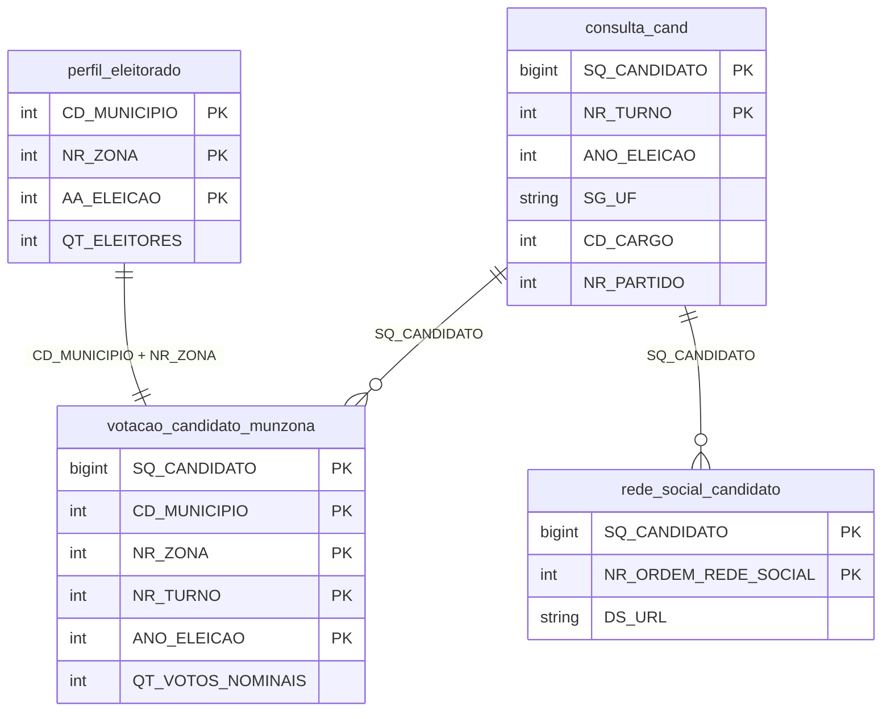

# 📊 Dicionário de Dados — TSE Eleições 2022 e 2024

> [!NOTE]
> Todas as tabelas usam `;` como delimitador e campos entre aspas duplas `"`.
> Valores especiais: `#NULO` / `#NULO#` = nulo, `#NE` = não se aplica, `-1` / `-3` / `-4` = não informado/não divulgável.

---

## 1. consulta_cand (2022 / 2024)

### Descrição
Cadastro de candidatos registrados junto ao TSE. Contém dados pessoais, partidários e situação da candidatura.

### Granularidade
**1 linha = 1 candidatura por turno**
Um mesmo indivíduo pode ter registros em turnos diferentes (ex: 2º turno para cargos executivos).

### 🔑 Chave Primária Composta
| Coluna | Descrição |
|---|---|
| `SQ_CANDIDATO` | Sequencial único do candidato na eleição |
| `NR_TURNO` | Número do turno (1 ou 2) |

> [!TIP]
> `SQ_CANDIDATO` é a **chave principal de ligação** com as demais tabelas de candidatos (votação e redes sociais). Dentro de uma mesma eleição (`ANO_ELEICAO` + `CD_ELEICAO`), `SQ_CANDIDATO` já é suficiente para identificar o candidato.

### Colunas

| # | Coluna | Tipo Lógico | Descrição |
|---|---|---|---|
| 1 | `DT_GERACAO` | Data | Data de geração do arquivo |
| 2 | `HH_GERACAO` | Hora | Hora de geração do arquivo |
| 3 | `ANO_ELEICAO` | Inteiro | Ano da eleição (2022, 2024) |
| 4 | `CD_TIPO_ELEICAO` | Inteiro (código) | Código do tipo de eleição |
| 5 | `NM_TIPO_ELEICAO` | Texto | Descrição do tipo (Ordinária, Suplementar) |
| 6 | `NR_TURNO` | Inteiro | Turno da eleição (1 ou 2) |
| 7 | `CD_ELEICAO` | Inteiro (código) | Código identificador da eleição |
| 8 | `DS_ELEICAO` | Texto | Descrição da eleição |
| 9 | `DT_ELEICAO` | Data | Data da votação |
| 10 | `TP_ABRANGENCIA` | Texto | Abrangência (ESTADUAL, MUNICIPAL, FEDERAL) |
| 11 | `SG_UF` | Texto (2 char) | Sigla da UF |
| 12 | `SG_UE` | Texto | Sigla da Unidade Eleitoral |
| 13 | `NM_UE` | Texto | Nome da Unidade Eleitoral |
| 14 | `CD_CARGO` | Inteiro (código) | Código do cargo disputado |
| 15 | `DS_CARGO` | Texto | Descrição do cargo (Prefeito, Vereador, Deputado, etc.) |
| 16 | `SQ_CANDIDATO` | Bigint | 🔑 Sequencial único do candidato |
| 17 | `NR_CANDIDATO` | Inteiro | Número de urna do candidato |
| 18 | `NM_CANDIDATO` | Texto | Nome civil completo |
| 19 | `NM_URNA_CANDIDATO` | Texto | Nome de urna |
| 20 | `NM_SOCIAL_CANDIDATO` | Texto | Nome social |
| 21 | `NR_CPF_CANDIDATO` | Texto | CPF (pode ser ofuscado) |
| 22 | `DS_EMAIL` | Texto | E-mail do candidato |
| 23 | `CD_SITUACAO_CANDIDATURA` | Inteiro (código) | Código da situação da candidatura |
| 24 | `DS_SITUACAO_CANDIDATURA` | Texto | Situação (APTO, INAPTO, etc.) |
| 25 | `TP_AGREMIACAO` | Texto | Tipo de agremiação (PARTIDO ISOLADO, COLIGAÇÃO, FEDERAÇÃO) |
| 26 | `NR_PARTIDO` | Inteiro | Número do partido |
| 27 | `SG_PARTIDO` | Texto | Sigla do partido |
| 28 | `NM_PARTIDO` | Texto | Nome do partido |
| 29 | `NR_FEDERACAO` | Inteiro | Número da federação |
| 30 | `NM_FEDERACAO` | Texto | Nome da federação |
| 31 | `SG_FEDERACAO` | Texto | Sigla da federação |
| 32 | `DS_COMPOSICAO_FEDERACAO` | Texto | Composição (partidos membros) |
| 33 | `SQ_COLIGACAO` | Bigint | Sequencial da coligação |
| 34 | `NM_COLIGACAO` | Texto | Nome da coligação |
| 35 | `DS_COMPOSICAO_COLIGACAO` | Texto | Composição (partidos membros) |
| 36 | `SG_UF_NASCIMENTO` | Texto (2 char) | UF de nascimento |
| 37 | `DT_NASCIMENTO` | Data | Data de nascimento |
| 38 | `NR_TITULO_ELEITORAL_CANDIDATO` | Texto | Nº do título eleitoral |
| 39 | `CD_GENERO` | Inteiro (código) | Código do gênero |
| 40 | `DS_GENERO` | Texto | Gênero (MASCULINO, FEMININO) |
| 41 | `CD_GRAU_INSTRUCAO` | Inteiro (código) | Código do grau de instrução |
| 42 | `DS_GRAU_INSTRUCAO` | Texto | Grau de instrução |
| 43 | `CD_ESTADO_CIVIL` | Inteiro (código) | Código do estado civil |
| 44 | `DS_ESTADO_CIVIL` | Texto | Estado civil |
| 45 | `CD_COR_RACA` | Texto (código) | Código da cor/raça |
| 46 | `DS_COR_RACA` | Texto | Cor/raça declarada |
| 47 | `CD_OCUPACAO` | Inteiro (código) | Código da ocupação |
| 48 | `DS_OCUPACAO` | Texto | Ocupação profissional |
| 49 | `CD_SIT_TOT_TURNO` | Inteiro (código) | Código da situação de totalização do turno |
| 50 | `DS_SIT_TOT_TURNO` | Texto | Resultado (ELEITO, NÃO ELEITO, 2º TURNO, etc.) |

---

## 2. perfil_eleitorado (2022 / 2024)

### Descrição
Perfil demográfico agregado do eleitorado brasileiro, segmentado por múltiplas dimensões.

### Granularidade
**1 linha = 1 combinação demográfica por zona eleitoral de um município**
Cada linha é uma intersecção de: UF + Município + Zona + Gênero + Estado Civil + Faixa Etária + Escolaridade + Raça/Cor + Identidade de Gênero + Quilombola + Intérprete Libras.

### 🔑 Chave Primária Composta
| Coluna | Descrição |
|---|---|
| `AA_ELEICAO` | Ano da eleição |
| `SG_UF` | Sigla da UF |
| `CD_MUNICIPIO` | Código do município |
| `NR_ZONA` | Número da zona eleitoral |
| `CD_GENERO` | Código do gênero |
| `CD_ESTADO_CIVIL` | Código do estado civil |
| `CD_FAIXA_ETARIA` | Código da faixa etária |
| `CD_GRAU_ESCOLARIDADE` | Código da escolaridade |
| `CD_RACA_COR` | Código da raça/cor |
| `CD_IDENTIDADE_GENERO` | Código da identidade de gênero |
| `CD_QUILOMBOLA` | Código quilombola |
| `CD_INTERPRETE_LIBRAS` | Código intérprete de libras |

> [!IMPORTANT]
> Esta tabela é **agregada**: as colunas `QT_*` são **contadores** (soma de eleitores daquele perfil). **Não há chave individual de eleitor.**

### Colunas

| # | Coluna | Tipo Lógico | Descrição |
|---|---|---|---|
| 1 | `DT_GERACAO` | Data | Data de geração do arquivo |
| 2 | `HH_GERACAO` | Hora | Hora de geração do arquivo |
| 3 | `AA_ELEICAO` | Inteiro | Ano da eleição |
| 4 | `SG_UF` | Texto (2 char) | Sigla da UF |
| 5 | `CD_MUNICIPIO` | Inteiro (código) | Código TSE do município |
| 6 | `NM_MUNICIPIO` | Texto | Nome do município |
| 7 | `NR_ZONA` | Inteiro | Número da zona eleitoral |
| 8 | `CD_GENERO` | Inteiro (código) | Código do gênero |
| 9 | `DS_GENERO` | Texto | Gênero |
| 10 | `CD_ESTADO_CIVIL` | Inteiro (código) | Código do estado civil |
| 11 | `DS_ESTADO_CIVIL` | Texto | Estado civil |
| 12 | `CD_FAIXA_ETARIA` | Texto (código) | Código da faixa etária |
| 13 | `DS_FAIXA_ETARIA` | Texto | Faixa etária (ex: "25 a 29 anos") |
| 14 | `CD_GRAU_ESCOLARIDADE` | Inteiro (código) | Código da escolaridade |
| 15 | `DS_GRAU_ESCOLARIDADE` | Texto | Grau de escolaridade |
| 16 | `CD_RACA_COR` | Texto (código) | Código da raça/cor |
| 17 | `DS_RACA_COR` | Texto | Raça/cor |
| 18 | `CD_IDENTIDADE_GENERO` | Inteiro (código) | Código da identidade de gênero |
| 19 | `DS_IDENTIDADE_GENERO` | Texto | Identidade de gênero |
| 20 | `CD_QUILOMBOLA` | Inteiro (código) | Indicador quilombola |
| 21 | `DS_QUILOMBOLA` | Texto | Descrição quilombola |
| 22 | `CD_INTERPRETE_LIBRAS` | Inteiro (código) | Indicador intérprete de Libras |
| 23 | `DS_INTERPRETE_LIBRAS` | Texto | Descrição intérprete de Libras |
| 24 | `QT_ELEITORES` | Inteiro | **Quantidade de eleitores** naquele perfil |
| 25 | `QT_ELEITORES_BIOMETRIA` | Inteiro | Eleitores com biometria cadastrada |
| 26 | `QT_ELEITORES_DEFICIENCIA` | Inteiro | Eleitores com deficiência |
| 27 | `QT_ELEITORES_NOME_SOCIAL` | Inteiro | Eleitores com nome social |

---

## 3. rede_social_candidato (2024)

### Descrição
URLs de redes sociais declaradas pelos candidatos no momento do registro da candidatura.

### Granularidade
**1 linha = 1 URL de rede social de um candidato**
Um candidato pode ter múltiplas redes sociais (múltiplas linhas).

### 🔑 Chave Primária Composta
| Coluna | Descrição |
|---|---|
| `SQ_CANDIDATO` | Sequencial do candidato |
| `NR_ORDEM_REDE_SOCIAL` | Número sequencial da rede social |

### Colunas

| # | Coluna | Tipo Lógico | Descrição |
|---|---|---|---|
| 1 | `DT_GERACAO` | Data | Data de geração do arquivo |
| 2 | `HH_GERACAO` | Hora | Hora de geração do arquivo |
| 3 | `AA_ELEICAO` | Inteiro | Ano da eleição |
| 4 | `SG_UF` | Texto (2 char) | Sigla da UF |
| 5 | `CD_TIPO_ELEICAO` | Inteiro (código) | Código do tipo de eleição |
| 6 | `NM_TIPO_ELEICAO` | Texto | Descrição do tipo de eleição |
| 7 | `CD_ELEICAO` | Inteiro (código) | Código da eleição |
| 8 | `DS_ELEICAO` | Texto | Descrição da eleição |
| 9 | `SQ_CANDIDATO` | Bigint | 🔑 Sequencial do candidato |
| 10 | `NR_ORDEM_REDE_SOCIAL` | Inteiro | 🔑 Ordem sequencial da URL |
| 11 | `DS_URL` | Texto | URL da rede social |

---

## 4. votacao_candidato_munzona (2022 / 2024)

### Descrição
Resultado da votação nominal por candidato, detalhada por município e zona eleitoral.

### Granularidade
**1 linha = votos de 1 candidato em 1 zona eleitoral de 1 município, em 1 turno**
É o nível mais granular de resultado: candidato × município × zona × turno.

### 🔑 Chave Primária Composta
| Coluna | Descrição |
|---|---|
| `ANO_ELEICAO` | Ano da eleição |
| `CD_ELEICAO` | Código da eleição |
| `NR_TURNO` | Turno |
| `SQ_CANDIDATO` | Sequencial do candidato |
| `CD_MUNICIPIO` | Código do município |
| `NR_ZONA` | Zona eleitoral |
| `ST_VOTO_EM_TRANSITO` | Se é voto em trânsito (S/N) |

### Colunas

| # | Coluna | Tipo Lógico | Descrição |
|---|---|---|---|
| 1 | `DT_GERACAO` | Data | Data de geração do arquivo |
| 2 | `HH_GERACAO` | Hora | Hora de geração do arquivo |
| 3 | `ANO_ELEICAO` | Inteiro | Ano da eleição |
| 4 | `CD_TIPO_ELEICAO` | Inteiro (código) | Código do tipo de eleição |
| 5 | `NM_TIPO_ELEICAO` | Texto | Tipo de eleição |
| 6 | `NR_TURNO` | Inteiro | Turno (1 ou 2) |
| 7 | `CD_ELEICAO` | Inteiro (código) | Código da eleição |
| 8 | `DS_ELEICAO` | Texto | Descrição da eleição |
| 9 | `DT_ELEICAO` | Data | Data da votação |
| 10 | `TP_ABRANGENCIA` | Texto | Abrangência (E=Estadual, M=Municipal) |
| 11 | `SG_UF` | Texto (2 char) | Sigla da UF |
| 12 | `SG_UE` | Texto | Sigla da Unidade Eleitoral |
| 13 | `NM_UE` | Texto | Nome da Unidade Eleitoral |
| 14 | `CD_MUNICIPIO` | Inteiro (código) | Código TSE do município |
| 15 | `NM_MUNICIPIO` | Texto | Nome do município |
| 16 | `NR_ZONA` | Inteiro | Número da zona eleitoral |
| 17 | `CD_CARGO` | Inteiro (código) | Código do cargo |
| 18 | `DS_CARGO` | Texto | Descrição do cargo |
| 19 | `SQ_CANDIDATO` | Bigint | 🔑 Sequencial do candidato |
| 20 | `NR_CANDIDATO` | Inteiro | Número de urna |
| 21 | `NM_CANDIDATO` | Texto | Nome civil |
| 22 | `NM_URNA_CANDIDATO` | Texto | Nome de urna |
| 23 | `NM_SOCIAL_CANDIDATO` | Texto | Nome social |
| 24 | `CD_SITUACAO_CANDIDATURA` | Inteiro (código) | Situação da candidatura |
| 25 | `DS_SITUACAO_CANDIDATURA` | Texto | Descrição da situação |
| 26 | `CD_DETALHE_SITUACAO_CAND` | Inteiro (código) | Detalhe da situação |
| 27 | `DS_DETALHE_SITUACAO_CAND` | Texto | Descrição do detalhe |
| 28 | `CD_SITUACAO_JULGAMENTO` | Inteiro (código) | Situação do julgamento |
| 29 | `DS_SITUACAO_JULGAMENTO` | Texto | Descrição do julgamento |
| 30 | `CD_SITUACAO_CASSACAO` | Inteiro (código) | Situação de cassação |
| 31 | `DS_SITUACAO_CASSACAO` | Texto | Descrição da cassação |
| 32 | `CD_SITUACAO_DCONST_DIPLOMA` | Inteiro (código) | Situação de desconstituição de diploma |
| 33 | `DS_SITUACAO_DCONST_DIPLOMA` | Texto | Descrição |
| 34 | `TP_AGREMIACAO` | Texto | Tipo de agremiação |
| 35 | `NR_PARTIDO` | Inteiro | Número do partido |
| 36 | `SG_PARTIDO` | Texto | Sigla do partido |
| 37 | `NM_PARTIDO` | Texto | Nome do partido |
| 38 | `NR_FEDERACAO` | Inteiro | Número da federação |
| 39 | `NM_FEDERACAO` | Texto | Nome da federação |
| 40 | `SG_FEDERACAO` | Texto | Sigla da federação |
| 41 | `DS_COMPOSICAO_FEDERACAO` | Texto | Composição da federação |
| 42 | `SQ_COLIGACAO` | Bigint | Sequencial da coligação |
| 43 | `NM_COLIGACAO` | Texto | Nome da coligação |
| 44 | `DS_COMPOSICAO_COLIGACAO` | Texto | Composição da coligação |
| 45 | `ST_VOTO_EM_TRANSITO` | Texto (S/N) | Se é voto em trânsito |
| 46 | `QT_VOTOS_NOMINAIS` | Inteiro | **Quantidade de votos nominais** |
| 47 | `NM_TIPO_DESTINACAO_VOTOS` | Texto | Tipo de destinação (Válido, Anulado) |
| 48 | `QT_VOTOS_NOMINAIS_VALIDOS` | Inteiro | Votos nominais válidos |
| 49 | `CD_SIT_TOT_TURNO` | Inteiro (código) | Código do resultado no turno |
| 50 | `DS_SIT_TOT_TURNO` | Texto | Resultado (ELEITO, NÃO ELEITO, SUPLENTE, etc.) |

---

## 🔗 Mapa de Relacionamentos entre Tabelas



---

## 🔗 JOINs Recomendados

### 1. Candidato → Votação (detalhes do candidato + seus votos por município/zona)

```sql
SELECT *
FROM consulta_cand c
JOIN votacao_candidato_munzona v
  ON c.SQ_CANDIDATO = v.SQ_CANDIDATO
 AND c.ANO_ELEICAO  = v.ANO_ELEICAO
 AND c.NR_TURNO     = v.NR_TURNO;
```

> [!TIP]
> Use também `AND c.CD_ELEICAO = v.CD_ELEICAO` para máxima segurança, especialmente em 2024 que contém eleições suplementares com códigos diferentes.

---

### 2. Candidato → Redes Sociais (apenas 2024)

```sql
SELECT *
FROM consulta_cand c
JOIN rede_social_candidato r
  ON c.SQ_CANDIDATO = r.SQ_CANDIDATO
 AND c.ANO_ELEICAO  = r.AA_ELEICAO;
```

---

### 3. Votação → Perfil do Eleitorado (contexto demográfico do município/zona)

```sql
SELECT
    v.NM_MUNICIPIO,
    v.NR_ZONA,
    v.NM_CANDIDATO,
    v.QT_VOTOS_NOMINAIS,
    SUM(p.QT_ELEITORES) AS total_eleitores_zona
FROM votacao_candidato_munzona v
JOIN perfil_eleitorado p
  ON v.CD_MUNICIPIO = p.CD_MUNICIPIO
 AND v.NR_ZONA      = p.NR_ZONA
 AND v.ANO_ELEICAO  = p.AA_ELEICAO
GROUP BY v.NM_MUNICIPIO, v.NR_ZONA, v.NM_CANDIDATO, v.QT_VOTOS_NOMINAIS;
```

> [!WARNING]
> A tabela `perfil_eleitorado` é **agregada por perfil demográfico**. Para obter o total de eleitores de uma zona, é necessário **somar `QT_ELEITORES`** agrupando por `CD_MUNICIPIO + NR_ZONA`.

---

### 4. JOIN Completo: Candidato + Votos + Eleitorado + Redes Sociais

```sql
SELECT
    c.NM_CANDIDATO,
    c.SG_PARTIDO,
    c.DS_CARGO,
    c.SG_UF,
    v.NM_MUNICIPIO,
    v.NR_ZONA,
    v.QT_VOTOS_NOMINAIS,
    v.DS_SIT_TOT_TURNO,
    SUM(p.QT_ELEITORES) AS eleitores_zona,
    r.DS_URL
FROM consulta_cand c
JOIN votacao_candidato_munzona v
  ON c.SQ_CANDIDATO = v.SQ_CANDIDATO
 AND c.ANO_ELEICAO  = v.ANO_ELEICAO
 AND c.NR_TURNO     = v.NR_TURNO
LEFT JOIN perfil_eleitorado p
  ON v.CD_MUNICIPIO = p.CD_MUNICIPIO
 AND v.NR_ZONA      = p.NR_ZONA
 AND v.ANO_ELEICAO  = p.AA_ELEICAO
LEFT JOIN rede_social_candidato r
  ON c.SQ_CANDIDATO = r.SQ_CANDIDATO
GROUP BY c.NM_CANDIDATO, c.SG_PARTIDO, c.DS_CARGO, c.SG_UF,
         v.NM_MUNICIPIO, v.NR_ZONA, v.QT_VOTOS_NOMINAIS,
         v.DS_SIT_TOT_TURNO, r.DS_URL;
```

---

## 📐 Resumo de Granularidades

| Tabela | Granularidade | Chave Natural |
|---|---|---|
| `consulta_cand` | 1 candidatura × turno | `SQ_CANDIDATO` + `NR_TURNO` |
| `perfil_eleitorado` | 1 perfil demográfico × zona × município | `AA_ELEICAO` + `CD_MUNICIPIO` + `NR_ZONA` + todas dimensões demográficas |
| `rede_social_candidato` | 1 URL × candidato | `SQ_CANDIDATO` + `NR_ORDEM_REDE_SOCIAL` |
| `votacao_candidato_munzona` | 1 candidato × zona × município × turno | `ANO_ELEICAO` + `CD_ELEICAO` + `NR_TURNO` + `SQ_CANDIDATO` + `CD_MUNICIPIO` + `NR_ZONA` + `ST_VOTO_EM_TRANSITO` |

---

## ⚠️ Observações Importantes

> [!CAUTION]
> **Atenção com os nomes de colunas entre tabelas!**
> - `consulta_cand` e `votacao` usam `ANO_ELEICAO`, mas `perfil_eleitorado` e `rede_social` usam `AA_ELEICAO`.
> - `consulta_cand` usa `CD_GRAU_INSTRUCAO`, mas `perfil_eleitorado` usa `CD_GRAU_ESCOLARIDADE`.
> - `consulta_cand` usa `CD_COR_RACA`, mas `perfil_eleitorado` usa `CD_RACA_COR`.
> - `consulta_cand` **NÃO possui** `CD_MUNICIPIO` — para ligar com eleitorado, passe por `votacao_candidato_munzona`.

> [!IMPORTANT]
> **Diferenças entre 2022 e 2024:**
> - 2022 = eleições gerais (Presidente, Governador, Senador, Deputados Federal e Estadual)
> - 2024 = eleições municipais (Prefeito, Vice-Prefeito, Vereador) + suplementares
> - `rede_social_candidato` **só existe para 2024**
> - O volume de `votacao_candidato_munzona_2022` (~4.3 GB) é muito maior que 2024 (~328 MB) porque 2022 inclui todos os cargos gerais

